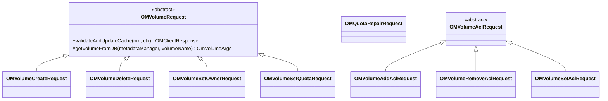

# OM / om-request-volume

**Classes:** 10    **Kinds:** dto:8, abstract:2

## Overview

The `om-request-volume` feature contains write-path Ratis request classes for volume operations. `OMVolumeRequest` provides shared helpers for volume requests (acquire volume write lock, update `userTable` index for owner changes). `OMVolumeCreateRequest` creates a volume entry in `volumeTable` and adds the user-volume mapping in `userTable`. `OMVolumeDeleteRequest` removes both entries. `OMVolumeSetOwnerRequest` updates the volume owner and the `userTable` index accordingly. `OMVolumeSetQuotaRequest` updates quota fields. `OMQuotaRepairRequest` is the write path for quota repair. Volume ACL requests use `OMVolumeAclRequest` as the abstract base.

## Diagram

## Class table

### Sub-feature: `request.volume`

| reading_order | fqcn | kind | logic | loc | study (min) | role |
|--:|---|---|---|--:|--:|---|
| 493 | `org.apache.hadoop.ozone.om.request.volume.OMVolumeRequest` | abstract | mixed | 75~ | 30 | Defines common methods required for volume requests. |
| 494 | `org.apache.hadoop.ozone.om.request.volume.OMVolumeSetQuotaRequest` | dto | data-only | 175~ | 10 | Handles set Quota request for volume. |
| 495 | `org.apache.hadoop.ozone.om.request.volume.OMVolumeSetOwnerRequest` | dto | data-only | 150~ | 10 | Handle set owner request for volume. |
| 496 | `org.apache.hadoop.ozone.om.request.volume.OMVolumeCreateRequest` | dto | data-only | 125~ | 10 | Handles volume create request. |
| 497 | `org.apache.hadoop.ozone.om.request.volume.OMQuotaRepairRequest` | dto | data-only | 125~ | 10 | Handle OMQuotaRepairRequest Request. |
| 498 | `org.apache.hadoop.ozone.om.request.volume.OMVolumeDeleteRequest` | dto | data-only | 100~ | 10 | Handles volume delete request. |

### Sub-feature: `volume.acl`

| reading_order | fqcn | kind | logic | loc | study (min) | role |
|--:|---|---|---|--:|--:|---|
| 499 | `org.apache.hadoop.ozone.om.request.volume.acl.OMVolumeAclRequest` | abstract | mixed | 100~ | 30 | Base class for OMVolumeAcl Request. |
| 500 | `org.apache.hadoop.ozone.om.request.volume.acl.OMVolumeAddAclRequest` | dto | data-only | 75~ | 10 | Handles volume add acl request. |
| 501 | `org.apache.hadoop.ozone.om.request.volume.acl.OMVolumeRemoveAclRequest` | dto | data-only | 75~ | 10 | Handles volume remove acl request. |
| 502 | `org.apache.hadoop.ozone.om.request.volume.acl.OMVolumeSetAclRequest` | dto | data-only | 75~ | 10 | Handles volume set acl request. |

## Anchor details

_No logic-heavy anchors in this feature; the classes are primarily data / dto / config / cli._

## Design docs

- `hadoop-hdds/docs/content/design/volume-management.md` — volume management design
- `hadoop-hdds/docs/content/concept/VolumesBucketsKeys.md` — volume namespace

## Seminal JIRAs / PRs

- HDDS-15462. Move ACL check in Volume requests to preExecute
- HDDS-14207. Inconsistent Ozone admin check (volume admin check fixes)
- HDDS-15204. Quota repair includes snapshot pending-delete usage
- HDDS-13940. Make OmVolumeArgs owner/timestamps/quotas immutable

## Sharp edges

- `OMVolumeSetOwnerRequest` updates both `volumeTable` (the `OmVolumeArgs`) and `userTable` (the owner index). These two writes are in a single batch and are atomic. However, if the volume key in `userTable` diverges from `volumeTable` (e.g., due to a partial replay after upgrade), quota repair is the only recovery path.

## Related features

- `components/om/om-volume-manager.md` — `VolumeManagerImpl` provides the read path
- `components/om/om-upgrade.md` — `QuotaRepairUpgradeAction` triggers `OMQuotaRepairRequest` via `QuotaRepairTask`

## Self-quiz

1. `OMVolumeCreateRequest` writes to two tables. Which tables and what keys?
2. `OMVolumeSetOwnerRequest` changes the owner. Why does it need to update both `volumeTable` AND `userTable`?
3. After HDDS-15462, ACL checks moved to `preExecute`. Why is this better than checking in `validateAndUpdateCache`?
4. `OmVolumeArgs` was made immutable in HDDS-13940. What fields became immutable and why?
5. `OMQuotaRepairRequest` is triggered by an upgrade action. What does it repair and how does it compute the correct values?

Answers

Answer 1: `volumeTable` keyed by volume name (stores `OmVolumeArgs`), and `userTable` keyed by `ownerUserName/volumeName` (stores the user-to-volume index entry).
Answer 2: `userTable` is a secondary index keyed by `oldOwner/volumeName` and must be updated to reflect the new owner. Without updating `userTable`, `listVolumes(newOwner)` would not include the transferred volume.
Answer 3: `preExecute` runs before the Ratis commit, so if ACL check fails the request is rejected without entering the log, saving unnecessary log entries and replay cost. In `validateAndUpdateCache` an ACL failure would still append a failed entry to the Raft log.
Answer 4: Owner, creation time, modification time, and quota fields. Made immutable to prevent mutation of cached `OmVolumeArgs` instances (thread safety — multiple threads share the same cached instance).
Answer 5: It scans all keys, files, and directories and recomputes `usedBytes` and `usedNamespace` per volume and bucket, including snapshot pending-delete usage (HDDS-15204). Values are written back via Ratis.

