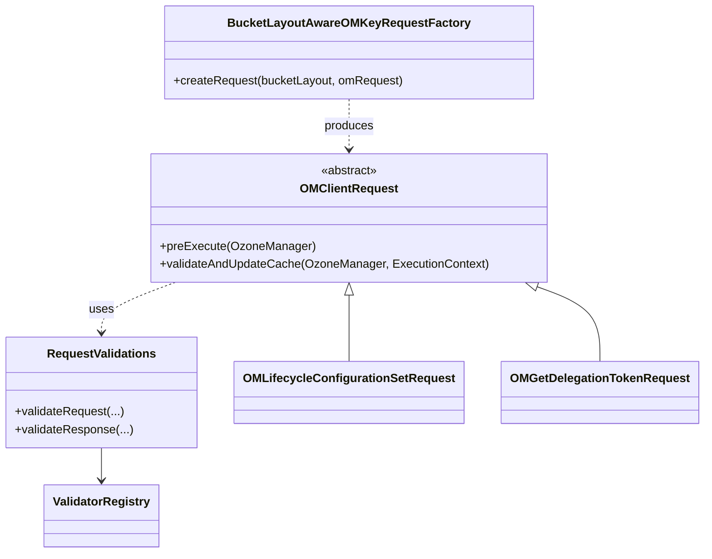

# OM / om-request

**Classes:** 25    **Kinds:** dto:8, service:7, interface:6, data:3, factory:1

## Overview

The `om-request` feature contains the base class and shared infrastructure for all OM write requests. `OMClientRequest` is the base class extended by every request class; it defines the `preExecute(OzoneManager)` method (called before Ratis, for SCM calls and proto normalization) and `validateAndUpdateCache(OzoneManager, ExecutionContext)` (called inside Ratis apply). The validation framework (`RequestValidations`, `ValidatorRegistry`, `ValidationContext`) applies pre/post validators annotated with `@RequestFeatureValidator`, `@OMLayoutVersionValidator`, or `@OMClientVersionValidator` to gate features behind layout versions or client versions. `BucketLayoutAwareOMKeyRequestFactory` dispatches to FSO vs OBS request implementations at runtime. Security request DTOs (`OMGetDelegationTokenRequest`, etc.) and lifecycle request DTOs live here. `OMMultipartUploadUtils` provides shared MPU size-counting helpers.

## Diagram

## Class table

### Sub-feature: `om.request`

| reading_order | fqcn | kind | logic | loc | study (min) | role |
|--:|---|---|---|--:|--:|---|
| 59 | `org.apache.hadoop.ozone.om.request.RequestAuditor` | interface | mixed | 50~ | 20 | Interface for OM Requests to convert to audit objects. |
| 60 | `org.apache.hadoop.ozone.om.request.OMClientRequestUtils` | service | mixed | 75~ | 30 | Utility class for OMClientRequest. |
| 61 | `org.apache.hadoop.ozone.om.request.BucketLayoutAwareOMKeyRequestFactory` | factory | mixed | 175~ | 20 | Factory class to instantiate bucket layout aware request classes. |
| 62 | `org.apache.hadoop.ozone.om.request.OMClientRequest` | abstract | logic-heavy | 325~ | 10 | OMClientRequest provides methods which every write OM request should implement. |

### Sub-feature: `request.lifecycle`

| reading_order | fqcn | kind | logic | loc | study (min) | role |
|--:|---|---|---|--:|--:|---|
| 63 | `org.apache.hadoop.ozone.om.request.lifecycle.OMLifecycleConfigurationSetRequest` | dto | data-only | 150~ | 10 | Handles SetLifecycleConfiguration Request. |
| 64 | `org.apache.hadoop.ozone.om.request.lifecycle.OMLifecycleConfigurationDeleteRequest` | dto | data-only | 125~ | 10 | Handles DeleteLifecycleConfiguration Request. |
| 65 | `org.apache.hadoop.ozone.om.request.lifecycle.OMLifecycleSetServiceStatusRequest` | dto | data-only | 75~ | 10 | Handles SetLifecycleServiceStatus Request. |
| 66 | `org.apache.hadoop.ozone.om.request.lifecycle.OMLifecycleSaveScanStateRequest` | dto | data-only | 25~ | 10 | Handles SaveLifecycleScanState request. |

### Sub-feature: `request.security`

| reading_order | fqcn | kind | logic | loc | study (min) | role |
|--:|---|---|---|--:|--:|---|
| 67 | `org.apache.hadoop.ozone.om.request.security.OMGetDelegationTokenRequest` | dto | data-only | 100~ | 10 | Handle GetDelegationToken Request. |
| 68 | `org.apache.hadoop.ozone.om.request.security.OMRenewDelegationTokenRequest` | dto | data-only | 100~ | 10 | Handle RenewDelegationToken Request. |
| 69 | `org.apache.hadoop.ozone.om.request.security.OMCancelDelegationTokenRequest` | dto | data-only | 75~ | 10 | Handle CancelDelegationToken Request. |

### Sub-feature: `request.util`

| reading_order | fqcn | kind | logic | loc | study (min) | role |
|--:|---|---|---|--:|--:|---|
| 70 | `org.apache.hadoop.ozone.om.request.util.AclOp` | interface | mixed | 25~ | 20 | ACL operation. |
| 71 | `org.apache.hadoop.ozone.om.request.util.OMMultipartUploadUtils` | service | mixed | 100~ | 30 | Utility class related to OM Multipart Upload. |
| 72 | `org.apache.hadoop.ozone.om.request.util.OmResponseUtil` | service | mixed | 25~ | 30 | Utility class to build OmResponse. |
| 73 | `org.apache.hadoop.ozone.om.request.util.ObjectParser` | service | mixed | 25~ | 30 | Utility class to parse OzoneObj#getPath(). |
| 74 | `org.apache.hadoop.ozone.om.request.util.OmKeyHSyncUtil` | service | mixed | 25~ | 30 | Helper methods related to OM key HSync. |
| 75 | `org.apache.hadoop.ozone.om.request.util.OMEchoRPCWriteRequest` | dto | data-only | 25~ | 10 | Handles EchoRPC request (write). |

### Sub-feature: `request.validation`

| reading_order | fqcn | kind | logic | loc | study (min) | role |
|--:|---|---|---|--:|--:|---|
| 76 | `org.apache.hadoop.ozone.om.request.validation.OMLayoutVersionValidator` | interface | mixed | 25~ | 20 | An annotation to mark methods that do certain request validations based on the server's layout version and capability... |
| 77 | `org.apache.hadoop.ozone.om.request.validation.RequestFeatureValidator` | interface | mixed | 25~ | 20 | An annotation to mark methods that do certain request validations. |
| 78 | `org.apache.hadoop.ozone.om.request.validation.OMClientVersionValidator` | interface | mixed | 25~ | 20 | An annotation to mark methods that do certain request validations based on the request protocol's client version. |
| 79 | `org.apache.hadoop.ozone.om.request.validation.ValidationContext` | interface | mixed | 25~ | 20 | A context that contains useful information for request validator instances. |
| 80 | `org.apache.hadoop.ozone.om.request.validation.ValidatorRegistry` | service | mixed | 100~ | 30 | Registry that loads and stores the request validators to be applied by a service. |
| 81 | `org.apache.hadoop.ozone.om.request.validation.RequestValidations` | service | mixed | 75~ | 30 | Main class to configure and set up and access the request/response validation framework. |
| 82 | `org.apache.hadoop.ozone.om.request.validation.VersionExtractor` | data | data-only | 25~ | 10 | Class to extract version out of OM request. |
| 83 | `org.apache.hadoop.ozone.om.request.validation.ValidationCondition` | data | data-only | 25~ | 10 | Defines conditions for which validators can be assigned to. |

## Anchor details

_No logic-heavy anchors in this feature; the classes are primarily data / dto / config / cli._

## Design docs

- `hadoop-hdds/docs/content/design/nonrolling-upgrade.md` — upgrade framework that drives `OMLayoutVersionValidator` and `DisallowedUntilLayoutVersion`

## Seminal JIRAs / PRs

- HDDS-15467. Do not fall back to the OM starter user in OMClientRequest
- HDDS-14665. Add upgrade handling to multipart requests
- HDDS-15949. Handle split MPU part counting for abort batch sizing
- HDDS-15853. Fix Ranger ACL validation for lifecycle requests

## Sharp edges

- `OMClientRequest.preExecute` runs before Ratis commit and can call SCM. If an exception is thrown in `preExecute`, the request is rejected before entering the Raft log, which is safe. However, side effects in `preExecute` (like block allocation) are not transactional and require manual cleanup if the commit later fails.
- `OMClientRequest.getOMRequest()` returns the original user identity from the request UGI. After HDDS-15467, `getOMAuditUserWithGroups()` no longer falls back to the OM starter user, so missing UGI in the request throws instead of silently substituting the service user.

## Related features

- `components/om/om-execution.md` — `OMExecutionFlow` and `ExecutionContext` are passed to `validateAndUpdateCache`
- `components/om/om-request-key.md` — key request classes extend `OMClientRequest` via `OMKeyRequest`
- `components/om/om-upgrade.md` — `OMLayoutFeatureAspect` applies `@DisallowedUntilLayoutVersion` checks on request methods

## Self-quiz

1. `OMClientRequest` defines two key methods. What is the difference between `preExecute` and `validateAndUpdateCache` in terms of when they run?
2. `BucketLayoutAwareOMKeyRequestFactory` selects between FSO and OBS request classes. How does it determine which layout to use?
3. `@RequestFeatureValidator` annotated methods are discovered by `ValidatorRegistry`. How are they discovered?
4. `OMLifecycleConfigurationSetRequest` persists lifecycle config. Which RocksDB table does it write to?
5. After HDDS-15467, what happens if `OMClientRequest.getUserInfo()` returns no valid UGI?

Answers

Answer 1: `preExecute` runs on the OM leader before the request enters the Ratis log — it performs validation that requires external calls (SCM block allocation, ACL checks). `validateAndUpdateCache` runs inside the Ratis apply thread after the entry is committed; it must be deterministic and idempotent.
Answer 2: It reads the `OmBucketInfo.getBucketLayout()` for the target bucket from the metadata manager's cache and selects the `WithFSO` or base implementation accordingly.
Answer 3: `ValidatorRegistry` uses reflection to scan annotated methods in a configured package and registers them by `(requestType, condition)` key.
Answer 4: `lifecycleStateTable` in `OMDBDefinition`.
Answer 5: It throws `OMException(PERMISSION_DENIED)` rather than falling back to the OM service user, preventing privilege escalation by clients that omit UGI information.

