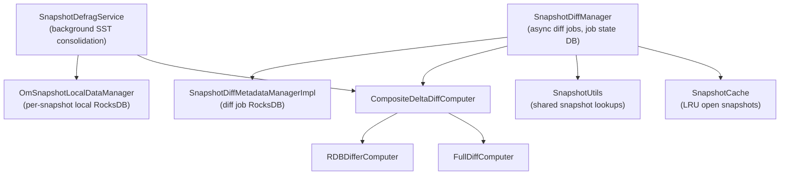

# OM / om-snapshot

**Classes:** 37    **Kinds:** service:23, interface:9, abstract:2, data:1, dto:1, metrics:1

## Overview

The `om-snapshot` feature handles the diff, defragmentation, and metadata management of OM snapshots. `SnapshotDiffManager` is the central engine: it accepts diff-job submissions, uses an `ExecutorService` to run diff computation asynchronously, and stores job state and reports in a dedicated `SnapshotDiffMetadataManager` (backed by a separate RocksDB store). Diff computation uses `DeltaFileComputer` implementations — `RDBDifferComputer` for RocksDB SST-level diffs and `FullDiffComputer` for full scans — combined via `CompositeDeltaDiffComputer`. `OmSnapshotLocalDataManager` persists per-snapshot YAML metadata (timestamps, defrag state, SST file info) to a local RocksDB. `SnapshotDefragService` runs as a background service, iterating the active snapshot chain to consolidate SST files via ingest, reducing space amplification. `SnapshotUtils` provides shared helpers for snapshot lookup, active-state checks, and column-family drop. Persistent collections (`RocksDbPersistentMap`, `RocksDbPersistentList`, `RocksDbPersistentSet`) wrap RocksDB column families as Java collections for the diff pipeline. `SnapshotCache` is a thread-safe LRU cache that keeps recently-accessed snapshot `OmMetadataManager` instances open.

## Diagram

## Class table

### Sub-feature: `diff.delta`

| reading_order | fqcn | kind | logic | loc | study (min) | role |
|--:|---|---|---|--:|--:|---|
| 853 | `org.apache.hadoop.ozone.om.snapshot.diff.delta.DeltaFileComputer` | interface | mixed | 25~ | 20 | The DeltaFileComputer interface defines a contract for computing delta files that represent changes between two snaps... |
| 854 | `org.apache.hadoop.ozone.om.snapshot.diff.delta.FileLinkDeltaFileComputer` | abstract | mixed | 75~ | 30 | The FileLinkDeltaFileComputer is an abstract class that provides a base implementation for the DeltaFileComputer inte... |
| 855 | `org.apache.hadoop.ozone.om.snapshot.diff.delta.CompositeDeltaDiffComputer` | service | mixed | 50~ | 30 | CompositeDeltaDiffComputer is responsible for computing the delta file differences between two snapshots, utilizing d... |
| 856 | `org.apache.hadoop.ozone.om.snapshot.diff.delta.RDBDifferComputer` | service | mixed | 50~ | 30 | Computes RocksDB SST file differences between two snapshots and materializes differing SST files as hard links in the... |
| 857 | `org.apache.hadoop.ozone.om.snapshot.diff.delta.FullDiffComputer` | service | mixed | 50~ | 30 | FullDiffComputer is a specialized implementation of FileLinkDeltaFileComputer that computes the delta files between t... |

### Sub-feature: `diff.helper`

| reading_order | fqcn | kind | logic | loc | study (min) | role |
|--:|---|---|---|--:|--:|---|
| 858 | `org.apache.hadoop.ozone.om.snapshot.diff.helper.SnapshotDiffObjectInfo` | dto | data-only | 25~ | 10 | Represents information about an object in a snapshot difference. |

### Sub-feature: `om.snapshot`

| reading_order | fqcn | kind | logic | loc | study (min) | role |
|--:|---|---|---|--:|--:|---|
| 859 | `org.apache.hadoop.ozone.om.snapshot.PersistentList` | interface | mixed | 25~ | 20 | Define an interface for persistent list. |
| 860 | `org.apache.hadoop.ozone.om.snapshot.ReferenceCountedCallback` | interface | mixed | 25~ | 20 | Callback interface for ReferenceCounted. |
| 861 | `org.apache.hadoop.ozone.om.snapshot.RequireSnapshotFeatureState` | interface | mixed | 25~ | 20 | Annotation used to check that the snapshot feature in desired state. |
| 862 | `org.apache.hadoop.ozone.om.snapshot.PersistentMap` | interface | mixed | 25~ | 20 | Define an interface for persistent map. |
| 863 | `org.apache.hadoop.ozone.om.snapshot.PersistentSet` | interface | mixed | 25~ | 20 | Define an interface for persistent set. |
| 864 | `org.apache.hadoop.ozone.om.snapshot.SnapshotDiffManagerMXBean` | interface | mixed | 25~ | 20 | JMX interface for SnapshotDiffManager. |
| 865 | `org.apache.hadoop.ozone.om.snapshot.ObjectPathResolver` | interface | mixed | 25~ | 20 | Class to resolve paths of Objects. |
| 866 | `org.apache.hadoop.ozone.om.snapshot.SnapshotDiffManager` | service | logic-heavy | 1250~ | 60 | Class to generate snapshot diff. |
| 867 | `org.apache.hadoop.ozone.om.snapshot.OmSnapshotLocalDataManager` | service | logic-heavy | 825~ | 60 | Manages local data and metadata associated with Ozone Manager (OM) snapshots, including the creation, storage, and re... |
| 868 | `org.apache.hadoop.ozone.om.snapshot.SnapshotDiffValueParser` | service | logic-heavy | 275~ | 45 | Parses snapshot diff values without full deserialization. |
| 869 | `org.apache.hadoop.ozone.om.snapshot.SnapshotUtils` | service | logic-heavy | 225~ | 45 | Util class for snapshot diff APIs. |
| 870 | `org.apache.hadoop.ozone.om.snapshot.RocksDbPersistentMap` | service | mixed | 125~ | 30 | Persistent map backed by RocksDB. |
| 871 | `org.apache.hadoop.ozone.om.snapshot.ReferenceCounted` | service | mixed | 75~ | 30 | Add reference counter to an object instance. |
| 872 | `org.apache.hadoop.ozone.om.snapshot.RocksDbPersistentList` | service | mixed | 75~ | 30 | Persistent list backed by RocksDB. |
| 873 | `org.apache.hadoop.ozone.om.snapshot.OMDBCheckpointUtils` | service | mixed | 50~ | 30 | Utility class for handling operations related to OM DB Checkpoints. |
| 874 | `org.apache.hadoop.ozone.om.snapshot.FSODirectoryPathResolver` | service | mixed | 50~ | 30 | Class to resolve absolute paths for FSO DirectoryInfo Objects. |
| 875 | `org.apache.hadoop.ozone.om.snapshot.RequireSnapshotFeatureStateAspect` | service | mixed | 50~ | 30 | 'Aspect' for checking whether snapshot feature is enabled. |
| 876 | `org.apache.hadoop.ozone.om.snapshot.RocksDbPersistentSet` | service | mixed | 50~ | 30 | Persistent set backed by RocksDB. |
| 877 | `org.apache.hadoop.ozone.om.snapshot.OmSnapshotUtils` | service | mixed | 50~ | 30 | Ozone Manager Snapshot Utilities. |
| 878 | `org.apache.hadoop.ozone.om.snapshot.MultiSnapshotLocks` | service | mixed | 50~ | 30 | Class to take multiple locks on multiple snapshots. |
| 879 | `org.apache.hadoop.ozone.om.snapshot.SnapshotCache` | service | logic-heavy | 275~ | 10 | Thread-safe custom unbounded LRU cache to manage open snapshot DB instances. |
| 880 | `org.apache.hadoop.ozone.om.snapshot.OMSnapshotDirectoryMetrics` | metrics | logic-heavy | 200~ | 20 | Metrics for tracking db.snapshots directory space usage and SST file counts. |

### Sub-feature: `snapshot.db`

| reading_order | fqcn | kind | logic | loc | study (min) | role |
|--:|---|---|---|--:|--:|---|
| 881 | `org.apache.hadoop.ozone.om.snapshot.db.SnapshotDiffMetadataManager` | interface | mixed | 25~ | 20 | Interface representing the metadata manager for snapshot difference operations. |
| 882 | `org.apache.hadoop.ozone.om.snapshot.db.SnapshotDiffMetadataManagerImpl` | service | mixed | 75~ | 30 | Implementation of the SnapshotDiffMetadataManager interface. |
| 883 | `org.apache.hadoop.ozone.om.snapshot.db.SnapshotDiffDBDefinition` | service | mixed | 50~ | 30 | The SnapshotDiffDBDefinition class defines the schema for the snapshot difference database tables used in snapshot di... |

### Sub-feature: `snapshot.defrag`

| reading_order | fqcn | kind | logic | loc | study (min) | role |
|--:|---|---|---|--:|--:|---|
| 884 | `org.apache.hadoop.ozone.om.snapshot.defrag.SnapshotDefragService` | service | logic-heavy | 525~ | 60 | Background service for defragmenting snapshots in the active snapshot chain. |

### Sub-feature: `snapshot.filter`

| reading_order | fqcn | kind | logic | loc | study (min) | role |
|--:|---|---|---|--:|--:|---|
| 885 | `org.apache.hadoop.ozone.om.snapshot.filter.ReclaimableFilter` | abstract | mixed | 150~ | 45 | This class is responsible for opening last N snapshot given a snapshot metadata manager or AOS metadata manager by ac... |
| 886 | `org.apache.hadoop.ozone.om.snapshot.filter.ReclaimableKeyFilter` | service | mixed | 75~ | 30 | Filter to return deleted keys which are reclaimable based on their presence in previous snapshot in the snapshot chain. |
| 887 | `org.apache.hadoop.ozone.om.snapshot.filter.ReclaimableRenameEntryFilter` | service | mixed | 50~ | 30 | Class to filter out rename table entries which are reclaimable based on the key presence in previous snapshot's keyTa... |
| 888 | `org.apache.hadoop.ozone.om.snapshot.filter.ReclaimableDirFilter` | service | mixed | 25~ | 30 | Class to filter out deleted directories which are reclaimable based on their presence in previous snapshot in the sna... |

### Sub-feature: `snapshot.util`

| reading_order | fqcn | kind | logic | loc | study (min) | role |
|--:|---|---|---|--:|--:|---|
| 889 | `org.apache.hadoop.ozone.om.snapshot.util.TableMergeIterator` | service | mixed | 50~ | 30 | TableMergeIterator is an implementation of an iterator that merges multiple table iterators and filters the data base... |

## Anchor details

### `SnapshotDiffManager`

- **path:** `hadoop-ozone/ozone-manager/src/main/java/org/apache/hadoop/ozone/om/snapshot/SnapshotDiffManager.java`
- **loc:** 1250~    **difficulty:** 5    **study:** 60 min    **concurrency:** actor/queue    **persistence:** RocksDB
- **entry points:** `close`
- **key collaborators:** `org.apache.hadoop.ozone.om.snapshot.db.SnapshotDiffDBDefinition`, `org.apache.hadoop.ozone.om.snapshot.diff.delta.CompositeDeltaDiffComputer`, `org.apache.hadoop.ozone.om.snapshot.diff.delta.DeltaFileComputer`, `org.apache.hadoop.ozone.om.snapshot.util.TableMergeIterator`, `org.apache.hadoop.hdds.HddsUtils`, `org.apache.hadoop.hdds.StringUtils`
- **test exemplar:** `hadoop-ozone/ozone-manager/src/test/java/org/apache/hadoop/ozone/om/snapshot/TestSnapshotDiffManager.java`
- **role:** Manages asynchronous snapshot diff jobs, persisting their state and reports to a dedicated RocksDB store.

Diff jobs cycle through states `QUEUED → IN_PROGRESS → DONE/FAILED/CANCELLED`. The job is submitted to a `ThreadPoolExecutor` (`OZONE_OM_SNAPSHOT_DIFF_THREAD_POOL_SIZE`). An important invariant: if `OZONE_OM_SNAPSHOT_FORCE_FULL_DIFF` is false, the manager first tries `RDBDifferComputer` to compute SST-file deltas cheaply; it falls back to `FullDiffComputer` if the SSTs are not available. `OZONE_OM_SNAPSHOT_DIFF_MAX_ALLOWED_KEYS_CHANGED_PER_DIFF_JOB` caps job size and results in a `REJECTED` status if exceeded. The RPC was split in HDDS-14829 so submitting a job and fetching its report are separate calls.

### `OmSnapshotLocalDataManager`

- **path:** `hadoop-ozone/ozone-manager/src/main/java/org/apache/hadoop/ozone/om/snapshot/OmSnapshotLocalDataManager.java`
- **loc:** 825~    **difficulty:** 5    **study:** 60 min    **concurrency:** thread-safe    **persistence:** RocksDB
- **entry points:** `close`, `commit`
- **key collaborators:** `org.apache.hadoop.hdds.conf.OzoneConfiguration`, `org.apache.hadoop.hdds.utils.Scheduler`, `org.apache.hadoop.hdds.utils.TransactionInfo`, `org.apache.hadoop.hdds.utils.db.RDBStore`, `org.apache.hadoop.hdds.utils.db.Table`, `org.apache.hadoop.hdds.utils.db.managed.ManagedRocksDB`
- **test exemplar:** `hadoop-ozone/ozone-manager/src/test/java/org/apache/hadoop/ozone/om/snapshot/TestOmSnapshotLocalDataManager.java`
- **role:** Manages local data and metadata associated with Ozone Manager (OM) snapshots, including the creation, storage, and retrieval of per-snapshot YAML files and a local RocksDB.

Maintains a separate per-snapshot RocksDB (not the main OM DB) to store backup SST file info, defrag timestamps, and transaction info. Large or malformed YAML files are rejected defensively since HDDS-15760. The `commit` method flushes the local DB atomically. A `Scheduler` triggers periodic flushes.

### `SnapshotDefragService`

- **path:** `hadoop-ozone/ozone-manager/src/main/java/org/apache/hadoop/ozone/om/snapshot/defrag/SnapshotDefragService.java`
- **loc:** 525~    **difficulty:** 5    **study:** 60 min    **concurrency:** single-threaded    **persistence:** RocksDB
- **entry points:** `start`, `call`
- **key collaborators:** `org.apache.hadoop.ozone.om.snapshot.MultiSnapshotLocks`, `org.apache.hadoop.ozone.om.snapshot.OmSnapshotLocalDataManager`, `org.apache.hadoop.ozone.om.snapshot.SnapshotUtils`, `org.apache.hadoop.ozone.om.snapshot.diff.delta.CompositeDeltaDiffComputer`, `org.apache.hadoop.ozone.om.snapshot.util.TableMergeIterator`, `org.apache.hadoop.hdds.conf.OzoneConfiguration`
- **test exemplar:** `hadoop-ozone/ozone-manager/src/test/java/org/apache/hadoop/ozone/om/snapshot/defrag/TestSnapshotDefragService.java`
- **role:** Background service for defragmenting snapshots in the active snapshot chain.

Iterates the snapshot chain in order, computes delta SST files between adjacent snapshots via `CompositeDeltaDiffComputer`, rewrites live SSTs to avoid retaining tombstone data (HDDS-15860), then ingests the consolidated files back. Uses `MultiSnapshotLocks` to lock adjacent snapshots during defrag. Records `lastDefragTime` in `OmSnapshotLocalDataManager` after each successful run (HDDS-15201). DB metrics for the defrag store were disabled to prevent crashes during defrag (HDDS-15314).

### `SnapshotDiffValueParser`

- **path:** `hadoop-ozone/ozone-manager/src/main/java/org/apache/hadoop/ozone/om/snapshot/SnapshotDiffValueParser.java`
- **loc:** 275~    **difficulty:** 4    **study:** 45 min    **concurrency:** single-threaded    **persistence:** in-memory
- **key collaborators:** `org.apache.hadoop.ozone.OzoneConsts`
- **test exemplar:** `hadoop-ozone/ozone-manager/src/test/java/org/apache/hadoop/ozone/om/snapshot/TestSnapshotDiffValueParser.java`
- **role:** Parses snapshot diff values without full deserialization.

Introduced in HDDS-15387 to avoid the cost of deserializing full `OmKeyInfo`/`OmDirectoryInfo` protos when only certain fields (e.g., object ID, update ID) are needed during diff generation. It reads selected fields directly from the serialized byte buffer using offsets.

### `SnapshotUtils`

- **path:** `hadoop-ozone/ozone-manager/src/main/java/org/apache/hadoop/ozone/om/snapshot/SnapshotUtils.java`
- **loc:** 225~    **difficulty:** 4    **study:** 45 min    **concurrency:** single-threaded    **persistence:** RocksDB
- **key collaborators:** `org.apache.hadoop.hdds.utils.db.managed.ManagedRocksDB`, `org.apache.hadoop.ozone.om.OMMetadataManager`, `org.apache.hadoop.ozone.om.OzoneManager`, `org.apache.hadoop.ozone.om.SnapshotChainManager`, `org.apache.hadoop.ozone.om.exceptions.OMException`, `org.apache.hadoop.ozone.om.helpers.OmKeyInfo`
- **test exemplar:** `hadoop-ozone/ozone-manager/src/test/java/org/apache/hadoop/ozone/om/snapshot/TestSnapshotUtils.java`
- **role:** Util class for snapshot diff APIs.

Provides `checkSnapshotActive(snapshotInfo)` which throws `OMException(INVALID_SNAPSHOT_ERROR)` if the snapshot has been deleted or is not active. Also provides `dropColumnFamilyHandle` for safe RocksDB CF cleanup and `getSnapshotInfo` for canonical snapshot lookup from the snapshot table. Called from both `SnapshotDiffManager` and `SnapshotDeletingService`.

### `OMSnapshotDirectoryMetrics`

- **path:** `hadoop-ozone/ozone-manager/src/main/java/org/apache/hadoop/ozone/om/snapshot/OMSnapshotDirectoryMetrics.java`
- **loc:** 200~    **difficulty:** 2    **study:** 20 min    **concurrency:** single-threaded    **persistence:** RocksDB
- **entry points:** `create`
- **key collaborators:** `org.apache.hadoop.hdds.annotation.InterfaceAudience`, `org.apache.hadoop.hdds.conf.ConfigurationSource`, `org.apache.hadoop.hdds.utils.IOUtils`, `org.apache.hadoop.hdds.utils.db.DBStore`, `org.apache.hadoop.hdds.utils.db.RDBStore`, `org.apache.hadoop.ozone.OzoneConsts`
- **test exemplar:** `hadoop-ozone/ozone-manager/src/test/java/org/apache/hadoop/ozone/om/snapshot/TestOMSnapshotDirectoryMetrics.java`
- **role:** Metrics for tracking db.

Tracks RocksDB file counts and sizes for the snapshot directory (backup SST files). The metrics were disabled for the defrag DB specifically to avoid a JVM crash during defrag processing (HDDS-15314).

## Design docs

- `hadoop-hdds/docs/content/design/efficient-snapdiff.md` — design for `SnapshotDiffManager` and the RDB-differ optimization

## Seminal JIRAs / PRs

- HDDS-14037. Create DBDefinition and corresponding MetadataManager for SnapshotDiff DB
- HDDS-14038. Optimize SnapshotDiff by removing intermediate tables
- HDDS-14829. Split snapshot diff job into separate RPC calls for submitting job and getting report
- HDDS-15314. Disable defrag DB metrics due to crash during snapshot defrag
- HDDS-15387. Selectively deserialize KeyInfo/DirectoryInfo fields for snapshot diff
- HDDS-15860. Always rewrite live SSTs before snapshot defrag ingestion
- HDDS-15760. Handle large or invalid OM snapshot local data YAMLs

## Sharp edges

- `SnapshotDiffManager` job state is stored in a RocksDB store that is NOT replicated through Ratis; it is node-local. If a follower becomes leader, it will not see diff jobs submitted to the previous leader. Clients must re-submit jobs after a leader change (HDDS-14829).
- `SnapshotDefragService` rewrites live SSTs before ingestion to avoid retaining tombstones from the previous snapshot's compaction ancestry. Skipping this rewrite (pre-HDDS-15860) could lead to space not being reclaimed after defrag.
- `SnapshotCache` eviction races: a snapshot can be evicted from the LRU cache while a `SnapshotDiffManager` worker holds a reference. `ReferenceCounted` is used to ensure the `OmMetadataManager` is not closed until the last reference is released. A lock leak during cache cleanup was fixed in HDDS-14768.

## Related features

- `components/om/om-background-services.md` — `SnapshotDeletingService` and `DirectoryDeletingService` use `SnapshotUtils` and the snapshot chain
- `components/om/om-request-snapshot.md` — Ratis request classes (`OMSnapshotMoveTableKeysRequest`, `OMSnapshotPurgeRequest`) used by deletion services
- `components/om/om-server.md` — `OmSnapshotManager` owns and opens snapshot DB instances via `SnapshotCache`

## Self-quiz

1. `SnapshotDiffManager` stores job state in a local RocksDB, not the main OM DB. What does this mean for availability after a leader failover?
2. What is the difference between `RDBDifferComputer` and `FullDiffComputer` and when does `CompositeDeltaDiffComputer` choose each?
3. `SnapshotDiffValueParser` was introduced to avoid full proto deserialization. What specific fields does it extract and why?
4. What invariant does `SnapshotUtils.checkSnapshotActive` enforce, and which exception type does it throw on failure?
5. Why does `SnapshotDefragService` need to hold `MultiSnapshotLocks` during defrag and which two adjacent snapshots does it lock?

Answers

Answer 1: Diff job state is node-local so after a failover the new leader has no record of pending jobs. Clients must poll the original leader's job ID, which no longer exists, and re-submit.
Answer 2: `RDBDifferComputer` computes only the SST files that differ between two snapshot RocksDB directories (cheap, delta-based). `FullDiffComputer` iterates all keys. `CompositeDeltaDiffComputer` tries the RDB differ first; if `OZONE_OM_SNAPSHOT_FORCE_FULL_DIFF` is set or the SST diff fails, it falls back to full diff.
Answer 3: It extracts object ID and update ID (used as diff keys) without deserializing the full `OmKeyInfo` proto, saving CPU and GC pressure during large diffs (HDDS-15387).
Answer 4: It enforces that `snapshotInfo.getSnapshotStatus() == SNAPSHOT_ACTIVE`. On failure it throws `OMException` with `ResultCodes.INVALID_SNAPSHOT_ERROR`.
Answer 5: Defrag physically rewrites SST files shared between adjacent snapshots. Holding locks on both prevents concurrent deletion or diff operations from accessing the snapshots with inconsistent file sets.

