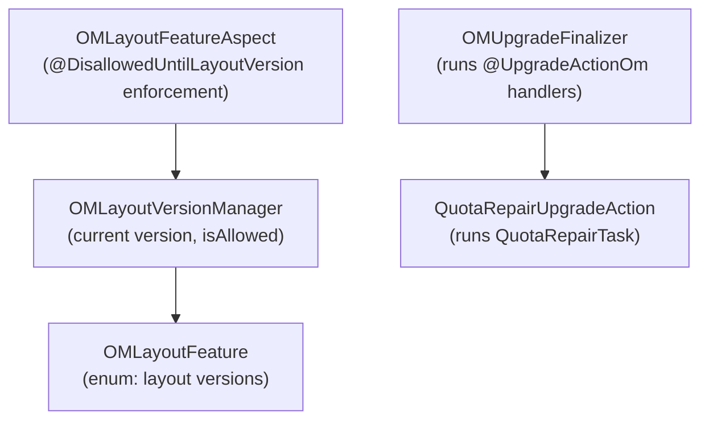

# OM / om-upgrade

**Classes:** 9    **Kinds:** interface:4, service:4, data:1

## Overview

The `om-upgrade` feature implements the OM side of the rolling-upgrade and finalization framework. `OMLayoutFeature` is an enum listing all OM layout features (each tied to a version number) — adding an entry here signals that a feature is gated until finalization. `OMLayoutVersionManager` tracks the current OM layout version against `OMLayoutFeature` and provides `isAllowed(feature)` checks. `OMLayoutFeatureAspect` is an AspectJ aspect that intercepts methods annotated with `@DisallowedUntilLayoutVersion` and throws an exception if the current layout version is too low. `OmUpgradeAction` is a functional interface for upgrade finalization handlers. `@UpgradeActionOm` marks a method as an upgrade action to run at a specific `OMLayoutFeature`. `OMUpgradeFinalizer` runs all registered `@UpgradeActionOm` handlers in version order during `OMFinalizeUpgradeRequest`. `QuotaRepairUpgradeAction` is the upgrade action that triggers `QuotaRepairTask`.

## Diagram

## Class table

### Sub-feature: `om.upgrade`

| reading_order | fqcn | kind | logic | loc | study (min) | role |
|--:|---|---|---|--:|--:|---|
| 990 | `org.apache.hadoop.ozone.om.upgrade.BelongsToLayoutVersion` | interface | mixed | 25~ | 20 | Annotation to mark a class that belongs to a specific Layout Version. |
| 991 | `org.apache.hadoop.ozone.om.upgrade.OmUpgradeAction` | interface | mixed | 25~ | 20 | Upgrade Action for OzoneManager which takes in an 'OM' instance. |
| 992 | `org.apache.hadoop.ozone.om.upgrade.UpgradeActionOm` | interface | mixed | 25~ | 20 | Annotation to specify upgrade action run during Ozone Manager finalization. |
| 993 | `org.apache.hadoop.ozone.om.upgrade.DisallowedUntilLayoutVersion` | interface | mixed | 25~ | 20 | Annotation used to "disallow" an API if current layout version does not include the associated layout feature. |
| 994 | `org.apache.hadoop.ozone.om.upgrade.OMLayoutVersionManager` | service | mixed | 100~ | 30 | Class to manage layout versions and features for Ozone Manager. |
| 995 | `org.apache.hadoop.ozone.om.upgrade.OMLayoutFeatureAspect` | service | mixed | 75~ | 30 | 'Aspect' for OM Layout Feature API. |
| 996 | `org.apache.hadoop.ozone.om.upgrade.QuotaRepairUpgradeAction` | service | mixed | 25~ | 30 | Quota repair for usages action to be triggered after upgrade. |
| 997 | `org.apache.hadoop.ozone.om.upgrade.OMUpgradeFinalizer` | service | mixed | 25~ | 30 | UpgradeFinalizer implementation for the Ozone Manager service. |
| 998 | `org.apache.hadoop.ozone.om.upgrade.OMLayoutFeature` | data | data-only | 50~ | 10 | List of OM Layout features / versions. |

## Anchor details

_No logic-heavy anchors in this feature; the classes are primarily data / dto / config / cli._

## Design docs

- `hadoop-hdds/docs/content/design/nonrolling-upgrade.md` — OM non-rolling upgrade design
- `hadoop-hdds/docs/content/design/upgrade-dev-primer.md` — developer guide for adding new OM upgrade actions

## Seminal JIRAs / PRs

- HDDS-14347. Handle upgrades to support S3 lifecycle (added new `OMLayoutFeature`)
- HDDS-14569. Remove support for upgrade actions that run outside of finalization
- HDDS-14568. Remove unused `LayoutVersionInstanceFactory` from the upgrade framework
- HDDS-13452. Prevent snapshot defrag from happening before upgrade finalization
- HDDS-11258. Add new OM layout version (HBASE_SUPPORT, hsync)

## Sharp edges

- `@DisallowedUntilLayoutVersion` is enforced via AspectJ at runtime. If the AspectJ weaving is not active (e.g., running tests without the weaving agent), the annotation has no effect and the feature is accessible regardless of layout version, silently bypassing the upgrade guard.
- `OMLayoutFeature` is an enum — adding a new value anywhere except the end changes the ordinal values of all subsequent features, breaking any code that stores ordinal integers. Always add new features at the end of the enum.

## Related features

- `components/om/om-request-upgrade.md` — `OMFinalizeUpgradeRequest` triggers `OMUpgradeFinalizer`
- `components/om/om-background-services.md` — `QuotaRepairUpgradeAction` runs `QuotaRepairTask`
- `components/om/om-request.md` — `@DisallowedUntilLayoutVersion` and `@BelongsToLayoutVersion` annotations used on request methods

## Self-quiz

1. `OMLayoutFeatureAspect` uses AspectJ. What happens if AspectJ weaving is not enabled and an `@DisallowedUntilLayoutVersion` method is called before finalization?
2. `OMLayoutFeature` is an enum. Why must new features always be added at the end?
3. `QuotaRepairUpgradeAction` runs `QuotaRepairTask`. Is this action synchronous or asynchronous and does it block finalization?
4. `@BelongsToLayoutVersion` annotates request classes. How does `OMLayoutVersionManager` use this annotation?
5. After finalization, `OMLayoutVersionManager.getMetadataLayoutVersion()` returns the final version. Where is this version persisted?

Answers

Answer 1: The annotation is effectively ignored — the method executes without the upgrade guard check. This can cause data corruption if the underlying DB schema has not been finalized.
Answer 2: `OMLayoutFeature` values are stored by name (not ordinal) in `OMStorage`, so ordinal order does not affect persistence. However, the `getDefaultLayoutVersion()` comparison uses ordinal comparison, and code that relies on ordinal order would break. The safe practice is appending-only.
Answer 3: `QuotaRepairTask.repair()` is run synchronously inside `OMUpgradeFinalizer` during `OMFinalizeUpgradeRequest.validateAndUpdateCache`. It blocks until the full table scan completes, which can take a long time on large clusters.
Answer 4: `OMLayoutVersionManager` discovers request classes annotated with `@BelongsToLayoutVersion` and uses them to determine which request types are available at each layout version, enabling version-specific routing in `OzoneManagerRatisUtils.createClientRequest`.
Answer 5: In `OMStorage` — specifically in the `VERSION` file written to the OM metadata directory. The `layoutVersion` field is updated during finalization and persisted to disk.

