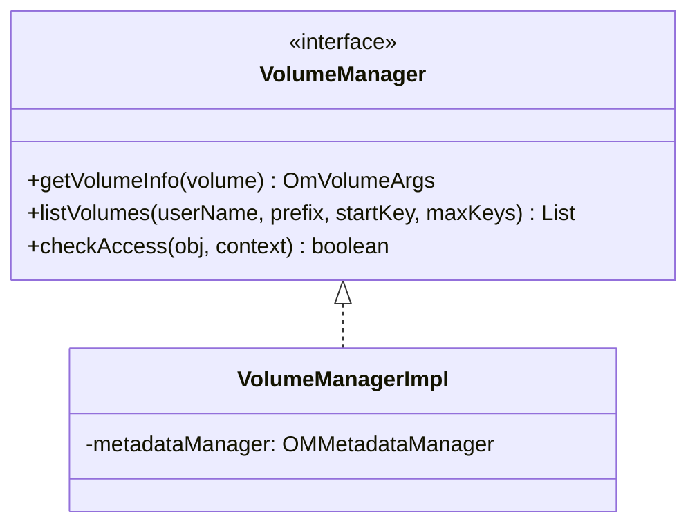

# OM / om-volume-manager

**Classes:** 2    **Kinds:** interface:1, service:1

## Overview

The `om-volume-manager` feature defines the volume-level read-path interface and its implementation. `VolumeManager` defines `getVolumeInfo`, `listVolumes`, `listAllVolumes`, and `checkAccess`. `VolumeManagerImpl` implements these against `OMMetadataManager`, using `OzoneManagerLock.VOLUME_LOCK` for read-path operations. Volume listing by admin uses the `userTable` index to find all volumes owned by a user. The `ozone.om.volume.listall.allowed` config controls whether non-admin users can list all volumes (HDDS-12301, made reconfigurable in HDDS-12248). All write-path volume operations (create, delete, set-quota) are in `om-request-volume`.

## Diagram

## Class table

### Sub-feature: `ozone.om`

| reading_order | fqcn | kind | logic | loc | study (min) | role |
|--:|---|---|---|--:|--:|---|
| 483 | `org.apache.hadoop.ozone.om.VolumeManager` | interface | mixed | 25~ | 20 | VolumeManager is responsible for read operations on a volume. |
| 484 | `org.apache.hadoop.ozone.om.VolumeManagerImpl` | service | mixed | 100~ | 30 | Volume Manager implementation. |

## Anchor details

_No logic-heavy anchors in this feature; the classes are primarily data / dto / config / cli._

## Design docs

- `hadoop-hdds/docs/content/design/volume-management.md` — volume management design
- `hadoop-hdds/docs/content/concept/VolumesBucketsKeys.md` — Ozone namespace overview

## Seminal JIRAs / PRs

- HDDS-12301. Move `ozone.om.volume.listall.allowed` into `OmConfig`
- HDDS-12248. Make `allowListAllVolumes` reconfigurable in OM
- HDDS-14207. Inconsistent Ozone admin check (volume listall check)

## Sharp edges

- `VolumeManagerImpl.listAllVolumes` scans the `userTable` which is keyed by `userName/volumeName`. If a user owns thousands of volumes, this scan can be slow and memory-intensive.

## Related features

- `components/om/om-request-volume.md` — write-path volume request classes
- `components/om/om-bucket-manager.md` — `BucketManagerImpl` is the bucket-level equivalent

## Self-quiz

1. `VolumeManagerImpl.listVolumes(userName, ...)` uses which table to list volumes for a user?
2. What config controls whether non-admin users can call `listAllVolumes`?
3. `VolumeManagerImpl.checkAccess` delegates to which authorizer class?
4. What lock does `VolumeManagerImpl.getVolumeInfo` acquire?
5. `OmVolumeArgs` is stored in `volumeTable`. What is the key format?

Answers

Answer 1: `userTable` — keyed by `userName/volumeName`, it provides an efficient prefix scan for a user's volumes.
Answer 2: `ozone.om.volume.listall.allowed` — when true, any authenticated user can list all volumes; when false, only admins can.
Answer 3: `OzoneManager.getAccessAuthorizer()` — which returns either `OzoneNativeAuthorizer` or the Ranger-backed authorizer based on configuration.
Answer 4: Volume read lock: `OzoneManagerLock.acquireReadLock(VOLUME_LOCK, volumeName)`.
Answer 5: The volume name (e.g., `myvolume`) — a flat key, not prefixed.

