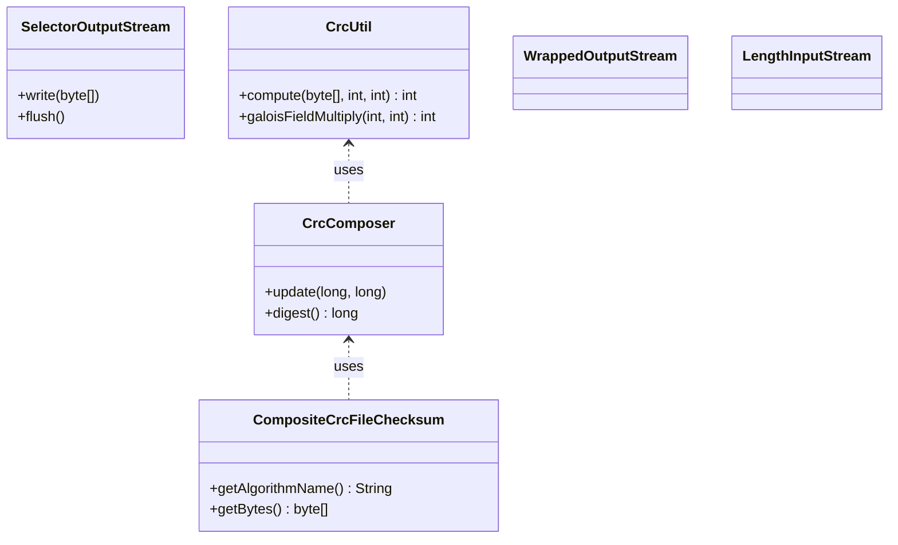

# OzoneCommon / client-common

**Classes:** 6    **Kinds:** service:6

## Overview

The `client-common` feature group holds shared I/O and checksum utilities used by Ozone client code. `SelectorOutputStream` buffers writes up to a configurable capacity threshold and then forwards to a delegated `OutputStream`, useful for deciding between in-memory and on-disk paths at write time. The CRC subsystem — `CrcUtil`, `CrcComposer`, and `CompositeCrcFileChecksum` — implements composite CRC computation over Ozone data blocks: `CrcUtil` provides low-level Galois Field polynomial arithmetic and CRC table lookups, `CrcComposer` accumulates per-chunk CRCs into a combined value for arbitrarily concatenated byte ranges, and `CompositeCrcFileChecksum` packages the resulting checksum into the Hadoop `FileChecksum` contract. `WrappedOutputStream` and `LengthInputStream` are thin decorators that track byte position or delegate transparently.

## Diagram

## Class table

### Sub-feature: `client.checksum`

| reading_order | fqcn | kind | logic | loc | study (min) | role |
|--:|---|---|---|--:|--:|---|
| 48 | `org.apache.hadoop.ozone.client.checksum.CrcUtil` | service | mixed | 125~ | 30 | This class provides utilities for working with CRCs. |
| 49 | `org.apache.hadoop.ozone.client.checksum.CrcComposer` | service | mixed | 100~ | 30 | Encapsulates logic for composing multiple CRCs into one or more combined CRCs corresponding to concatenated underlyin... |
| 50 | `org.apache.hadoop.ozone.client.checksum.CompositeCrcFileChecksum` | service | mixed | 50~ | 30 | Composite CRC. |

### Sub-feature: `client.io`

| reading_order | fqcn | kind | logic | loc | study (min) | role |
|--:|---|---|---|--:|--:|---|
| 51 | `org.apache.hadoop.ozone.client.io.SelectorOutputStream` | service | mixed | 125~ | 30 | An OutputStream first write data to a buffer up to the capacity. |
| 52 | `org.apache.hadoop.ozone.client.io.WrappedOutputStream` | service | mixed | 25~ | 30 | Pure wrapper of OutputStream. |
| 53 | `org.apache.hadoop.ozone.client.io.LengthInputStream` | service | mixed | 25~ | 30 | An input stream with length. |

## Anchor details

_No logic-heavy anchors in this feature; the classes are primarily data / dto / config / cli._

## Design docs

- no dedicated design doc under hadoop-hdds/docs/content/ on this branch

## Seminal JIRAs / PRs

- HDDS-9228. Poor S3G read performance (introduced `SelectorOutputStream` to avoid early stream selection)
- HDDS-10489. Use CRC tables to speed up galoisFieldMultiply in CrcUtil
- HDDS-15115. CrcUtil/CrcComposer should not throw IOException for non-IO operations
- HDDS-9886. `hadoop fs -checksum` fails with `NoClassDefFoundError` on Hadoop 2
- HDDS-11816. Ozone stream to support Hsync/Hflush

## Sharp edges

- `CrcComposer` accumulates state; calling `digest()` does not reset the composer. Re-use without explicit reconstruction will silently corrupt checksums across multiple ranges (`hadoop-ozone/common/src/main/java/org/apache/hadoop/ozone/client/checksum/CrcComposer.java`).
- `SelectorOutputStream` delegates to the underlying stream only after the buffer threshold is crossed; callers that close without flushing may leave buffered bytes unwritten if the threshold is never reached.

## Related features

- `components/ozonecommon/protocol-common.md` — OMPBHelper uses `CrcUtil`/`CompositeCrcFileChecksum` when translating checksum protobufs
- `components/ozonecommon/ozone-fs-common.md` — OzoneTrashPolicy interacts with the same OutputStream abstraction layer
- `components/OzoneClient/ozone-client-core.md` — OzoneInputStream/OzoneOutputStream build on these utilities

## Self-quiz

1. What does `SelectorOutputStream` do before the capacity threshold is reached, and where does it switch behaviour?
2. Explain the role of `CrcComposer.update(long crc, long dataLength)` — why is the length parameter required?
3. Which class implements the Hadoop `FileChecksum` contract and what algorithm name does it report?
4. What Galois Field operation does `CrcUtil.galoisFieldMultiply` perform and why was it accelerated in HDDS-10489?
5. Can `CrcComposer` be reused across calls? Cite a specific method or field to justify your answer.

Answers

Answer 1: Before the capacity threshold is crossed, `SelectorOutputStream` buffers writes in memory. Once the threshold is reached, it selects and delegates to the backing `OutputStream`. See the `write` methods in `SelectorOutputStream.java`.
Answer 2: CRC combination is not simply XOR; the length of each chunk determines the polynomial shift needed to merge two CRCs representing concatenated byte ranges. Without the length, the final combined CRC would be wrong.
Answer 3: `CompositeCrcFileChecksum` implements `FileChecksum`. The `getAlgorithmName()` method returns a string such as `COMPOSITE-CRC32C` depending on the underlying CRC type.
Answer 4: `galoisFieldMultiply` computes polynomial multiplication over GF(2^32) used in CRC combination. HDDS-10489 replaced the naive loop with a lookup table (stored as a static array in `CrcUtil`) to reduce CPU work per byte.
Answer 5: `CrcComposer` is stateful and cannot be safely reused across independent checksums without constructing a new instance. The accumulated `crc` field is updated in-place by `update()` and never reset.

