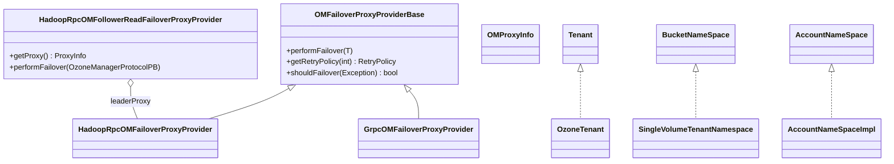

# OzoneCommon / om-common

**Classes:** 19    **Kinds:** service:8, interface:4, exception:3, config:2, abstract:1, dto:1

## Overview

The `om-common` feature group provides the client-side failover and HA plumbing for OM communication, plus the multi-tenancy namespace model and shared configuration. `OMFailoverProxyProviderBase` implements the Hadoop `FailoverProxyProvider` contract: it maintains an ordered list of OM proxies, selects the next candidate on `performFailover`, and encodes retry logic that distinguishes `OMNotLeaderException` (use the suggested leader), `OMLeaderNotReadyException` (retry same OM with back-off), and connection failures (optionally re-resolve DNS for Kubernetes pod-IP changes). `HadoopRpcOMFollowerReadFailoverProxyProvider` wraps that base provider with a `FollowerReadInvocationHandler` dynamic proxy that injects a `ReadConsistencyHint` into every `OMRequest` so follower reads can be routed to non-leader OMs. The multi-tenancy interfaces (`Tenant`, `BucketNameSpace`, `AccountNameSpace`) and their concrete implementations represent the namespace model used by OM for tenant isolation; `OMConfigKeys` and `OmConfig` hold all OM configuration constants.

## Diagram

## Class table

### Sub-feature: `multitenant.impl`

| reading_order | fqcn | kind | logic | loc | study (min) | role |
|--:|---|---|---|--:|--:|---|
| 2095 | `org.apache.hadoop.ozone.om.multitenant.impl.SingleVolumeTenantNamespace` | service | mixed | 50~ | 30 | Implements BucketNameSpace which allows exactly ONE VOLUME. |
| 2096 | `org.apache.hadoop.ozone.om.multitenant.impl.AccountNameSpaceImpl` | service | mixed | 25~ | 30 | Implements AccountNameSpace. |

### Sub-feature: `om.exceptions`

| reading_order | fqcn | kind | logic | loc | study (min) | role |
|--:|---|---|---|--:|--:|---|
| 2097 | `org.apache.hadoop.ozone.om.exceptions.OMException` | exception | data-only | 125~ | 10 | Exception thrown by Ozone Manager. |
| 2098 | `org.apache.hadoop.ozone.om.exceptions.OMNotLeaderException` | exception | data-only | 50~ | 10 | Exception thrown by org.apache.hadoop.ozone.om.protocolPB.OzoneManagerProtocolPB when a read request is received by a... |
| 2099 | `org.apache.hadoop.ozone.om.exceptions.OMLeaderNotReadyException` | exception | data-only | 25~ | 10 | Exception thrown by org.apache.hadoop.ozone.om.protocolPB.OzoneManagerProtocolPB when OM leader is not ready to serve... |

### Sub-feature: `om.ha`

| reading_order | fqcn | kind | logic | loc | study (min) | role |
|--:|---|---|---|--:|--:|---|
| 2100 | `org.apache.hadoop.ozone.om.ha.OMFailoverProxyProviderBase` | abstract | logic-heavy | 300~ | 45 | A failover proxy provider base abstract class. |
| 2101 | `org.apache.hadoop.ozone.om.ha.HadoopRpcOMFollowerReadFailoverProxyProvider` | service | logic-heavy | 225~ | 45 | A org.apache.hadoop.io.retry.FailoverProxyProvider implementation that supports reading from follower OM(s) (i.e. |
| 2102 | `org.apache.hadoop.ozone.om.ha.HadoopRpcOMFailoverProxyProvider` | service | mixed | 75~ | 30 | A failover proxy provider implementation which allows clients to configure multiple OMs to connect to. |
| 2103 | `org.apache.hadoop.ozone.om.ha.GrpcOMFailoverProxyProvider` | service | mixed | 75~ | 30 | The Grpc s3gateway om transport failover proxy provider implementation extending the ozone client OM failover proxy p... |
| 2104 | `org.apache.hadoop.ozone.om.ha.OMProxyInfo` | dto | data-only | 175~ | 10 | ProxyInfo with additional info such as #nodeId and #rpcAddr. |

### Sub-feature: `om.multitenant`

| reading_order | fqcn | kind | logic | loc | study (min) | role |
|--:|---|---|---|--:|--:|---|
| 2105 | `org.apache.hadoop.ozone.om.multitenant.AccountNameSpace` | interface | mixed | 25~ | 20 | AccountNameSpace interface. |
| 2106 | `org.apache.hadoop.ozone.om.multitenant.Tenant` | interface | mixed | 25~ | 20 | Tenant interface. |
| 2107 | `org.apache.hadoop.ozone.om.multitenant.BucketNameSpace` | interface | mixed | 25~ | 20 | BucketNameSpace interface. |
| 2108 | `org.apache.hadoop.ozone.om.multitenant.OzoneTenant` | service | mixed | 50~ | 30 | In-memory tenant info. |
| 2109 | `org.apache.hadoop.ozone.om.multitenant.OzoneOwnerPrincipal` | service | mixed | 25~ | 30 | Used to specify &#123;OWNER&#125; tag in Ranger. |
| 2110 | `org.apache.hadoop.ozone.om.multitenant.OzoneTenantRolePrincipal` | service | mixed | 25~ | 30 | Used to identify a tenant's Ranger Role. |

### Sub-feature: `ozone.om`

| reading_order | fqcn | kind | logic | loc | study (min) | role |
|--:|---|---|---|--:|--:|---|
| 2111 | `org.apache.hadoop.ozone.om.IOmMetadataReader` | interface | mixed | 25~ | 20 | Protocol for OmMetadataReader's. |
| 2112 | `org.apache.hadoop.ozone.om.OMConfigKeys` | config | logic-heavy | 550~ | 20 | Ozone Manager Constants. |
| 2113 | `org.apache.hadoop.ozone.om.OmConfig` | config | logic-heavy | 275~ | 20 | Ozone Manager configuration. |

## Anchor details

### `OMFailoverProxyProviderBase`

- **path:** `hadoop-ozone/common/src/main/java/org/apache/hadoop/ozone/om/ha/OMFailoverProxyProviderBase.java`
- **loc:** 300~    **difficulty:** 4    **study:** 45 min    **concurrency:** thread-safe    **persistence:** in-memory
- **key collaborators:** `org.apache.hadoop.ozone.om.exceptions.OMException`, `org.apache.hadoop.ozone.om.exceptions.OMLeaderNotReadyException`, `org.apache.hadoop.ozone.om.exceptions.OMNotLeaderException`, `org.apache.hadoop.hdds.HddsUtils`, `org.apache.hadoop.hdds.conf.ConfigurationSource`, `org.apache.hadoop.hdds.utils.ConnectionFailureUtils`
- **role:** A failover proxy provider base abstract class.
- The key insight is in `shouldRetry` inside `getRetryPolicy`: on `OMNotLeaderException` the provider fast-paths to the suggested leader node via `setNextOmProxy(suggestedNodeId)` rather than round-robining; on `OMLeaderNotReadyException` it re-pins to the same node (`setNextOmProxy(omNodeId)`) to stay on the current leader candidate. The `resolveOnFailureEnabled` flag (HDDS-15531) adds a DNS re-resolution step before advancing to the next node, enabling transparent recovery from Kubernetes pod-IP changes.

### `HadoopRpcOMFollowerReadFailoverProxyProvider`

- **path:** `hadoop-ozone/common/src/main/java/org/apache/hadoop/ozone/om/ha/HadoopRpcOMFollowerReadFailoverProxyProvider.java`
- **loc:** 225~    **difficulty:** 4    **study:** 45 min    **concurrency:** single-threaded    **persistence:** in-memory
- **entry points:** `close`
- **key collaborators:** `org.apache.hadoop.ozone.om.exceptions.OMLeaderNotReadyException`, `org.apache.hadoop.ozone.om.exceptions.OMNotLeaderException`, `org.apache.hadoop.ozone.OmUtils`, `org.apache.hadoop.ozone.om.helpers.ReadConsistency`, `org.apache.hadoop.ozone.om.protocolPB.OzoneManagerProtocolPB`
- **test exemplar:** `hadoop-ozone/common/src/test/java/org/apache/hadoop/ozone/om/ha/TestHadoopRpcOMFollowerReadFailoverProxyProvider.java`
- **role:** Extends Hadoop OM failover with optional follower-read routing via an injected `ReadConsistencyHint`.
- The combined proxy returned by `getProxy()` is a JDK dynamic proxy backed by `FollowerReadInvocationHandler`. On each invocation, the handler inspects whether the request is a read and `useFollowerRead` is true; if so it injects `followerReadConsistency` into the `OMRequest`, then calls the current follower proxy. If that proxy returns `ReadException` or `ReadIndexException`, the handler falls back to the leader proxy with `leaderReadConsistency`. `changeProxy` is `synchronized` to prevent concurrent invocations from advancing the index twice.

## Design docs

- `hadoop-hdds/docs/content/design/omha.md` — OM HA design covering failover proxy provider architecture
- `hadoop-hdds/docs/content/design/listener-om.md` — OM listener node design (relates to follower-read routing)

## Seminal JIRAs / PRs

- HDDS-14682. Unify OzoneManagerProtocolPB failover proxy provider
- HDDS-9279. Basic implementation of OM follower read
- HDDS-14379. Implement basic Hadoop OM client proxy provider to read from followers
- HDDS-14425. Implement Ratis follower read exception handling
- HDDS-14509. Allow client to choose the read consistency level
- HDDS-15531. DNS refresh on connection failure for Client to OM
- HDDS-15492. Support OM follower read for gRPC client

## Sharp edges

- `OMFailoverProxyProviderBase.shouldRetry` is `synchronized`, but the `accessControlExceptionOMs` set can grow across retries and is only cleared when the full round-robin completes — if the OM list changes while a client is retrying, stale node IDs remain in the set (`OMFailoverProxyProviderBase.java`, `accessControlExceptionOMs` field).
- `HadoopRpcOMFollowerReadFailoverProxyProvider.changeProxy` advances `currentIndex` modulo the proxy list size; if `leaderProxy.getOMProxyMap()` grows or shrinks between calls (e.g. OM bootstrap), `currentIndex` can point to the wrong node without any error (`HadoopRpcOMFollowerReadFailoverProxyProvider.java`, `changeProxy` method).

## Related features

- `components/ozonecommon/protocol-common.md` — `OzoneManagerProtocolClientSideTranslatorPB` uses the proxy provider chain
- `components/ozonecommon/om-helpers-common.md` — `ReadConsistency` enum used to configure follower-read hints
- `components/ozonecommon/ozone-common-primitives.md` — `OmUtils.getOMClientRpcTimeOut` consumed by `createOMProxy`

## Self-quiz

1. In `OMFailoverProxyProviderBase.getRetryPolicy`, what does the provider do when it receives an `OMNotLeaderException` that contains a `suggestedLeaderNodeId`?
2. What is the role of `HadoopRpcOMFollowerReadFailoverProxyProvider.FollowerReadInvocationHandler` and how does it decide whether to use a follower proxy or fall back to the leader?
3. Why does `OMFailoverProxyProviderBase` have both `currentProxyIndex` and `nextProxyIndex` rather than a single index?
4. What guard prevents `HadoopRpcOMFollowerReadFailoverProxyProvider.changeProxy` from advancing the index multiple times under concurrent requests?
5. Name the exception type that causes the provider to retry on the same OM rather than failing over to a different one, and explain why.

Answers

Answer 1: It calls `setNextOmProxy(suggestedNodeId)` to pin the next attempt to the suggested leader, then returns `FAILOVER_AND_RETRY` with the configured wait time — skipping the round-robin advance.
Answer 2: `FollowerReadInvocationHandler.invoke` inspects the parsed `OMRequest` to determine if it is a read; if follower reads are enabled, it injects `followerReadConsistency` and routes to the current follower. On `ReadException`/`ReadIndexException` it falls back to the leader provider.
Answer 3: `nextProxyIndex` is set during retry-policy evaluation (possibly by `setNextOmProxy` or `selectNextOmProxy`) so the correct proxy is ready when Hadoop's `RetryInvocationHandler` calls `performFailover`. `currentProxyIndex` tracks what is in active use, enabling `getCurrentProxyOMNodeId` to remain stable.
Answer 4: `changeProxy` is `synchronized` and checks `currentProxy != initial` before advancing. If another thread already moved the index, the check fails and the call is a no-op.
Answer 5: `OMLeaderNotReadyException` causes retry on the same OM. The leader is elected but not yet ready to serve requests (e.g. still catching up with Raft log); the provider backs off linearly and retries the same node rather than switching to a follower that would also fail.

