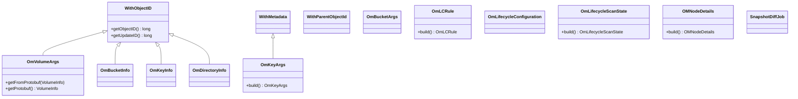

# OzoneCommon / om-helpers-common

**Classes:** 76    **Kinds:** service:45, dto:21, data:4, interface:3, abstract:3

## Overview

The `om-helpers-common` feature group is the largest in OzoneCommon and contains the shared data model and helper classes that both the OM server and clients use to represent namespace objects. Immutable request/response args classes (`OmVolumeArgs`, `OmKeyArgs`, `OmBucketArgs`, `OmBucketInfo`, `OmKeyInfo`) carry attributes across the RPC boundary; they implement `Auditable` for audit-log emission and are serialized via Proto2 codecs from `hadoop-hdds/framework`. Abstract mixins `WithObjectID`, `WithMetadata`, and `WithParentObjectId` inject monotonically-increasing object IDs, custom metadata maps, and FSO parent pointers respectively. Lifecycle management adds `OmLCRule`, `OmLifecycleConfiguration`, `OmLifecycleScanState`, and related filter/action types. Snapshot diff state is tracked in `SnapshotDiffJob`. Utility classes `OzoneFSUtils`, `OzoneAclUtil`, and `QuotaUtil` host pure-function helpers for path resolution, ACL list manipulation, and quota arithmetic.

## Diagram

## Class table

### Sub-feature: `om.helpers`

| reading_order | fqcn | kind | logic | loc | study (min) | role |
|--:|---|---|---|--:|--:|---|
| 2114 | `org.apache.hadoop.ozone.om.helpers.OmVolumeArgs` | service | logic-heavy | 300~ | 20 | A class that encapsulates the OmVolumeArgs Args. |
| 2115 | `org.apache.hadoop.ozone.om.helpers.OmLCAction` | interface | mixed | 25~ | 20 | Interface that encapsulates lifecycle rule actions. |
| 2116 | `org.apache.hadoop.ozone.om.helpers.WithTags` | interface | mixed | 25~ | 20 | Interface to handle S3 object / bucket tags. |
| 2117 | `org.apache.hadoop.ozone.om.helpers.WithObjectID` | abstract | mixed | 75~ | 30 | Mixin class to handle ObjectID and UpdateID. |
| 2118 | `org.apache.hadoop.ozone.om.helpers.WithMetadata` | abstract | mixed | 50~ | 30 | Mixin class to handle custom metadata. |
| 2119 | `org.apache.hadoop.ozone.om.helpers.WithParentObjectId` | abstract | mixed | 25~ | 30 | Object ID with additional parent ID field. |
| 2120 | `org.apache.hadoop.ozone.om.helpers.OmKeyArgs` | service | logic-heavy | 325~ | 45 | Args for key. |
| 2121 | `org.apache.hadoop.ozone.om.helpers.SnapshotDiffJob` | service | logic-heavy | 275~ | 45 | POJO for Snapshot diff job. |
| 2122 | `org.apache.hadoop.ozone.om.helpers.OmLCRule` | service | logic-heavy | 275~ | 45 | A class that encapsulates lifecycle rule. |
| 2123 | `org.apache.hadoop.ozone.om.helpers.OmBucketArgs` | service | logic-heavy | 250~ | 45 | A class that encapsulates Bucket Arguments. |
| 2124 | `org.apache.hadoop.ozone.om.helpers.OzoneFSUtils` | service | logic-heavy | 250~ | 45 | Utility class for OzoneFileSystem. |
| 2125 | `org.apache.hadoop.ozone.om.helpers.OmLifecycleConfiguration` | service | logic-heavy | 225~ | 45 | A class that encapsulates lifecycle configuration. |
| 2126 | `org.apache.hadoop.ozone.om.helpers.OmLifecycleScanState` | service | logic-heavy | 200~ | 45 | POJO for LifecycleScanState. |
| 2127 | `org.apache.hadoop.ozone.om.helpers.OMNodeDetails` | service | logic-heavy | 200~ | 45 | This class stores OM node details. |
| 2128 | `org.apache.hadoop.ozone.om.helpers.OmKeyLocationInfoGroup` | service | mixed | 150~ | 45 | A list of key locations. |
| 2129 | `org.apache.hadoop.ozone.om.helpers.OmMultipartPartKey` | service | mixed | 150~ | 45 | Typed key for multipart parts table. |
| 2130 | `org.apache.hadoop.ozone.om.helpers.OzoneAclUtil` | service | mixed | 150~ | 45 | Helper class for ozone acls operations. |
| 2131 | `org.apache.hadoop.ozone.om.helpers.OmLCFilter` | service | mixed | 150~ | 45 | A class that encapsulates lifecycle rule filter. |
| 2132 | `org.apache.hadoop.ozone.om.helpers.OmLifecycleRuleAndOperator` | service | mixed | 125~ | 30 | A class that encapsulates lifecycleRule andOperator. |
| 2133 | `org.apache.hadoop.ozone.om.helpers.OmLCExpiration` | service | mixed | 125~ | 30 | A class that encapsulates lifecycle rule expiration action. |
| 2134 | `org.apache.hadoop.ozone.om.helpers.OmDBTenantState` | service | mixed | 125~ | 30 | This class is used for storing Ozone tenant state info. |
| 2135 | `org.apache.hadoop.ozone.om.helpers.OzoneFileStatusLight` | service | mixed | 100~ | 30 | Lightweight OzoneFileStatus class. |
| 2136 | `org.apache.hadoop.ozone.om.helpers.OzoneFileStatus` | service | mixed | 100~ | 30 | File Status of the Ozone Key. |
| 2137 | `org.apache.hadoop.ozone.om.helpers.OmMultipartUpload` | service | mixed | 100~ | 30 | Information about one initialized upload. |
| 2138 | `org.apache.hadoop.ozone.om.helpers.S3SecretValue` | service | mixed | 75~ | 30 | S3Secret to be saved in database. |
| 2139 | `org.apache.hadoop.ozone.om.helpers.OmLCAbortIncompleteMultipartUpload` | service | mixed | 75~ | 30 | A class that encapsulates lifecycle rule AbortIncompleteMultipartUpload action. |
| 2140 | `org.apache.hadoop.ozone.om.helpers.TenantUserInfoValue` | service | mixed | 50~ | 30 | Utility class to handle TenantGetUserInfoResponse protobuf message. |
| 2141 | `org.apache.hadoop.ozone.om.helpers.OMRatisHelper` | service | mixed | 50~ | 30 | Helper methods for converting between proto 2 (OM) and proto 3 (Ratis) messages. |
| 2142 | `org.apache.hadoop.ozone.om.helpers.QuotaUtil` | service | mixed | 50~ | 30 | Helper class to calculate quota related usage. |
| 2143 | `org.apache.hadoop.ozone.om.helpers.OmTenantArgs` | service | mixed | 50~ | 30 | This class is used for storing Ozone tenant arguments. |
| 2144 | `org.apache.hadoop.ozone.om.helpers.ListOpenFilesResult` | service | mixed | 50~ | 30 | Encapsulates the result of listOpenFiles. |
| 2145 | `org.apache.hadoop.ozone.om.helpers.DBUpdates` | service | mixed | 50~ | 30 | Client side representation of DBUpdates. |
| 2146 | `org.apache.hadoop.ozone.om.helpers.OmLifecycleUtils` | service | mixed | 50~ | 30 | Utility class for Ozone Lifecycle. |
| 2147 | `org.apache.hadoop.ozone.om.helpers.DeleteTenantState` | service | mixed | 50~ | 30 | A class that encapsulates DeleteTenantResponse protobuf message. |
| 2148 | `org.apache.hadoop.ozone.om.helpers.KeyInfoWithVolumeContext` | service | mixed | 50~ | 30 | Encloses a OmKeyInfo and optionally a volume context. |
| 2149 | `org.apache.hadoop.ozone.om.helpers.OmMultipartUploadList` | service | mixed | 50~ | 30 | List of in-flight MPU uploads. |
| 2150 | `org.apache.hadoop.ozone.om.helpers.S3VolumeContext` | service | mixed | 50~ | 30 | A class that encapsulates GetS3VolumeContextResponse protobuf message. |
| 2151 | `org.apache.hadoop.ozone.om.helpers.ServiceInfoEx` | service | mixed | 25~ | 30 | Wrapper class for service discovery, design for broader usage such as security, etc. |
| 2152 | `org.apache.hadoop.ozone.om.helpers.OmMultipartUploadListParts` | service | mixed | 25~ | 30 | Class which is response for the list parts of a multipart upload key. |
| 2153 | `org.apache.hadoop.ozone.om.helpers.OmDeleteKeys` | service | mixed | 25~ | 30 | Represent class which has info of Keys to be deleted from Client. |
| 2154 | `org.apache.hadoop.ozone.om.helpers.OmRenameKeys` | service | mixed | 25~ | 30 | This class is used for rename keys. |
| 2155 | `org.apache.hadoop.ozone.om.helpers.OpenKeySession` | service | mixed | 25~ | 30 | This class represents a open key "session". |
| 2156 | `org.apache.hadoop.ozone.om.helpers.OzoneIdentityProvider` | service | mixed | 25~ | 30 | Ozone implementation of IdentityProvider used by Hadoop DecayRpcScheduler. |
| 2157 | `org.apache.hadoop.ozone.om.helpers.ListKeysResult` | service | mixed | 25~ | 30 | Encapsulates the result of listKeys. |
| 2158 | `org.apache.hadoop.ozone.om.helpers.TenantUserList` | service | mixed | 25~ | 30 | Class to encapsulate the list of users and corresponding accessIds associated with a tenant. |
| 2159 | `org.apache.hadoop.ozone.om.helpers.KeyValueUtil` | service | mixed | 25~ | 30 | Convert from/to hdds KeyValue protobuf structure. |
| 2160 | `org.apache.hadoop.ozone.om.helpers.ListKeysLightResult` | service | mixed | 25~ | 30 | Encapsulates the result of listKeys. |
| 2161 | `org.apache.hadoop.ozone.om.helpers.OmRangerSyncArgs` | service | mixed | 25~ | 30 | This class is used for storing Ranger Sync request args. |
| 2162 | `org.apache.hadoop.ozone.om.helpers.OmMultipartUploadCompleteList` | service | mixed | 25~ | 30 | This class represents multipart list, which is required for CompleteMultipart upload request. |
| 2163 | `org.apache.hadoop.ozone.om.helpers.TenantStateList` | service | mixed | 25~ | 30 | Utility class to handle protobuf message TenantState conversion. |
| 2164 | `org.apache.hadoop.ozone.om.helpers.OmTenantUserArgs` | service | mixed | 25~ | 30 | This class is used for storing tenant user arguments. |
| 2165 | `org.apache.hadoop.ozone.om.helpers.OmKeyInfo` | dto | logic-heavy | 700~ | 10 | Args for key block. |
| 2166 | `org.apache.hadoop.ozone.om.helpers.SnapshotInfo` | dto | logic-heavy | 575~ | 10 | This class is used for storing info related to Snapshots. |
| 2167 | `org.apache.hadoop.ozone.om.helpers.OmBucketInfo` | dto | logic-heavy | 575~ | 10 | A class that encapsulates Bucket Info. |
| 2168 | `org.apache.hadoop.ozone.om.helpers.OmMultipartKeyInfo` | dto | logic-heavy | 350~ | 10 | This class represents multipart upload information for a key, which holds upload part information of the key. |
| 2169 | `org.apache.hadoop.ozone.om.helpers.OmMultipartPartInfo` | dto | logic-heavy | 275~ | 10 | This class represents a part of a multipart upload key. |
| 2170 | `org.apache.hadoop.ozone.om.helpers.BasicOmKeyInfo` | dto | logic-heavy | 250~ | 10 | Lightweight OmKeyInfo class. |
| 2171 | `org.apache.hadoop.ozone.om.helpers.OmDirectoryInfo` | dto | data-only | 175~ | 10 | This class represents the directory information by keeping each component in the user given path and a pointer to its... |
| 2172 | `org.apache.hadoop.ozone.om.helpers.ServiceInfo` | dto | data-only | 150~ | 10 | ServiceInfo holds the config details of Ozone services. |
| 2173 | `org.apache.hadoop.ozone.om.helpers.RepeatedOmKeyInfo` | dto | data-only | 100~ | 10 | Args for deleted keys. |
| 2174 | `org.apache.hadoop.ozone.om.helpers.OmMultipartAbortInfo` | dto | data-only | 100~ | 10 | This class contains the necessary information to abort MPU keys. |
| 2175 | `org.apache.hadoop.ozone.om.helpers.OmDBAccessIdInfo` | dto | data-only | 75~ | 10 | This class is used for storing Ozone tenant accessId info. |
| 2176 | `org.apache.hadoop.ozone.om.helpers.OmKeyLocationInfo` | dto | data-only | 75~ | 10 | One key can be too huge to fit in one container. |
| 2177 | `org.apache.hadoop.ozone.om.helpers.BucketLayout` | data | data-only | 75~ | 10 | BucketLayout enum We have 3 types of bucket layouts - FSO, OBJECT_STORE, and LEGACY LEGACY is used to represent the o... |
| 2178 | `org.apache.hadoop.ozone.om.helpers.AclListBuilder` | data | data-only | 75~ | 10 | Helps incrementally build a list of ACLs. |
| 2179 | `org.apache.hadoop.ozone.om.helpers.ReadConsistency` | data | data-only | 75~ | 10 | Supported read consistency. |
| 2180 | `org.apache.hadoop.ozone.om.helpers.EncryptionBucketInfo` | dto | data-only | 75~ | 10 | A simple class for representing an encryption bucket. |
| 2181 | `org.apache.hadoop.ozone.om.helpers.OmDBUserPrincipalInfo` | dto | data-only | 50~ | 10 | This class is used for storing info related to the Kerberos principal. |
| 2182 | `org.apache.hadoop.ozone.om.helpers.OmPartInfo` | dto | data-only | 50~ | 10 | Class that defines information about each part of a multipart upload key. |
| 2183 | `org.apache.hadoop.ozone.om.helpers.BucketEncryptionKeyInfo` | dto | data-only | 50~ | 10 | Encryption key info for bucket encryption key. |
| 2184 | `org.apache.hadoop.ozone.om.helpers.MapBuilder` | data | data-only | 50~ | 10 | Helps incrementally build an immutable map. |
| 2185 | `org.apache.hadoop.ozone.om.helpers.OmMultipartUploadCompleteInfo` | dto | data-only | 50~ | 10 | This class holds information about the response of complete Multipart upload request. |
| 2186 | `org.apache.hadoop.ozone.om.helpers.LeaseKeyInfo` | dto | data-only | 25~ | 10 | This class represents LeaseKeyInfo. |
| 2187 | `org.apache.hadoop.ozone.om.helpers.OmMultipartInfo` | dto | data-only | 25~ | 10 | Class which holds information about the response of initiate multipart upload request. |
| 2188 | `org.apache.hadoop.ozone.om.helpers.ErrorInfo` | dto | data-only | 25~ | 10 | Represent class which has info of error thrown for any operation. |
| 2189 | `org.apache.hadoop.ozone.om.helpers.OmMultipartCommitUploadPartInfo` | dto | data-only | 25~ | 10 | This class holds information about the response from commit multipart upload part request. |

## Anchor details

### `OmVolumeArgs`

- **path:** `hadoop-ozone/common/src/main/java/org/apache/hadoop/ozone/om/helpers/OmVolumeArgs.java`
- **loc:** 300~    **difficulty:** 2    **study:** 20 min    **concurrency:** single-threaded    **persistence:** in-memory
- **key collaborators:** `org.apache.hadoop.hdds.utils.db.Codec`, `org.apache.hadoop.hdds.utils.db.CopyObject`, `org.apache.hadoop.hdds.utils.db.DelegatedCodec`, `org.apache.hadoop.hdds.utils.db.Proto2Codec`, `org.apache.hadoop.ozone.OzoneAcl`, `org.apache.hadoop.ozone.OzoneConsts`
- **test exemplar:** `hadoop-ozone/common/src/test/java/org/apache/hadoop/ozone/om/helpers/TestOmVolumeArgs.java`
- **role:** A class that encapsulates the OmVolumeArgs Args.
- The class is `@Immutable` and is stored in RocksDB via a `DelegatedCodec` wrapping `Proto2Codec<VolumeInfo>`. The `refCount` field (not in `VolumeInfo` proto until multi-tenancy) gates volume deletion: any non-zero count triggers `OMException` in the delete handler. `getProtobuf()` / `getFromProtobuf()` are the canonical serialization boundary.

### `OmKeyArgs`

- **path:** `hadoop-ozone/common/src/main/java/org/apache/hadoop/ozone/om/helpers/OmKeyArgs.java`
- **loc:** 325~    **difficulty:** 4    **study:** 45 min    **concurrency:** single-threaded    **persistence:** in-memory
- **entry points:** `build`
- **key collaborators:** `org.apache.hadoop.hdds.client.ReplicationConfig`, `org.apache.hadoop.ozone.OzoneAcl`, `org.apache.hadoop.ozone.OzoneConsts`, `org.apache.hadoop.ozone.audit.Auditable`, `org.apache.hadoop.ozone.security.GDPRSymmetricKey`
- **test exemplar:** `hadoop-ozone/common/src/test/java/org/apache/hadoop/ozone/om/helpers/TestOmKeyArgs.java`
- **role:** Args for key.
- `OmKeyArgs` is a request-side-only object (no RocksDB codec); it is translated to `KeyArgs` proto in `OzoneManagerProtocolClientSideTranslatorPB`. The `expectedDataGeneration` field (conditional writes, HDDS-13919) and `expectedETag` field are set only on overwrite-conditional paths. `headOp` suppresses block-location fetching.

### `SnapshotDiffJob`

- **path:** `hadoop-ozone/common/src/main/java/org/apache/hadoop/ozone/om/helpers/SnapshotDiffJob.java`
- **loc:** 275~    **difficulty:** 4    **study:** 45 min    **concurrency:** single-threaded    **persistence:** in-memory
- **key collaborators:** `org.apache.hadoop.hdds.utils.db.Codec`
- **role:** POJO for Snapshot diff job.
- Tracks the full lifecycle of an async snapshot diff operation: job ID, from/to snapshot names, creation time, total diff entries, and a `JobStatus` enum (`QUEUED`, `IN_PROGRESS`, `DONE`, `FAILED`, `CANCELLED`). Persisted to RocksDB via a `Proto2Codec`; job state transitions are applied by the OM snapshot diff service.

### `OmLCRule`

- **path:** `hadoop-ozone/common/src/main/java/org/apache/hadoop/ozone/om/helpers/OmLCRule.java`
- **loc:** 275~    **difficulty:** 4    **study:** 45 min    **concurrency:** single-threaded    **persistence:** in-memory
- **entry points:** `build`
- **key collaborators:** `org.apache.hadoop.ozone.om.exceptions.OMException`
- **test exemplar:** `hadoop-ozone/common/src/test/java/org/apache/hadoop/ozone/om/helpers/TestOmLCRule.java`
- **role:** A class that encapsulates lifecycle rule.
- `OmLCRule.Builder.build()` validates that exactly one action type is present and that filter predicates are mutually consistent; it throws `OMException.ResultCodes.INVALID_REQUEST` if the rule is malformed. Rules are composed into `OmLifecycleConfiguration` lists, which are the unit persisted per bucket.

### `OmBucketArgs`

- **path:** `hadoop-ozone/common/src/main/java/org/apache/hadoop/ozone/om/helpers/OmBucketArgs.java`
- **loc:** 250~    **difficulty:** 4    **study:** 45 min    **concurrency:** single-threaded    **persistence:** in-memory
- **entry points:** `build`
- **key collaborators:** `org.apache.hadoop.hdds.client.DefaultReplicationConfig`, `org.apache.hadoop.hdds.protocol.StorageType`, `org.apache.hadoop.ozone.OzoneConsts`, `org.apache.hadoop.ozone.audit.Auditable`, `org.apache.hadoop.ozone.protocolPB.OMPBHelper`
- **test exemplar:** `hadoop-ozone/common/src/test/java/org/apache/hadoop/ozone/om/helpers/TestOmBucketArgs.java`
- **role:** A class that encapsulates Bucket Arguments.
- `OmBucketArgs` is a delta-update object used in `setBucket` RPCs — fields are `Optional`-wrapped so that absent fields mean "no change." The OM server-side handler merges the args into the existing `OmBucketInfo`. Contrast with `OmBucketInfo` which is the full stored record.

### `OzoneFSUtils`

- **path:** `hadoop-ozone/common/src/main/java/org/apache/hadoop/ozone/om/helpers/OzoneFSUtils.java`
- **loc:** 250~    **difficulty:** 4    **study:** 45 min    **concurrency:** single-threaded    **persistence:** in-memory
- **key collaborators:** `org.apache.hadoop.hdds.conf.ConfigurationSource`, `org.apache.hadoop.ozone.OzoneConfigKeys`, `org.apache.hadoop.ozone.om.exceptions.OMException`
- **role:** Utility class for OzoneFileSystem.
- Houses path normalization and validation logic shared between OzoneFileSystem and the OM request handlers. `isValidKeyPath` (unified in HDDS-13444) is the canonical check for valid key characters; `addTrailingSlashIfNeeded` ensures directory marker consistency for FSO buckets.

### `OmLifecycleConfiguration`

- **path:** `hadoop-ozone/common/src/main/java/org/apache/hadoop/ozone/om/helpers/OmLifecycleConfiguration.java`
- **loc:** 225~    **difficulty:** 4    **study:** 45 min    **concurrency:** single-threaded    **persistence:** in-memory
- **key collaborators:** `org.apache.hadoop.hdds.utils.db.Codec`, `org.apache.hadoop.hdds.utils.db.CopyObject`, `org.apache.hadoop.hdds.utils.db.DelegatedCodec`, `org.apache.hadoop.hdds.utils.db.Proto2Codec`, `org.apache.hadoop.ozone.OzoneConsts`, `org.apache.hadoop.ozone.audit.Auditable`
- **role:** A class that encapsulates lifecycle configuration.
- Top-level container for a bucket's lifecycle policy: holds a list of `OmLCRule` objects, implements `CopyObject` for defensive copying before mutation, and serializes via `Proto2Codec`. The `Builder` validates that rule IDs are unique within the configuration.

### `OmLifecycleScanState`

- **path:** `hadoop-ozone/common/src/main/java/org/apache/hadoop/ozone/om/helpers/OmLifecycleScanState.java`
- **loc:** 200~    **difficulty:** 4    **study:** 45 min    **concurrency:** single-threaded    **persistence:** in-memory
- **entry points:** `build`
- **key collaborators:** `org.apache.hadoop.hdds.utils.db.Codec`, `org.apache.hadoop.hdds.utils.db.DelegatedCodec`, `org.apache.hadoop.hdds.utils.db.Proto2Codec`
- **test exemplar:** `hadoop-ozone/common/src/test/java/org/apache/hadoop/ozone/om/helpers/TestOmLifecycleScanState.java`
- **role:** POJO for LifecycleScanState.
- Persists a cursor into the key namespace that the lifecycle background scanner has reached, enabling resume after OM restart (HDDS-15447). Fields include the last scanned bucket, the key pointer within that bucket, and a scan epoch; the `build()` entry point validates that the key pointer is non-null when the bucket pointer is set.

### `OMNodeDetails`

- **path:** `hadoop-ozone/common/src/main/java/org/apache/hadoop/ozone/om/helpers/OMNodeDetails.java`
- **loc:** 200~    **difficulty:** 4    **study:** 45 min    **concurrency:** single-threaded    **persistence:** in-memory
- **entry points:** `build`
- **key collaborators:** `org.apache.hadoop.hdds.NodeDetails`, `org.apache.hadoop.hdds.conf.OzoneConfiguration`, `org.apache.hadoop.ozone.OmUtils`, `org.apache.hadoop.ozone.ha.ConfUtils`
- **test exemplar:** `hadoop-ozone/common/src/test/java/org/apache/hadoop/ozone/om/helpers/TestOMNodeDetails.java`
- **role:** This class stores OM node details.
- Extends `NodeDetails` with OM-specific fields: `omServiceId`, `nodeType` (`ACTIVE`/`OBSERVER`/`DECOMMISSIONED`), and separate RPC vs. GRPC addresses. `OmUtils.getOMNodeDetails` parses these from configuration keys, and the `OMFailoverProxyProviderBase` uses them to populate its proxy list at startup.

## Design docs

- `hadoop-hdds/docs/content/design/namespace-support.md` — covers FSO bucket layout and the namespace model that `OzoneFSUtils` supports
- `hadoop-hdds/docs/content/design/s3-object-lifecycle-management.md` — covers S3 lifecycle rules modeled by `OmLCRule`/`OmLifecycleConfiguration`
- `hadoop-hdds/docs/content/design/efficient-snapdiff.md` — background on `SnapshotDiffJob` state tracking

## Seminal JIRAs / PRs

- HDDS-13474. Support abort incomplete multipart upload action (added `OmLCAbortIncompleteMultipartUpload`)
- HDDS-14377. Refactor OmLifecycleConfiguration#Builder
- HDDS-15447. Persist bucket scanned key pointer periodically (added `OmLifecycleScanState`)
- HDDS-14829. Split snapshot diff job into separate RPC calls (shaped `SnapshotDiffJob` status fields)
- HDDS-13919. S3 Conditional Writes — PutObject (added `expectedETag` to `OmKeyArgs`)
- HDDS-15509. Add protobuf schema and OmBucketInfo storage for S3 bucket tags
- HDDS-14169. Reduce copying of maps in OmKeyArgs

## Sharp edges

- `OmVolumeArgs.refCount` blocks volume deletion when non-zero (multi-tenancy lock); callers that decrement this count must do so atomically inside an OM Ratis transaction or risk a race that allows deletion while a tenant still holds the volume (`OmVolumeArgs.java`, `refCount` field, HDDS-14682 context).
- `OmKeyArgs` has two distinct conditional-write fields: `expectedDataGeneration` and `expectedETag`. Using the wrong field for a given request type will pass validation silently at the client side but fail at the OM handler (`OmKeyArgs.java`, lines near `expectedDataGeneration` and `expectedETag`).

## Related features

- `components/ozonecommon/protocol-common.md` — `OzoneManagerProtocolClientSideTranslatorPB` translates these args to proto
- `components/ozonecommon/om-common.md` — `OMNodeDetails` used by failover proxy initialization
- `components/ozonecommon/snapshot-common.md` — snapshot diff response objects companion to `SnapshotDiffJob`
- `components/OzoneManager/om-request-handlers.md` — server-side handlers consume these helpers

## Self-quiz

1. What makes `OmVolumeArgs` `@Immutable`, and what mechanism does it use to expose a mutable copy for incremental updates?
2. In `OmKeyArgs`, what is the purpose of the `headOp` field and which OM operation sets it?
3. How does `OmBucketArgs` differ from `OmBucketInfo` and how does the OM handler merge them?
4. Describe the full lifecycle of a `SnapshotDiffJob` from submission to completion, referencing the `JobStatus` enum values.
5. What does `OmLifecycleScanState.build()` validate, and why is that validation needed for correctness of the lifecycle background scanner?

Answers

Answer 1: `OmVolumeArgs` is annotated `@Immutable` and uses only `final` fields constructed via its inner `Builder`. The `CopyObject<OmVolumeArgs>` interface provides `copyObject()` which constructs a new builder pre-filled from the existing instance for safe incremental update patterns.
Answer 2: `headOp = true` signals that the `lookupKey` call should not fetch or validate block locations, used by `OzoneFileSystem.getFileStatus()` to reduce RPC cost. It is set in `OzoneFileSystem` or S3 Gateway HEAD-object paths.
Answer 3: `OmBucketArgs` uses `Optional`-typed fields; absent means "do not change." The OM `SetBucketPropertyRequest` handler reads each field and applies it to the live `OmBucketInfo` only if the `Optional` is present, then persists the updated `OmBucketInfo`.
Answer 4: Job is created as `QUEUED`, transitions to `IN_PROGRESS` when the diff background thread picks it up, then to `DONE` with total entry count on success. `FAILED` is set on unrecoverable exception; `CANCELLED` is set by the cancel RPC if the job is still `QUEUED` or `IN_PROGRESS`.
Answer 5: `build()` checks that when the bucket key pointer is set, the key cursor field is also non-null. This is required because the scanner resumes from a (bucket, key) pair — a bucket pointer without a key pointer would restart a full bucket scan, potentially re-expiring already-processed keys.

