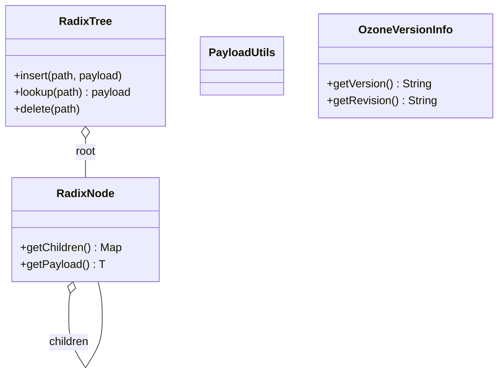

# OzoneCommon / ozone-utils

**Classes:** 4    **Kinds:** service:3, dto:1

## Overview

The `ozone-utils` feature group contains four miscellaneous utility classes. `RadixTree` and `RadixNode` implement a prefix-path radix tree used for Ozone prefix ACL lookup: each tree node holds a map from path segment to child `RadixNode`, and the tree supports insert, lookup, and delete of OFS-style `volume/bucket/prefix` paths. `PayloadUtils` provides helpers for encoding and decoding arbitrary byte payloads in Ozone RPC messages. `OzoneVersionInfo` exposes build-time version metadata (version string, revision, build date, compile platform) derived from the Maven resource filtering step; it is the backing class for the `ozone version` CLI command.

## Diagram

## Class table

### Sub-feature: `ozone.util`

| reading_order | fqcn | kind | logic | loc | study (min) | role |
|--:|---|---|---|--:|--:|---|
| 2200 | `org.apache.hadoop.ozone.util.RadixTree` | service | mixed | 125~ | 30 | Wrapper class for handling Ozone prefix path lookup of ACL APIs with radix tree. |
| 2201 | `org.apache.hadoop.ozone.util.RadixNode` | service | mixed | 25~ | 30 | Wrapper class for Radix tree node representing Ozone prefix path segment separated by "/". |
| 2202 | `org.apache.hadoop.ozone.util.PayloadUtils` | service | mixed | 25~ | 30 | Utility class for payload operations. |
| 2203 | `org.apache.hadoop.ozone.util.OzoneVersionInfo` | dto | data-only | 50~ | 10 | This class returns build information about Hadoop components. |

## Anchor details

_No logic-heavy anchors in this feature; the classes are primarily data / dto / config / cli._

## Design docs

- no dedicated design doc under hadoop-hdds/docs/content/ on this branch

## Seminal JIRAs / PRs

- HDDS-14934. Enable PMD rule ConsecutiveAppendsShouldReuse (cleanup touching `PayloadUtils`)
- HDDS-14623. Remove ProtoUtils (consolidated payload utilities into this module)
- HDDS-13718. Improve ASCII logo and startup message (touches `OzoneVersionInfo` display)
- HDDS-11057. Enable reproducible builds (affects `OzoneVersionInfo` build-time metadata)

## Sharp edges

- `RadixTree` is not thread-safe; concurrent insert/lookup from multiple threads requires external synchronization. The OM prefix ACL table is modified under write lock but the tree itself provides no internal locking (`RadixTree.java`).

## Related features

- `components/ozonecommon/ozone-common-primitives.md` — `OFSPath` provides the path segments that are inserted into `RadixTree`
- `components/ozonecommon/security-common.md` — `IAccessAuthorizer` implementations query the prefix ACL tree

## Self-quiz

1. What data structure does `RadixNode` use to store its children, and what are the lookup semantics for a given path segment?
2. In what context is `RadixTree` used within the OM, and what kind of objects does it store as payloads?
3. What does `OzoneVersionInfo.getVersion()` return and where is this value set at build time?
4. Is `RadixTree` thread-safe? What evidence in the code or CLAUDE.md supports your answer?
5. What is the purpose of `PayloadUtils` and in which layer of the stack is it primarily used?

Answers

Answer 1: `RadixNode` stores children in a `HashMap<String, RadixNode<T>>` keyed by path segment. Lookup splits the path by `/` and descends the map at each segment; a miss at any level returns null.
Answer 2: `RadixTree` is used in the OM prefix ACL manager to store ACL entries keyed by `volume/bucket/prefix` paths. Payloads are lists of `OzoneAcl` objects.
Answer 3: `getVersion()` returns the Maven project version (e.g. `2.0.0-SNAPSHOT`). The value is injected via Maven resource filtering into a `ozone-version-info.properties` file which `OzoneVersionInfo` reads from the classpath at runtime.
Answer 4: `RadixTree` is not thread-safe; neither `RadixTree` nor `RadixNode` use any synchronization primitives. The class-level `concurrency` field in atlas.json is `single-threaded`.
Answer 5: `PayloadUtils` encodes and decodes byte payloads in Ozone inter-service messages. It is used in the OM/SCM RPC layer where binary blobs need to be embedded in proto messages.

