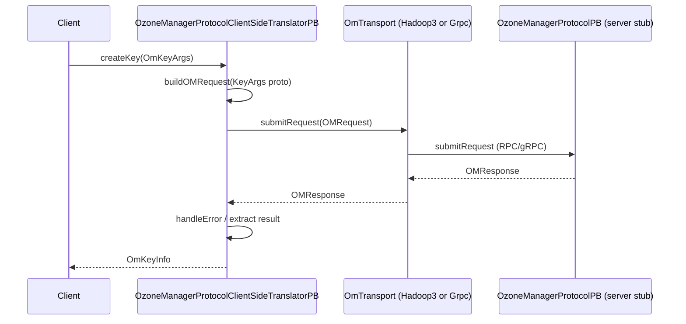

# OzoneCommon / protocol-common

**Classes:** 24    **Kinds:** service:11, interface:6, factory:3, rpc-stub:3, data:1

## Overview

The `protocol-common` feature group defines the full client-to-OM and OM-to-OM communication layer. `OzoneManagerProtocol` is the primary Java interface (750+ methods covering volume/bucket/key/snapshot operations) that both the OM server and the client-side translator implement. `OzoneManagerProtocolClientSideTranslatorPB` (2025 lines) is the client-side implementation: it converts every `OzoneManagerProtocol` method call into a serialized `OMRequest` proto, sends it over one of two transports, and deserializes the `OMResponse`. The two transports are `Hadoop3OmTransport` (Hadoop RPC with failover via `OMFailoverProxyProviderBase`) and `GrpcOmTransport` (gRPC channel used by S3 Gateway). `OMPBHelper` is a shared conversion utility for `OzoneAcl`, checksum, and encryption key proto translations. Factory classes `OmTransportFactory`, `GrpcOmTransportFactory`, and `Hadoop3OmTransportFactory` follow a service-loader pattern to decouple transport selection from the caller.

## Diagram

## Class table

### Sub-feature: `hdds.protocol`

| reading_order | fqcn | kind | logic | loc | study (min) | role |
|--:|---|---|---|--:|--:|---|
| 2204 | `org.apache.hadoop.hdds.protocol.StorageType` | data | data-only | 25~ | 10 | Ozone specific storage types. |

### Sub-feature: `om.protocol`

| reading_order | fqcn | kind | logic | loc | study (min) | role |
|--:|---|---|---|--:|--:|---|
| 2205 | `org.apache.hadoop.ozone.om.protocol.OzoneManagerProtocol` | interface | logic-heavy | 400~ | 20 | Protocol to talk to OM. |
| 2206 | `org.apache.hadoop.ozone.om.protocol.OMInterServiceProtocol` | interface | mixed | 25~ | 20 | Protocol for inter OM communication. |
| 2207 | `org.apache.hadoop.ozone.om.protocol.OzoneManagerSecurityProtocol` | interface | mixed | 25~ | 20 | Security protocol for a secure OzoneManager. |
| 2208 | `org.apache.hadoop.ozone.om.protocol.OMAdminProtocol` | interface | mixed | 25~ | 20 | Protocol for performing admin operations such as getting OM metadata. |
| 2209 | `org.apache.hadoop.ozone.om.protocol.OMConfiguration` | service | mixed | 50~ | 30 | Class storing the OM configuration information such as the node details in memory and node details when config is rel... |
| 2210 | `org.apache.hadoop.ozone.om.protocol.S3Auth` | service | mixed | 25~ | 30 | S3Auth wraps the data needed for S3 Authentication. |

### Sub-feature: `om.protocolPB`

| reading_order | fqcn | kind | logic | loc | study (min) | role |
|--:|---|---|---|--:|--:|---|
| 2211 | `org.apache.hadoop.ozone.om.protocolPB.OzoneManagerClientProtocol` | interface | mixed | 25~ | 20 | OzoneManagerClientProtocol defines interfaces needed on the client side when communicating with Ozone Manager. |
| 2212 | `org.apache.hadoop.ozone.om.protocolPB.OmTransport` | interface | mixed | 25~ | 20 | Transport responsible to send messages to OM. |
| 2213 | `org.apache.hadoop.ozone.om.protocolPB.OzoneManagerProtocolClientSideTranslatorPB` | service | logic-heavy | 2025~ | 60 | inferred(from-md): Client-side protobuf translator: converts `OzoneManagerProtocol` Java calls into `OMRequest` proto messages, sends th... |
| 2214 | `org.apache.hadoop.ozone.om.protocolPB.GrpcOmTransport` | service | logic-heavy | 400~ | 60 | Grpc transport for grpc between s3g and om. |
| 2215 | `org.apache.hadoop.ozone.om.protocolPB.OMAdminProtocolClientSideImpl` | service | mixed | 175~ | 45 | Protocol implementation for OM admin operations. |
| 2216 | `org.apache.hadoop.ozone.om.protocolPB.Hadoop3OmTransport` | service | mixed | 75~ | 30 | Full-featured Hadoop RPC implementation with failover support. |
| 2217 | `org.apache.hadoop.ozone.om.protocolPB.OMInterServiceProtocolClientSideImpl` | service | mixed | 50~ | 30 | Protocol implementation for Inter OM communication. |
| 2218 | `org.apache.hadoop.ozone.om.protocolPB.GrpcOmTransportFactory` | factory | mixed | 25~ | 20 | Factory to create the default GrpcOm transport. |
| 2219 | `org.apache.hadoop.ozone.om.protocolPB.Hadoop3OmTransportFactory` | factory | mixed | 25~ | 20 | Factory to create the default Hadoop 3 transport with failover support. |
| 2220 | `org.apache.hadoop.ozone.om.protocolPB.OmTransportFactory` | factory | mixed | 25~ | 20 | Factory pattern to create object for RPC communication with OM. |
| 2221 | `org.apache.hadoop.ozone.om.protocolPB.OMInterServiceProtocolPB` | rpc-stub | data-only | 25~ | 20 | Protocol used for communication between OMs. |
| 2222 | `org.apache.hadoop.ozone.om.protocolPB.OMAdminProtocolPB` | rpc-stub | data-only | 25~ | 20 | Protocol used for communication between OMs. |
| 2223 | `org.apache.hadoop.ozone.om.protocolPB.OzoneManagerProtocolPB` | rpc-stub | data-only | 25~ | 20 | Protocol used to communicate with OM. |

### Sub-feature: `ozone.protocolPB`

| reading_order | fqcn | kind | logic | loc | study (min) | role |
|--:|---|---|---|--:|--:|---|
| 2224 | `org.apache.hadoop.ozone.protocolPB.OMPBHelper` | service | logic-heavy | 275~ | 45 | Utilities for converting protobuf classes. |

### Sub-feature: `protocolPB.grpc`

| reading_order | fqcn | kind | logic | loc | study (min) | role |
|--:|---|---|---|--:|--:|---|
| 2225 | `org.apache.hadoop.ozone.om.protocolPB.grpc.GrpcClientConstants` | service | mixed | 25~ | 30 | Constants to store grpc-client specific header values. |
| 2226 | `org.apache.hadoop.ozone.om.protocolPB.grpc.ClientAddressServerInterceptor` | service | mixed | 25~ | 30 | GRPC server side interceptor to retrieve the client IP and hostname. |
| 2227 | `org.apache.hadoop.ozone.om.protocolPB.grpc.ClientAddressClientInterceptor` | service | mixed | 25~ | 30 | GRPC client side interceptor to provide client hostname and IP address. |

## Anchor details

### `OzoneManagerProtocol`

- **path:** `hadoop-ozone/common/src/main/java/org/apache/hadoop/ozone/om/protocol/OzoneManagerProtocol.java`
- **loc:** 400~    **difficulty:** 2    **study:** 20 min    **concurrency:** single-threaded    **persistence:** in-memory
- **key collaborators:** `org.apache.hadoop.hdds.scm.container.common.helpers.ExcludeList`, `org.apache.hadoop.ozone.OzoneAcl`, `org.apache.hadoop.ozone.om.IOmMetadataReader`, `org.apache.hadoop.ozone.om.OMConfigKeys`, `org.apache.hadoop.ozone.om.exceptions.OMException`, `org.apache.hadoop.ozone.om.helpers.DBUpdates`
- **role:** Protocol to talk to OM.
- Defines the full OM API surface as a Java interface; the OM server implements it directly, and the client-side translator implements it by serializing to proto. Extends `IOmMetadataReader` for the read-only metadata subset. Default methods (e.g. for conditional writes added in HDDS-13919) allow backward-compatible additions without breaking existing implementations.

### `OzoneManagerProtocolClientSideTranslatorPB`

- **path:** `hadoop-ozone/common/src/main/java/org/apache/hadoop/ozone/om/protocolPB/OzoneManagerProtocolClientSideTranslatorPB.java`
- **loc:** 2025~    **difficulty:** 5    **study:** 60 min    **concurrency:** single-threaded    **persistence:** in-memory
- **entry points:** `close`
- **key collaborators:** `org.apache.hadoop.ozone.om.protocol.S3Auth`, `org.apache.hadoop.ozone.protocolPB.OMPBHelper`, `org.apache.hadoop.hdds.annotation.InterfaceAudience`, `org.apache.hadoop.hdds.client.ECReplicationConfig`, `org.apache.hadoop.hdds.client.ReplicationConfig`, `org.apache.hadoop.hdds.scm.container.common.helpers.ExcludeList`
- **test exemplar:** `hadoop-ozone/common/src/test/java/org/apache/hadoop/ozone/om/protocolPB/TestOzoneManagerProtocolClientSideTranslatorPB.java`
- **role:** Client-side protobuf translator: converts `OzoneManagerProtocol` Java calls into `OMRequest` proto messages, sends them via `OmTransport`, and translates `OMResponse` back to Java types.
- Every method follows the same skeleton: build an `OMRequest` with the appropriate `cmdType`, populate sub-message fields using helpers from `OMPBHelper`, call `submitRequest(request)`, check `response.getStatus()` and throw `OMException` on failure, then extract and return the response payload. The `S3Auth` field is injected per-call by the S3 Gateway to carry AWS signature info. `ClientVersion` is negotiated at construction time and controls which proto fields are populated.

### `GrpcOmTransport`

- **path:** `hadoop-ozone/common/src/main/java/org/apache/hadoop/ozone/om/protocolPB/GrpcOmTransport.java`
- **loc:** 400~    **difficulty:** 5    **study:** 60 min    **concurrency:** single-threaded    **persistence:** in-memory
- **entry points:** `start`, `close`
- **key collaborators:** `org.apache.hadoop.ozone.om.protocolPB.grpc.ClientAddressClientInterceptor`, `org.apache.hadoop.ozone.om.protocolPB.grpc.GrpcClientConstants`, `org.apache.hadoop.hdds.conf.Config`, `org.apache.hadoop.hdds.conf.ConfigGroup`, `org.apache.hadoop.hdds.conf.ConfigTag`, `org.apache.hadoop.hdds.conf.ConfigurationSource`
- **test exemplar:** `hadoop-ozone/s3gateway/src/test/java/org/apache/hadoop/ozone/protocolPB/TestGrpcOmTransport.java`
- **role:** gRPC transport used by S3 Gateway for OM communication; manages channel lifecycle, TLS, and failover.
- `start()` constructs one `ManagedChannel` per OM node using `NettyChannelBuilder`; TLS is configured via `SecurityConfig` when secure mode is active. `submitRequest` serializes the `OMRequest`, calls the gRPC stub (potentially blocking until the channel is ready via `RetryPolicy`), and deserializes the response. `GrpcOMFailoverProxyProvider` supplies the per-request retry/failover decisions; follower-read support was added in HDDS-15492.

### `OMPBHelper`

- **path:** `hadoop-ozone/common/src/main/java/org/apache/hadoop/ozone/protocolPB/OMPBHelper.java`
- **loc:** 275~    **difficulty:** 4    **study:** 45 min    **concurrency:** single-threaded    **persistence:** in-memory
- **key collaborators:** `org.apache.hadoop.ozone.client.checksum.CompositeCrcFileChecksum`, `org.apache.hadoop.ozone.client.checksum.CrcUtil`, `org.apache.hadoop.ozone.om.helpers.BucketEncryptionKeyInfo`
- **test exemplar:** `hadoop-ozone/common/src/test/java/org/apache/hadoop/ozone/protocolPB/TestOMPBHelper.java`
- **role:** Utilities for converting protobuf classes.
- Provides `convertOzoneAcl`/`fromProtobufAcl` for `OzoneAcl` ↔ `OzoneAclInfo` conversion, `getFileChecksumFromProtobuf`/`toProtobufFileChecksum` for composite CRC checksums using `CrcUtil`, and `getBucketEncryptionKeyInfo`/`toProtoBucketEncryptionKeyInfo` for TDE key metadata. All methods are stateless and called exclusively from `OzoneManagerProtocolClientSideTranslatorPB`.

## Design docs

- `hadoop-hdds/docs/content/design/omha.md` — OM HA design; the transport and failover classes implement the client side
- `hadoop-hdds/docs/content/design/s3gateway.md` — S3 Gateway uses `GrpcOmTransport` for OM communication
- `hadoop-hdds/docs/content/design/s3-conditional-requests.md` — conditional write paths flow through the translator

## Seminal JIRAs / PRs

- HDDS-15492. Support OM follower read for gRPC client (added follower-read path to `GrpcOmTransport`)
- HDDS-14829. Split snapshot diff job into separate RPC calls (added new translator methods)
- HDDS-15511. Implement Ozone client API's for bucket tagging (extended translator + protocol interface)
- HDDS-15264. Fork RetryInvocationHandler from Hadoop (Hadoop RPC transport hardening)
- HDDS-13919. S3 Conditional Writes — PutObject (added `expectedETag` through translator)
- HDDS-14623. Remove ProtoUtils (consolidated conversion helpers into `OMPBHelper`)
- HDDS-15274. Fork RetryPolicies from Hadoop

## Sharp edges

- `OzoneManagerProtocolClientSideTranslatorPB.submitRequest` attaches `S3Auth` to every request when running inside S3 Gateway; if `S3Auth` is set on a non-S3 client path (e.g. via direct OzoneClient constructor), the OM will attempt to validate the AWS signature and fail. The field must be null for Kerberos-authenticated clients (`OzoneManagerProtocolClientSideTranslatorPB.java`, `s3Auth` field).
- `GrpcOmTransport` opens one channel per OM node at `start()`; if the number of OM nodes in a running HA cluster changes (bootstrap of a new OM), the client will not pick up the new node until restart or re-initialization. (HDDS-14721 context.)

## Related features

- `components/ozonecommon/om-common.md` — failover proxy providers feed requests to these transports
- `components/ozonecommon/client-common.md` — `OMPBHelper` uses `CrcUtil`/`CompositeCrcFileChecksum` from client-common
- `components/ozonecommon/om-helpers-common.md` — all helper/args classes used as parameters in the protocol interface
- `components/ozonecommon/security-common.md` — `OzoneTokenIdentifier` and `S3Auth` flow through the translator

## Self-quiz

1. What is the role of `ClientVersion` in `OzoneManagerProtocolClientSideTranslatorPB`, and when is it checked?
2. How does `GrpcOmTransport` handle TLS configuration differently from `Hadoop3OmTransport`?
3. Why does `OzoneManagerProtocol` extend `IOmMetadataReader`, and which classes implement only `IOmMetadataReader` but not the full protocol?
4. Trace the call path for `OzoneClient.createKey` from the Java interface down to the wire, naming every class crossed.
5. What happens in `OzoneManagerProtocolClientSideTranslatorPB` when the `OMResponse.status` is not `OK`?

Answers

Answer 1: `ClientVersion` is set at construction and passed in each `OMRequest` header. The OM server checks it to decide which proto fields are safe to read — for example, newer conditional-write fields are only populated when the client version indicates support. This prevents `NullPointerException` on older servers and enables rolling upgrades.
Answer 2: `GrpcOmTransport` builds a `NettyChannelBuilder` with `GrpcSslContexts` and `SslContextBuilder` using certificates from `SecurityConfig`. `Hadoop3OmTransport` delegates TLS to the underlying Hadoop RPC engine configured via Kerberos/SASL, not gRPC's native TLS stack.
Answer 3: `IOmMetadataReader` defines the read-only OM API (lookup, list) independently of the write API. OM follower nodes and Recon implement only `IOmMetadataReader`; they do not implement the full write-side `OzoneManagerProtocol`. Clients that only need reads can hold an `IOmMetadataReader` reference.
Answer 4: `OzoneClient.createKey` → `ObjectStore.createKey` → `OzoneManagerProtocolClientSideTranslatorPB.createKey` → builds `OMRequest` → `submitRequest` → `OmTransport.submitRequest` (Hadoop3 or gRPC) → wire.
Answer 5: The translator calls `handleError(response)` which reads `response.getMessage()` and the `status` code, maps known error codes to `OMException.ResultCodes`, and throws an `OMException` with the mapped code. Unmapped status codes result in a generic IO exception.

