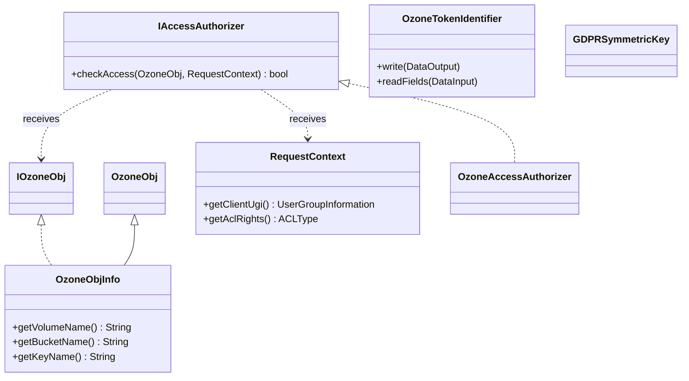

# OzoneCommon / security-common

**Classes:** 11    **Kinds:** service:5, interface:3, dto:2, data:1

## Overview

The `security-common` feature group defines the client-visible security contracts for Ozone: ACL authorization and delegation token management. `IAccessAuthorizer` is the public SPI that Ranger (and the built-in no-op `OzoneAccessAuthorizer`) implement; it receives a `RequestContext` (carrying the identity, ACL type, and object reference) and returns an allow/deny decision. `IOzoneObj` and `OzoneObjInfo` represent the Ozone namespace object being accessed, with volume/bucket/key granularity. `OzoneTokenIdentifier` encodes the delegation token payload: it extends Hadoop's `AbstractDelegationTokenIdentifier` and adds Ozone-specific fields for the OM service ID, AWS access ID and signature (for `S3AUTHINFO` tokens), and the secret key ID used for symmetric-key token verification (HDDS-8829 replaced the older certificate serial ID approach). `GDPRSymmetricKey` carries the per-key encryption metadata for GDPR-compliant data deletion by key destruction.

## Diagram

## Class table

### Sub-feature: `ozone.security`

| reading_order | fqcn | kind | logic | loc | study (min) | role |
|--:|---|---|---|--:|--:|---|
| 2228 | `org.apache.hadoop.ozone.security.OzoneTokenIdentifier` | service | logic-heavy | 275~ | 45 | The token identifier for Ozone Master. |
| 2229 | `org.apache.hadoop.ozone.security.GDPRSymmetricKey` | service | mixed | 50~ | 30 | Symmetric Key structure for GDPR. |
| 2230 | `org.apache.hadoop.ozone.security.OzoneDelegationTokenSelector` | service | mixed | 25~ | 30 | A delegation token selector that is specialized for Ozone. |

### Sub-feature: `security.acl`

| reading_order | fqcn | kind | logic | loc | study (min) | role |
|--:|---|---|---|--:|--:|---|
| 2231 | `org.apache.hadoop.ozone.security.acl.IAccessAuthorizer` | interface | mixed | 125~ | 20 | Public API for Ozone ACLs. |
| 2232 | `org.apache.hadoop.ozone.security.acl.IOzoneObj` | interface | mixed | 25~ | 20 | Marker interface for objects supported by Ozone. |
| 2233 | `org.apache.hadoop.ozone.security.acl.OzonePrefixPath` | interface | mixed | 25~ | 20 | Interface used to lists immediate children(sub-paths) for a given keyPrefix. |
| 2234 | `org.apache.hadoop.ozone.security.acl.RequestContext` | service | mixed | 125~ | 30 | This class encapsulates information required for Ozone ACLs. |
| 2235 | `org.apache.hadoop.ozone.security.acl.OzoneAccessAuthorizer` | service | mixed | 25~ | 30 | No-op implementation for IAccessAuthorizer, allows everything. |
| 2236 | `org.apache.hadoop.ozone.security.acl.OzoneObjInfo` | dto | data-only | 175~ | 10 | Class representing an ozone object. |
| 2237 | `org.apache.hadoop.ozone.security.acl.AssumeRoleRequest` | dto | data-only | 100~ | 10 | Represents an S3 AssumeRole request that needs to be authorized by an IAccessAuthorizer. |
| 2238 | `org.apache.hadoop.ozone.security.acl.OzoneObj` | abstract | mixed | 75~ | 10 | Class representing an unique ozone object. |

## Anchor details

### `OzoneTokenIdentifier`

- **path:** `hadoop-ozone/common/src/main/java/org/apache/hadoop/ozone/security/OzoneTokenIdentifier.java`
- **loc:** 275~    **difficulty:** 4    **study:** 45 min    **concurrency:** single-threaded    **persistence:** in-memory
- **entry points:** `write`
- **key collaborators:** `org.apache.hadoop.hdds.annotation.InterfaceAudience`, `org.apache.hadoop.hdds.annotation.InterfaceStability`
- **test exemplar:** `hadoop-ozone/ozone-manager/src/test/java/org/apache/hadoop/ozone/security/TestOzoneTokenIdentifier.java`
- **role:** The token identifier for Ozone Master.
- `write(DataOutput)` serializes the token using Hadoop's `WritableUtils` plus custom fields; field presence is gated by backward-compatibility checks (HDDS-13264 fixed a bug where `omServiceId` was not written in some code paths, causing token validation failures on OM restart). The `tokenType` field distinguishes `DELEGATION_TOKEN` (Kerberos-issued) from `S3AUTHINFO` (AWS SigV4 credentials passed as a token), allowing the same code path to handle both.`omCertSerialId` is `@Deprecated` since HDDS-8829.

## Design docs

- `hadoop-hdds/docs/content/design/token.md` — delegation token design; `OzoneTokenIdentifier` is the payload class
- `hadoop-hdds/docs/content/design/symmetric-token-signatures.md` — describes the switch from cert-serial to symmetric key IDs (HDDS-8829)
- `hadoop-hdds/docs/content/design/secure-s3.md` — S3 auth token flow using `S3AUTHINFO` token type
- `hadoop-hdds/docs/content/design/ozone-sts.md` — STS design that adds `AssumeRoleRequest` to the authorizer

## Seminal JIRAs / PRs

- HDDS-8829. Symmetric Keys for Delegation Tokens (replaced cert serial ID with secret key ID)
- HDDS-13264. Fix OzoneTokenIdentifier to correctly handle missing omServiceId field
- HDDS-15064. STS Artifacts for Ranger to Consider S3 Action when Authorizing
- HDDS-13848. STS Artifacts for Ranger to authorize STS token
- HDDS-14104. Refactor RequestContext creation
- HDDS-10412. Prefix ACL check needs to resolve the bucket link

## Sharp edges

- `OzoneTokenIdentifier.omCertSerialId` is `@Deprecated` but is still written and read for backward compatibility with tokens issued by older OM nodes. Code that reads the field must handle the case where it is populated (old token) vs. where `secretKeyId` is populated (new token); mixing up the two will silently succeed but fail verification (`OzoneTokenIdentifier.java`, `omCertSerialId` and `secretKeyId` fields).
- `IAccessAuthorizer.checkAccess` is called with a `RequestContext` that includes `OzonePrefixPath` for prefix ACL checks; if the prefix path listing implementation throws, the authorizer will deny access without a clear error. The `OzoneAccessAuthorizer` no-op avoids this but disables all ACL enforcement.

## Related features

- `components/ozonecommon/ozone-common-primitives.md` — `OzoneAcl` is the ACL entry type consumed by `IAccessAuthorizer`
- `components/ozonecommon/om-helpers-common.md` — `OmKeyArgs` carries `GDPRSymmetricKey`; `OzoneAclUtil` manipulates ACL lists
- `components/ozonecommon/protocol-common.md` — `OzoneManagerProtocolClientSideTranslatorPB` passes delegation tokens in the RPC header

## Self-quiz

1. What two distinct token types does `OzoneTokenIdentifier` support, and how does the serialization differ between them?
2. Why was `omCertSerialId` deprecated in `OzoneTokenIdentifier`, and what replaced it?
3. What does `IAccessAuthorizer.checkAccess` receive in the `RequestContext` and what does it return?
4. How does HDDS-13264 relate to OM restart — what bug did it fix and what symptom would a user see?
5. What is the role of `GDPRSymmetricKey` and how does it enable GDPR-compliant key deletion?

Answers

Answer 1: `DELEGATION_TOKEN` (standard Hadoop delegation token issued after Kerberos authentication) and `S3AUTHINFO` (AWS SigV4 credentials passed as a pseudo-token for S3 requests). `DELEGATION_TOKEN` writes full owner/renewer/issuer fields; `S3AUTHINFO` writes `awsAccessId`, `signature`, and `strToSign` fields instead.
Answer 2: Using the certificate serial ID created a dependency on the SCM CA certificate lifecycle: if the OM reissued its certificate, existing tokens became unverifiable. HDDS-8829 replaced it with a `secretKeyId` referencing a symmetric HMAC key managed by SCM, decoupling token validity from certificate rotation.
Answer 3: `checkAccess` receives an `OzoneObj` (the resource being accessed — could be volume, bucket, or key) and a `RequestContext` (containing the caller's `UserGroupInformation`, the requested `ACLType`, and optionally a `OzonePrefixPath` for prefix ACL evaluation). It returns `true` to allow or `false` to deny.
Answer 4: HDDS-13264 fixed a bug where `omServiceId` was only written to the token when it was non-null, but was always read, causing `readFields` to deserialize the wrong fields. After an OM restart, tokens without the service ID field would fail HMAC verification with a confusing error rather than an authentication failure.
Answer 5: `GDPRSymmetricKey` stores the per-key encryption key and IV. When a GDPR deletion is requested, the OM overwrites (destroys) the key material in the stored `GDPRSymmetricKey` entry, making the encrypted data permanently unreadable without deleting the ciphertext blocks — satisfying "right to erasure" semantics without waiting for GC.

