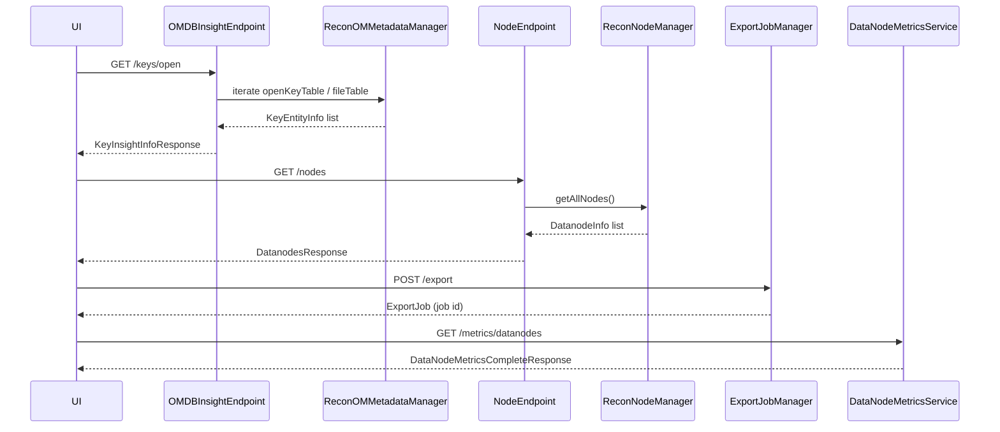

# Recon / recon-api

**Classes:** 102    **Kinds:** service:52, dto:30, metrics:7, data:6, interface:4, abstract:2, exception:1

## Overview

The `recon-api` feature group is the HTTP-facing layer of Recon. It exposes JAX-RS endpoints covering datanode state (`NodeEndpoint`), namespace summaries (`NSSummaryEndpoint`), OM DB insights (`OMDBInsightEndpoint`), container health, storage distribution, pipelines, and the chatbot. `OMDBInsightEndpoint` serves the "OM DB Insight" page by iterating directly over OM RocksDB tables to count and page open keys, open files, and pending-delete keys across FSO, OBS, and legacy buckets. `NodeEndpoint` projects Recon's in-memory SCM state into per-datanode metadata objects for the UI. `ExportJobManager` runs asynchronous CSV export jobs in a bounded thread pool and tracks their lifecycle as `ExportJob` records in memory. `DataNodeMetricsService` fans out JMX queries to all datanodes and aggregates pending-deletion metrics. DTOs under `types/` carry JSON responses; the `handlers/` hierarchy dispatches namespace-summary requests by bucket layout (FSO, OBS, legacy, unknown).

## Diagram

## Class table

### Sub-feature: `api.filters`

| reading_order | fqcn | kind | logic | loc | study (min) | role |
|--:|---|---|---|--:|--:|---|
| 2239 | `org.apache.hadoop.ozone.recon.api.filters.ReconAdminFilter` | service | mixed | 50~ | 30 | Filter that can be applied to paths to only allow access by configured admins. |
| 2240 | `org.apache.hadoop.ozone.recon.api.filters.ReconAuthFilter` | service | mixed | 50~ | 30 | Filter that can be applied to paths to only allow access by authenticated kerberos users. |

### Sub-feature: `api.handlers`

| reading_order | fqcn | kind | logic | loc | study (min) | role |
|--:|---|---|---|--:|--:|---|
| 2241 | `org.apache.hadoop.ozone.recon.api.handlers.EntityHandler` | abstract | mixed | 175~ | 45 | Class for handling all entity types. |
| 2242 | `org.apache.hadoop.ozone.recon.api.handlers.BucketHandler` | abstract | mixed | 125~ | 30 | Abstract class for handling all bucket types. |
| 2243 | `org.apache.hadoop.ozone.recon.api.handlers.LegacyBucketHandler` | service | mixed | 150~ | 45 | Class for handling Legacy buckets NameSpaceSummaries. |
| 2244 | `org.apache.hadoop.ozone.recon.api.handlers.FSOBucketHandler` | service | mixed | 150~ | 45 | Class for handling FSO buckets NameSpaceSummaries. |
| 2245 | `org.apache.hadoop.ozone.recon.api.handlers.VolumeEntityHandler` | service | mixed | 125~ | 30 | Class for handling volume entity type. |
| 2246 | `org.apache.hadoop.ozone.recon.api.handlers.BucketEntityHandler` | service | mixed | 125~ | 30 | Class for handling bucket entity type. |
| 2247 | `org.apache.hadoop.ozone.recon.api.handlers.RootEntityHandler` | service | mixed | 125~ | 30 | Class for handling root entity type. |
| 2248 | `org.apache.hadoop.ozone.recon.api.handlers.DirectoryEntityHandler` | service | mixed | 100~ | 30 | Class for handling directory entity type. |
| 2249 | `org.apache.hadoop.ozone.recon.api.handlers.OBSBucketHandler` | service | mixed | 100~ | 30 | Class for handling OBS buckets NameSpaceSummaries. |
| 2250 | `org.apache.hadoop.ozone.recon.api.handlers.UnknownEntityHandler` | service | mixed | 50~ | 30 | Class for handling unknown entity type. |
| 2251 | `org.apache.hadoop.ozone.recon.api.handlers.KeyEntityHandler` | service | mixed | 50~ | 30 | Class for handling key entity type. |

### Sub-feature: `api.types`

| reading_order | fqcn | kind | logic | loc | study (min) | role |
|--:|---|---|---|--:|--:|---|
| 2252 | `org.apache.hadoop.ozone.recon.api.types.GlobalStorageReport` | service | mixed | 100~ | 20 | Represents a report detailing global storage usage metrics. |
| 2253 | `org.apache.hadoop.ozone.recon.api.types.KeyPrefixContainer` | interface | mixed | 25~ | 20 | Class to encapsulate the Key information needed for the Recon container DB. |
| 2254 | `org.apache.hadoop.ozone.recon.api.types.ContainerKeyPrefix` | interface | mixed | 25~ | 20 | Class to encapsulate the Key information needed for the Recon container DB. |
| 2255 | `org.apache.hadoop.ozone.recon.api.types.DatanodeStorageReport` | service | mixed | 175~ | 45 | Metadata object that contains storage report of a Datanode. |
| 2256 | `org.apache.hadoop.ozone.recon.api.types.DatanodeMetadata` | service | mixed | 175~ | 45 | Metadata object that represents a Datanode. |
| 2257 | `org.apache.hadoop.ozone.recon.api.types.ClusterStorageReport` | service | mixed | 150~ | 45 | Metadata object that contains the storage report of the cluster. |
| 2258 | `org.apache.hadoop.ozone.recon.api.types.PipelineMetadata` | service | mixed | 125~ | 30 | Metadata object that represents a Pipeline. |
| 2259 | `org.apache.hadoop.ozone.recon.api.types.KeyMetadata` | service | mixed | 100~ | 30 | Metadata object represents one key in the object store. |
| 2260 | `org.apache.hadoop.ozone.recon.api.types.NSSummary` | service | mixed | 100~ | 30 | Class to encapsulate namespace metadata summaries from OM. |
| 2261 | `org.apache.hadoop.ozone.recon.api.types.QuasiClosedContainerMetadata` | service | mixed | 75~ | 30 | JSON response DTO for a single QUASI_CLOSED container. |
| 2262 | `org.apache.hadoop.ozone.recon.api.types.UnhealthyContainerMetadata` | service | mixed | 75~ | 30 | Metadata object that represents an unhealthy Container. |
| 2263 | `org.apache.hadoop.ozone.recon.api.types.AclMetadata` | service | mixed | 75~ | 30 | Metadata object represents one Ozone ACL. |
| 2264 | `org.apache.hadoop.ozone.recon.api.types.ContainerBlocksInfoWrapper` | service | mixed | 50~ | 30 | This class wraps containers and their associated blocks information. |
| 2265 | `org.apache.hadoop.ozone.recon.api.types.ContainerKeyPrefixImpl` | service | mixed | 50~ | 30 | An implementation of both ContainerKeyPrefix and KeyPrefixContainer. |
| 2266 | `org.apache.hadoop.ozone.recon.api.types.UnhealthyContainersSummary` | service | mixed | 25~ | 30 | Simple POJO to receive the results of a Jooq query. |
| 2267 | `org.apache.hadoop.ozone.recon.api.types.EntityMetaData` | service | mixed | 25~ | 30 | This class is used as a placeholder for entity's audit log related metadata. |
| 2268 | `org.apache.hadoop.ozone.recon.api.types.ContainerMetadata` | service | mixed | 25~ | 30 | Metadata object that represents a Container. |
| 2269 | `org.apache.hadoop.ozone.recon.api.types.DeletionPendingBytesByComponent` | service | mixed | 25~ | 30 | This class represents the metadata related to deletion stages and the corresponding bytes pending to be deleted. |
| 2270 | `org.apache.hadoop.ozone.recon.api.types.CountStats` | service | mixed | 25~ | 30 | Count stats which tells the number of volumes/buckets/dir/files etc. |
| 2271 | `org.apache.hadoop.ozone.recon.api.types.UsedSpaceBreakDown` | service | mixed | 25~ | 30 | Represents a breakdown of storage space usage in a system by categorizing the used space into open keys, committed by... |
| 2272 | `org.apache.hadoop.ozone.recon.api.types.ScmPendingDeletion` | service | mixed | 25~ | 30 | Represents metadata related to pending deletions in the storage container manager (SCM). |
| 2273 | `org.apache.hadoop.ozone.recon.api.types.DatanodePipeline` | service | mixed | 25~ | 30 | Metadata object that contains pipeline information of a Datanode. |
| 2274 | `org.apache.hadoop.ozone.recon.api.types.ContainerStateCounts` | service | mixed | 25~ | 30 | Represents statistics related to containers in the Ozone cluster. |
| 2275 | `org.apache.hadoop.ozone.recon.api.types.IsoDateAdapter` | service | mixed | 25~ | 30 | A converter to convert Instant to standard date string. |
| 2276 | `org.apache.hadoop.ozone.recon.api.types.RemoveDataNodesResponseWrapper` | service | mixed | 25~ | 30 | Class that represents the API Response structure of Datanodes. |
| 2277 | `org.apache.hadoop.ozone.recon.api.types.GlobalNamespaceReport` | service | mixed | 25~ | 30 | The GlobalNamespaceReport class serves as a representation of the global namespace metadata summary for a storage sys... |
| 2278 | `org.apache.hadoop.ozone.recon.api.types.MissingContainerMetadata` | service | mixed | 25~ | 30 | Metadata object that represents a Missing Container. |
| 2279 | `org.apache.hadoop.ozone.recon.api.types.ReconBasicOmKeyInfo` | dto | logic-heavy | 225~ | 10 | Lightweight OmKeyInfo class. |
| 2280 | `org.apache.hadoop.ozone.recon.api.types.ClusterStateResponse` | dto | logic-heavy | 200~ | 10 | Class that represents the API Response structure of ClusterState. |
| 2281 | `org.apache.hadoop.ozone.recon.api.types.ExportJob` | service | mixed | 150~ | 10 | Represents an asynchronous CSV export job. |
| 2282 | `org.apache.hadoop.ozone.recon.api.types.DUResponse` | dto | data-only | 100~ | 10 | HTTP Response wrapped for Disk Usage requests. |
| 2283 | `org.apache.hadoop.ozone.recon.api.types.EntityReadAccessHeatMapResponse` | dto | data-only | 100~ | 10 | HTTP Response wrapped for a read access based heatmap request. |
| 2284 | `org.apache.hadoop.ozone.recon.api.types.NamespaceSummaryResponse` | dto | data-only | 100~ | 10 | HTTP Response wrapped for a 'summary' request. |
| 2285 | `org.apache.hadoop.ozone.recon.api.types.BucketObjectDBInfo` | dto | data-only | 100~ | 10 | Encapsulates the low level bucket info. |
| 2286 | `org.apache.hadoop.ozone.recon.api.types.KeyObjectDBInfo` | dto | data-only | 100~ | 10 | Encapsulates the low level key info. |
| 2287 | `org.apache.hadoop.ozone.recon.api.types.DeletedContainerInfo` | dto | data-only | 75~ | 10 | This class wraps deleted container info for API response. |
| 2288 | `org.apache.hadoop.ozone.recon.api.types.ParamInfo` | dto | data-only | 75~ | 10 | Wrapper object for statistics of records of a page in API response. |
| 2289 | `org.apache.hadoop.ozone.recon.api.types.UnhealthyContainersResponse` | dto | data-only | 75~ | 10 | Class that represents the API Response structure of Unhealthy Containers. |
| 2290 | `org.apache.hadoop.ozone.recon.api.types.KeyInsightInfoResponse` | dto | data-only | 75~ | 10 | HTTP Response wrapped for keys insights. |
| 2291 | `org.apache.hadoop.ozone.recon.api.types.EntityType` | data | data-only | 75~ | 10 | Enum class for namespace type. |
| 2292 | `org.apache.hadoop.ozone.recon.api.types.KeyEntityInfo` | dto | data-only | 75~ | 10 | POJO object wrapper for metadata of a given key/file. |
| 2293 | `org.apache.hadoop.ozone.recon.api.types.ObjectDBInfo` | dto | data-only | 75~ | 10 | Encapsulates the low level DB info common to volume or bucket or dir. |
| 2294 | `org.apache.hadoop.ozone.recon.api.types.StorageCapacityDistributionResponse` | dto | data-only | 75~ | 10 | Represents the response structure for storage capacity distribution in the system. |
| 2295 | `org.apache.hadoop.ozone.recon.api.types.ListKeysResponse` | dto | data-only | 50~ | 10 | HTTP Response wrapped for listKeys requests. |
| 2296 | `org.apache.hadoop.ozone.recon.api.types.ContainersResponse` | dto | data-only | 50~ | 10 | Class that represents the API Response structure of Containers. |
| 2297 | `org.apache.hadoop.ozone.recon.api.types.VolumeObjectDBInfo` | dto | data-only | 50~ | 10 | Encapsulates the low level volume info. |
| 2298 | `org.apache.hadoop.ozone.recon.api.types.ContainerDiscrepancyInfo` | dto | data-only | 50~ | 10 | Metadata object that represents a Container Discrepancy Info. |
| 2299 | `org.apache.hadoop.ozone.recon.api.types.FeatureProvider` | service | mixed | 50~ | 10 | This class is responsible for maintaining Recon features metadata. |
| 2300 | `org.apache.hadoop.ozone.recon.api.types.QuasiClosedContainersResponse` | dto | data-only | 50~ | 10 | API response wrapper for the quasi-closed containers endpoint. |
| 2301 | `org.apache.hadoop.ozone.recon.api.types.OMDBReprocessResponse` | dto | data-only | 25~ | 10 | Response for OM DB manual reprocess request. |
| 2302 | `org.apache.hadoop.ozone.recon.api.types.BucketsResponse` | dto | data-only | 25~ | 10 | Class that represents the API response structure of Buckets. |
| 2303 | `org.apache.hadoop.ozone.recon.api.types.HealthCheckResponse` | dto | data-only | 25~ | 10 | This is Solr Health Check response for healthCheck API. |
| 2304 | `org.apache.hadoop.ozone.recon.api.types.DecommissionStatusInfoResponse` | dto | data-only | 25~ | 10 | Class that represents the API Response of decommissioning status info of datanode. |
| 2305 | `org.apache.hadoop.ozone.recon.api.types.FileSizeDistributionResponse` | dto | data-only | 25~ | 10 | HTTP Response wrapped for a file size distribution request. |
| 2306 | `org.apache.hadoop.ozone.recon.api.types.ResponseStatus` | data | data-only | 25~ | 10 | Enum class for a path request's status. |
| 2307 | `org.apache.hadoop.ozone.recon.api.types.KeysResponse` | dto | data-only | 25~ | 10 | Class that represents the API Response structure of Keys within a container. |
| 2308 | `org.apache.hadoop.ozone.recon.api.types.MissingContainersResponse` | dto | data-only | 25~ | 10 | Class that represents the API Response structure of Missing Containers. |
| 2309 | `org.apache.hadoop.ozone.recon.api.types.DatanodesResponse` | dto | data-only | 25~ | 10 | Class that represents the API Response structure of Datanodes. |
| 2310 | `org.apache.hadoop.ozone.recon.api.types.VolumesResponse` | dto | data-only | 25~ | 10 | Class the represents the API response structure of Volumes. |
| 2311 | `org.apache.hadoop.ozone.recon.api.types.QuotaUsageResponse` | dto | data-only | 25~ | 10 | HTTP Response wrapped for a quota usage request. |
| 2312 | `org.apache.hadoop.ozone.recon.api.types.OpenKeyBytesInfo` | dto | data-only | 25~ | 10 | Represents information about the open keys in a storage system. |
| 2313 | `org.apache.hadoop.ozone.recon.api.types.PipelinesResponse` | dto | data-only | 25~ | 10 | Class that represents the API Response structure of Pipelines. |
| 2314 | `org.apache.hadoop.ozone.recon.api.types.DataNodeMetricsCompleteResponse` | metrics | mixed | 50~ | 20 | Response returned when metrics collection is complete. |
| 2315 | `org.apache.hadoop.ozone.recon.api.types.DataNodeMetricsProgressResponse` | metrics | mixed | 25~ | 20 | Response returned while metrics collection is still in progress. |
| 2316 | `org.apache.hadoop.ozone.recon.api.types.DatanodePendingDeletionMetrics` | metrics | mixed | 25~ | 20 | Represents pending deletion metrics for a datanode. |
| 2317 | `org.apache.hadoop.ozone.recon.api.types.DatanodeMetrics` | metrics | mixed | 25~ | 20 | Class that represents the datanode metrics captured during decommissioning. |

### Sub-feature: `chatbot.api`

| reading_order | fqcn | kind | logic | loc | study (min) | role |
|--:|---|---|---|--:|--:|---|
| 2318 | `org.apache.hadoop.ozone.recon.chatbot.api.ChatbotEndpoint` | service | logic-heavy | 200~ | 45 | REST API endpoint for the Recon Chatbot. |

### Sub-feature: `recon.api`

| reading_order | fqcn | kind | logic | loc | study (min) | role |
|--:|---|---|---|--:|--:|---|
| 2319 | `org.apache.hadoop.ozone.recon.api.InternalOnly` | interface | mixed | 25~ | 20 | Annotation to apply to endpoint classes that have dependency on internal service components and not available for API... |
| 2320 | `org.apache.hadoop.ozone.recon.api.OMDBInsightEndpoint` | service | logic-heavy | 475~ | 60 | Endpoint to get following key level info under OM DB Insight page of Recon. |
| 2321 | `org.apache.hadoop.ozone.recon.api.NodeEndpoint` | service | logic-heavy | 300~ | 45 | Endpoint to fetch details about datanodes. |
| 2322 | `org.apache.hadoop.ozone.recon.api.StorageDistributionEndpoint` | service | logic-heavy | 275~ | 45 | This endpoint handles requests related to storage distribution across different datanodes in a Recon instance. |
| 2323 | `org.apache.hadoop.ozone.recon.api.ExportJobManager` | service | logic-heavy | 250~ | 45 | Manages asynchronous CSV export jobs. |
| 2324 | `org.apache.hadoop.ozone.recon.api.ClusterStateEndpoint` | service | mixed | 150~ | 45 | Endpoint to fetch the current state of the ozone cluster. |
| 2325 | `org.apache.hadoop.ozone.recon.api.UtilizationEndpoint` | service | mixed | 100~ | 30 | Endpoint for querying the counts of a certain file Size. |
| 2326 | `org.apache.hadoop.ozone.recon.api.NSSummaryEndpoint` | service | mixed | 100~ | 30 | REST APIs for namespace metadata summary. |
| 2327 | `org.apache.hadoop.ozone.recon.api.PipelineEndpoint` | service | mixed | 100~ | 30 | Endpoint to fetch details about Pipelines. |
| 2328 | `org.apache.hadoop.ozone.recon.api.BlocksEndPoint` | service | mixed | 75~ | 30 | Endpoint to get following information about blocks metadata. |
| 2329 | `org.apache.hadoop.ozone.recon.api.PendingDeletionEndpoint` | service | mixed | 75~ | 30 | REST API endpoint that provides metrics and information related to pending deletions. |
| 2330 | `org.apache.hadoop.ozone.recon.api.AccessHeatMapEndpoint` | service | mixed | 50~ | 30 | Endpoint for querying access metadata from HeatMapProvider interface to generate heatmap in Recon. |
| 2331 | `org.apache.hadoop.ozone.recon.api.TriggerDBSyncEndpoint` | service | mixed | 50~ | 30 | Endpoint to trigger the OM DB sync between Recon and OM. |
| 2332 | `org.apache.hadoop.ozone.recon.api.TaskStatusService` | service | mixed | 25~ | 30 | Endpoint for displaying the last successful run of each Recon Task. |
| 2333 | `org.apache.hadoop.ozone.recon.api.BucketEndpoint` | service | mixed | 25~ | 30 | Endpoint to fetch details about buckets. |
| 2334 | `org.apache.hadoop.ozone.recon.api.FeaturesEndpoint` | service | mixed | 25~ | 30 | Endpoint for APIs related to features in Recon. |
| 2335 | `org.apache.hadoop.ozone.recon.api.VolumeEndpoint` | service | mixed | 25~ | 30 | Endpoint to fetch details about volumes. |
| 2336 | `org.apache.hadoop.ozone.recon.api.ContainerEndpoint` | service | logic-heavy | 650~ | 10 | Endpoint for querying keys that belong to a container. |
| 2337 | `org.apache.hadoop.ozone.recon.api.DataNodeMetricsService` | metrics | logic-heavy | 250~ | 20 | Service for collecting and managing DataNode pending deletion metrics. |
| 2338 | `org.apache.hadoop.ozone.recon.api.ReconGlobalMetricsService` | metrics | mixed | 175~ | 20 | Service for getting global storage metric values. |
| 2339 | `org.apache.hadoop.ozone.recon.api.MetricsProxyEndpoint` | metrics | mixed | 50~ | 20 | Endpoint to fetch metrics data from Prometheus HTTP endpoint. |
| 2340 | `org.apache.hadoop.ozone.recon.api.ServiceNotReadyException` | exception | data-only | 25~ | 10 | This exception being thrown when Rest API service is still initializing and not yet ready. |

## Anchor details

### `OMDBInsightEndpoint`

- **path:** `hadoop-ozone/recon/src/main/java/org/apache/hadoop/ozone/recon/api/OMDBInsightEndpoint.java`
- **loc:** 475~    **difficulty:** 5    **study:** 60 min    **concurrency:** single-threaded    **persistence:** RocksDB
- **key collaborators:** `org.apache.hadoop.ozone.recon.api.handlers.BucketHandler`, `org.apache.hadoop.ozone.recon.api.types.KeyEntityInfo`, `org.apache.hadoop.ozone.recon.api.types.KeyInsightInfoResponse`, `org.apache.hadoop.ozone.recon.api.types.ListKeysResponse`, `org.apache.hadoop.ozone.recon.api.types.NSSummary`, `org.apache.hadoop.ozone.recon.api.types.ParamInfo`
- **role:** Endpoint to get following key level info under OM DB Insight page of Recon.

The endpoint owns the `/keys` JAX-RS path group and implements three sub-resources: open keys (`/keys/open`), pending-delete keys (`/keys/deletePending`), and a key-listing path (`/keys/search`). Each sub-resource selects the correct OM table (openKeyTable vs. fileTable for FSO, keyTable vs. deletedTable for pending deletes) based on query parameters. The `BucketHandler` hierarchy is used to resolve bucket layouts, and `ParamInfo` carries the cursor/limit/total metadata for cursor-based pagination over potentially large tables.

### `NodeEndpoint`

- **path:** `hadoop-ozone/recon/src/main/java/org/apache/hadoop/ozone/recon/api/NodeEndpoint.java`
- **loc:** 300~    **difficulty:** 4    **study:** 45 min    **concurrency:** single-threaded    **persistence:** in-memory
- **key collaborators:** `org.apache.hadoop.ozone.recon.api.types.DatanodeMetadata`, `org.apache.hadoop.ozone.recon.api.types.DatanodePipeline`, `org.apache.hadoop.ozone.recon.api.types.DatanodeStorageReport`, `org.apache.hadoop.ozone.recon.api.types.DatanodesResponse`, `org.apache.hadoop.ozone.recon.api.types.RemoveDataNodesResponseWrapper`, `org.apache.hadoop.hdds.client.DecommissionUtils`
- **role:** Endpoint to fetch details about datanodes.

Translates `DatanodeInfo` objects from `ReconNodeManager` into `DatanodeMetadata` DTOs for the UI. The decommission-status branch uses `DecommissionUtils` to compute remaining replication work and returns `DecommissionStatusInfoResponse`. The `PUT /nodes/remove` handler is the only mutating operation in the endpoint; it filters out datanodes that still have open or active containers and returns a `RemoveDataNodesResponseWrapper` with per-node success/failure details.

### `StorageDistributionEndpoint`

- **path:** `hadoop-ozone/recon/src/main/java/org/apache/hadoop/ozone/recon/api/StorageDistributionEndpoint.java`
- **loc:** 275~    **difficulty:** 4    **study:** 45 min    **concurrency:** single-threaded    **persistence:** in-memory
- **key collaborators:** `org.apache.hadoop.ozone.recon.api.types.DUResponse`, `org.apache.hadoop.ozone.recon.api.types.DataNodeMetricsCompleteResponse`, `org.apache.hadoop.ozone.recon.api.types.DatanodePendingDeletionMetrics`, `org.apache.hadoop.ozone.recon.api.types.DatanodeStorageReport`, `org.apache.hadoop.ozone.recon.api.types.GlobalNamespaceReport`, `org.apache.hadoop.ozone.recon.api.types.GlobalStorageReport`
- **test exemplar:** `hadoop-ozone/recon/src/test/java/org/apache/hadoop/ozone/recon/api/TestStorageDistributionEndpoint.java`
- **role:** This endpoint handles requests related to storage distribution across different datanodes in a Recon instance.

Serves the Capacity Distribution page. It aggregates per-datanode storage reports from the node manager into a `GlobalStorageReport` (total, used, free, committed) and a `StorageCapacityDistributionResponse` that buckets nodes by capacity range. A key subtlety: it distinguishes between `usedSpace` (actual bytes written) and `committedSpace` (bytes reserved for finalized keys), aligning the two figures against reserved capacity reported by SCM.

### `ExportJobManager`

- **path:** `hadoop-ozone/recon/src/main/java/org/apache/hadoop/ozone/recon/api/ExportJobManager.java`
- **loc:** 250~    **difficulty:** 4    **study:** 45 min    **concurrency:** thread-safe    **persistence:** in-memory
- **key collaborators:** `org.apache.hadoop.ozone.recon.api.types.ExportJob`, `org.apache.hadoop.hdds.conf.OzoneConfiguration`, `org.apache.hadoop.hdds.utils.Archiver`, `org.apache.hadoop.ozone.recon.ReconServerConfigKeys`, `org.apache.hadoop.ozone.recon.ReconUtils`, `org.apache.hadoop.ozone.recon.persistence.ContainerHealthSchemaManager`
- **test exemplar:** `hadoop-ozone/recon/src/test/java/org/apache/hadoop/ozone/recon/api/TestExportJobManager.java`
- **role:** Manages asynchronous CSV export jobs.

Maintains a bounded in-memory map of `ExportJob` objects keyed by UUID. Callers submit a job, receive the UUID, and poll for completion. The actual CSV streaming is done via `ReconUtils.writeStreamingOutput`, which writes to a `StreamingOutput` backed by `CSVPrinter`. The job map is bounded by a configurable maximum (`OZONE_RECON_EXPORT_JOB_MAX_COUNT`) and old completed jobs are evicted when the limit is hit.

### `ChatbotEndpoint`

- **path:** `hadoop-ozone/recon/src/main/java/org/apache/hadoop/ozone/recon/chatbot/api/ChatbotEndpoint.java`
- **loc:** 200~    **difficulty:** 4    **study:** 45 min    **concurrency:** actor/queue    **persistence:** in-memory
- **key collaborators:** `org.apache.hadoop.hdds.conf.OzoneConfiguration`, `org.apache.hadoop.ozone.recon.chatbot.ChatbotConfigKeys`, `org.apache.hadoop.ozone.recon.chatbot.agent.ChatbotAgent`, `org.apache.hadoop.ozone.recon.chatbot.llm.LLMClient`
- **test exemplar:** `hadoop-ozone/recon/src/test/java/org/apache/hadoop/ozone/recon/chatbot/api/TestChatbotEndpoint.java`
- **role:** REST API endpoint for the Recon Chatbot.

Validates that the chatbot feature is enabled via `ChatbotConfigKeys.OZONE_RECON_CHATBOT_ENABLED` before accepting requests; returns 503 when disabled. Delegates each conversation turn to `ChatbotAgent.chat()`, which runs the multi-turn LLM tool-use loop. The endpoint itself adds no conversation state — session continuity is the caller's responsibility through the `sessionId` query parameter.

### `DataNodeMetricsService`

- **path:** `hadoop-ozone/recon/src/main/java/org/apache/hadoop/ozone/recon/api/DataNodeMetricsService.java`
- **loc:** 250~    **difficulty:** 2    **study:** 20 min    **concurrency:** thread-safe    **persistence:** in-memory
- **key collaborators:** `org.apache.hadoop.ozone.recon.api.types.DataNodeMetricsCompleteResponse`, `org.apache.hadoop.ozone.recon.api.types.DataNodeMetricsProgressResponse`, `org.apache.hadoop.ozone.recon.api.types.DatanodePendingDeletionMetrics`, `org.apache.hadoop.hdds.conf.OzoneConfiguration`, `org.apache.hadoop.hdds.scm.node.DatanodeInfo`, `org.apache.hadoop.hdds.scm.server.OzoneStorageContainerManager`
- **role:** Service for collecting and managing DataNode pending deletion metrics.

Fans out JMX queries (via `DataNodeMetricsCollectionTask`) to every registered datanode in parallel and accumulates `DatanodePendingDeletionMetrics` per host. While collection is in flight the service returns `DataNodeMetricsProgressResponse` with a completion percentage; once all nodes respond it caches the final `DataNodeMetricsCompleteResponse` until the next cycle.

## Design docs

- `hadoop-hdds/docs/content/design/recon1.md` — original Recon design proposal covering the API surface and backend sync architecture.
- `hadoop-hdds/docs/content/design/recon2.md` — follow-up proposal adding FSO namespace summaries and the NSSummary tasks.
- `hadoop-hdds/docs/content/interface/ReconApi.md` — REST API reference documenting the public endpoints exposed by this feature group.

## Seminal JIRAs / PRs

- HDDS-13891. SCM-based health monitoring and batch processing in Recon
- HDDS-14010. Endpoint to retrieve pending deletion metrics from DataNodes, SCM, and OM
- HDDS-14913. Implement Scalable CSV Export for Unhealthy Containers in Recon UI
- HDDS-14927. Add Quasi-Closed Container Tracking in Recon
- HDDS-15165. Recon: Add admin REST APIs to trigger, monitor, and cancel SCM DB snapshot sync
- HDDS-15452. Split DataNodeMetricsServiceResponse response into state-specific DTOs
- HDDS-15863. Add Manual OM DB Rebuild Support for Recon Bootstrapping

## Sharp edges

- `ExportJobManager` holds completed `ExportJob` entries in a plain in-memory map with no TTL; on Recon restart all job history is lost and polling callers will receive 404s. (file: `hadoop-ozone/recon/src/main/java/org/apache/hadoop/ozone/recon/api/ExportJobManager.java`)
- `OMDBInsightEndpoint` reads directly from Recon's local OM snapshot, not live OM. If the sync task is lagging, counts returned may be stale by up to the configured sync interval (`OZONE_RECON_OM_SNAPSHOT_TASK_INITIAL_DELAY` + interval). Callers have no way to detect staleness from the response. (HDDS-15863 added a manual rebuild path to mitigate this.)
- `NodeEndpoint` returns `decommissioningStatus.currentState` driven by `DecommissionUtils`, which checks SCM node state live but container-replication-remaining counts come from Recon's local container replica table, which may not reflect the very latest replica movements. (HDDS-15308 improved ICR/FCR-driven state recovery.)

## Related features

- `components/recon/recon-spi.md` — the `ReconContainerMetadataManager` and `OzoneManagerServiceProvider` interfaces that the endpoints depend on.
- `components/recon/recon-tasks.md` — background tasks that populate the RocksDB tables the endpoints query.
- `components/recon/recon-scm.md` — `ReconNodeManager` and `ReconContainerManager` that back `NodeEndpoint` and container queries.
- `components/recon/recon-heatmap.md` — `AccessHeatMapEndpoint` calls `HeatMapUtil` from this same package.
- `components/recon/recon-server.md` — `ReconServer` wires all endpoints into the Guice injector and HTTP server.

## Self-quiz

1. `OMDBInsightEndpoint` handles the `/keys/open` path. What OM tables does it iterate over for FSO vs. OBS/legacy buckets, and how does it determine which table to use?
2. `ExportJobManager` is annotated `thread-safe`. What synchronization mechanism protects the internal job map, and what happens when the job-count limit is exceeded?
3. `StorageDistributionEndpoint` returns both `usedSpace` and `committedSpace` in `GlobalStorageReport`. What is the semantic difference, and where does each figure come from in the data flow?
4. `NodeEndpoint.removeDatanodes()` is the only mutating endpoint in this group. What precondition check prevents a node from being removed when it still has live containers?
5. `DataNodeMetricsService` fans out to datanodes in parallel. What response type is returned while collection is still in progress, and how does the caller know when results are final?

Answers

Answer 1: For FSO buckets (`BucketLayout.FILE_SYSTEM_OPTIMIZED`) it iterates `fileTable` for open files and `deletedDirTable`/`deletedTable` for pending deletes. For OBS and legacy it uses `openKeyTable` and `deletedTable`. The bucket layout is resolved via `BucketHandler.getBucketHandler()` which reads bucket metadata from `ReconOMMetadataManager`.
Answer 2: The job map is guarded by a `ReentrantLock`. When the map size reaches the configured maximum, the oldest completed job is evicted before the new job is inserted; if no completed job exists the new submission is rejected with an error response.
Answer 3: `usedSpace` is the sum of bytes actually stored (derived from SCM's `SCMNodeStat.getScmUsed()`). `committedSpace` is the reserved space for finalized keys reported by `SCMNodeStat.getCommitted()`. Both are aggregated over all registered datanodes by the endpoint.
Answer 4: `NodeEndpoint.removeDatanodes()` calls `ReconNodeManager.getNodesByState` to confirm the node is in `DEAD` or `DECOMMISSIONED` state before removal, and additionally verifies that `ReconContainerManager` reports zero open or active containers on that node.
Answer 5: While in-progress it returns `DataNodeMetricsProgressResponse` with a `completionPercent` field. When all datanodes have responded (or timed out), the service caches and returns `DataNodeMetricsCompleteResponse` with the full per-node breakdown.

