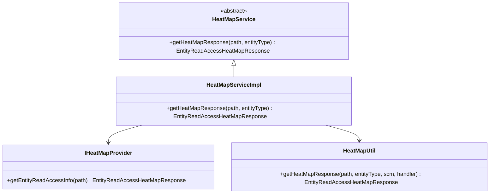

# Recon / recon-heatmap

**Classes:** 4    **Kinds:** abstract:2, interface:1, service:1

## Overview

The `recon-heatmap` feature group provides the read-access heatmap for Recon's UI. `IHeatMapProvider` is the pluggable interface for supplying raw read-count data keyed by path entity. `HeatMapService` is the abstract template that defines the data-retrieval contract, and `HeatMapServiceImpl` is the concrete subclass that implements it by calling through to an `IHeatMapProvider`. `HeatMapUtil` contains the main algorithmic logic: given a namespace entity path, it recursively builds a hierarchical `EntityReadAccessHeatMapResponse` by calling `NSSummaryEndpoint`-style disk-usage lookups and attaching access-count annotations from the provider. The heatmap is surfaced via `AccessHeatMapEndpoint` in `recon-api`. The feature has a feature-flag toggle (`ozone.recon.heatmap.enable`) that `AccessHeatMapEndpoint` checks before serving requests.

## Diagram

## Class table

### Sub-feature: `recon.heatmap`

| reading_order | fqcn | kind | logic | loc | study (min) | role |
|--:|---|---|---|--:|--:|---|
| 2358 | `org.apache.hadoop.ozone.recon.heatmap.IHeatMapProvider` | interface | mixed | 25~ | 20 | This interface is to provide heatmap data. |
| 2359 | `org.apache.hadoop.ozone.recon.heatmap.HeatMapServiceImpl` | service | mixed | 75~ | 30 | This class is an implementation of abstract class for retrieving data through HeatMapService. |
| 2360 | `org.apache.hadoop.ozone.recon.heatmap.HeatMapService` | abstract | mixed | 25~ | 30 | This is an abstract class for implementation of access to HeatMap Service. |
| 2361 | `org.apache.hadoop.ozone.recon.heatmap.HeatMapUtil` | service | logic-heavy | 300~ | 45 | This class is general utility class for keeping heatmap utility functions. |

## Anchor details

### `HeatMapUtil`

- **path:** `hadoop-ozone/recon/src/main/java/org/apache/hadoop/ozone/recon/heatmap/HeatMapUtil.java`
- **loc:** 300~    **difficulty:** 4    **study:** 45 min    **concurrency:** single-threaded    **persistence:** in-memory
- **key collaborators:** `org.apache.hadoop.hdds.scm.server.OzoneStorageContainerManager`, `org.apache.hadoop.ozone.recon.api.handlers.EntityHandler`, `org.apache.hadoop.ozone.recon.api.types.DUResponse`, `org.apache.hadoop.ozone.recon.api.types.EntityMetaData`, `org.apache.hadoop.ozone.recon.api.types.EntityReadAccessHeatMapResponse`, `org.apache.hadoop.ozone.recon.api.types.ResponseStatus`
- **role:** This class is general utility class for keeping heatmap utility functions.

The core method builds a tree of `EntityMetaData` nodes by fetching disk-usage data via `EntityHandler` and annotating each node with read-access counts from `IHeatMapProvider`. It caps the recursion depth to avoid exploding on deep namespace trees, and it prunes nodes whose read-count falls below a configurable minimum (inferred: this threshold was introduced in HDDS-9087 to avoid noise in the heatmap). The `EntityReadAccessHeatMapResponse` returned is hierarchical, where each node's `accessCount` reflects the aggregate reads for its subtree.

## Design docs

- No dedicated design doc under `hadoop-hdds/docs/content/` on this branch for the heatmap feature specifically.
- `hadoop-hdds/docs/content/design/recon1.md` — covers the general Recon observability framework that heatmap builds on.

## Seminal JIRAs / PRs

- HDDS-7795. Recon - Data Management Metrics - HeatMap of Ozone Data (initial feature)
- HDDS-8414. Recon: Heatmap Absolute Path in Response at end node level
- HDDS-8743. Recon - Expose API for hide/show flag for heatmap feature
- HDDS-8852. Ozone Recon Heatmap API - 500 server error on entityType as volume
- HDDS-9087. Ozone Recon Heatmap code refactoring and Bucket level access count fix
- HDDS-11228. Ozone Recon HeatMap refactoring of code

## Sharp edges

- The `IHeatMapProvider` interface is pluggable but only one implementation is wired in practice; if no provider bean is bound, `HeatMapServiceImpl.getHeatMapResponse()` will throw an injection error at runtime rather than returning an empty response.
- `HeatMapUtil` recursively traverses the namespace tree but does not impose a strict node-count cap per request; on very large volumes with many sub-directories the response can be very large. (HDDS-10452 added Top-N limiting to disk-usage but heatmap recursion depth is still bounded loosely.)

## Related features

- `components/recon/recon-api.md` — `AccessHeatMapEndpoint` is the HTTP entry point that calls `HeatMapServiceImpl`.
- `components/recon/recon-tasks.md` — NSSummary tasks populate the namespace data that `HeatMapUtil` uses for disk-usage lookups.
- `components/recon/recon-spi.md` — `ReconNamespaceSummaryManager` interface backs the disk-usage data used in heatmap tree construction.

## Self-quiz

1. `IHeatMapProvider` is an interface. What concrete implementation is typically bound, and how does `HeatMapServiceImpl` obtain it?
2. `HeatMapUtil.getHeatMapResponse()` builds a tree. What is the data source for the disk-usage (size) dimension and what is the data source for the read-access (access count) dimension?
3. The heatmap feature has a feature-flag. Which class checks it, and what response is returned when the flag is disabled?
4. `HeatMapServiceImpl` is abstract despite being a concrete class name. What method does `HeatMapService` (the abstract parent) require subclasses to implement?
5. After HDDS-9087, how does `HeatMapUtil` handle bucket-level access count aggregation differently from the original implementation?

Answers

Answer 1: The concrete implementation is bound via Guice in `ReconControllerModule`. `HeatMapServiceImpl` receives it as a constructor-injected `IHeatMapProvider`.
Answer 2: Disk-usage (size) data comes from `NSSummaryEndpoint`-style lookups backed by the `ReconNamespaceSummaryManager` RocksDB store. Read-access counts come from `IHeatMapProvider.getEntityReadAccessInfo()`, which reads access metadata (typically from a Prometheus or JMX source).
Answer 3: `AccessHeatMapEndpoint` (in `recon-api`) checks `FeaturesEndpoint`/`FeatureProvider` for the `ozone.recon.heatmap.enable` flag and returns a 501 Not Implemented response when disabled.
Answer 4: `HeatMapService` declares abstract `getHeatMapResponse(String path, String entityType)`. `HeatMapServiceImpl` provides the implementation by delegating to `HeatMapUtil`.
Answer 5: After HDDS-9087, bucket-level aggregation rolls up access counts from child keys rather than reporting zero when no direct bucket-level access record exists, fixing incorrect zeros in the heatmap for buckets accessed only through their keys.

