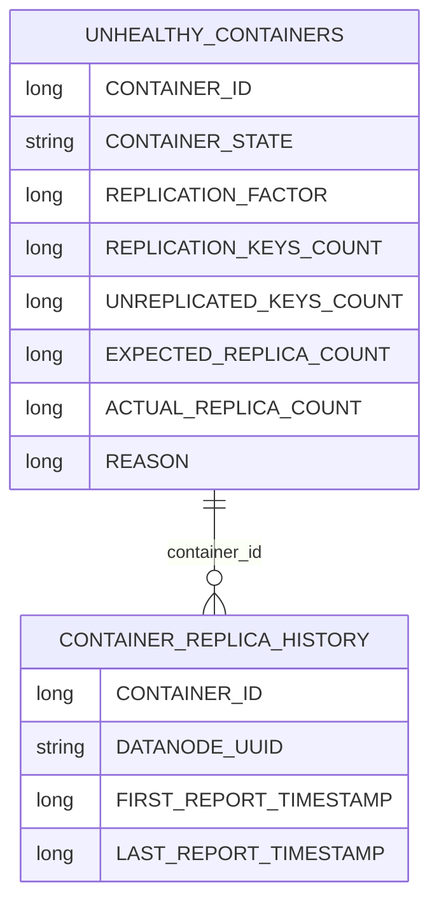

# Recon / recon-persistence

**Classes:** 8    **Kinds:** service:7, interface:1

## Overview

The `recon-persistence` feature group manages Recon's SQL (Derby/SQLite) database layer, which stores container health state and container-replica history. `JooqPersistenceModule` is the Guice module that binds a `DataSource` and installs `TransactionalMethodInterceptor` for AOP-based nested transaction support. Three `DataSource` providers cover the supported backends: `DerbyDataSourceProvider` (default for production), `SqliteDataSourceProvider` (tests), and `DefaultDataSourceProvider` (configurable via `DataSourceConfiguration`). `ContainerHealthSchemaManager` is the main workhorse: it exposes create/delete/query methods against the SQL `UNHEALTHY_CONTAINERS` table, used by both `ContainerHealthTask` and the `ContainerEndpoint` API. Deletes are batched in chunks to avoid oversized `IN` clauses. `ContainerHistory` is a value object tracking the first-seen and last-seen timestamps of a container replica on a specific datanode.

## Diagram

## Class table

### Sub-feature: `recon.persistence`

| reading_order | fqcn | kind | logic | loc | study (min) | role |
|--:|---|---|---|--:|--:|---|
| 2370 | `org.apache.hadoop.ozone.recon.persistence.DataSourceConfiguration` | interface | mixed | 25~ | 20 | Common configuration needed to instantiate javax.sql.DataSource. |
| 2371 | `org.apache.hadoop.ozone.recon.persistence.ContainerHealthSchemaManager` | service | logic-heavy | 375~ | 45 | Manager for UNHEALTHY_CONTAINERS table used by ContainerHealthTask. |
| 2372 | `org.apache.hadoop.ozone.recon.persistence.ContainerHistory` | service | mixed | 75~ | 30 | Some historical info about a container on a datanode. |
| 2373 | `org.apache.hadoop.ozone.recon.persistence.JooqPersistenceModule` | service | mixed | 50~ | 30 | Persistence module that provides binding for DataSource and a MethodInterceptor for nested transactions support. |
| 2374 | `org.apache.hadoop.ozone.recon.persistence.SqliteDataSourceProvider` | service | mixed | 25~ | 30 | Provide a javax.sql.DataSource for the application. |
| 2375 | `org.apache.hadoop.ozone.recon.persistence.DefaultDataSourceProvider` | service | mixed | 25~ | 30 | Provide a javax.sql.DataSource for the application. |
| 2376 | `org.apache.hadoop.ozone.recon.persistence.TransactionalMethodInterceptor` | service | mixed | 25~ | 30 | A MethodInterceptor that implements nested transactions. |
| 2377 | `org.apache.hadoop.ozone.recon.persistence.DerbyDataSourceProvider` | service | mixed | 25~ | 30 | Provide a javax.sql.DataSource for the application. |

## Anchor details

### `ContainerHealthSchemaManager`

- **path:** `hadoop-ozone/recon/src/main/java/org/apache/hadoop/ozone/recon/persistence/ContainerHealthSchemaManager.java`
- **loc:** 375~    **difficulty:** 4    **study:** 45 min    **concurrency:** single-threaded    **persistence:** in-memory
- **key collaborators:** `org.apache.hadoop.hdds.conf.OzoneConfiguration`, `org.apache.hadoop.ozone.recon.ReconServerConfigKeys`
- **role:** Manager for UNHEALTHY_CONTAINERS table used by ContainerHealthTask.

Provides typed read/write access to the `UNHEALTHY_CONTAINERS` table using a jOOQ `DSLContext`. The `insertBatch()` method uses `BATCH_INSERT_CHUNK_SIZE` (1,000) to split large inserts. The `deleteBatch()` method splits deletes into bounded `IN` clauses (configurable via `ReconServerConfigKeys`) to avoid oversized SQL statements that can exceed Derby's parameter limit. The `getUnhealthyContainerCount(UnHealthyContainerStates)` method returns a group-by count used by the `ContainerEndpoint` summary API. A key invariant: callers must ensure the table is cleared and repopulated atomically per scan cycle to avoid stale health states persisting across restarts.

## Design docs

- No dedicated design doc under `hadoop-hdds/docs/content/` on this branch for the SQL persistence layer.
- `hadoop-hdds/docs/content/design/recon1.md` — covers the initial Recon design, including the choice of an embedded SQL DB for derived health data.

## Seminal JIRAs / PRs

- HDDS-5965. Recon should be able to distinguish containers with no replicas from those with all replicas UNHEALTHY (initial UNHEALTHY_CONTAINERS table)
- HDDS-7098. Provide a way for admin to identify all unhealthy container replicas
- HDDS-11309. Increase CONTAINER_STATE Column Length in UNHEALTHY_CONTAINERS to Avoid Truncation
- HDDS-12585. Recon ContainerHealthTask ConstraintViolationException error handling
- HDDS-12708. Fix Unhealthy Containers API for pagination
- HDDS-13891. SCM-based health monitoring and batch processing in Recon
- HDDS-14913. Implement Scalable CSV Export for Unhealthy Containers in Recon UI

## Sharp edges

- Derby has a practical limit on the size of an `IN` clause parameter list. `ContainerHealthSchemaManager.deleteBatch()` addresses this by chunking deletes, but the chunk size is configurable and must be tuned for the Derby version in use; setting it too high will cause SQL errors. (`hadoop-ozone/recon/src/main/java/org/apache/hadoop/ozone/recon/persistence/ContainerHealthSchemaManager.java`, `BATCH_DELETE_CHUNK_SIZE`)
- `UNHEALTHY_CONTAINERS` is fully replaced on each scan cycle. If the scan crashes mid-write, the table may contain partial results until the next successful scan. There is no transactional snapshot isolation between the write and concurrent API reads.

## Related features

- `components/recon/recon-fsck.md` — `ReconReplicationManager` writes the results that `ContainerHealthSchemaManager` persists.
- `components/recon/recon-codegen.md` — `ContainerSchemaDefinition` defines the DDL for the `UNHEALTHY_CONTAINERS` table; jOOQ POJOs used here are generated from that definition.
- `components/recon/recon-upgrade.md` — upgrade actions add indices and columns to `UNHEALTHY_CONTAINERS`.
- `components/recon/recon-api.md` — `ContainerEndpoint` queries `ContainerHealthSchemaManager` to serve the unhealthy-containers API.

## Self-quiz

1. `ContainerHealthSchemaManager.insertBatch()` uses `BATCH_INSERT_CHUNK_SIZE`. What is the default value and why is chunking necessary when inserting many rows?
2. `JooqPersistenceModule` installs a `TransactionalMethodInterceptor`. What annotation triggers this interceptor, and what is the behavior for nested transactions?
3. `DerbyDataSourceProvider` is the production backend. What is the on-disk storage location for the Derby database in a typical Recon deployment?
4. `ContainerHistory` tracks `firstReportTimestamp` and `lastReportTimestamp`. What event updates `lastReportTimestamp`, and where is `ContainerHistory` persisted?
5. After HDDS-11309, the `CONTAINER_STATE` column was widened. What was the maximum length before the fix, and what state value exceeded it?

Answers

Answer 1: The default `BATCH_INSERT_CHUNK_SIZE` is 1,000 rows per insert statement. Chunking is necessary because Derby limits the number of bind parameters in a single SQL statement, and inserting all unhealthy containers at once on large clusters could exceed that limit.
Answer 2: The `@Transactional` annotation (from jOOQ or a custom annotation processed by Guice AOP) triggers the interceptor. Nested `@Transactional` calls reuse the outermost transaction (no savepoints); the interceptor tracks the nesting depth and only commits/rolls back at the outermost boundary.
Answer 3: The Derby database is stored under the Recon metadata directory configured via `ozone.recon.db.dir` (or the default under `OZONE_HOME/recon`), in a subdirectory named `recon-db`.
Answer 4: `lastReportTimestamp` is updated each time an ICR or FCR report arrives for that container on that datanode, processed by `ReconContainerManager.updateContainerReplica()`. `ContainerHistory` is persisted via jOOQ into the `CONTAINER_REPLICA_HISTORY` SQL table.
Answer 5: The column was originally 64 characters. The `QUASI_CLOSED_STUCK_REPLICA_DUE_TO_MISMATCH` state (introduced in HDDS-13891) exceeded this limit, causing truncation. HDDS-11309 widened the column to 256 characters.

