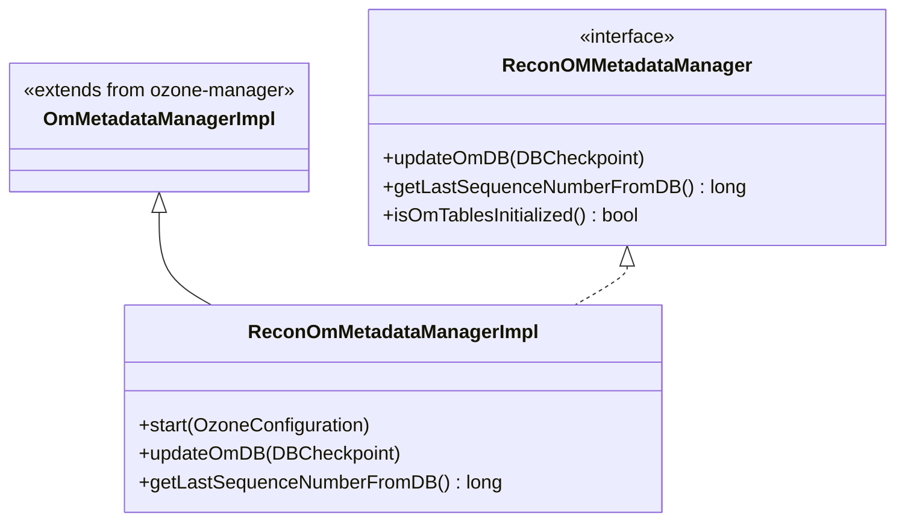

# Recon / recon-recovery

**Classes:** 2    **Kinds:** interface:1, service:1

## Overview

The `recon-recovery` feature group contains Recon's local copy of the OM metadata store. `ReconOMMetadataManager` is the interface that extends OM's own `OmMetadataManager`, adding Recon-specific operations such as `updateOmDB` (swap in a new checkpoint) and `getLastSequenceNumberFromDB`. `ReconOmMetadataManagerImpl` extends `OmMetadataManagerImpl` directly so that all OM table definitions and codec registrations are inherited automatically; Recon does not maintain a parallel schema. The impl opens a local RocksDB snapshot of OM's database under the directory configured by `OZONE_RECON_OM_SNAPSHOT_DB_DIR`. When `OzoneManagerServiceProviderImpl` downloads a fresh OM checkpoint, it calls `updateOmDB` on this class to atomically swap the backing store, which re-opens all column-family handles. The `omTablesInitialized` flag prevents reads before the first successful snapshot download.

## Diagram

## Class table

### Sub-feature: `recon.recovery`

| reading_order | fqcn | kind | logic | loc | study (min) | role |
|--:|---|---|---|--:|--:|---|
| 2378 | `org.apache.hadoop.ozone.recon.recovery.ReconOMMetadataManager` | interface | mixed | 25~ | 20 | Interface for the OM Metadata Manager + DB store maintained by Recon. |
| 2379 | `org.apache.hadoop.ozone.recon.recovery.ReconOmMetadataManagerImpl` | service | logic-heavy | 200~ | 45 | Recon's implementation of the OM Metadata manager. |

## Anchor details

### `ReconOmMetadataManagerImpl`

- **path:** `hadoop-ozone/recon/src/main/java/org/apache/hadoop/ozone/recon/recovery/ReconOmMetadataManagerImpl.java`
- **loc:** 200~    **difficulty:** 4    **study:** 45 min    **concurrency:** single-threaded    **persistence:** in-memory
- **entry points:** `start`
- **key collaborators:** `org.apache.hadoop.hdds.conf.OzoneConfiguration`, `org.apache.hadoop.hdds.utils.db.DBCheckpoint`, `org.apache.hadoop.hdds.utils.db.DBStore`, `org.apache.hadoop.hdds.utils.db.DBStoreBuilder`, `org.apache.hadoop.hdds.utils.db.RDBStore`, `org.apache.hadoop.hdds.utils.db.StringCodec`
- **test exemplar:** `hadoop-ozone/recon/src/test/java/org/apache/hadoop/ozone/recon/recovery/TestReconOmMetadataManagerImpl.java`
- **role:** Recon's implementation of the OM Metadata manager.

`updateOmDB(DBCheckpoint)` is the critical method: it closes the current `DBStore`, copies the checkpoint into the snapshot directory (replacing any existing snapshot), then reopens the store via `OmMetadataManagerImpl.start()`. The `omTablesInitialized` flag is set to `true` only after this first successful open, gating all API calls that read OM tables. Recon depends on inheriting `OmMetadataManagerImpl`'s column-family definitions; any new table added to OM without a corresponding change in `OmMetadataManagerImpl` will cause Recon's store open to fail with an "unknown column family" error.

## Design docs

- `hadoop-hdds/docs/content/design/recon1.md` — covers the rationale for Recon maintaining a local OM snapshot rather than querying OM live.
- `hadoop-hdds/docs/content/design/recon2.md` — describes the delta-sync approach that extends the snapshot mechanism.
- No dedicated recovery/snapshot design doc under `hadoop-hdds/docs/content/` on this branch.

## Seminal JIRAs / PRs

- HDDS-11349. Add NullPointer handling when volume/bucket tables are not initialized
- HDDS-11484. Validate javadoc in CI
- HDDS-11660. Recon List Key API: Reduce object creation and buffering memory
- HDDS-13576. Recon reprocess of all tasks should be non-blocking
- HDDS-15766. Make Recon OM DB large tarball transfer reliable
- HDDS-15863. Add Manual OM DB Rebuild Support for Recon Bootstrapping

## Sharp edges

- `updateOmDB()` closes and reopens the entire `DBStore`. If any thread is mid-read on a table handle at that moment, it will see a closed-store exception. The `omTablesInitialized` guard only prevents new reads from starting; it does not protect in-flight reads. (HDDS-15863 added a manual rebuild path that worsens this window.)
- Recon inherits all OM column families by extending `OmMetadataManagerImpl`. If OM introduces a new column family in a rolling upgrade before Recon is upgraded, Recon's `start()` will fail to open the DB because it does not recognize the new CF. This is an upgrade-ordering constraint with no automatic mitigation.

## Related features

- `components/recon/recon-spi.md` — `OzoneManagerServiceProviderImpl` drives the download and calls `updateOmDB()` on this class.
- `components/recon/recon-tasks.md` — `ReconTaskControllerImpl` waits for `omTablesInitialized` before submitting tasks that read OM tables.
- `components/recon/recon-api.md` — endpoints like `OMDBInsightEndpoint` and `NSSummaryEndpoint` inject `ReconOMMetadataManager` and read from the local OM snapshot.

## Self-quiz

1. `ReconOmMetadataManagerImpl.updateOmDB()` swaps the backing store. What happens to any ongoing read operations when this swap occurs?
2. Why does `ReconOmMetadataManagerImpl` extend `OmMetadataManagerImpl` rather than providing its own `DBStoreBuilder` configuration?
3. What is the `omTablesInitialized` flag and which operations check it before proceeding?
4. `getLastSequenceNumberFromDB()` reads the sequence number from RocksDB. How does this differ from the in-memory sequence number tracked by `OzoneManagerServiceProviderImpl`?
5. HDDS-15863 added a manual OM DB rebuild path. What scenario motivated this and how does `updateOmDB()` support it?

Answers

Answer 1: In-flight reads on table iterators obtained before the swap will encounter a `RocksDB is closed` error if the old store is closed mid-read. The `omTablesInitialized` flag does not guard against this; callers must handle the exception.
Answer 2: `OmMetadataManagerImpl` owns the authoritative list of column-family definitions, codecs, and table-name constants for every OM table. By extending it, Recon automatically picks up any new tables added to OM without needing a parallel schema definition.
Answer 3: `omTablesInitialized` is set to `true` after the first successful `updateOmDB()` call. Methods such as `getKeyTable()`, `getBucketTable()`, and similar table accessors check it and throw `ServiceNotReadyException` if it is false, preventing API calls from returning stale or null data.
Answer 4: `getLastSequenceNumberFromDB()` reads the sequence number persisted in the RocksDB WAL metadata of the local snapshot. `OzoneManagerServiceProviderImpl` tracks the sequence number of the last successfully applied delta in memory. On restart, the impl uses `getLastSequenceNumberFromDB()` to recover the correct starting point for delta-sync without replaying all deltas from the beginning.
Answer 5: In some disaster-recovery or corruption scenarios, Recon's local OM snapshot becomes too far behind or corrupt and delta-sync cannot recover it. HDDS-15863 added a `/dbsync/reset` admin endpoint that triggers a fresh full snapshot download and calls `updateOmDB()` with the new checkpoint, bypassing the normal delta-sync interval.

