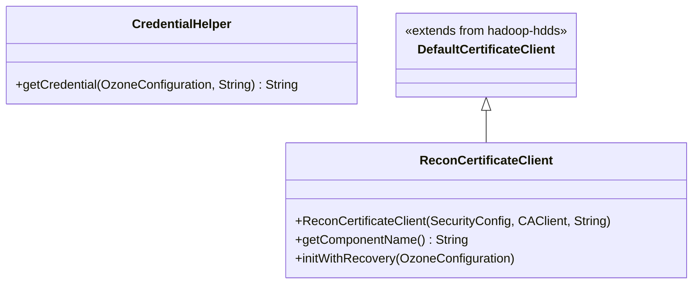

# Recon / recon-security

**Classes:** 2    **Kinds:** service:2

## Overview

The `recon-security` feature group covers two distinct security concerns in Recon. `ReconCertificateClient` extends the shared `DefaultCertificateClient` to provide Recon's TLS certificate lifecycle: it obtains a signed certificate from the SCM CA on first startup, stores it locally, and handles rotation. The `@Component` suffix in the constructor specifies `"recon"` as the component name, which is used for certificate subject naming and local keystore paths. `CredentialHelper` is a chatbot-specific utility that reads LLM API keys from Hadoop's Credential Provider (JCEKS keystores or similar), keeping secrets out of plain-text configuration files. These two classes are otherwise unrelated; they share a feature bucket only because both touch security primitives.

## Diagram

## Class table

### Sub-feature: `chatbot.security`

| reading_order | fqcn | kind | logic | loc | study (min) | role |
|--:|---|---|---|--:|--:|---|
| 2402 | `org.apache.hadoop.ozone.recon.chatbot.security.CredentialHelper` | service | mixed | 25~ | 30 | Centralised utility for reading secrets from the Hadoop Credential Provider (JCEKS). |

### Sub-feature: `recon.security`

| reading_order | fqcn | kind | logic | loc | study (min) | role |
|--:|---|---|---|--:|--:|---|
| 2403 | `org.apache.hadoop.ozone.recon.security.ReconCertificateClient` | service | mixed | 50~ | 30 | Certificate client for Recon. |

## Anchor details

_No logic-heavy anchors in this feature; the classes are primarily data / dto / config / cli._

## Design docs

- No dedicated design doc under `hadoop-hdds/docs/content/` on this branch for Recon's certificate client specifically.
- The shared certificate-client design is implicit in the `DefaultCertificateClient` framework in `hadoop-hdds/framework`.

## Seminal JIRAs / PRs

- HDDS-8030. Cleanup unused/unnecessary code related to CertificateClient
- HDDS-8879. Cleanup SecurityConfig and related class initialization
- HDDS-9334. Improve thread names in common/framework
- HDDS-9418. Consolidate CertificateClient handleCase handling
- HDDS-11028. Replace PKCS10CertificationRequest usage in CertificateClient
- HDDS-14816. Add Recon AI Assistant backend foundation with Multi LLM integration (introduced CredentialHelper)

## Sharp edges

- `CredentialHelper.getCredential()` delegates to Hadoop's `CredentialProvider` API. If no provider is configured (`hadoop.security.credential.provider.path` is unset), the method falls back to reading from plain-text config keys — silently, with no warning. Operators who intend to keep API keys secret must explicitly configure a JCEKS provider.

## Related features

- `components/recon/recon-server.md` — `ReconServer` initializes `ReconCertificateClient` during startup in secure mode; `LangChain4jDispatcher` uses `CredentialHelper` to obtain LLM API keys.
- `components/recon/recon-scm.md` — `ReconStorageContainerManagerFacade` requires a valid TLS context from `ReconCertificateClient` when secure mode is enabled.

## Self-quiz

1. `ReconCertificateClient` specifies `"recon"` as its component name. What effect does this have on the certificate subject and local keystore paths?
2. `CredentialHelper.getCredential()` reads from the Hadoop Credential Provider. What happens if no provider path is configured and the key is also absent from the plain-text config?
3. `ReconCertificateClient` is initialized during `ReconServer.start()`. In what order relative to the HTTP server and RPC server does certificate initialization occur, and why does that order matter?
4. Which SCM endpoint does `ReconCertificateClient` contact to obtain its signed certificate, and how does Recon locate that endpoint?
5. `DefaultCertificateClient` handles certificate rotation. Does `ReconCertificateClient` override the rotation logic, or does it inherit it unchanged?

Answers

Answer 1: The component name `"recon"` is embedded in the certificate's common name (CN) and in the local keystore directory path (e.g., `<metadata-dir>/recon/certs/`), distinguishing Recon certificates from OM and SCM certificates.
Answer 2: `CredentialHelper.getCredential()` returns `null` (or an empty string) silently. The LLM dispatcher will then fail at the first API call with an authentication error, not at startup.
Answer 3: Certificate initialization occurs before the HTTP server and RPC server start, because both need a valid TLS context to bind their sockets. Starting servers before the certificate is ready would cause them to bind without TLS, creating a security gap.
Answer 4: `ReconCertificateClient` contacts the SCM's `SCMSecurityProtocol` endpoint using the address resolved from `OZONE_SCM_CLIENT_ADDRESS_KEY`. `ReconServer` configures the address via `SCMSecurityProtocolClientSideTranslatorPB`.
Answer 5: `ReconCertificateClient` inherits the rotation logic from `DefaultCertificateClient` without override. Only the component name and any Recon-specific key/cert path construction differ.

