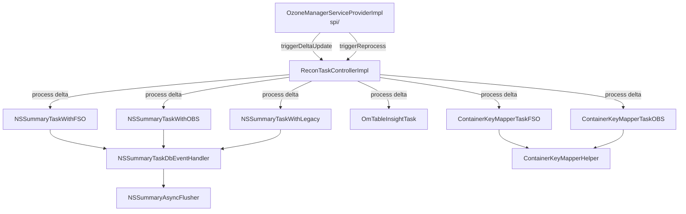

# Recon / recon-tasks

**Classes:** 37    **Kinds:** service:25, interface:4, data:3, abstract:2, config:1, metrics:1, exception:1

## Overview

The `recon-tasks` feature group implements the background task framework that keeps Recon's derived data in sync with OM. `ReconTaskControllerImpl` is the central dispatcher: it manages a thread pool, an `OMUpdateEventBuffer` that buffers deltas between sync cycles, and drives two modes — `reprocess` (full OM table scan from scratch) and `process` (incremental delta application from `OMDBUpdateEvent` batches). The NSSummary task family (`NSSummaryTaskWithFSO`, `NSSummaryTaskWithOBS`, `NSSummaryTaskWithLegacy`) rebuilds the namespace-summary RocksDB tree in parallel using `ParallelTableIteratorOperation` and a shared `NSSummaryAsyncFlusher`. `OmTableInsightTask` iterates OM tables to populate global counts (volumes, buckets, keys, open keys, deleted keys) in RocksDB. `ContainerKeyMapperHelper` builds the bidirectional container-key index in `ReconContainerMetadataManagerImpl`. `OMDBUpdatesHandler` listens to OM RocksDB WAL events to populate delta batches for incremental processing.

## Diagram

## Class table

### Sub-feature: `recon.tasks`

| reading_order | fqcn | kind | logic | loc | study (min) | role |
|--:|---|---|---|--:|--:|---|
| 2425 | `org.apache.hadoop.ozone.recon.tasks.ReconOmTask` | interface | mixed | 75~ | 20 | Interface used to denote a Recon task that needs to act on OM DB events. |
| 2426 | `org.apache.hadoop.ozone.recon.tasks.ReconTaskController` | interface | mixed | 25~ | 20 | Controller used by Recon to manage Tasks that are waiting on Recon events. |
| 2427 | `org.apache.hadoop.ozone.recon.tasks.OmTableHandler` | interface | mixed | 25~ | 20 | Interface for handling PUT, DELETE and UPDATE events for size-related tables for OM Insights. |
| 2428 | `org.apache.hadoop.ozone.recon.tasks.ReconEvent` | interface | mixed | 25~ | 20 | Common interface for all Recon events that can be processed by the event buffer. |
| 2429 | `org.apache.hadoop.ozone.recon.tasks.ContainerKeyMapperHelper` | abstract | logic-heavy | 325~ | 45 | Helper class that encapsulates the common logic for ContainerKeyMapperTaskFSO and ContainerKeyMapperTaskOBS. |
| 2430 | `org.apache.hadoop.ozone.recon.tasks.FileSizeCountTaskHelper` | abstract | mixed | 175~ | 45 | Helper class that encapsulates the common code for file size count tasks. |
| 2431 | `org.apache.hadoop.ozone.recon.tasks.ReconTaskControllerImpl` | service | logic-heavy | 650~ | 60 | Implementation of ReconTaskController. |
| 2432 | `org.apache.hadoop.ozone.recon.tasks.NSSummaryTaskWithFSO` | service | logic-heavy | 275~ | 45 | Class for handling FSO specific tasks. |
| 2433 | `org.apache.hadoop.ozone.recon.tasks.NSSummaryTaskWithLegacy` | service | logic-heavy | 275~ | 45 | Class for handling Legacy specific tasks. |
| 2434 | `org.apache.hadoop.ozone.recon.tasks.OmTableInsightTask` | service | logic-heavy | 275~ | 45 | Class to iterate over the OM DB and store the total counts of volumes, buckets, keys, open keys, deleted keys, etc. |
| 2435 | `org.apache.hadoop.ozone.recon.tasks.NSSummaryTaskDbEventHandler` | service | logic-heavy | 275~ | 45 | Class for holding all NSSummaryTask methods related to DB operations so that they can commonly be used in NSSummaryTa... |
| 2436 | `org.apache.hadoop.ozone.recon.tasks.NSSummaryTaskWithOBS` | service | logic-heavy | 200~ | 45 | Class for handling OBS specific tasks. |
| 2437 | `org.apache.hadoop.ozone.recon.tasks.NSSummaryAsyncFlusher` | service | mixed | 175~ | 45 | Async flusher for NSSummary maps with background thread. |
| 2438 | `org.apache.hadoop.ozone.recon.tasks.ContainerSizeCountTask` | service | mixed | 175~ | 45 | Class that scans the list of containers and keeps track of container sizes binned into ranges (1KB, 2Kb…,4MB,…1GB,…5G... |
| 2439 | `org.apache.hadoop.ozone.recon.tasks.OMDBUpdatesHandler` | service | mixed | 175~ | 45 | Class used to listen on OM RocksDB updates. |
| 2440 | `org.apache.hadoop.ozone.recon.tasks.MultipartInfoInsightHandler` | service | mixed | 125~ | 30 | Manages records in the MultipartInfo Table, updating counts and sizes of multipart upload keys in the backend. |
| 2441 | `org.apache.hadoop.ozone.recon.tasks.OpenKeysInsightHandler` | service | mixed | 100~ | 30 | Manages records in the OpenKey Table, updating counts and sizes of open keys in the backend. |
| 2442 | `org.apache.hadoop.ozone.recon.tasks.DeletedKeysInsightHandler` | service | mixed | 75~ | 30 | Manages records in the Deleted Table, updating counts and sizes of pending Key Deletions in the backend. |
| 2443 | `org.apache.hadoop.ozone.recon.tasks.OMUpdateEventBuffer` | service | mixed | 75~ | 30 | Buffer for Recon events during task reprocessing. |
| 2444 | `org.apache.hadoop.ozone.recon.tasks.FileSizeCountKey` | service | mixed | 75~ | 30 | Key class used for grouping file size counts in RocksDB storage. |
| 2445 | `org.apache.hadoop.ozone.recon.tasks.FileSizeCountTaskFSO` | service | mixed | 50~ | 30 | Task for FileSystemOptimized (FSO) which processes the FILE_TABLE. |
| 2446 | `org.apache.hadoop.ozone.recon.tasks.ContainerKeyMapperTaskOBS` | service | mixed | 50~ | 30 | Task for processing ContainerKey mapping specifically for OBS buckets. |
| 2447 | `org.apache.hadoop.ozone.recon.tasks.FileSizeCountTaskOBS` | service | mixed | 50~ | 30 | Task for ObjectStore (OBS) which processes the KEY_TABLE. |
| 2448 | `org.apache.hadoop.ozone.recon.tasks.ContainerKeyMapperTaskFSO` | service | mixed | 50~ | 30 | Task for processing ContainerKey mapping specifically for FSO buckets. |
| 2449 | `org.apache.hadoop.ozone.recon.tasks.OMUpdateEventBatch` | service | mixed | 25~ | 30 | Wrapper class to hold multiple OM DB update events. |
| 2450 | `org.apache.hadoop.ozone.recon.tasks.OmUpdateEventValidator` | service | mixed | 25~ | 30 | OmUpdateEventValidator is a utility class for validating OMDBUpdateEvents It can be further extended to different typ... |
| 2451 | `org.apache.hadoop.ozone.recon.tasks.GlobalStatsValue` | service | mixed | 25~ | 30 | Value class for global statistics stored in RocksDB. |
| 2452 | `org.apache.hadoop.ozone.recon.tasks.ReconTaskConfig` | config | data-only | 50~ | 20 | The configuration class for the Recon tasks. |
| 2453 | `org.apache.hadoop.ozone.recon.tasks.NSSummaryTask` | service | logic-heavy | 225~ | 10 | Task to query data from OMDB and write into Recon RocksDB. |
| 2454 | `org.apache.hadoop.ozone.recon.tasks.OMDBUpdateEvent` | service | mixed | 100~ | 10 | A class used to encapsulate a single OM DB update event. |
| 2455 | `org.apache.hadoop.ozone.recon.tasks.ReconTaskReInitializationEvent` | service | mixed | 50~ | 10 | Custom event to trigger task reinitialization asynchronously. |
| 2456 | `org.apache.hadoop.ozone.recon.tasks.DataNodeMetricsCollectionTask` | metrics | mixed | 50~ | 20 | Task for collecting pending deletion metrics from a DataNode using JMX. |

### Sub-feature: `tasks.types`

| reading_order | fqcn | kind | logic | loc | study (min) | role |
|--:|---|---|---|--:|--:|---|
| 2457 | `org.apache.hadoop.ozone.recon.tasks.types.NamedCallableTask` | service | mixed | 25~ | 30 | This class is a wrapper over the java.util.concurrent.Callable interface. |
| 2458 | `org.apache.hadoop.ozone.recon.tasks.types.TaskExecutionException` | exception | data-only | 25~ | 10 | Wrapper over RuntimeException to associate an exception to a task name. |

### Sub-feature: `tasks.updater`

| reading_order | fqcn | kind | logic | loc | study (min) | role |
|--:|---|---|---|--:|--:|---|
| 2459 | `org.apache.hadoop.ozone.recon.tasks.updater.ReconTaskStatusUpdaterManager` | service | mixed | 75~ | 30 | This class provides caching for ReconTaskStatusUpdater instances. |
| 2460 | `org.apache.hadoop.ozone.recon.tasks.updater.ReconTaskStatusUpdater` | service | mixed | 75~ | 30 | This class provides utilities to update/modify Recon Task related data like updating table, incrementing counter etc. |

### Sub-feature: `tasks.util`

| reading_order | fqcn | kind | logic | loc | study (min) | role |
|--:|---|---|---|--:|--:|---|
| 2461 | `org.apache.hadoop.ozone.recon.tasks.util.ParallelTableIteratorOperation` | service | mixed | 175~ | 45 | Class to iterate through a table in parallel by breaking table into multiple iterators. |

## Anchor details

### `ContainerKeyMapperHelper`

- **path:** `hadoop-ozone/recon/src/main/java/org/apache/hadoop/ozone/recon/tasks/ContainerKeyMapperHelper.java`
- **loc:** 325~    **difficulty:** 4    **study:** 45 min    **concurrency:** thread-safe    **persistence:** in-memory
- **entry points:** `process`
- **key collaborators:** `org.apache.hadoop.ozone.recon.tasks.util.ParallelTableIteratorOperation`, `org.apache.hadoop.hdds.utils.db.RDBBatchOperation`, `org.apache.hadoop.hdds.utils.db.StringCodec`, `org.apache.hadoop.hdds.utils.db.Table`, `org.apache.hadoop.hdds.utils.db.TableIterator`, `org.apache.hadoop.ozone.om.OMMetadataManager`
- **role:** Helper class that encapsulates the common logic for ContainerKeyMapperTaskFSO and ContainerKeyMapperTaskOBS.

For each key in the OM key table, the helper extracts the list of `OmKeyLocationInfo` blocks, maps each block's `ContainerID` to the key prefix, and writes (or deletes) entries in both `CONTAINER_KEY` and `KEY_CONTAINER` RocksDB tables using batched `RDBBatchOperation`. Subclasses (`ContainerKeyMapperTaskFSO`, `ContainerKeyMapperTaskOBS`) provide the OM table reference but share all the iteration and write logic here. The `process()` path handles incremental PUT/DELETE events from `OMDBUpdateEvent`; the `reprocess()` path does a full table scan via `ParallelTableIteratorOperation`.

### `ReconTaskControllerImpl`

- **path:** `hadoop-ozone/recon/src/main/java/org/apache/hadoop/ozone/recon/tasks/ReconTaskControllerImpl.java`
- **loc:** 650~    **difficulty:** 5    **study:** 60 min    **concurrency:** actor/queue    **persistence:** RocksDB
- **entry points:** `start`
- **key collaborators:** `org.apache.hadoop.ozone.recon.tasks.types.NamedCallableTask`, `org.apache.hadoop.ozone.recon.tasks.types.TaskExecutionException`, `org.apache.hadoop.ozone.recon.tasks.updater.ReconTaskStatusUpdater`, `org.apache.hadoop.ozone.recon.tasks.updater.ReconTaskStatusUpdaterManager`, `org.apache.hadoop.hdds.conf.OzoneConfiguration`, `org.apache.hadoop.hdds.utils.db.DBCheckpoint`
- **test exemplar:** `hadoop-ozone/recon/src/test/java/org/apache/hadoop/ozone/recon/tasks/TestReconTaskControllerImpl.java`
- **role:** Implementation of ReconTaskController.

Uses a `CompletableFuture`-based task fan-out: all registered tasks are submitted concurrently to an `ExecutorService` and awaited. A key design invariant: `reprocess()` creates a staging directory for the new OM RocksDB snapshot, runs all tasks against the staging DB, and only after all tasks succeed does it atomically replace the live DB. If any task fails, the staging directory is deleted and the old DB is preserved. This two-phase approach prevents partial reprocess results from being served by the API. The `OMUpdateEventBuffer` accumulates delta events while tasks are running and drains them once the reprocess completes.

### `NSSummaryTaskWithFSO`

- **path:** `hadoop-ozone/recon/src/main/java/org/apache/hadoop/ozone/recon/tasks/NSSummaryTaskWithFSO.java`
- **loc:** 275~    **difficulty:** 4    **study:** 45 min    **concurrency:** thread-safe    **persistence:** in-memory
- **key collaborators:** `org.apache.hadoop.ozone.recon.tasks.util.ParallelTableIteratorOperation`, `org.apache.hadoop.hdds.utils.db.StringCodec`, `org.apache.hadoop.hdds.utils.db.Table`, `org.apache.hadoop.ozone.om.OMMetadataManager`, `org.apache.hadoop.ozone.om.helpers.OmDirectoryInfo`, `org.apache.hadoop.ozone.om.helpers.OmKeyInfo`
- **test exemplar:** `hadoop-ozone/recon/src/test/java/org/apache/hadoop/ozone/recon/tasks/TestNSSummaryTaskWithFSO.java`
- **role:** Class for handling FSO specific tasks.

Iterates the `FILE_TABLE` and `DIRECTORY_TABLE` in parallel using `ParallelTableIteratorOperation` (HDDS-14121 / HDDS-15335). For each file it builds or updates the `NSSummary` object for the parent directory's object ID, accumulating file count, file size distribution, and (since HDDS-13758) replicated size of files. For each directory it creates a directory-level `NSSummary`. All writes go through `NSSummaryTaskDbEventHandler` which serializes them to the `NSSummary` RocksDB column family via `NSSummaryAsyncFlusher`.

### `NSSummaryTaskWithLegacy`

- **path:** `hadoop-ozone/recon/src/main/java/org/apache/hadoop/ozone/recon/tasks/NSSummaryTaskWithLegacy.java`
- **loc:** 275~    **difficulty:** 4    **study:** 45 min    **concurrency:** single-threaded    **persistence:** in-memory
- **key collaborators:** `org.apache.hadoop.hdds.conf.OzoneConfiguration`, `org.apache.hadoop.hdds.utils.db.Table`, `org.apache.hadoop.hdds.utils.db.TableIterator`, `org.apache.hadoop.ozone.om.OMMetadataManager`, `org.apache.hadoop.ozone.om.OmConfig`, `org.apache.hadoop.ozone.om.helpers.BucketLayout`
- **test exemplar:** `hadoop-ozone/recon/src/test/java/org/apache/hadoop/ozone/recon/tasks/TestNSSummaryTaskWithLegacy.java`
- **role:** Class for handling Legacy specific tasks.

Handles the `KEY_TABLE` for legacy (non-FSO, non-OBS) buckets. Legacy bucket handling is more complex because the key path encodes the full namespace path as a string prefix rather than object IDs; the task must parse the key string to reconstruct the parent path hierarchy. Single-threaded because the legacy key table does not support the parallel split used by FSO and OBS tasks.

### `OmTableInsightTask`

- **path:** `hadoop-ozone/recon/src/main/java/org/apache/hadoop/ozone/recon/tasks/OmTableInsightTask.java`
- **loc:** 275~    **difficulty:** 4    **study:** 45 min    **concurrency:** single-threaded    **persistence:** RocksDB
- **entry points:** `init`, `process`
- **key collaborators:** `org.apache.hadoop.ozone.recon.tasks.util.ParallelTableIteratorOperation`, `org.apache.hadoop.hdds.utils.db.ByteArrayCodec`, `org.apache.hadoop.hdds.utils.db.DBStore`, `org.apache.hadoop.hdds.utils.db.RDBBatchOperation`, `org.apache.hadoop.hdds.utils.db.StringCodec`, `org.apache.hadoop.hdds.utils.db.Table`
- **test exemplar:** `hadoop-ozone/recon/src/test/java/org/apache/hadoop/ozone/recon/tasks/TestOmTableInsightTask.java`
- **role:** Class to iterate over the OM DB and store the total counts of volumes, buckets, keys, open keys, deleted keys, etc.

Implements the `OmTableHandler` interface for multiple OM tables (volume, bucket, key, openKey, deletedKey, multipartInfo). For each table it accumulates count and byte-size aggregates and persists them to Recon's `GlobalStats` RocksDB table via `ReconGlobalStatsManager`. The `process()` method handles delta events by adjusting running totals (increment on PUT, decrement on DELETE); `reprocess()` does a full table scan and resets the counters.

### `NSSummaryTaskDbEventHandler`

- **path:** `hadoop-ozone/recon/src/main/java/org/apache/hadoop/ozone/recon/tasks/NSSummaryTaskDbEventHandler.java`
- **loc:** 275~    **difficulty:** 4    **study:** 45 min    **concurrency:** single-threaded    **persistence:** RocksDB
- **key collaborators:** `org.apache.hadoop.hdds.utils.db.RDBBatchOperation`, `org.apache.hadoop.ozone.om.helpers.OmBucketInfo`, `org.apache.hadoop.ozone.om.helpers.OmDirectoryInfo`, `org.apache.hadoop.ozone.om.helpers.OmKeyInfo`, `org.apache.hadoop.ozone.recon.ReconUtils`, `org.apache.hadoop.ozone.recon.api.types.NSSummary`
- **role:** Class for holding all NSSummaryTask methods related to DB operations so that they can commonly be used in NSSummaryTask subclasses.

Centralizes all RocksDB read-modify-write operations on `NSSummary` objects. The key method `addToNSSummary()` fetches the existing `NSSummary` for a given parent object ID, applies the delta (add file size, increment file count, update size distribution), and queues the updated object for flush via `NSSummaryAsyncFlusher`. This shared handler avoids duplicating the merge logic across FSO, OBS, and legacy task variants.

### `NSSummaryTaskWithOBS`

- **path:** `hadoop-ozone/recon/src/main/java/org/apache/hadoop/ozone/recon/tasks/NSSummaryTaskWithOBS.java`
- **loc:** 200~    **difficulty:** 4    **study:** 45 min    **concurrency:** thread-safe    **persistence:** in-memory
- **key collaborators:** `org.apache.hadoop.ozone.recon.tasks.util.ParallelTableIteratorOperation`, `org.apache.hadoop.hdds.utils.db.StringCodec`, `org.apache.hadoop.hdds.utils.db.Table`, `org.apache.hadoop.ozone.om.OMMetadataManager`, `org.apache.hadoop.ozone.om.helpers.BucketLayout`, `org.apache.hadoop.ozone.om.helpers.OmBucketInfo`
- **test exemplar:** `hadoop-ozone/recon/src/test/java/org/apache/hadoop/ozone/recon/tasks/TestNSSummaryTaskWithOBS.java`
- **role:** Class for handling OBS specific tasks.

Iterates the `KEY_TABLE` for OBS (Object Store) buckets in parallel. Unlike FSO, OBS does not have a separate `DIRECTORY_TABLE`; directories are virtual and implied by key name prefixes. The task generates `NSSummary` entries keyed by bucket object ID, with all keys contributing to the bucket-level aggregate rather than intermediate directory nodes.

## Design docs

- `hadoop-hdds/docs/content/design/recon2.md` — covers the NSSummary task design, delta-sync approach, and parallelization.
- `hadoop-hdds/docs/content/design/recon1.md` — original task-controller framework design.

## Seminal JIRAs / PRs

- HDDS-12607. Parallelize recon tasks to speed up OM RocksDB reading tasks
- HDDS-13637. Add metrics in Recon OM sync for staging and queue-based implementation
- HDDS-14121. Parallelize NSSummaryTask tree rebuild
- HDDS-14844. Update reconOmTasks memory counter using init after reinit
- HDDS-15269. Avoid 30s shutdown wait in ReconTaskControllerImpl
- HDDS-15335. Recon: parallelize NSSummaryTask sub-tasks and cache OmBucketInfo lookups
- HDDS-15863. Add Manual OM DB Rebuild Support for Recon Bootstrapping

## Sharp edges

- `ReconTaskControllerImpl.reprocess()` uses a staging directory and two-phase commit for the OM DB snapshot. If the Recon process is killed between staging completion and the atomic rename, the staging directory is left on disk and the next restart will attempt to clean it up. If the cleanup fails (e.g., disk-full), startup will fail. (`hadoop-ozone/recon/src/main/java/org/apache/hadoop/ozone/recon/tasks/ReconTaskControllerImpl.java`, `REPROCESS_STAGING`)
- `NSSummaryTaskDbEventHandler.addToNSSummary()` does a read-modify-write that is not atomic under concurrent task runs. The `NSSummaryAsyncFlusher` serializes final writes but the in-memory accumulation in the handler itself is not guarded by a lock; if two tasks process events for the same parent object ID concurrently, the last write wins and the other is silently dropped. (HDDS-15335 partially mitigated this via sub-task serialization.)
- `OmTableInsightTask` tracks counts as running deltas. If an `OMDBUpdateEvent` is processed twice (e.g., after a reprocess triggers a buffer replay), counts will be double-incremented. The buffer-drain logic in `OMUpdateEventBuffer` must ensure each event is processed exactly once.

## Related features

- `components/recon/recon-spi.md` — `OzoneManagerServiceProviderImpl` triggers task processing; `ReconContainerMetadataManagerImpl` is the persistence target for container-key mapper tasks.
- `components/recon/recon-metrics.md` — `ReconTaskControllerMetrics` and `ReconTaskMetrics` record task execution statistics.
- `components/recon/recon-api.md` — `NSSummaryEndpoint`, `OMDBInsightEndpoint`, and `ContainerEndpoint` consume the data populated by these tasks.
- `components/recon/recon-upgrade.md` — `NSSummaryAggregatedTotalsUpgrade` triggers a one-time NSSummary reprocess on upgrade to populate new aggregated fields.

## Self-quiz

1. `ReconTaskControllerImpl.reprocess()` uses a staging directory. What is the exact sequence of steps for a successful reprocess, and at what point does the API start serving new data?
2. `NSSummaryTaskWithFSO` uses `ParallelTableIteratorOperation`. How does this class split the RocksDB table for parallel iteration, and what invariant must hold for the splits to produce correct aggregates?
3. `NSSummaryTaskDbEventHandler.addToNSSummary()` does a read-modify-write. What storage-level mechanism prevents concurrent writers from corrupting `NSSummary` objects?
4. `OmTableInsightTask` is registered for multiple OM tables. How does it route a single `OMDBUpdateEvent` to the correct table handler, and what interface does each handler implement?
5. `OMUpdateEventBuffer` accumulates events during reprocess. What happens to events buffered during a reprocess if the reprocess fails partway through?

Answers

Answer 1: (1) Create staging dir and open new OM DB checkpoint there, (2) run all registered tasks' `reprocess()` against the staging DB concurrently, (3) wait for all tasks to complete, (4) atomically swap staging DB to live path, (5) drain buffered `OMUpdateEventBuffer` delta events against the new live DB. The API starts serving new data after step 4.
Answer 2: `ParallelTableIteratorOperation` splits the RocksDB table into N ranges by sampling the key space and dividing it into equal-sized segments. Each thread iterates one segment independently. The invariant that must hold is that each key appears in exactly one segment; since RocksDB key ranges are disjoint, this is guaranteed by the key-order split.
Answer 3: `NSSummaryTaskDbEventHandler` relies on task-level serialization: only one NSSummary task (FSO, OBS, or legacy) processes events for a given bucket at a time, enforced by `ReconTaskControllerImpl`'s sequential per-task dispatch. Within a single task, the handler is single-threaded for event processing (even if the reprocess uses parallel iteration for the initial scan).
Answer 4: `OmTableInsightTask` implements `OmTableHandler` for each tracked table name. The controller calls `process(OMDBUpdateEvent)` which dispatches by `event.getTable()` to the registered handler for that table name. Each handler implements `OmTableHandler.handlePutEvent()` and `OmTableHandler.handleDeleteEvent()`.
Answer 5: If the reprocess fails, the staging directory is deleted and the buffer is NOT drained; it continues accumulating events until the next successful reprocess or `process()` cycle. The events in the buffer will be applied to the still-current live DB in the next `process()` call, preserving eventual consistency.

