# Recon / recon-upgrade

**Classes:** 10    **Kinds:** service:7, interface:2, data:1

## Overview

The `recon-upgrade` feature group implements Recon's layout-version finalization framework. `ReconLayoutFeature` is the enum listing all layout features with their version numbers and the associated `@UpgradeActionRecon`-annotated action classes. `ReconLayoutVersionManager` reads the current persisted layout version on startup, determines which actions need to run (those whose version is greater than the persisted version), and invokes them in order. Each `ReconUpgradeAction` implementation makes a one-time schema or data change: adding an index to `UNHEALTHY_CONTAINERS`, adding new column values for a new container state, adding constraints, or triggering an NSSummary tree rebuild. `@UpgradeActionRecon` is a marker annotation that carries the target `ReconLayoutFeature` so the manager can discover actions via reflection. Finalization runs automatically on Recon startup, not interactively.

## Diagram

```mermaid
flowchart TD
  ReconLayoutVersionManager -->|reads current version| ReconSchemaVersionTableManager[ReconSchemaVersionTableManager\nrecon-server]
  ReconLayoutVersionManager -->|discovers via annotation| UpgradeActionRecon
  ReconLayoutVersionManager -->|executes in order| InitialConstraintUpgradeAction
  ReconLayoutVersionManager -->|executes in order| UnhealthyContainersStateContainerIdIndexUpgradeAction
  ReconLayoutVersionManager -->|executes in order| UnhealthyContainerReplicaMismatchAction
  ReconLayoutVersionManager -->|executes in order| NSSummaryAggregatedTotalsUpgrade
  ReconLayoutVersionManager -->|executes in order| ReplicatedSizeOfFilesUpgradeAction
  ReconLayoutVersionManager -->|executes in order| ReconTaskStatusTableUpgradeAction
  ReconLayoutVersionManager -->|writes new version| ReconSchemaVersionTableManager
```

## Class table

### Sub-feature: `recon.upgrade`

| reading_order | fqcn | kind | logic | loc | study (min) | role |
|--:|---|---|---|--:|--:|---|
| 2462 | `org.apache.hadoop.ozone.recon.upgrade.ReconUpgradeAction` | interface | mixed | 25~ | 20 | ReconUpgradeAction is an interface for executing upgrade actions in Recon. |
| 2463 | `org.apache.hadoop.ozone.recon.upgrade.UpgradeActionRecon` | interface | mixed | 25~ | 20 | The UpgradeActionRecon annotation is used to specify upgrade actions that should be executed during finalization of t... |
| 2464 | `org.apache.hadoop.ozone.recon.upgrade.ReconLayoutVersionManager` | service | mixed | 75~ | 30 | ReconLayoutVersionManager is responsible for managing the layout version of the Recon service. |
| 2465 | `org.apache.hadoop.ozone.recon.upgrade.UnhealthyContainersStateContainerIdIndexUpgradeAction` | service | mixed | 50~ | 30 | Upgrade action to ensure idx_state_container_id exists on UNHEALTHY_CONTAINERS. |
| 2466 | `org.apache.hadoop.ozone.recon.upgrade.UnhealthyContainerReplicaMismatchAction` | service | mixed | 50~ | 30 | Upgrade action for handling the addition of a new unhealthy container state in Recon, which will be for containers, t... |
| 2467 | `org.apache.hadoop.ozone.recon.upgrade.InitialConstraintUpgradeAction` | service | mixed | 50~ | 30 | Upgrade action for the INITIAL schema version, which manages constraints for the UNHEALTHY_CONTAINERS table. |
| 2468 | `org.apache.hadoop.ozone.recon.upgrade.NSSummaryAggregatedTotalsUpgrade` | service | mixed | 25~ | 30 | Upgrade action that triggers a rebuild of the NSSummary tree to populate materialized totals upon upgrade to the feat... |
| 2469 | `org.apache.hadoop.ozone.recon.upgrade.ReplicatedSizeOfFilesUpgradeAction` | service | mixed | 25~ | 30 | Upgrade action for the REPLICATED_SIZE_OF_FILES layout feature. |
| 2470 | `org.apache.hadoop.ozone.recon.upgrade.ReconTaskStatusTableUpgradeAction` | service | mixed | 25~ | 30 | Upgrade action for TASK_STATUS_STATISTICS feature layout change, which adds &lt;code&gt;last_task_run_status&lt;/code&gt; and &lt;co... |
| 2471 | `org.apache.hadoop.ozone.recon.upgrade.ReconLayoutFeature` | data | data-only | 50~ | 10 | Enum representing Recon layout features with their version, description, and associated upgrade action to be executed... |

## Anchor details

_No logic-heavy anchors in this feature; the classes are primarily data / dto / config / cli._

## Design docs

- No dedicated design doc under `hadoop-hdds/docs/content/` on this branch for Recon's upgrade framework specifically.
- `hadoop-hdds/docs/content/design/recon2.md` — mentions the schema versioning approach.

## Seminal JIRAs / PRs

- HDDS-11887. Recon - Identify container replicas difference based on content checksums (drove first index/constraint actions)
- HDDS-12968. Recon: Fix column visibility issue in Derby during schema upgrade finalization
- HDDS-13571. Add upgrade action for NSSummary aggregated totals
- HDDS-13758. Add replicatedSizeOfFiles to NSSummary to Calculate DiskUsage
- HDDS-13891. SCM-based health monitoring and batch processing in Recon
- HDDS-14569. Remove support for upgrade actions that run outside of finalization

## Sharp edges

- Upgrade actions run automatically on every Recon startup until the layout version is finalized. An action that fails partway through (e.g., `NSSummaryAggregatedTotalsUpgrade` triggering a reprocess on a large cluster) will prevent Recon from finishing startup until it succeeds. There is no skip/retry mechanism. (HDDS-14079 fixed a related race condition.)
- `ReconLayoutVersionManager` discovers actions via reflection on the `@UpgradeActionRecon` annotation. If a new action class is added without updating `ReconLayoutFeature` to reference it, the action will never be discovered and will silently not run. The enum is the registration point.

## Related features

- `components/recon/recon-persistence.md` — most upgrade actions modify the `UNHEALTHY_CONTAINERS` SQL table schema.
- `components/recon/recon-tasks.md` — `NSSummaryAggregatedTotalsUpgrade` and `ReplicatedSizeOfFilesUpgradeAction` trigger NSSummary reprocessing via `ReconTaskControllerImpl`.
- `components/recon/recon-server.md` — `ReconServer` invokes `ReconLayoutVersionManager.finalize()` during startup before other services start.
- `components/recon/recon-codegen.md` — SQL schema definitions that upgrade actions alter are originally defined in `ContainerSchemaDefinition`.

## Self-quiz

1. `ReconLayoutVersionManager` discovers upgrade actions via reflection. What annotation is scanned, and what is the relationship between the annotation's `feature()` attribute and `ReconLayoutFeature`?
2. What happens if an upgrade action throws an exception mid-execution? Does Recon start partially upgraded or does startup fail?
3. `NSSummaryAggregatedTotalsUpgrade` triggers an NSSummary tree rebuild. What specific aggregated fields does this upgrade action populate that did not exist before it ran?
4. `ReconLayoutFeature` is an enum with version numbers. How does `ReconLayoutVersionManager` determine which actions need to run on a given Recon startup?
5. HDDS-14569 removed support for upgrade actions that run outside finalization. What was the previous mechanism and why was it removed?

Answers

Answer 1: The `@UpgradeActionRecon` annotation is scanned via Guice or classpath scanning. Its `feature()` attribute returns a `ReconLayoutFeature` enum value that identifies which layout feature this action implements, allowing the manager to order actions by feature version number.
Answer 2: Startup fails with an exception. Recon does not start partially upgraded; the layout version is only written to the schema version table after all pending actions have completed successfully. On the next restart the same actions will be retried.
Answer 3: `NSSummaryAggregatedTotalsUpgrade` populates the `totalSize`, `totalCount`, and `totalDiskUsage` aggregated fields that were added as materialised totals to the `NSSummary` tree, enabling the `NSSummaryEndpoint` to return aggregated statistics without a full tree traversal on every request.
Answer 4: `ReconLayoutVersionManager` reads the persisted current version from `ReconSchemaVersionTableManager`. It then runs all `ReconLayoutFeature` enum entries whose version is greater than the persisted version, in ascending version order. After all pending actions succeed, it writes the new current version.
Answer 5: Previously, upgrade actions could be marked to run at Recon startup unconditionally (outside finalization). This caused actions to re-execute on every restart, making them non-idempotent and creating operational risk. HDDS-14569 enforced that all upgrade actions run exactly once during finalization, identified by the layout version.

