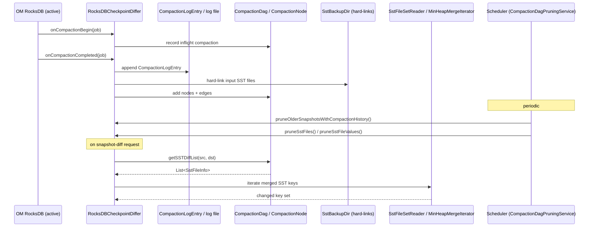

# RocksDB / checkpoint-differ

**Classes:** 15    **Kinds:** service:8, dto:4, interface:1, abstract:1, metrics:1

## Overview

The `checkpoint-differ` feature implements Ozone's snapshot-diff accelerator: instead of scanning full checkpoints, it tracks every RocksDB compaction event so that SST file sets between two snapshots can be determined by traversing a directed acyclic graph (DAG). `RocksDBCheckpointDiffer` registers an `AbstractEventListener` with the active OM RocksDB instance; on each compaction it appends a `CompactionLogEntry` to an append-only per-DB log file and hard-links input SST files into a backup directory. The `CompactionDag` and `CompactionNode` classes maintain the in-memory DAG during normal operation and reconstruct it from the persisted log on OM restart via `loadAllCompactionLogs()`. A background `Scheduler` (`CompactionDagPruningService`) periodically trims DAG nodes older than a configurable time window and, when the native library is loaded, prunes stale value data from backed-up SST files. The DAG traversal in `getSSTDiffList()` walks from a source snapshot's SST set to a destination set, collecting only the changed SST files rather than comparing full key spaces. `SstFileSetReader`/`MinHeapMergeIterator` then merge-read those SST files in sorted order for the actual key comparison phase.

## Diagram

## Class table

### Sub-feature: `compaction.log`

| reading_order | fqcn | kind | logic | loc | study (min) | role |
|--:|---|---|---|--:|--:|---|
| 904 | `org.apache.ozone.compaction.log.CompactionLogEntry` | service | mixed | 150~ | 45 | Compaction log entry Dao to write to the compaction log file. |
| 905 | `org.apache.ozone.compaction.log.CompactionFileInfo` | dto | data-only | 125~ | 10 | Dao to keep SST file information in the compaction log. |

### Sub-feature: `ozone.rocksdiff`

| reading_order | fqcn | kind | logic | loc | study (min) | role |
|--:|---|---|---|--:|--:|---|
| 906 | `org.apache.ozone.rocksdiff.RocksDBCheckpointDiffer` | service | logic-heavy | 950~ | 60 | RocksDB checkpoint differ. |
| 907 | `org.apache.ozone.rocksdiff.CompactionDag` | service | mixed | 75~ | 30 | Wrapper class storing DAGs of SST files for tracking compactions. |
| 908 | `org.apache.ozone.rocksdiff.CompactionNode` | service | mixed | 50~ | 30 | Node in the compaction DAG that represents an SST file. |
| 909 | `org.apache.ozone.rocksdiff.RocksDiffUtils` | service | mixed | 50~ | 30 | Helper methods for snap-diff operations. |
| 910 | `org.apache.ozone.rocksdiff.DifferSnapshotInfo` | dto | data-only | 50~ | 10 | Snapshot information node class for the differ. |
| 911 | `org.apache.ozone.rocksdiff.SSTFilePruningMetrics` | metrics | mixed | 75~ | 20 | Class contains metrics for monitoring SST file pruning operations in RocksDBCheckpointDiffer. |

### Sub-feature: `rocksdb.util`

| reading_order | fqcn | kind | logic | loc | study (min) | role |
|--:|---|---|---|--:|--:|---|
| 912 | `org.apache.ozone.rocksdb.util.RdbUtil` | service | mixed | 25~ | 30 | Temporary class to test snapshot diff functionality. |
| 913 | `org.apache.ozone.rocksdb.util.SstFileInfo` | dto | data-only | 50~ | 10 | Dao to keep SST file information in the compaction log. |

### Sub-feature: `utils.db`

| reading_order | fqcn | kind | logic | loc | study (min) | role |
|--:|---|---|---|--:|--:|---|
| 914 | `org.apache.hadoop.hdds.utils.db.ManagedSstFileIterator` | abstract | mixed | 50~ | 20 | ManagedSstFileIterator is an abstract class designed to provide a managed, resource-safe iteration over SST (Sorted S... |
| 915 | `org.apache.hadoop.hdds.utils.db.MinHeapMergeIterator` | abstract | mixed | 125~ | 30 | An abstract class that provides functionality to merge elements from multiple sorted iterators using a min-heap. |
| 916 | `org.apache.hadoop.hdds.utils.db.SstFileSetReader` | service | mixed | 150~ | 45 | Provides an abstraction layer using which we can iterate over multiple underlying SST files transparently. |
| 917 | `org.apache.hadoop.hdds.utils.db.RDBSstFileWriter` | service | mixed | 100~ | 30 | DumpFileWriter using rocksdb sst files. |
| 918 | `org.apache.hadoop.hdds.utils.db.TablePrefixInfo` | dto | data-only | 25~ | 10 | Encapsulates a store's prefix info corresponding to tables in a db. |

## Anchor details

### `RocksDBCheckpointDiffer`

- **path:** `hadoop-hdds/rocksdb-checkpoint-differ/src/main/java/org/apache/ozone/rocksdiff/RocksDBCheckpointDiffer.java`
- **loc:** 950~    **difficulty:** 5    **study:** 60 min    **concurrency:** thread-safe    **persistence:** RocksDB
- **entry points:** `close`
- **key collaborators:** `org.apache.hadoop.hdds.utils.db.RDBSstFileWriter`, `org.apache.hadoop.hdds.utils.db.TablePrefixInfo`, `org.apache.hadoop.hdds.StringUtils`, `org.apache.hadoop.hdds.conf.ConfigurationSource`, `org.apache.hadoop.hdds.utils.IOUtils`, `org.apache.hadoop.hdds.utils.NativeLibraryNotLoadedException`
- **test exemplar:** `hadoop-hdds/rocksdb-checkpoint-differ/src/test/java/org/apache/ozone/rocksdiff/TestRocksDBCheckpointDiffer.java`
- **role:** RocksDB checkpoint differ.

The class installs an `AbstractEventListener` directly into `ManagedDBOptions` via `setRocksDBForCompactionTracking()`; this must be called before the DB is opened, not after. The `getSSTDiffList()` method is `synchronized` and returns `Optional.empty()` when the DAG cannot produce a valid path (e.g., compaction history was pruned away), forcing callers to fall back to a full diff. The constant `COLUMN_FAMILIES_TO_TRACK_IN_DAG` (keyTable, directoryTable, fileTable) gates which column families produce compaction log entries — SST files from other CFs are silently ignored, meaning a diff request that spans non-tracked CFs will always see an empty DAG result. The background `pruneSstFileValues()` task (enabled only when the native library loads successfully) strips OMKeyInfo values from backed-up SST files to reclaim disk space while preserving keys for future diff traversals.

## Design docs

- `hadoop-hdds/docs/content/design/efficient-snapdiff.md` — draft design for the optimized snapshot diff path that uses sequential SST reads and the compaction DAG (HDDS-9154).
- `hadoop-hdds/docs/content/feature/Snapshot.md` — user-facing feature page for Ozone Snapshot, which this feature underpins.
- `hadoop-hdds/docs/content/concept/RocksDB.md` — concept overview of how RocksDB is used across Ozone services.

## Seminal JIRAs / PRs

- HDDS-13005. Add metrics for monitoring the SST file pruning threads.
- HDDS-13612. Track SST file ranges in sst file metadata.
- HDDS-13930. Snapshot diff can use rocksdb iterator instead of using multiple gets.
- HDDS-14053. Extract generic MinHeapMergeIterator from SstFileSetReader.
- HDDS-14330. MinHeapMergeIterator should use key comparator while popping out entries from the heap.
- HDDS-14225. Upgrade RocksDB from 7.7.3 to 10.10.1.
- HDDS-15788. Fix SST filtering BOOTSTRAP_LOCK contention introduced by RocksDB 10 upgrade.

## Sharp edges

- `getSSTDiffList()` returns `Optional.empty()` silently when the DAG path is missing (nodes pruned or history not yet loaded); callers must treat that as a signal to fall back to full diff, not as "no changes." (`RocksDBCheckpointDiffer.java`, `getSSTDiffList` method; HDDS-13929 introduced the optional return.)
- `setRocksDBForCompactionTracking()` must be called before `RocksDB.open()`; calling it after the DB is open means the listener is never registered and no compaction events are captured, producing a permanently empty DAG with no error. (`RocksDBCheckpointDiffer.java` lines 357-366.)
- HDDS-14330: prior to the fix, `MinHeapMergeIterator` used identity ordering instead of the RocksDB key comparator when breaking ties in the heap, causing non-deterministic merge order on keys that sort differently under the DB comparator versus natural byte order.

## Related features

- `components/rocksdb/rocks-native.md` — provides `LatestVersionedKWayMergeIterator` and `ManagedRawSSTFileReader` used during the SST file value-pruning pass.
- `components/rocksdb/managed-rocksdb.md` — `ManagedRocksDB` and `ManagedDBOptions` are the objects that `RocksDBCheckpointDiffer` attaches its compaction listener to.
- `components/OzoneManager/snapshot.md` — OM snapshot lifecycle that invokes `getSSTDiffListWithFullPath()` and manages `DifferSnapshotInfo` inputs.
- `components/OzoneManager/snapshot-diff.md` — the higher-level snap-diff worker that consumes the SST list produced by this feature.

## Self-quiz

1. Which constant in `RocksDBCheckpointDiffer` controls which column families generate compaction log entries, and what are its values? Why does the choice matter for snapshot diff correctness?
2. `getSSTDiffList()` is `synchronized`. What does that prevent, and what does it *not* prevent with respect to concurrent snapshot-diff requests?
3. `RocksDBCheckpointDiffer` implements `BootstrapStateHandler`. What is the `BootstrapStateHandler.Lock` used for, and which JIRA introduced this dependency?
4. `CompactionLogEntry` is persisted both to a flat log file and to a RocksDB column family. What is the column family, and why are both stores kept?
5. Describe the two conditions under which `pruneSstFileValues()` is *not* scheduled at all, and where in the constructor these conditions are checked.

Answers

Answer 1: `COLUMN_FAMILIES_TO_TRACK_IN_DAG = ImmutableSet.of("keyTable", "directoryTable", "fileTable")`. Only SST files belonging to these CFs are recorded in the compaction log. SST files from other CFs (e.g., deletedTable) are ignored, so diff requests that compare keys in untracked CFs will always get an empty DAG result and must fall back to full diff.

Answer 2: The `synchronized` prevents two concurrent `getSSTDiffList()` calls from racing on shared DAG state (the `CompactionDag` graph and the file set maps). It does not prevent compaction callbacks (`onCompactionCompleted`) from racing with the diff — those are handled separately via `inflightCompactions` (a `ConcurrentHashMap`) and the `BootstrapStateHandler.Lock`.

Answer 3: The lock ensures that an OM bootstrap (snapshot installation) cannot run concurrently with active DAG queries or compaction tracking. HDDS-13962 introduced `DAGBasedLeveledResourceLock` to the bootstrap flow to acquire this lock.

Answer 4: The column family is `compactionLogTable` (set via `setCompactionLogTableCFHandle()`). The flat file provides crash-safe append semantics and is read during `loadAllCompactionLogs()` restart reconstruction; the RocksDB CF provides indexed lookup by snapshot sequence number for efficient range queries.

Answer 5: (a) `pruneCompactionDagDaemonRunIntervalInMs <= 0` — no `Scheduler` is created at all, so no tasks are scheduled; (b) `ManagedRawSSTFileReader.loadLibrary()` throws `NativeLibraryNotLoadedException` — `pruneQueue` stays `null`, and the `pruneSstFileValues` schedule block is guarded by `if (pruneQueue != null)`. Both checks are in the constructor body around lines 252-284.

