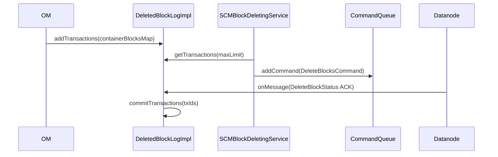

# SCM / block-manager

**Classes:** 11    **Kinds:** service:5, interface:4, data:1, metrics:1

## Overview

The block-manager feature handles block deletion across the cluster. When OM deletes a key it records `DeletedBlocksTransaction` entries via `DeletedBlockLog`; the persisted implementation is `DeletedBlockLogImpl`, which stores those transactions in a RocksDB table using `DeletedBlockLogStateManagerImpl`. `SCMBlockDeletingService` is a `BackgroundService` that periodically reads pending transactions, groups them by datanode, constructs `DeleteBlocksCommand` objects, and places them in the per-node `CommandQueue`. Datanodes ACK the commands via heartbeat; `DeletedBlockLogImpl` listens for `DeleteBlockStatus` events and removes acknowledged transactions. `SCMDeletedBlockTransactionStatusManager` tracks command-level ACK status to avoid re-sending commands that are already in-flight. `ScmBlockDeletingServiceMetrics` exposes per-datanode and per-transaction counters through Hadoop Metrics2.

## Diagram

## Class table

### Sub-feature: `scm.block`

| reading_order | fqcn | kind | logic | loc | study (min) | role |
|--:|---|---|---|--:|--:|---|
| 134 | `org.apache.hadoop.hdds.scm.block.BlockmanagerMXBean` | interface | mixed | 25~ | 20 | JMX interface for the block manager. |
| 135 | `org.apache.hadoop.hdds.scm.block.DeletedBlockLogStateManager` | interface | mixed | 25~ | 20 | DeletedBlockLogStateManager interface to manage deleted blocks and record them in the underlying persist store. |
| 136 | `org.apache.hadoop.hdds.scm.block.BlockManager` | interface | mixed | 25~ | 20 | Block APIs. |
| 137 | `org.apache.hadoop.hdds.scm.block.DeletedBlockLog` | interface | mixed | 25~ | 20 | The DeletedBlockLog is a persisted log in SCM to keep tracking container blocks which are under deletion. |
| 138 | `org.apache.hadoop.hdds.scm.block.DeletedBlockLogImpl` | service | logic-heavy | 350~ | 45 | An implement class of DeletedBlockLog, and it uses K/V db to maintain block deletion transactions between scm and dat... |
| 139 | `org.apache.hadoop.hdds.scm.block.SCMBlockDeletingService` | service | logic-heavy | 225~ | 45 | A background service running in SCM to delete blocks. |
| 140 | `org.apache.hadoop.hdds.scm.block.DeletedBlockLogStateManagerImpl` | service | mixed | 150~ | 45 | DeletedBlockLogStateManager implementation based on DeletedBlocksTransaction. |
| 141 | `org.apache.hadoop.hdds.scm.block.BlockManagerImpl` | service | mixed | 150~ | 45 | Block Manager manages the block access for SCM. |
| 142 | `org.apache.hadoop.hdds.scm.block.DatanodeDeletedBlockTransactions` | service | mixed | 50~ | 30 | A wrapper class to hold info about datanode and all deleted block transactions that will be sent to this datanode. |
| 143 | `org.apache.hadoop.hdds.scm.block.SCMDeletedBlockTransactionStatusManager` | service | logic-heavy | 600~ | 10 | This is a class to manage the status of DeletedBlockTransaction, the purpose of this class is to reduce the number of... |
| 144 | `org.apache.hadoop.hdds.scm.block.ScmBlockDeletingServiceMetrics` | metrics | logic-heavy | 300~ | 20 | Metrics related to Block Deleting Service running in SCM. |

## Anchor details

### `DeletedBlockLogImpl`

- **path:** `hadoop-hdds/server-scm/src/main/java/org/apache/hadoop/hdds/scm/block/DeletedBlockLogImpl.java`
- **loc:** 350~    **difficulty:** 4    **study:** 45 min    **concurrency:** single-threaded    **persistence:** in-memory
- **entry points:** `close`, `onMessage`
- **key collaborators:** `org.apache.hadoop.hdds.conf.ConfigurationSource`, `org.apache.hadoop.hdds.conf.StorageUnit`, `org.apache.hadoop.hdds.protocol.DatanodeDetails`, `org.apache.hadoop.hdds.protocol.DatanodeID`, `org.apache.hadoop.hdds.scm.ScmConfigKeys`, `org.apache.hadoop.hdds.scm.container.ContainerID`
- **role:** An implement class of DeletedBlockLog, and it uses K/V db to maintain block deletion transactions between scm...

The `onMessage` method handles `DeleteBlockStatus` ACKs from datanodes; it calls `SCMDeletedBlockTransactionStatusManager` to record per-command status and then removes fully-ACKed transactions from the persisted log. The class holds a `ReentrantLock` to serialize access to the in-memory scan position against concurrent ACK processing.

### `SCMBlockDeletingService`

- **path:** `hadoop-hdds/server-scm/src/main/java/org/apache/hadoop/hdds/scm/block/SCMBlockDeletingService.java`
- **loc:** 225~    **difficulty:** 4    **study:** 45 min    **concurrency:** single-threaded    **persistence:** in-memory
- **entry points:** `call`
- **key collaborators:** `org.apache.hadoop.hdds.HddsConfigKeys`, `org.apache.hadoop.hdds.conf.ConfigurationSource`, `org.apache.hadoop.hdds.conf.ReconfigurationHandler`, `org.apache.hadoop.hdds.protocol.DatanodeDetails`, `org.apache.hadoop.hdds.protocol.DatanodeID`, `org.apache.hadoop.hdds.scm.ScmConfig`
- **test exemplar:** `hadoop-hdds/server-scm/src/test/java/org/apache/hadoop/hdds/scm/block/TestSCMBlockDeletingService.java`
- **role:** A background service running in SCM to delete blocks.

The inner `call()` task queries only `HEALTHY` (not stale or dead) datanodes and respects `OZONE_SCM_BLOCK_DELETION_MAX_RETRY` to prevent re-queuing transactions that have been retried too many times. It checks `SCMContext.isLeader()` before enqueuing commands, so a follower SCM silently skips work each interval rather than throwing.

### `ScmBlockDeletingServiceMetrics`

- **path:** `hadoop-hdds/server-scm/src/main/java/org/apache/hadoop/hdds/scm/block/ScmBlockDeletingServiceMetrics.java`
- **loc:** 300~    **difficulty:** 2    **study:** 20 min    **concurrency:** thread-safe    **persistence:** in-memory
- **entry points:** `create`
- **key collaborators:** `org.apache.hadoop.hdds.protocol.DatanodeID`
- **role:** Metrics related to Block Deleting Service running in SCM.

Maintains both cluster-level counters (`deleteTxCreated`, `deleteTxCompleted`) and per-datanode gauges stored in a `ConcurrentHashMap<DatanodeID, MutableGaugeLong>`. The class comment documents the expected invariants: without resends, `deleteTxSent == deleteTxSuccess + deleteTxFailure` and `deleteTxCreated == deleteTxCompleted`.

## Design docs

- no dedicated design doc under hadoop-hdds/docs/content/ on this branch

## Seminal JIRAs / PRs

- HDDS-325. Add event watcher for delete blocks command.
- HDDS-5453. Add metrics in SCM block deleting service.
- HDDS-8882. Manage status of DeleteBlocksCommand in SCM to avoid sending duplicates to Datanode.
- HDDS-13178. Include block size in delete request and pass it to SCM.
- HDDS-13651. Remove delete transaction from memory in abnormal case.
- HDDS-14429. Avoid Duplicate Transaction Deletion and Replica-Level TxnSize Updates.
- HDDS-15634. Avoid updating container delete transaction ID on SCM delete log append.

## Sharp edges

- A `ReentrantLock` in `DeletedBlockLogImpl` serialises `getTransactions` and `onMessage` (ACK processing). If the ACK processing path blocks (e.g., RocksDB stall), the periodic scan is also blocked and delete throughput drops to zero without any timeout or error log. (HDDS-15665 describes a related race between `readOnlyIterator` and `onFlush`; `DeletedBlockLogImpl.java` ~L120-180.)
- `SCMBlockDeletingService` skips execution if `SCMContext.isLeader()` returns false, but the check is not atomic with the actual command enqueue. A leader transfer mid-interval can result in a small window where both the old and new leader enqueue the same transactions. `SCMDeletedBlockTransactionStatusManager` deduplicates by command ID but relies on the datanode eventually sending a final ACK; if the datanode never does (e.g., it is decommissioned), the transaction can stay in the log indefinitely until `OZONE_SCM_BLOCK_DELETION_MAX_RETRY` is exceeded.

## Related features

- `components/scm/container-manager.md` — containers are the unit of block grouping; deletion transactions reference container IDs
- `components/scm/scm-ha.md` — `DeletedBlockLogStateManagerImpl` uses `@Replicate` annotations so mutations are applied through Ratis
- `components/scm/node-manager.md` — `SCMBlockDeletingService` queries `NodeManager` for healthy datanodes before sending commands
- `components/scm/scm-server.md` — `SCMBlockProtocolServer` is the entry point for OM block allocation/deletion RPCs

## Self-quiz

1. `SCMBlockDeletingService.call()` is the primary periodic entry point. What condition makes it a no-op without logging an error, and where in the source is that check?
2. `DeletedBlockLogImpl` is listed as `single-threaded` in the atlas. Given that it holds a `ReentrantLock`, why is this correct? What does that lock actually protect?
3. `ScmBlockDeletingServiceMetrics` maintains per-datanode gauges. What Java type holds them, and what happens to a datanode's gauge entry if that datanode is removed from the cluster?
4. What invariant does the class-level comment in `ScmBlockDeletingServiceMetrics` document about `deleteTxSent` when there are no command resends?
5. Trace: OM calls `SCMBlockProtocolServer.deleteKeyBlocks()` → `BlockManagerImpl.deleteBlocks()` → `DeletedBlockLogImpl.addTransactions()`. Name the RocksDB column family where the transaction is persisted.

Answers

Answer 1: `SCMBlockDeletingService.call()` calls `scmContext.isLeader()` early and returns an empty result without doing any work if the local SCM is not the Ratis leader. This check is at approximately the top of the inner `BackgroundTask.call()` method.
Answer 2: The lock protects concurrent access between the scan thread (reading `getTransactions`) and the event-handler thread (writing ACKs via `onMessage`). Both run on different threads; the label `single-threaded` in the atlas refers to the scan task itself running on a single background thread pool, not to the overall class.
Answer 3: The gauges are stored in a `ConcurrentHashMap<DatanodeID, MutableGaugeLong>`. There is no automatic cleanup; a removed datanode's entry stays in the map and continues to report as zero until the SCM process restarts.
Answer 4: Without resends: `deleteTxSent == deleteTxSuccess + deleteTxFailure` and `deleteTxCreated == deleteTxCompleted`.
Answer 5: The transaction is written to the `deletedBlocksTable` column family in the SCM RocksDB store, as defined in `SCMDBDefinition`.

