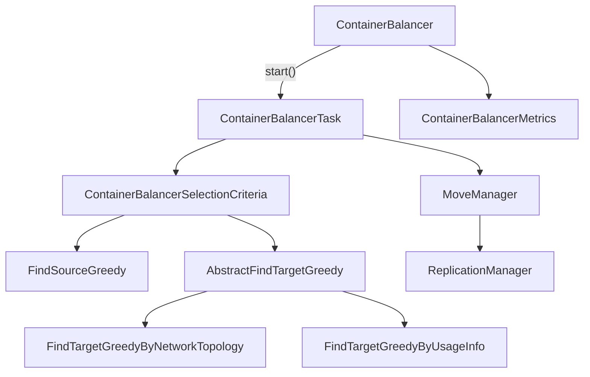

# SCM / container-balancer

**Classes:** 20    **Kinds:** service:7, dto:6, interface:2, exception:2, abstract:1, data:1, metrics:1

## Overview

Container balancer redistributes data across datanodes to correct utilization imbalances. `ContainerBalancer` extends `StatefulService` and persists its configuration to RocksDB so it survives leader failover. On `start()` it spawns a `ContainerBalancerTask` thread. Each balancing iteration, `ContainerBalancerTask` calls `NodeManager` to classify datanodes as over- or under-utilized against computed thresholds, then uses `ContainerBalancerSelectionCriteria` to pick containers to move and `FindSourceGreedy`/`AbstractFindTargetGreedy` implementations to select source and target nodes. Actual move execution is delegated to `MoveManager`, which submits replication and deletion commands and waits on a `CompletableFuture`. `ContainerBalancerMetrics` tracks bytes moved, containers moved, and iteration counts. The balancer respects exclude/include node lists and a per-iteration size cap.

## Diagram

## Class table

### Sub-feature: `container.balancer`

| reading_order | fqcn | kind | logic | loc | study (min) | role |
|--:|---|---|---|--:|--:|---|
| 945 | `org.apache.hadoop.hdds.scm.container.balancer.FindTargetStrategy` | interface | mixed | 25~ | 20 | This interface can be used to implement strategies to find a target for a source. |
| 946 | `org.apache.hadoop.hdds.scm.container.balancer.FindSourceStrategy` | interface | mixed | 25~ | 20 | This interface can be used to implement strategies to get a source datanode. |
| 947 | `org.apache.hadoop.hdds.scm.container.balancer.AbstractFindTargetGreedy` | abstract | mixed | 175~ | 45 | Find a target for a source datanode with greedy strategy. |
| 948 | `org.apache.hadoop.hdds.scm.container.balancer.ContainerBalancerTask` | service | logic-heavy | 900~ | 60 | Container balancer task performs move of containers between over- and under-utilized datanodes. |
| 949 | `org.apache.hadoop.hdds.scm.container.balancer.ContainerBalancer` | service | logic-heavy | 475~ | 60 | Container balancer is a service in SCM to move containers between over- and under-utilized datanodes. |
| 950 | `org.apache.hadoop.hdds.scm.container.balancer.MoveManager` | service | logic-heavy | 375~ | 45 | A class which schedules, tracks and completes moves scheduled by the balancer. |
| 951 | `org.apache.hadoop.hdds.scm.container.balancer.ContainerBalancerSelectionCriteria` | service | logic-heavy | 225~ | 45 | The selection criteria for selecting containers that will be moved and selecting datanodes that containers will move to. |
| 952 | `org.apache.hadoop.hdds.scm.container.balancer.FindSourceGreedy` | service | mixed | 125~ | 30 | The selection criteria for selecting source datanodes , the containers of which will be moved out. |
| 953 | `org.apache.hadoop.hdds.scm.container.balancer.FindTargetGreedyByNetworkTopology` | service | mixed | 50~ | 30 | an implementation of FindTargetGreedy, which will always select the target with the shortest distance according to ne... |
| 954 | `org.apache.hadoop.hdds.scm.container.balancer.ContainerMoveSelection` | service | mixed | 50~ | 30 | This class represents a target datanode and the container to be moved from a source to that target. |
| 955 | `org.apache.hadoop.hdds.scm.container.balancer.ContainerBalancerStatusInfo` | dto | data-only | 75~ | 10 | Info about balancer status. |
| 956 | `org.apache.hadoop.hdds.scm.container.balancer.ContainerBalancerTaskIterationStatusInfo` | dto | data-only | 75~ | 10 | Information about balancer task iteration. |
| 957 | `org.apache.hadoop.hdds.scm.container.balancer.FindTargetGreedyByUsageInfo` | dto | data-only | 25~ | 10 | an implementation of FindTargetGreedy, which will always select the target with the lowest space usage. |
| 958 | `org.apache.hadoop.hdds.scm.container.balancer.IterationInfo` | dto | data-only | 25~ | 10 | Information about the iteration. |
| 959 | `org.apache.hadoop.hdds.scm.container.balancer.ContainerMoveInfo` | dto | data-only | 25~ | 10 | Information about moving containers. |
| 960 | `org.apache.hadoop.hdds.scm.container.balancer.DataMoveInfo` | dto | data-only | 25~ | 10 | Information about the process of moving data. |
| 961 | `org.apache.hadoop.hdds.scm.container.balancer.ContainerBalancerStopReason` | data | data-only | 25~ | 10 | Stop reason codes and messages for ContainerBalancer. |
| 962 | `org.apache.hadoop.hdds.scm.container.balancer.ContainerBalancerMetrics` | metrics | logic-heavy | 200~ | 20 | Metrics related to Container Balancer running in SCM. |
| 963 | `org.apache.hadoop.hdds.scm.container.balancer.IllegalContainerBalancerStateException` | exception | data-only | 25~ | 10 | Signals that a state change cannot be performed on ContainerBalancer. |
| 964 | `org.apache.hadoop.hdds.scm.container.balancer.InvalidContainerBalancerConfigurationException` | exception | data-only | 25~ | 10 | Signals that ContainerBalancerConfiguration contains invalid configuration value(s). |

## Anchor details

### `ContainerBalancerTask`

- **path:** `hadoop-hdds/server-scm/src/main/java/org/apache/hadoop/hdds/scm/container/balancer/ContainerBalancerTask.java`
- **loc:** 900~    **difficulty:** 5    **study:** 60 min    **concurrency:** thread-safe    **persistence:** in-memory
- **entry points:** `run`
- **key collaborators:** `org.apache.hadoop.hdds.HddsConfigKeys`, `org.apache.hadoop.hdds.conf.OzoneConfiguration`, `org.apache.hadoop.hdds.protocol.DatanodeDetails`, `org.apache.hadoop.hdds.protocol.DatanodeID`, `org.apache.hadoop.hdds.scm.PlacementPolicyValidateProxy`, `org.apache.hadoop.hdds.scm.container.ContainerID`
- **test exemplar:** `hadoop-hdds/server-scm/src/test/java/org/apache/hadoop/hdds/scm/container/balancer/TestContainerBalancerTask.java`
- **role:** Container balancer task performs move of containers between over- and under-utilized datanodes.

The `run()` loop iterates up to `maxIterations` times. Within each iteration it accumulates `sizeScheduledForMoveInLatestIteration` and stops scheduling new moves once `maxSizeToMovePerIteration` is hit, but already-submitted `CompletableFuture` objects from `MoveManager` continue to completion. The `volatile Status taskStatus` flag is the cancellation mechanism: `ContainerBalancer.stop()` sets it to `STOPPING` and the loop exits cleanly on the next iteration boundary.

### `ContainerBalancer`

- **path:** `hadoop-hdds/server-scm/src/main/java/org/apache/hadoop/hdds/scm/container/balancer/ContainerBalancer.java`
- **loc:** 475~    **difficulty:** 5    **study:** 60 min    **concurrency:** single-threaded    **persistence:** in-memory
- **entry points:** `start`
- **key collaborators:** `org.apache.hadoop.hdds.conf.OzoneConfiguration`, `org.apache.hadoop.hdds.conf.StorageUnit`, `org.apache.hadoop.hdds.fs.DUFactory`, `org.apache.hadoop.hdds.protocol.DatanodeDetails`, `org.apache.hadoop.hdds.scm.ScmConfigKeys`, `org.apache.hadoop.hdds.scm.container.ContainerID`
- **test exemplar:** `hadoop-hdds/server-scm/src/test/java/org/apache/hadoop/hdds/scm/container/balancer/TestContainerBalancer.java`
- **role:** Container balancer is a service in SCM to move containers between over- and under-utilized datanodes.

`ContainerBalancer` extends `StatefulService<ContainerBalancerConfigurationProto>`, so its configuration proto is persisted to RocksDB and replicated via Ratis. On leader election the persisted config is re-read; if the balancer was running before a failover it must be explicitly restarted by an admin. The `ReentrantLock` inside `ContainerBalancer` serializes `start`/`stop` state transitions but does not protect the balancing thread itself.

### `MoveManager`

- **path:** `hadoop-hdds/server-scm/src/main/java/org/apache/hadoop/hdds/scm/container/balancer/MoveManager.java`
- **loc:** 375~    **difficulty:** 4    **study:** 45 min    **concurrency:** thread-safe    **persistence:** in-memory
- **key collaborators:** `org.apache.hadoop.hdds.protocol.DatanodeDetails`, `org.apache.hadoop.hdds.scm.container.ContainerID`, `org.apache.hadoop.hdds.scm.container.ContainerInfo`, `org.apache.hadoop.hdds.scm.container.ContainerManager`, `org.apache.hadoop.hdds.scm.container.ContainerNotFoundException`, `org.apache.hadoop.hdds.scm.container.ContainerReplica`
- **test exemplar:** `hadoop-hdds/server-scm/src/test/java/org/apache/hadoop/hdds/scm/container/balancer/TestMoveManager.java`
- **role:** A class which schedules, tracks and completes moves scheduled by the balancer.

`MoveManager` implements `ContainerReplicaPendingOpsSubscriber` and tracks in-flight moves in a `ConcurrentHashMap`. When a pending ADD op completes, it triggers the DELETE of the source replica; when the DELETE completes, the `CompletableFuture` returned to `ContainerBalancerTask` is resolved. This two-phase design means a move that loses its ADD confirmation (e.g., due to SCM restart) leaves the container temporarily over-replicated until `ReplicationManager` cleans it up.

### `ContainerBalancerSelectionCriteria`

- **path:** `hadoop-hdds/server-scm/src/main/java/org/apache/hadoop/hdds/scm/container/balancer/ContainerBalancerSelectionCriteria.java`
- **loc:** 225~    **difficulty:** 4    **study:** 45 min    **concurrency:** single-threaded    **persistence:** in-memory
- **key collaborators:** `org.apache.hadoop.hdds.protocol.DatanodeDetails`, `org.apache.hadoop.hdds.scm.container.ContainerID`, `org.apache.hadoop.hdds.scm.container.ContainerInfo`, `org.apache.hadoop.hdds.scm.container.ContainerManager`, `org.apache.hadoop.hdds.scm.container.ContainerNotFoundException`, `org.apache.hadoop.hdds.scm.container.ContainerReplica`
- **test exemplar:** `hadoop-hdds/server-scm/src/test/java/org/apache/hadoop/hdds/scm/container/balancer/TestContainerBalancerSelectionCriteria.java`
- **role:** The selection criteria for selecting containers that will be moved and selecting datanodes that containers will move to.

Applies include/exclude container and datanode filters. The `getContainerSelectingIterator()` method returns a `NavigableSet` sorted by container size to allow greedy iteration. Containers already in the `selectedContainers` set (already scheduled in this iteration) are skipped to avoid double-counting their size.

### `ContainerBalancerMetrics`

- **path:** `hadoop-hdds/server-scm/src/main/java/org/apache/hadoop/hdds/scm/container/balancer/ContainerBalancerMetrics.java`
- **loc:** 200~    **difficulty:** 2    **study:** 20 min    **concurrency:** single-threaded    **persistence:** in-memory
- **entry points:** `create`
- **role:** Metrics related to Container Balancer running in SCM.

Tracks per-iteration and cumulative counters: `numContainerMovesCompleted`, `numContainerMovesFailed`, `dataSizeMovedGB`. All fields are `MutableCounterLong` or `MutableGaugeLong`; no per-datanode breakdown is stored here (that would need to be added separately).

## Design docs

- `hadoop-hdds/docs/content/feature/ContainerBalancer.md` — user-facing overview of the feature, including configuration keys and the utilization threshold model

## Seminal JIRAs / PRs

- HDDS-13002. Use DatanodeID in ContainerBalancerTask.
- HDDS-13068. Validate Container Balancer move timeout and replication timeout configs.
- HDDS-14618. Support including only specified containers in Container Balancer.
- HDDS-14850. Implement StatefulService without reflection.
- HDDS-14870. Allow balancing of over replicated and quasi closed containers.
- HDDS-15535. Container Balancer should validate configuration and report startup failures to user.
- HDDS-15656. Fix non-atomic data size accumulation in ContainerBalancer move callback.

## Sharp edges

- `ContainerBalancer` persists its configuration via `StatefulService` to RocksDB and that config survives Ratis leader failover, but the balancer thread itself does not auto-restart after a leader change. An admin must re-issue the start command. (HDDS-14850; `ContainerBalancer.java` `notifyStatusChanged` method.)
- `MoveManager` tracks moves in a `ConcurrentHashMap` keyed by `ContainerID`. If SCM restarts mid-move the map is lost. The container is left temporarily over-replicated; `ReplicationManager` will eventually schedule the excess deletion, but this can delay visible cluster balance for one RM scan cycle.

## Related features

- `components/scm/container-replication.md` — `MoveManager` delegates replication/deletion commands through `ReplicationManager`
- `components/scm/container-manager.md` — `ContainerManagerImpl` is queried to look up container replicas during selection
- `components/scm/node-manager.md` — `NodeManager` supplies per-datanode usage info to classify over/under-utilized nodes
- `components/scm/scm-ha.md` — `ContainerBalancer` extends `StatefulService`; config is replicated via `SCMStateMachine`

## Self-quiz

1. `ContainerBalancer.start()` is protected by a `ReentrantLock`. What does that lock actually guard against, and what happens if `start()` is called while a balancing iteration is already running?
2. `ContainerBalancerTask` tracks `sizeScheduledForMoveInLatestIteration`. When does a move contribute to this counter — when it is scheduled or when it completes?
3. `MoveManager` implements `ContainerReplicaPendingOpsSubscriber`. What event causes it to trigger the second phase (delete of source replica)?
4. `ContainerBalancerSelectionCriteria.getContainerSelectingIterator()` returns a `NavigableSet`. What ordering is used, and why does that ordering matter for the balancer's efficiency?
5. `ContainerBalancer` extends `StatefulService<ContainerBalancerConfigurationProto>`. Name the RocksDB column family and key under which its configuration proto is persisted.

Answers

Answer 1: The lock prevents concurrent `start()`/`stop()` calls from creating multiple balancing threads. If `start()` is called while a task is already running, it throws `IllegalContainerBalancerStateException` rather than spawning a second thread.
Answer 2: A move contributes to `sizeScheduledForMoveInLatestIteration` when it is scheduled (added to `MoveManager`), not when it completes. This is intentional: the cap is on bytes dispatched per iteration to limit outstanding work, not on bytes confirmed moved.
Answer 3: `MoveManager` receives a `ContainerReplicaOp` completion event for the ADD operation via `onUpdate()`. When the ADD is confirmed it submits the DELETE command for the source replica.
Answer 4: The set is ordered by container size descending. Larger containers are moved first, which achieves balance faster with fewer moves when data sizes vary widely.
Answer 5: The configuration is stored in the `statefulServiceTable` column family under the key `ContainerBalancer` (the `SERVICE_NAME` constant). This table is defined in `SCMDBDefinition`.

