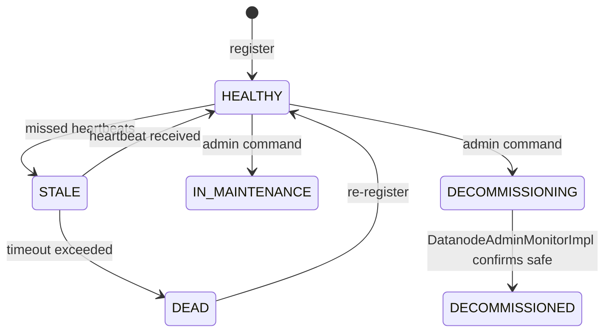

# SCM / node-manager

**Classes:** 34    **Kinds:** service:19, exception:5, interface:4, data:2, dto:2, metrics:2

## Overview

Node-manager tracks the health and operational state of every datanode in the cluster. `SCMNodeManager` is the primary implementation: it handles datanode registration, heartbeat processing, storage report updates, and command dispatch. Under the hood `NodeStateManager` runs a timer loop that drives state transitions (HEALTHY, STALE, DEAD) based on heartbeat expiry. Both classes share `NodeStateMap`, a thread-safe map from `DatanodeID` to `DatanodeEntry` (wrapping `DatanodeInfo` and the node's container set). `NodeDecommissionManager` implements decommission and maintenance workflows: it validates host strings, updates `NodeOperationalState`, and delegates monitoring to `DatanodeAdminMonitorImpl`, which polls container health via `ReplicationManager` to determine when a node is safe to decommission. `PendingContainerTracker` uses a two-window tumbling bucket to count pending container allocations per node so that placement policies can avoid overloading a node with simultaneous allocations.

## Diagram

## Class table

### Sub-feature: `node.states`

| reading_order | fqcn | kind | logic | loc | study (min) | role |
|--:|---|---|---|--:|--:|---|
| 698 | `org.apache.hadoop.hdds.scm.node.states.NodeStateMap` | service | logic-heavy | 225~ | 45 | Map: DatanodeID to DatanodeEntry. |
| 699 | `org.apache.hadoop.hdds.scm.node.states.DatanodeEntry` | service | mixed | 25~ | 30 | The entry (DatanodeInfo and ContainerIDs) for a datanode in NodeStateMap. |
| 700 | `org.apache.hadoop.hdds.scm.node.states.Node2PipelineMap` | service | mixed | 25~ | 30 | This data structure maintains the list of pipelines which the given datanode is a part of. |
| 701 | `org.apache.hadoop.hdds.scm.node.states.ReportResult` | service | mixed | 50~ | 10 | A Container/Pipeline Report gets processed by the Node2Container/Node2Pipeline and returns Report Result class. |
| 702 | `org.apache.hadoop.hdds.scm.node.states.NodeNotFoundException` | exception | data-only | 25~ | 10 | This exception represents that the node that is being accessed does not exist in NodeStateMap. |
| 703 | `org.apache.hadoop.hdds.scm.node.states.NodeException` | exception | data-only | 25~ | 10 | This exception represents all node related exceptions in NodeStateMap. |
| 704 | `org.apache.hadoop.hdds.scm.node.states.NodeAlreadyExistsException` | exception | data-only | 25~ | 10 | This exception represents that there is already a node added to NodeStateMap with same UUID. |

### Sub-feature: `scm.node`

| reading_order | fqcn | kind | logic | loc | study (min) | role |
|--:|---|---|---|--:|--:|---|
| 705 | `org.apache.hadoop.hdds.scm.node.NodeManager` | interface | mixed | 75~ | 20 | A node manager supports a simple interface for managing a datanode. |
| 706 | `org.apache.hadoop.hdds.scm.node.DatanodeAdminMonitor` | interface | mixed | 25~ | 20 | Interface used by the DatanodeAdminMonitor, which can be used to decommission or recommission nodes and take them in... |
| 707 | `org.apache.hadoop.hdds.scm.node.SCMNodeStorageStatMXBean` | interface | mixed | 25~ | 20 | This is the JMX management interface for node manager information. |
| 708 | `org.apache.hadoop.hdds.scm.node.NodeManagerMXBean` | interface | mixed | 25~ | 20 | This is the JMX management interface for node manager information. |
| 709 | `org.apache.hadoop.hdds.scm.node.SCMNodeManager` | service | logic-heavy | 1400~ | 60 | Maintains information about the Datanodes on SCM side. |
| 710 | `org.apache.hadoop.hdds.scm.node.NodeDecommissionManager` | service | logic-heavy | 475~ | 60 | Class used to manage datanodes scheduled for maintenance or decommission. |
| 711 | `org.apache.hadoop.hdds.scm.node.NodeStateManager` | service | logic-heavy | 450~ | 60 | NodeStateManager maintains the state of all the datanodes in the cluster. |
| 712 | `org.apache.hadoop.hdds.scm.node.DatanodeAdminMonitorImpl` | service | logic-heavy | 375~ | 45 | Monitor thread which watches for nodes to be decommissioned, recommissioned or placed into maintenance. |
| 713 | `org.apache.hadoop.hdds.scm.node.NodeStatus` | service | mixed | 150~ | 45 | The status of a datanode including NodeState, NodeOperationalState and the expiry time for the operational state, whe... |
| 714 | `org.apache.hadoop.hdds.scm.node.PendingContainerTracker` | service | mixed | 150~ | 45 | Tracks per-datanode pending container allocations at SCM using a Two Window Tumbling Bucket pattern (similar to HDFS... |
| 715 | `org.apache.hadoop.hdds.scm.node.DeadNodeHandler` | service | mixed | 125~ | 30 | Handles Dead Node event. |
| 716 | `org.apache.hadoop.hdds.scm.node.CommandQueue` | service | mixed | 75~ | 30 | Command Queue is queue of commands for the datanode. |
| 717 | `org.apache.hadoop.hdds.scm.node.StorageReportResult` | service | mixed | 50~ | 30 | A Container Report gets processsed by the Node2Container and returns the Report Result class. |
| 718 | `org.apache.hadoop.hdds.scm.node.HealthyReadOnlyNodeHandler` | service | mixed | 50~ | 30 | Handles non healthy to healthy(ReadOnly) node event. |
| 719 | `org.apache.hadoop.hdds.scm.node.StartDatanodeAdminHandler` | service | mixed | 25~ | 30 | Handler which is fired when a datanode starts admin (decommission or maintenance). |
| 720 | `org.apache.hadoop.hdds.scm.node.StaleNodeHandler` | service | mixed | 25~ | 30 | Handles Stale node event. |
| 721 | `org.apache.hadoop.hdds.scm.node.ReadOnlyHealthyToHealthyNodeHandler` | service | mixed | 25~ | 30 | Handles Read Only healthy to healthy node event. |
| 722 | `org.apache.hadoop.hdds.scm.node.NewNodeHandler` | service | mixed | 25~ | 30 | Handles New Node event. |
| 723 | `org.apache.hadoop.hdds.scm.node.NodeReportHandler` | service | mixed | 25~ | 30 | Handles Node Reports from datanode. |
| 724 | `org.apache.hadoop.hdds.scm.node.NodeAddressUpdateHandler` | service | mixed | 25~ | 30 | Handles datanode ip or hostname change event. |
| 725 | `org.apache.hadoop.hdds.scm.node.SCMNodeStorageStatMap` | service | logic-heavy | 225~ | 10 | This data structure maintains the disk space capacity, disk usage and free space availability per Datanode. |
| 726 | `org.apache.hadoop.hdds.scm.node.DatanodeInfo` | dto | logic-heavy | 200~ | 10 | This class extends the primary identifier of a Datanode with ephemeral state, eg last reported time, usage informatio... |
| 727 | `org.apache.hadoop.hdds.scm.node.DatanodeUsageInfo` | dto | data-only | 125~ | 10 | Bundles datanode details with usage statistics. |
| 728 | `org.apache.hadoop.hdds.scm.node.NodeDecommissionMetrics` | metrics | logic-heavy | 200~ | 20 | Class contains metrics related to the NodeDecommissionManager. |
| 729 | `org.apache.hadoop.hdds.scm.node.SCMNodeMetrics` | metrics | mixed | 150~ | 20 | This class maintains Node related metrics. |
| 730 | `org.apache.hadoop.hdds.scm.node.InvalidHostStringException` | exception | data-only | 25~ | 10 | Exception thrown by the NodeDecommissionManager when it encounters host strings it does not expect or understand. |
| 731 | `org.apache.hadoop.hdds.scm.node.InvalidNodeStateException` | exception | data-only | 25~ | 10 | Exception thrown by the NodeDecommissionManager when it encounters host strings it does not expect or understand. |

## Anchor details

### `SCMNodeManager`

- **path:** `hadoop-hdds/server-scm/src/main/java/org/apache/hadoop/hdds/scm/node/SCMNodeManager.java`
- **loc:** 1400~    **difficulty:** 5    **study:** 60 min    **concurrency:** thread-safe    **persistence:** in-memory
- **entry points:** `close`, `onMessage`
- **key collaborators:** `org.apache.hadoop.hdds.scm.node.states.NodeAlreadyExistsException`, `org.apache.hadoop.hdds.scm.node.states.NodeNotFoundException`, `org.apache.hadoop.hdds.HddsConfigKeys`, `org.apache.hadoop.hdds.conf.ConfigurationSource`, `org.apache.hadoop.hdds.conf.OzoneConfiguration`, `org.apache.hadoop.hdds.conf.StorageUnit`
- **test exemplar:** `hadoop-hdds/server-scm/src/test/java/org/apache/hadoop/hdds/scm/node/TestSCMNodeManager.java`
- **role:** Maintains information about the Datanodes on SCM side.

### `NodeDecommissionManager`

- **path:** `hadoop-hdds/server-scm/src/main/java/org/apache/hadoop/hdds/scm/node/NodeDecommissionManager.java`
- **loc:** 475~    **difficulty:** 5    **study:** 60 min    **concurrency:** thread-safe    **persistence:** in-memory
- **key collaborators:** `org.apache.hadoop.hdds.scm.node.states.NodeNotFoundException`, `org.apache.hadoop.hdds.HddsConfigKeys`, `org.apache.hadoop.hdds.client.ECReplicationConfig`, `org.apache.hadoop.hdds.conf.OzoneConfiguration`, `org.apache.hadoop.hdds.protocol.DatanodeDetails`, `org.apache.hadoop.hdds.scm.DatanodeAdminError`
- **test exemplar:** `hadoop-hdds/server-scm/src/test/java/org/apache/hadoop/hdds/scm/node/TestNodeDecommissionManager.java`
- **role:** Class used to manage datanodes scheduled for maintenance or decommission.

### `NodeStateManager`

- **path:** `hadoop-hdds/server-scm/src/main/java/org/apache/hadoop/hdds/scm/node/NodeStateManager.java`
- **loc:** 450~    **difficulty:** 5    **study:** 60 min    **concurrency:** actor/queue    **persistence:** in-memory
- **entry points:** `run`, `close`
- **key collaborators:** `org.apache.hadoop.hdds.scm.node.states.Node2PipelineMap`, `org.apache.hadoop.hdds.scm.node.states.NodeAlreadyExistsException`, `org.apache.hadoop.hdds.scm.node.states.NodeNotFoundException`, `org.apache.hadoop.hdds.scm.node.states.NodeStateMap`, `org.apache.hadoop.hdds.conf.ConfigurationSource`, `org.apache.hadoop.hdds.protocol.DatanodeDetails`
- **test exemplar:** `hadoop-hdds/server-scm/src/test/java/org/apache/hadoop/hdds/scm/node/TestNodeStateManager.java`
- **role:** NodeStateManager maintains the state of all the datanodes in the cluster.

### `DatanodeAdminMonitorImpl`

- **path:** `hadoop-hdds/server-scm/src/main/java/org/apache/hadoop/hdds/scm/node/DatanodeAdminMonitorImpl.java`
- **loc:** 375~    **difficulty:** 4    **study:** 45 min    **concurrency:** thread-safe    **persistence:** in-memory
- **entry points:** `run`
- **key collaborators:** `org.apache.hadoop.hdds.scm.node.states.NodeNotFoundException`, `org.apache.hadoop.hdds.conf.OzoneConfiguration`, `org.apache.hadoop.hdds.protocol.DatanodeDetails`, `org.apache.hadoop.hdds.scm.ScmConfigKeys`, `org.apache.hadoop.hdds.scm.container.ContainerHealthState`, `org.apache.hadoop.hdds.scm.container.ContainerID`
- **role:** Monitor thread which watches for nodes to be decommissioned, recommissioned or placed into maintenance.

### `NodeStateMap`

- **path:** `hadoop-hdds/server-scm/src/main/java/org/apache/hadoop/hdds/scm/node/states/NodeStateMap.java`
- **loc:** 225~    **difficulty:** 4    **study:** 45 min    **concurrency:** thread-safe    **persistence:** in-memory
- **key collaborators:** `org.apache.hadoop.hdds.scm.node.DatanodeInfo`, `org.apache.hadoop.hdds.scm.node.NodeStatus`, `org.apache.hadoop.hdds.protocol.DatanodeDetails`, `org.apache.hadoop.hdds.protocol.DatanodeID`, `org.apache.hadoop.hdds.scm.container.ContainerID`
- **test exemplar:** `hadoop-hdds/server-scm/src/test/java/org/apache/hadoop/hdds/scm/node/states/TestNodeStateMap.java`
- **role:** Map: DatanodeID to DatanodeEntry.

### `NodeDecommissionMetrics`

- **path:** `hadoop-hdds/server-scm/src/main/java/org/apache/hadoop/hdds/scm/node/NodeDecommissionMetrics.java`
- **loc:** 200~    **difficulty:** 2    **study:** 20 min    **concurrency:** single-threaded    **persistence:** in-memory
- **entry points:** `create`
- **key collaborators:** `org.apache.hadoop.ozone.OzoneConsts`
- **test exemplar:** `hadoop-hdds/server-scm/src/test/java/org/apache/hadoop/hdds/scm/node/TestNodeDecommissionMetrics.java`
- **role:** Class contains metrics related to the NodeDecommissionManager.

## Design docs

- `hadoop-hdds/docs/content/design/decommissioning.md` — design for node decommission and maintenance workflows implemented by `NodeDecommissionManager` and `DatanodeAdminMonitorImpl`
- `hadoop-hdds/docs/content/feature/Decommission.zh.md` — user-facing doc for decommission/maintenance feature

## Seminal JIRAs / PRs

- HDDS-14834. Fix race condition between DeadNodeHandler and HealthyReadOnlyNodeHandler on NetworkTopology.
- HDDS-14921. Improve space accounting in SCM with In-Flight container allocation tracking.
- HDDS-14924. Account replication in PendingContainerTracker for space usage.
- HDDS-15024. Track pending containers in SCM to prevent Datanode over-allocation.
- HDDS-15104. Refactor code related to container space management.
- HDDS-15146. Remove getDatanodeInfo(DatanodeDetails) from NodeManager.
- HDDS-15541. PlacementPolicy to use PendingContainerTracker to check space availability.

## Sharp edges

- `NodeStateManager` uses a scheduled timer to detect stale/dead nodes. The timer fires at a fixed interval (`hdds.heartbeat.interval`); if a burst of heartbeats causes GC pauses longer than the stale timeout, healthy nodes may be incorrectly marked STALE and then DEAD. This is an ops concern, not a code bug, but the transition is not always observable until pipelines start closing. (`NodeStateManager.java` `run()` method and expiry logic.)
- `DatanodeAdminMonitorImpl.run()` checks that all containers on a decommissioning node are sufficiently replicated before marking the node `DECOMMISSIONED`. If `ReplicationManager` is not the Ratis leader (e.g., during a leader transition), the check always sees containers as under-replicated and the node is never decommissioned. The admin monitor does not distinguish between a genuine under-replication and an RM outage. (HDDS-13544 area.)

## Related features

- `components/scm/container-replication.md` — `DatanodeAdminMonitorImpl` queries `ReplicationManager` to check container health during decommission
- `components/scm/pipeline-manager.md` — `SCMNodeManager` notifies `PipelineManager` when a node's state changes
- `components/scm/safemode.md` — `SCMSafeModeManager` checks node count via `NodeManager` to evaluate `DataNodeSafeModeRule`
- `components/scm/scm-server.md` — `SCMDatanodeProtocolServer` calls `SCMNodeManager.register()` and `processHeartbeat()`

## Self-quiz

1. `SCMNodeManager.onMessage()` is an `EventHandler<NodeReport>`. What does it do when it receives a storage report for a node it does not recognize?
2. `NodeStateManager.run()` drives state transitions. What is the distinction between the STALE and DEAD states, and which handler fires for each?
3. `NodeDecommissionManager` validates host strings with `getNodeDetails()`. What exception is thrown for malformed or unresolvable hostnames, and how does the admin API surface that error?
4. `PendingContainerTracker` uses a two-window tumbling bucket. Why two windows rather than one, and what problem does the second window solve?
5. `NodeStateMap` uses `DatanodeID` as the key. What replaces the old UUID-based key, and what does the HDDS-15146 series of commits say about this change?

Answers

Answer 1: `SCMNodeManager.onMessage()` for an unrecognized node fires a `REREGISTER` command back to the datanode via the `CommandQueue`. The datanode then re-registers with a full `SCMRegisteredResponseProto`.
Answer 2: STALE means the node has missed enough heartbeats to be considered suspect but is not yet removed from pipelines; `StaleNodeHandler` fires and logs a warning. DEAD means the timeout for recovery has passed; `DeadNodeHandler` fires, closes pipelines involving the node, and notifies `ReplicationManager`.
Answer 3: `InvalidHostStringException` is thrown for unresolvable hostnames. The admin API (`SCMClientProtocolServer.decommissionNodes()`) collects per-host errors into a `DatanodeAdminError` list and returns them all to the caller rather than aborting on the first failure.
Answer 4: One window alone has a race at the window boundary: a container allocated just before the window rolls is counted in the old window but its disk usage materialises in the new one, causing a brief under-count. The second (overlap) window ensures in-flight allocations are visible across the boundary.
Answer 5: HDDS-15146 removes the `getDatanodeInfo(DatanodeDetails)` overload that looked up by UUID. The `DatanodeID` key (UUID + hostname + port) is used directly to avoid ambiguity when a datanode re-registers with the same UUID but a new IP.

