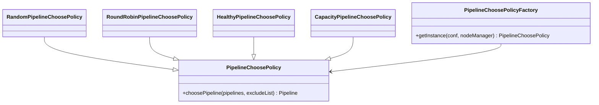

# SCM / pipeline-choose-policy

**Classes:** 5    **Kinds:** service:4, factory:1

## Overview

Pipeline-choose-policy controls which of the available open pipelines is selected when a client requests a writable container. `PipelineChoosePolicyFactory` reads the configuration key `ozone.scm.pipeline.choose.policy.impl` and instantiates one of four strategies: `RandomPipelineChoosePolicy` picks uniformly at random; `RoundRobinPipelineChoosePolicy` cycles through the list sequentially; `HealthyPipelineChoosePolicy` skips pipelines with unhealthy nodes; and `CapacityPipelineChoosePolicy` biases selection toward pipelines whose member datanodes have relatively more free space. All four implement the `PipelineChoosePolicy` interface. The chosen pipeline is then passed to `WritableRatisContainerProvider` or `WritableECContainerProvider` to obtain a writable container. The feature is entirely stateless: each `choosePolicy(pipelines, excludeList)` call operates on the snapshot of pipelines passed in.

## Diagram

## Class table

### Sub-feature: `choose.algorithms`

| reading_order | fqcn | kind | logic | loc | study (min) | role |
|--:|---|---|---|--:|--:|---|
| 568 | `org.apache.hadoop.hdds.scm.pipeline.choose.algorithms.CapacityPipelineChoosePolicy` | service | mixed | 75~ | 30 | Pipeline choose policy that randomly choose pipeline with relatively lower utilization. |
| 569 | `org.apache.hadoop.hdds.scm.pipeline.choose.algorithms.HealthyPipelineChoosePolicy` | service | mixed | 25~ | 30 | The healthy pipeline choose policy that chooses pipeline until return healthy pipeline. |
| 570 | `org.apache.hadoop.hdds.scm.pipeline.choose.algorithms.RoundRobinPipelineChoosePolicy` | service | mixed | 25~ | 30 | Round-robin choose policy that chooses pipeline in a round-robin fashion. |
| 571 | `org.apache.hadoop.hdds.scm.pipeline.choose.algorithms.RandomPipelineChoosePolicy` | service | mixed | 25~ | 30 | Random choose policy that randomly chooses pipeline. |
| 572 | `org.apache.hadoop.hdds.scm.pipeline.choose.algorithms.PipelineChoosePolicyFactory` | factory | mixed | 75~ | 20 | A factory to create pipeline choose policy instance based on configuration property ScmConfig. |

## Anchor details

_No logic-heavy anchors in this feature; the classes are primarily data / dto / config / cli._

## Design docs

- no dedicated design doc under hadoop-hdds/docs/content/ on this branch

## Seminal JIRAs / PRs

- TODO(verify) — the git log for this package has no HDDS commits recorded in the present history window beyond general cleanups; the policies were introduced as part of broader pipeline management work.

## Sharp edges

- `HealthyPipelineChoosePolicy` skips pipelines with non-HEALTHY nodes but does not fall back to any other policy if all pipelines are unhealthy. If the caller's `excludeList` already filters out the only healthy pipelines, the method returns null and the caller (`WritableRatisContainerProvider`) must handle this by creating a new pipeline.

## Related features

- `components/scm/pipeline-manager.md` — `PipelineManagerImpl` uses `PipelineChoosePolicy` implementations to select pipelines for writable container allocation
- `components/scm/container-manager.md` — `ContainerManagerImpl` calls `WritableContainerFactory`, which delegates to the choose policy
- `components/scm/node-manager.md` — `CapacityPipelineChoosePolicy` queries `NodeManager` for per-datanode usage information

## Self-quiz

1. All four policy classes implement `PipelineChoosePolicy`. Which one is the default when `ozone.scm.pipeline.choose.policy.impl` is not set, and where is that default registered?
2. `CapacityPipelineChoosePolicy` selects the pipeline with "relatively lower utilization." How does it quantify utilization across multiple datanodes in a pipeline?
3. `RoundRobinPipelineChoosePolicy` maintains a counter. Is that counter thread-safe across concurrent `choosePipeline()` calls, and does it matter if it is not?
4. `HealthyPipelineChoosePolicy` iterates the pipeline list. What does it return if no healthy pipeline is found?
5. `PipelineChoosePolicyFactory.getInstance()` uses reflection to instantiate the class. What happens if the configured class name is not on the classpath?

Answers

Answer 1: `RandomPipelineChoosePolicy` is the default. The default is registered in `ScmConfig` via the `@Config` annotation on `ozone.scm.pipeline.choose.policy.impl`.
Answer 2: `CapacityPipelineChoosePolicy` sums the used-to-capacity ratio of all datanodes in each pipeline and selects the pipeline with the lowest aggregate ratio, favouring pipelines with more headroom.
Answer 3: The counter in `RoundRobinPipelineChoosePolicy` is not explicitly synchronized (implementation uses a simple field). Under concurrent calls the counter may skip values, but since the goal is round-robin distribution rather than strict fairness, this is acceptable.
Answer 4: It returns null. The caller (`WritableRatisContainerProvider`) interprets null as a signal to trigger background pipeline creation via `BackgroundPipelineCreator`.
Answer 5: `PipelineChoosePolicyFactory` wraps the `Class.forName` call; if the class is missing a `RuntimeException` (wrapping `ClassNotFoundException`) is thrown and SCM fails to start.

