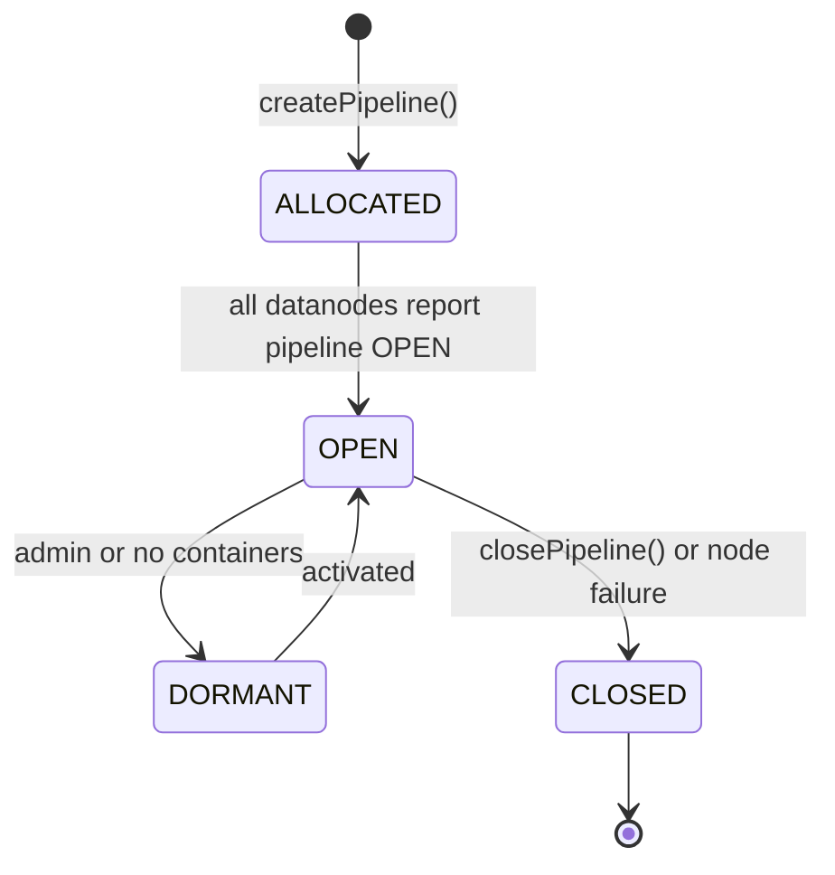

# SCM / pipeline-manager

**Classes:** 28    **Kinds:** service:16, interface:4, factory:4, abstract:2, metrics:1, exception:1

## Overview

Pipeline-manager governs the lifecycle of Ratis and EC pipelines. `PipelineManagerImpl` is the top-level service: it creates pipelines using `PipelineFactory` (which delegates to `RatisPipelineProvider` or `ECPipelineProvider`), persists pipeline state via `PipelineStateManagerImpl`, and manages transitions through ALLOCATED, OPEN, DORMANT, and CLOSED states. `PipelineStateManagerImpl` wraps mutations in the SCM Ratis transaction buffer via `PipelineStateManagerInvoker` so that all state changes are replicated in HA mode. The in-memory representation is `PipelineStateMap`, which keeps a fast-lookup structure from pipeline ID and replication config to pipeline and its container set. `PipelinePlacementPolicy` selects datanodes for new Ratis pipelines using load-balancing and network topology; it uses `SortedList` for O(log n) ranking of nodes by pipeline count. `BackgroundPipelineCreator` proactively creates pipelines to keep a minimum number available at all times. For writable container allocation, `WritableRatisContainerProvider` and `WritableECContainerProvider` wrap pipeline selection and container open logic.

## Diagram

## Class table

### Sub-feature: `choose.algorithms`

| reading_order | fqcn | kind | logic | loc | study (min) | role |
|--:|---|---|---|--:|--:|---|
| 145 | `org.apache.hadoop.hdds.scm.pipeline.leader.choose.algorithms.LeaderChoosePolicy` | abstract | mixed | 25~ | 30 | A LeaderChoosePolicy support choosing leader from datanode list. |
| 146 | `org.apache.hadoop.hdds.scm.pipeline.leader.choose.algorithms.MinLeaderCountChoosePolicy` | service | mixed | 50~ | 30 | The minimum leader count choose policy that chooses leader which has the minimum exist leader count. |
| 147 | `org.apache.hadoop.hdds.scm.pipeline.leader.choose.algorithms.DefaultLeaderChoosePolicy` | service | mixed | 25~ | 30 | The default leader choose policy. |
| 148 | `org.apache.hadoop.hdds.scm.pipeline.leader.choose.algorithms.LeaderChoosePolicyFactory` | factory | mixed | 25~ | 20 | A factory to create leader choose policy instance based on configuration property ScmConfigKeys#OZONE_SCM_PIPELINE_LE... |

### Sub-feature: `scm.pipeline`

| reading_order | fqcn | kind | logic | loc | study (min) | role |
|--:|---|---|---|--:|--:|---|
| 149 | `org.apache.hadoop.hdds.scm.pipeline.PipelineManager` | interface | mixed | 75~ | 20 | Interface which exposes the api for pipeline management. |
| 150 | `org.apache.hadoop.hdds.scm.pipeline.PipelineStateManager` | interface | mixed | 50~ | 20 | Manages the state of pipelines in SCM. |
| 151 | `org.apache.hadoop.hdds.scm.pipeline.WritableContainerProvider` | interface | mixed | 25~ | 20 | Interface used by the WritableContainerFactory to obtain a writable container from the providers. |
| 152 | `org.apache.hadoop.hdds.scm.pipeline.PipelineManagerMXBean` | interface | mixed | 25~ | 20 | This is the JMX management interface for information related to PipelineManager. |
| 153 | `org.apache.hadoop.hdds.scm.pipeline.PipelineProvider` | abstract | mixed | 100~ | 30 | Interface for creating pipelines. |
| 154 | `org.apache.hadoop.hdds.scm.pipeline.PipelineManagerImpl` | service | logic-heavy | 725~ | 60 | SCM Pipeline Manager implementation. |
| 155 | `org.apache.hadoop.hdds.scm.pipeline.PipelinePlacementPolicy` | service | logic-heavy | 375~ | 45 | Pipeline placement policy that choose datanodes based on load balancing and network topology to supply pipeline creat... |
| 156 | `org.apache.hadoop.hdds.scm.pipeline.PipelineStateManagerImpl` | service | logic-heavy | 275~ | 45 | Implementation of pipeline state manager. |
| 157 | `org.apache.hadoop.hdds.scm.pipeline.PipelineStateMap` | service | logic-heavy | 250~ | 45 | Holds the data structures which maintain the information about pipeline and its state. |
| 158 | `org.apache.hadoop.hdds.scm.pipeline.WritableECContainerProvider` | service | logic-heavy | 225~ | 45 | Writable Container provider to obtain a writable container for EC pipelines. |
| 159 | `org.apache.hadoop.hdds.scm.pipeline.BackgroundPipelineCreator` | service | logic-heavy | 225~ | 45 | Implements api for running background pipeline creation jobs. |
| 160 | `org.apache.hadoop.hdds.scm.pipeline.RatisPipelineProvider` | service | logic-heavy | 200~ | 45 | Implements Api for creating ratis pipelines. |
| 161 | `org.apache.hadoop.hdds.scm.pipeline.SortedList` | service | logic-heavy | 200~ | 45 | A sorted list using bucket-sort with bucket size == 1. |
| 162 | `org.apache.hadoop.hdds.scm.pipeline.WritableRatisContainerProvider` | service | mixed | 100~ | 30 | Class to obtain a writable container for Ratis and Standalone pipelines. |
| 163 | `org.apache.hadoop.hdds.scm.pipeline.PipelineReportHandler` | service | mixed | 100~ | 30 | Handles Pipeline Reports from datanode. |
| 164 | `org.apache.hadoop.hdds.scm.pipeline.PipelineActionHandler` | service | mixed | 75~ | 30 | Handles pipeline actions from datanode. |
| 165 | `org.apache.hadoop.hdds.scm.pipeline.ECPipelineProvider` | service | mixed | 75~ | 30 | Class to create pipelines for EC containers. |
| 166 | `org.apache.hadoop.hdds.scm.pipeline.SimplePipelineProvider` | service | mixed | 50~ | 30 | Implements Api for creating stand alone pipelines. |
| 167 | `org.apache.hadoop.hdds.scm.pipeline.RatisPipelineUtils` | service | mixed | 25~ | 30 | Utility class for Ratis pipelines. |
| 168 | `org.apache.hadoop.hdds.scm.pipeline.PipelineFactory` | factory | mixed | 75~ | 20 | Creates pipeline based on replication type. |
| 169 | `org.apache.hadoop.hdds.scm.pipeline.WritableContainerFactory` | factory | mixed | 50~ | 20 | Factory class to obtain a container to which a block can be allocated for write. |
| 170 | `org.apache.hadoop.hdds.scm.pipeline.PipelinePlacementPolicyFactory` | factory | mixed | 25~ | 20 | Pipeline placement factor for pipeline providers to create placement instance based on configuration property. |
| 171 | `org.apache.hadoop.hdds.scm.pipeline.SCMPipelineMetrics` | metrics | mixed | 100~ | 20 | This class maintains Pipeline related metrics. |
| 172 | `org.apache.hadoop.hdds.scm.pipeline.InsufficientDatanodesException` | exception | data-only | 25~ | 10 | Exception thrown when there are not enough Datanodes to create a pipeline. |

## Anchor details

### `PipelineManagerImpl`

- **path:** `hadoop-hdds/server-scm/src/main/java/org/apache/hadoop/hdds/scm/pipeline/PipelineManagerImpl.java`
- **loc:** 725~    **difficulty:** 5    **study:** 60 min    **concurrency:** thread-safe    **persistence:** in-memory
- **entry points:** `close`
- **key collaborators:** `org.apache.hadoop.hdds.HddsConfigKeys`, `org.apache.hadoop.hdds.client.RatisReplicationConfig`, `org.apache.hadoop.hdds.client.ReplicationConfig`, `org.apache.hadoop.hdds.client.StandaloneReplicationConfig`, `org.apache.hadoop.hdds.conf.ConfigurationSource`, `org.apache.hadoop.hdds.protocol.DatanodeDetails`
- **test exemplar:** `hadoop-hdds/server-scm/src/test/java/org/apache/hadoop/hdds/scm/pipeline/TestPipelineManagerImpl.java`
- **role:** SCM Pipeline Manager implementation.

### `PipelinePlacementPolicy`

- **path:** `hadoop-hdds/server-scm/src/main/java/org/apache/hadoop/hdds/scm/pipeline/PipelinePlacementPolicy.java`
- **loc:** 375~    **difficulty:** 4    **study:** 45 min    **concurrency:** single-threaded    **persistence:** in-memory
- **key collaborators:** `org.apache.hadoop.hdds.client.RatisReplicationConfig`, `org.apache.hadoop.hdds.conf.ConfigurationSource`, `org.apache.hadoop.hdds.protocol.DatanodeDetails`, `org.apache.hadoop.hdds.scm.SCMCommonPlacementPolicy`, `org.apache.hadoop.hdds.scm.ScmConfigKeys`, `org.apache.hadoop.hdds.scm.exceptions.SCMException`
- **test exemplar:** `hadoop-hdds/server-scm/src/test/java/org/apache/hadoop/hdds/scm/pipeline/TestPipelinePlacementPolicy.java`
- **role:** Pipeline placement policy that choose datanodes based on load balancing and network topology to supply pipeline creat...

### `PipelineStateManagerImpl`

- **path:** `hadoop-hdds/server-scm/src/main/java/org/apache/hadoop/hdds/scm/pipeline/PipelineStateManagerImpl.java`
- **loc:** 275~    **difficulty:** 4    **study:** 45 min    **concurrency:** thread-safe    **persistence:** in-memory
- **entry points:** `close`, `build`
- **key collaborators:** `org.apache.hadoop.hdds.client.ReplicationConfig`, `org.apache.hadoop.hdds.protocol.DatanodeDetails`, `org.apache.hadoop.hdds.scm.container.ContainerID`, `org.apache.hadoop.hdds.scm.ha.SCMRatisServer`, `org.apache.hadoop.hdds.scm.ha.invoker.PipelineStateManagerInvoker`, `org.apache.hadoop.hdds.scm.metadata.DBTransactionBuffer`
- **test exemplar:** `hadoop-hdds/server-scm/src/test/java/org/apache/hadoop/hdds/scm/pipeline/TestPipelineStateManagerImpl.java`
- **role:** Implementation of pipeline state manager.

### `PipelineStateMap`

- **path:** `hadoop-hdds/server-scm/src/main/java/org/apache/hadoop/hdds/scm/pipeline/PipelineStateMap.java`
- **loc:** 250~    **difficulty:** 4    **study:** 45 min    **concurrency:** single-threaded    **persistence:** in-memory
- **key collaborators:** `org.apache.hadoop.hdds.client.ReplicationConfig`, `org.apache.hadoop.hdds.protocol.DatanodeDetails`, `org.apache.hadoop.hdds.scm.container.ContainerID`
- **test exemplar:** `hadoop-hdds/server-scm/src/test/java/org/apache/hadoop/hdds/scm/pipeline/TestPipelineStateMap.java`
- **role:** Holds the data structures which maintain the information about pipeline and its state.

### `WritableECContainerProvider`

- **path:** `hadoop-hdds/server-scm/src/main/java/org/apache/hadoop/hdds/scm/pipeline/WritableECContainerProvider.java`
- **loc:** 225~    **difficulty:** 4    **study:** 45 min    **concurrency:** thread-safe    **persistence:** in-memory
- **key collaborators:** `org.apache.hadoop.hdds.client.ECReplicationConfig`, `org.apache.hadoop.hdds.client.ReplicationConfig`, `org.apache.hadoop.hdds.conf.Config`, `org.apache.hadoop.hdds.conf.ConfigGroup`, `org.apache.hadoop.hdds.conf.ConfigTag`, `org.apache.hadoop.hdds.conf.ConfigType`
- **test exemplar:** `hadoop-hdds/server-scm/src/test/java/org/apache/hadoop/hdds/scm/pipeline/TestWritableECContainerProvider.java`
- **role:** Writable Container provider to obtain a writable container for EC pipelines.

### `BackgroundPipelineCreator`

- **path:** `hadoop-hdds/server-scm/src/main/java/org/apache/hadoop/hdds/scm/pipeline/BackgroundPipelineCreator.java`
- **loc:** 225~    **difficulty:** 4    **study:** 45 min    **concurrency:** thread-safe    **persistence:** in-memory
- **entry points:** `start`
- **key collaborators:** `org.apache.hadoop.hdds.HddsConfigKeys`, `org.apache.hadoop.hdds.client.RatisReplicationConfig`, `org.apache.hadoop.hdds.client.ReplicationConfig`, `org.apache.hadoop.hdds.client.StandaloneReplicationConfig`, `org.apache.hadoop.hdds.conf.ConfigurationSource`, `org.apache.hadoop.hdds.scm.ScmConfigKeys`
- **test exemplar:** `hadoop-hdds/server-scm/src/test/java/org/apache/hadoop/hdds/scm/pipeline/TestBackgroundPipelineCreator.java`
- **role:** Implements api for running background pipeline creation jobs.

### `RatisPipelineProvider`

- **path:** `hadoop-hdds/server-scm/src/main/java/org/apache/hadoop/hdds/scm/pipeline/RatisPipelineProvider.java`
- **loc:** 200~    **difficulty:** 4    **study:** 45 min    **concurrency:** single-threaded    **persistence:** in-memory
- **entry points:** `create`, `close`
- **key collaborators:** `org.apache.hadoop.hdds.scm.pipeline.leader.choose.algorithms.LeaderChoosePolicy`, `org.apache.hadoop.hdds.scm.pipeline.leader.choose.algorithms.LeaderChoosePolicyFactory`, `org.apache.hadoop.hdds.client.RatisReplicationConfig`, `org.apache.hadoop.hdds.conf.ConfigurationSource`, `org.apache.hadoop.hdds.conf.StorageUnit`, `org.apache.hadoop.hdds.protocol.DatanodeDetails`
- **test exemplar:** `hadoop-hdds/server-scm/src/test/java/org/apache/hadoop/hdds/scm/pipeline/TestRatisPipelineProvider.java`
- **role:** Implements Api for creating ratis pipelines.

### `SortedList`

- **path:** `hadoop-hdds/server-scm/src/main/java/org/apache/hadoop/hdds/scm/pipeline/SortedList.java`
- **loc:** 200~    **difficulty:** 4    **study:** 45 min    **concurrency:** single-threaded    **persistence:** in-memory
- **test exemplar:** `hadoop-hdds/server-scm/src/test/java/org/apache/hadoop/hdds/scm/pipeline/TestSortedList.java`
- **role:** A sorted list using bucket-sort with bucket size == 1.

## Design docs

- `hadoop-hdds/docs/content/design/multiraft.md` — design for multi-Raft pipeline support managed by `RatisPipelineProvider`
- `hadoop-hdds/docs/content/feature/multi-raft-support.md` — user-facing feature page for multi-Raft
- `hadoop-hdds/docs/content/feature/Streaming-Write-Pipeline.md` — describes the Ratis streaming write pipeline path

## Seminal JIRAs / PRs

- HDDS-3466. Improve PipelinePlacementPolicy performance.
- HDDS-14355. Allow createKey to skip allocateBlock for empty key.
- HDDS-14369. RatisPipelineProvider does not honor OZONE_DATANODE_PIPELINE_LIMIT_DEFAULT.
- HDDS-15138. Add EC DN safemode rule and control RATIS/THREE background pipelines for EC-default clusters.
- HDDS-15440. Combine pipelineMap and pipeline2container to a single map in PipelineStateMap.
- HDDS-15969. Prioritize Ratis Streaming capable DataNodes during Pipeline creation with graceful fallback.
- HDDS-12991. Recreate pipelines after enabling ratis write streaming.

## Sharp edges

- `PipelineManagerImpl` uses a `ReentrantReadWriteLock`. Write operations (create, close, update) hold the write lock. `PipelineStateManagerImpl` mutations are forwarded to Ratis while the write lock is held; if the Ratis call times out, the lock is released but the pipeline may or may not have been created on followers, causing a split-brain view until the next SCM snapshot. (`PipelineManagerImpl.java` around `createPipeline()`.)
- `BackgroundPipelineCreator` checks `OZONE_DATANODE_PIPELINE_LIMIT` before creating new pipelines. If a datanode is already at its limit it is excluded from new pipelines, which can leave a cluster with too few open pipelines if many nodes hit the limit simultaneously. This limit is not dynamically reconfigurable without a restart as of HDDS-14369.

## Related features

- `components/scm/pipeline-choose-policy.md` — choose policies select from open pipelines built by this feature
- `components/scm/container-manager.md` — containers are allocated on pipelines managed here
- `components/scm/node-manager.md` — `PipelinePlacementPolicy` queries `NodeManager` for per-node pipeline count and load
- `components/scm/safemode.md` — `HealthyPipelineSafeModeRule` requires a minimum number of OPEN pipelines before SCM exits safe mode
- `components/scm/scm-ha.md` — `PipelineStateManagerInvoker` routes writes through `SCMStateMachine`

## Self-quiz

1. `PipelineManagerImpl` is thread-safe via `ReentrantReadWriteLock`. What specific operations hold the write lock, and why does `getOpenPipelinesByReplicationConfig()` only need a read lock?
2. `PipelinePlacementPolicy` uses `SortedList` to pick datanodes. What metric is the list sorted by, and what is the time complexity of `getTopN(n)` on this structure?
3. `PipelineStateManagerImpl` is built with `close` and `build` entry points. What does `build()` do that the constructor does not?
4. `WritableECContainerProvider` allocates or reuses a writable EC container. Under what condition does it create a new pipeline rather than reusing an existing one?
5. `BackgroundPipelineCreator.start()` is the lifecycle entry point. How does it react to SCM leader failover, and what `SCMService` mechanism controls this?

Answers

Answer 1: `createPipeline()`, `closePipeline()`, `activatePipeline()`, `deactivatePipeline()`, and `addContainerToPipeline()` hold the write lock. `getOpenPipelinesByReplicationConfig()` and similar read queries only need the read lock because they access the immutable view from `PipelineStateMap` without modifying it.
Answer 2: `SortedList` sorts by the number of leader pipelines on each datanode. `getTopN(n)` has O(n) time complexity because the list uses bucket sort with bucket size 1, making element access O(1) per bucket.
Answer 3: `build()` loads all existing pipelines from the RocksDB `pipelineTable` into the in-memory `PipelineStateMap` and wires up the Ratis invoker. The constructor alone does not read persistent state.
Answer 4: `WritableECContainerProvider` creates a new pipeline when all existing EC pipelines for the given replication config have reached maximum container count (`ozone.scm.pipeline.ec.limit`) or when no healthy pipeline exists.
Answer 5: `BackgroundPipelineCreator` implements `SCMService`. Its `shouldRun()` method returns false when `SCMContext.isLeader()` is false, so the creation task is a no-op on followers. After a leader election, `notifyStatusChanged()` is called and `shouldRun()` becomes true, allowing the next scheduled interval to resume creation.

