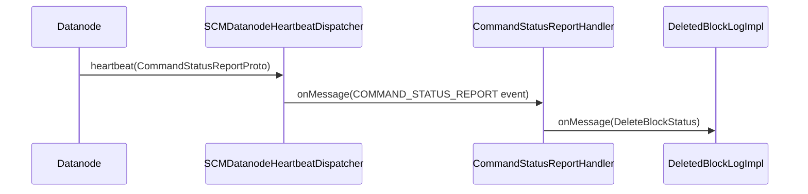

# SCM / scm-commands

**Classes:** 1    **Kinds:** service:1

## Overview

The scm-commands feature has a single class: `CommandStatusReportHandler`. Datanodes periodically send a `CommandStatusReportProto` inside their heartbeat to inform SCM about the outcome of previously issued commands (e.g., whether a `DeleteBlocksCommand` succeeded or failed). `CommandStatusReportHandler` implements `EventHandler<CommandStatusReport>`, receives the SCM event fired by `SCMDatanodeHeartbeatDispatcher`, and routes each command status entry to the appropriate subscriber — in practice `DeletedBlockLogImpl` for delete command outcomes. It is a narrow routing class with no persistent state.

## Diagram

## Class table

### Sub-feature: `scm.command`

| reading_order | fqcn | kind | logic | loc | study (min) | role |
|--:|---|---|---|--:|--:|---|
| 1475 | `org.apache.hadoop.hdds.scm.command.CommandStatusReportHandler` | service | mixed | 50~ | 30 | Handles CommandStatusReports from datanode. |

## Anchor details

_No logic-heavy anchors in this feature; the classes are primarily data / dto / config / cli._

## Design docs

- no dedicated design doc under hadoop-hdds/docs/content/ on this branch

## Seminal JIRAs / PRs

- HDDS-325. Add event watcher for delete blocks command — introduced the command-status report feedback loop.
- HDDS-8882. Manage status of DeleteBlocksCommand in SCM to avoid sending duplicates to Datanode.

## Sharp edges

- `CommandStatusReportHandler` publishes a specific typed event (`DeleteBlockStatus`) for delete command outcomes, but there is no similar handler for other command types (e.g., replication commands). Replication command outcomes are inferred indirectly from subsequent container replica reports rather than from explicit command ACKs.

## Related features

- `components/scm/block-manager.md` — `DeletedBlockLogImpl` is the primary consumer of `DeleteBlockStatus` events from this handler
- `components/scm/scm-events.md` — `SCMEvents.COMMAND_STATUS_REPORT` is the event that carries command status to this handler
- `components/scm/scm-server.md` — `SCMDatanodeHeartbeatDispatcher` is the upstream dispatcher that fires the event

## Self-quiz

1. `CommandStatusReportHandler.onMessage()` receives `CommandStatusReport`. For which command type does it forward a typed event downstream, and to which handler?
2. The class has no persistent state. What would break if SCM restarted and a datanode then sent a delayed command status report for a command issued before the restart?
3. What protobuf message carries command status from the datanode to SCM?
4. Why are replication command outcomes not handled through this same feedback path?
5. Which `SCMEvents` constant triggers `CommandStatusReportHandler`, and where is that event fired?

Answers

Answer 1: For `DELETE_BLOCK` commands it fires a `DeleteBlockStatus` event to `DeletedBlockLogImpl`. Other command types are not explicitly routed.
Answer 2: Nothing would break from SCM's perspective. The status report for the old command would arrive but `DeletedBlockLogImpl` would not find the command ID in its tracking map (since the map is in-memory and lost on restart), and the status would be silently dropped.
Answer 3: `CommandStatusReportProto` inside `SCMHeartbeatRequestProto`, defined in `StorageContainerDatanodeProtocol.proto`.
Answer 4: Replication outcomes are confirmed by subsequent container replica reports (`IncrementalContainerReportHandler`), which carry the actual state of replicas. An explicit replication-command ACK would be redundant with the replica-report signal.
Answer 5: `SCMEvents.COMMAND_STATUS_REPORT`. It is fired by `SCMDatanodeHeartbeatDispatcher.processCommandStatusReport()` when a non-empty `CommandStatusReportProto` arrives in a heartbeat.

