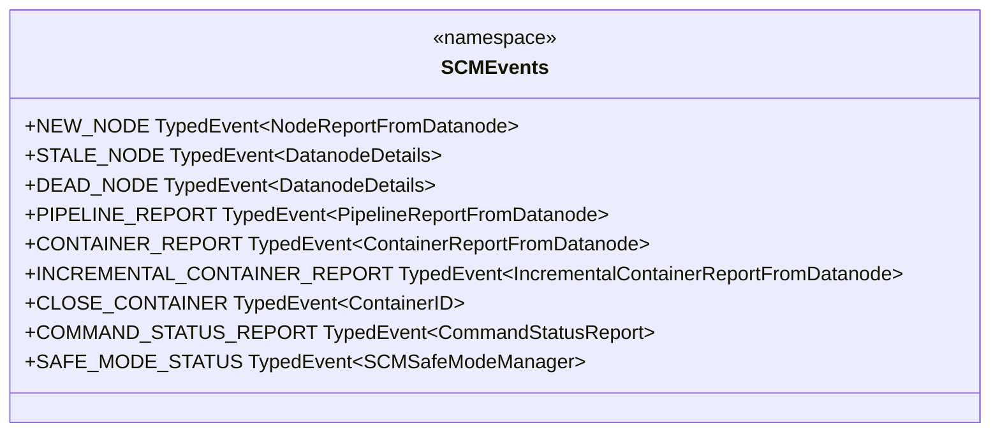

# SCM / scm-events

**Classes:** 1    **Kinds:** service:1

## Overview

`SCMEvents` is a single-class namespace that declares all typed event constants used in SCM's internal event bus. Each constant is a `TypedEvent<PayloadType>` instance; the type parameter constrains what payload the event carries. Event constants group into categories: datanode lifecycle (`NEW_NODE`, `STALE_NODE`, `DEAD_NODE`, `HEALTHY_NODE`, `HEALTHY_READONLY_NODE`), pipeline (`PIPELINE_REPORT`, `PIPELINE_ACTIONS`), container (`CONTAINER_REPORT`, `INCREMENTAL_CONTAINER_REPORT`, `CLOSE_CONTAINER`, `RECONCILE_CONTAINER`), block management (`COMMAND_STATUS_REPORT`), safe mode (`SAFE_MODE_STATUS`), and others. The class itself has no logic — it is a catalog that allows producers and consumers to reference the same singleton event type object.

## Diagram

## Class table

### Sub-feature: `scm.events`

| reading_order | fqcn | kind | logic | loc | study (min) | role |
|--:|---|---|---|--:|--:|---|
| 1476 | `org.apache.hadoop.hdds.scm.events.SCMEvents` | service | mixed | 75~ | 30 | Class that acts as the namespace for all SCM Events. |

## Anchor details

_No logic-heavy anchors in this feature; the classes are primarily data / dto / config / cli._

## Design docs

- no dedicated design doc under hadoop-hdds/docs/content/ on this branch

## Seminal JIRAs / PRs

- HDDS-8660. Notify ReplicationManager when nodes go dead or out of service — added `DEAD_NODE` consumers.
- HDDS-13980. SCM start DN protocol server during startup — touches event wiring at startup.

## Sharp edges

- `SCMEvents` constants are static final fields initialized at class load. Adding a new event requires no configuration, but forgetting to register a handler for the new event silently drops all payloads — the event bus does not warn about unhandled events by default.

## Related features

- `components/scm/scm-server.md` — `SCMDatanodeHeartbeatDispatcher` fires most datanode-originated events
- `components/scm/node-manager.md` — `SCMNodeManager` and node handlers consume `NEW_NODE`, `STALE_NODE`, `DEAD_NODE`
- `components/scm/container-manager.md` — `ContainerReportHandler` and `IncrementalContainerReportHandler` consume container report events
- `components/scm/safemode.md` — `SCMSafeModeManager` emits and listens to `SAFE_MODE_STATUS`

## Self-quiz

1. `TypedEvent<T>` constrains what payload an event can carry. What happens at compile time if a producer tries to fire `SCMEvents.CLOSE_CONTAINER` with a payload that is not a `ContainerID`?
2. `SCMEvents` has no instance — all fields are static. Why does the framework use singleton `TypedEvent` instances rather than just string names for events?
3. Which event fires when a datanode's `NodeOperationalState` changes from `IN_SERVICE` to `DECOMMISSIONING`?
4. The `DATANODE_COMMAND_COUNT_UPDATED` event is handled by `DatanodeCommandCountUpdatedHandler` in the replication feature. What does that event's payload contain?
5. How does a new handler register itself to receive `SCMEvents.DEAD_NODE` events?

Answers

Answer 1: A compile-time type error is raised because `EventPublisher.fireEvent(TypedEvent<T>, T)` requires the payload to match the event's type parameter.
Answer 2: Singleton instances allow the event bus to use object identity for routing without string parsing or hash collisions, and they make handler registration fully type-safe at compile time.
Answer 3: `SCMEvents.START_ADMIN_ON_DN` fires to trigger decommission/maintenance processing in `StartDatanodeAdminHandler` and `NodeDecommissionManager`.
Answer 4: The payload is a `DatanodeDetails` coupled with a per-command-type pending count map, allowing `DatanodeCommandCountUpdatedHandler` to update `SCMNodeManager` about the datanode's current command queue depth.
Answer 5: The handler calls `eventQueue.addHandler(SCMEvents.DEAD_NODE, handlerInstance)` during SCM initialization, typically inside `StorageContainerManager.registerEventHandlers()`.

