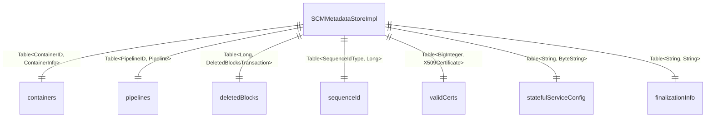

# SCM / scm-metadata

**Classes:** 4    **Kinds:** service:2, util:2

## Overview

The scm-metadata feature provides the RocksDB schema and codec layer for SCM's persistent store. `SCMDBDefinition` declares every column family used by SCM: `containers`, `pipelines`, `deletedBlocks`, `sequenceId`, `certs`, `validCerts`, `revokedCerts`, `statefulServiceConfig`, `finalizationInfo`, and several others. Each column family is described as a `DBColumnFamilyDefinition<K, V>` with typed key and value codecs. `SCMMetadataStoreImpl` opens the RocksDB database using these definitions and exposes typed `Table<K, V>` accessors for the rest of SCM. `X509CertificateCodec` and `BigIntegerCodec` are custom Hadoop `Codec` implementations needed because `X509Certificate` and `BigInteger` have no standard Protobuf equivalents in the SCM schema.

## Diagram

## Class table

### Sub-feature: `scm.metadata`

| reading_order | fqcn | kind | logic | loc | study (min) | role |
|--:|---|---|---|--:|--:|---|
| 1477 | `org.apache.hadoop.hdds.scm.metadata.SCMMetadataStoreImpl` | service | mixed | 125~ | 30 | A RocksDB based implementation of SCM Metadata Store. |
| 1478 | `org.apache.hadoop.hdds.scm.metadata.SCMDBDefinition` | service | mixed | 100~ | 30 | Class defines the structure and types of the scm.db. |
| 1479 | `org.apache.hadoop.hdds.scm.metadata.X509CertificateCodec` | util | mixed | 75~ | 20 | Codec to serialize/deserialize X509Certificate. |
| 1480 | `org.apache.hadoop.hdds.scm.metadata.BigIntegerCodec` | util | mixed | 25~ | 20 | Codec to serialize/deserialize BigInteger. |

## Anchor details

_No logic-heavy anchors in this feature; the classes are primarily data / dto / config / cli._

## Design docs

- no dedicated design doc under hadoop-hdds/docs/content/ on this branch

## Seminal JIRAs / PRs

- HDDS-11555. SCMDBDefinition should be singleton.
- HDDS-11556. Add a getTypeClass method to Codec.
- HDDS-11557. Simplify DBColumnFamilyDefinition.
- HDDS-15370. Change sequenceIdTable to use SequenceIdType.

## Sharp edges

- `SCMDBDefinition` is a singleton (HDDS-11555). Any code that creates a new `SCMDBDefinition` directly bypasses this and risks opening the RocksDB database with a different set of column families, which corrupts the DB layout. Callers must use `SCMDBDefinition.get()`.
- `X509CertificateCodec` and `BigIntegerCodec` encode to DER/byte-array representations that are not human-readable. If the SCM DB needs to be inspected with `ozone debug ldb`, these columns require a custom decoder — the standard `ldb` scan will show raw bytes.

## Related features

- `components/scm/scm-ha.md` — `SCMMetadataStoreImpl` is the backing store for `SCMHADBTransactionBufferImpl`
- `components/scm/container-manager.md` — `ContainerStateManagerImpl` reads/writes the `containers` column family
- `components/scm/pipeline-manager.md` — `PipelineStateManagerImpl` reads/writes the `pipelines` column family
- `components/scm/scm-security.md` — certificate tables (`validCerts`, `certs`) are read by `SCMCertStore`

## Self-quiz

1. `SCMDBDefinition` is a singleton. What concurrency guarantee does this provide, and why does it matter for RocksDB column family registration?
2. `X509CertificateCodec.toPersistedFormat()` encodes a certificate. What byte format does it use, and is the result portable across JVM implementations?
3. `SCMMetadataStoreImpl.getContainerTable()` returns a `Table<ContainerID, ContainerInfo>`. What Protobuf type is `ContainerInfo` serialised to on disk?
4. `BigIntegerCodec` is used for certificate serial numbers. What is the maximum size of a `BigInteger` serial number, and how does the codec handle variable-length byte arrays?
5. If a new SCM feature needs a new RocksDB column family, what two files must be changed, and what happens if the column family is missing when SCM opens an existing DB?

Answers

Answer 1: The singleton ensures that the same `DBColumnFamilyDefinition` objects are used throughout the JVM. RocksDB requires the same column family list at open time as at creation time; a second definition instance with different options would cause an open failure or silent misuse of the wrong column family handle.
Answer 2: `X509CertificateCodec` encodes to DER (Distinguished Encoding Rules) byte format via `certificate.getEncoded()`. DER is a standard ASN.1 format and is portable across JVM implementations.
Answer 3: `ContainerInfo` is serialised to `HddsProtos.ContainerInfoProto` on disk.
Answer 4: `BigInteger.toByteArray()` returns a variable-length two's-complement representation. `BigIntegerCodec` stores the raw byte array without a length prefix; the Hadoop `Codec` framework stores the array length as a prefix separately at the table layer.
Answer 5: The new column family must be added to `SCMDBDefinition` (as a new `DBColumnFamilyDefinition` field) and the accessor added to `SCMMetadataStore` (interface) and `SCMMetadataStoreImpl`. If the column family is missing when SCM opens an existing DB, RocksDB throws `RocksDBException` (column family not found), preventing SCM from starting.

