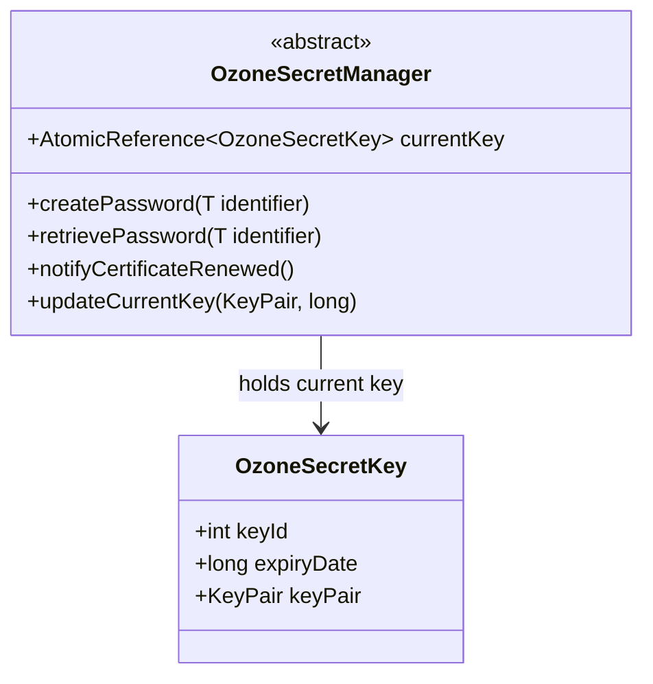

# Security / security-framework

**Classes:** 2    **Kinds:** abstract:1, service:1

## Overview

`OzoneSecretManager` is the abstract base for OM's Hadoop-compatible delegation-token secret managers. It extends Hadoop's `SecretManager<T>` and implements `CertificateNotification`, so it can be notified when a service certificate is renewed and can rotate its internal signing key accordingly. The current signing key is an `OzoneSecretKey`, which pairs a key-id, an expiry timestamp, and a raw `KeyPair`; both token creation and verification pass through this key. The abstract layer separates the HMAC-based token machinery (here) from the asymmetric-certificate PKI (security-x509), allowing higher-level managers such as the block and container secret managers to share one key-rotation code path. There are only two classes because the feature intentionally stays thin: all protocol-specific token formats live in security-tokens, and all key-store concerns live in security-symmetric.

## Diagram

## Class table

### Sub-feature: `hdds.security`

| reading_order | fqcn | kind | logic | loc | study (min) | role |
|--:|---|---|---|--:|--:|---|
| 1618 | `org.apache.hadoop.hdds.security.OzoneSecretManager` | abstract | mixed | 150~ | 45 | SecretManager for Ozone Master. |
| 1619 | `org.apache.hadoop.hdds.security.OzoneSecretKey` | service | mixed | 75~ | 30 | Wrapper class for Ozone/Hdds secret keys. |

## Anchor details

_No logic-heavy anchors in this feature (both classes are `mixed` weight). Key observations:_

- `OzoneSecretManager.updateCurrentKey` holds a `ReentrantReadWriteLock`-style critical section guarded by an `AtomicReference<OzoneSecretKey>` swap; callers reading the current key must tolerate a race between the reference read and the token verification step.
- `OzoneSecretKey` deliberately has no Protobuf serialization — it is rebuilt from a stored `KeyPair` on each SCM/OM restart; token identifiers carry only the `keyId`, not the key material.

## Design docs

- `hadoop-hdds/docs/content/security/SecureOzone.md` — overview of Ozone secure mode, Kerberos, and token concepts that this abstract manager implements.
- `hadoop-hdds/docs/content/design/token.md` — generic extensible token design (HDDS-2867) that shaped the `SecretManager<T>` abstraction boundary.
- No dedicated design doc for the framework base classes under `hadoop-hdds/docs/content/` on this branch.

## Seminal JIRAs / PRs

- HDDS-4729. Add token support for container admin operations.
- HDDS-7723. Refresh Keys and Certificate used in OzoneSecretManager after certificate renewed.
- HDDS-8829. Symmetric Keys for Delegation Tokens.
- HDDS-11907. OzoneSecretKey does not need to implement Writable.
- HDDS-11070. Separate KeyCodec from reading and storing keys to disk.

## Sharp edges

- `OzoneSecretManager` implements `CertificateNotification`, so subclasses must register themselves with the `DefaultCertificateClient` or the key will not rotate when a certificate renews — HDDS-7723 fixed a case where this wiring was absent.
- `OzoneSecretKey` stores the raw private key material in a heap field with no zeroisation on expiry; removal of the reference is the only cleanup path (HDDS-11907 removed Writable but did not add zeroisation).

## Related features

- `components/security/security-tokens.md` — concrete token managers (block, container) that extend `OzoneSecretManager`.
- `components/security/security-symmetric.md` — `ManagedSecretKey` and `SecretKeyManager`, the SCM-side symmetric key lifecycle that replaced HMAC keys for block tokens.
- `components/security/security-x509.md` — PKI layer whose `CertificateNotification` callback triggers key rotation in `OzoneSecretManager`.
- `components/security/security-ssl.md` — TLS layer that consumes the certificates managed by the PKI layer.

## Self-quiz

1. `OzoneSecretManager` implements `CertificateNotification`. Which method must a subclass call on certificate renewal to rotate the signing key, and what side-effect does it trigger on the `currentKey` field?
2. What is the role of the `keyId` in `OzoneSecretKey`, and why is it sufficient to store in a token identifier instead of the raw key material?
3. `OzoneSecretManager` extends Hadoop's `SecretManager<T>`. What two abstract methods must every concrete subclass implement, and which class in `security-tokens` provides a complete implementation?
4. Why does `OzoneSecretKey` no longer implement `Writable` (see HDDS-11907), and what replaced that serialization path?
5. Trace the token creation path from a client `getBlockToken` call through `OzoneSecretManager.createPassword` to the point where the `OzoneSecretKey` is used. Name the key intermediate classes.

Answers

Answer 1: `notifyCertificateRenewed()` triggers `updateCurrentKey`, which atomically replaces the `currentKey` reference with a new `OzoneSecretKey` built from the refreshed `KeyPair`.
Answer 2: The `keyId` is a monotonically incrementing integer that lets the verifier look up the correct key from a server-side map without embedding secret bytes in the token; this limits exposure if a token is intercepted.
Answer 3: `createIdentifier()` and `createPassword(T)`. `OzoneBlockTokenSecretManager` in `security-tokens` is a concrete example.
Answer 4: HDDS-11907 removed the `Writable` implementation because `OzoneSecretKey` is never serialized to HDFS edit logs; keys are derived from a stored `KeyPair` on each restart.
Answer 5: client RPC -&gt; OM `OzoneBlockTokenSecretManager.generateToken` -&gt; `OzoneSecretManager.createPassword` -&gt; `OzoneSecretKey.getPrivateKey()` for HMAC signing.

