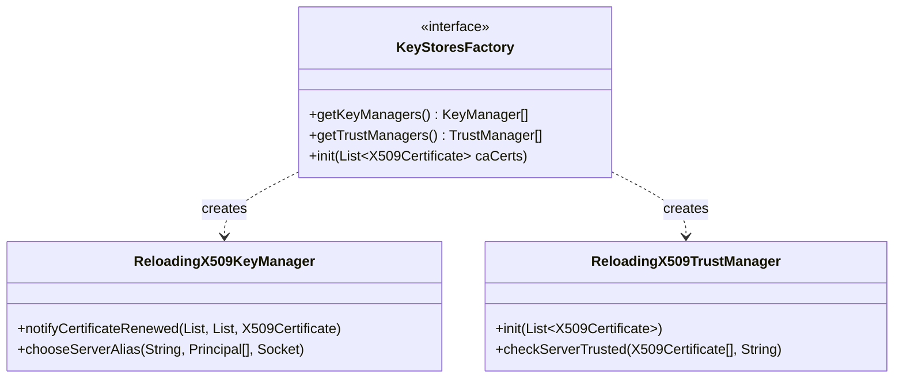

# Security / security-ssl

**Classes:** 3    **Kinds:** interface:1, service:1, factory:1

## Overview

This feature provides the hot-reloadable TLS layer that Ozone services use for in-transit encryption. `KeyStoresFactory` is the factory interface that creates a matched pair of `KeyManager` and `TrustManager` for a given `SecurityConfig`; its implementation builds Java `KeyStore` objects from the on-disk PEM-encoded certificates managed by `DefaultCertificateClient`. `ReloadingX509KeyManager` wraps the standard `X509KeyManager` and exposes a `notifyCertificateRenewed()` method so that `DefaultCertificateClient` can push a new certificate in-place without restarting the gRPC or Netty transport. `ReloadingX509TrustManager` performs the same live-reload for the trust chain, accepting a list of CA certificates that grows when a new sub-CA is added. Together the three classes let Ozone complete a certificate rotation under live traffic without closing existing connections, which is the core requirement for SCM HA CA rotation (HDDS-8149, HDDS-8178).

## Diagram

## Class table

### Sub-feature: `security.ssl`

| reading_order | fqcn | kind | logic | loc | study (min) | role |
|--:|---|---|---|--:|--:|---|
| 1620 | `org.apache.hadoop.hdds.security.ssl.ReloadingX509TrustManager` | service | mixed | 125~ | 20 | A TrustManager implementation that exposes a method, #init(List) to reload its configuration for example when the tru... |
| 1621 | `org.apache.hadoop.hdds.security.ssl.ReloadingX509KeyManager` | service | mixed | 125~ | 30 | An implementation of &lt;code&gt;X509KeyManager&lt;/code&gt; that can be notified of certificate changes. |
| 1622 | `org.apache.hadoop.hdds.security.ssl.KeyStoresFactory` | factory | mixed | 25~ | 20 | Interface that gives access to KeyManager and TrustManager implementations. |

## Anchor details

_No logic-heavy anchors in this feature (all three classes are `mixed` weight). Key observations:_

- `ReloadingX509KeyManager.notifyCertificateRenewed` rebuilds its internal `KeyStore` in-place under a write lock and then replaces the delegate `X509KeyManager`; this is the mechanism that allows certificate rotation without transport restart (HDDS-8149).
- `ReloadingX509TrustManager.init(List<X509Certificate>)` replaces the trusted set atomically; during SCM HA CA rotation the new root CA cert is appended before the old one expires, so there is always at least one valid trust anchor in the list (HDDS-8588).

## Design docs

- `hadoop-hdds/docs/content/security/protect-in-transit-traffic.md` — operator guide for enabling TLS between Ozone services; directly describes the KeyManager/TrustManager setup this feature implements.
- `hadoop-hdds/docs/content/security/SecureOzone.md` — broader Ozone security overview that covers TLS configuration.
- No dedicated design doc for the hot-reload mechanism under `hadoop-hdds/docs/content/` on this branch.

## Seminal JIRAs / PRs

- HDDS-7486. Support KeyStoresFactory which supports keyManager and trustManager reload.
- HDDS-7636. Remove hadoop security dependency in org.apache.hadoop.hdds.security.ssl package.
- HDDS-7590. Use keyManager and trustManager provided by keyStoreFactory in OM gRPC services.
- HDDS-8149. Refactor the way to notify keyStoreFactory about certificate renewed.
- HDDS-8178. CertificateClient and KeyStoresFactory support multiple Sub-CA certificates in the trust chain.
- HDDS-8588. Add initialization logic in CertificateClient to handle more than one rootCA certificate.

## Sharp edges

- `ReloadingX509TrustManager.init` replaces the entire trusted set; if a caller passes an empty list (e.g. during a CA rotation race) all peer certificates will fail validation until the list is repopulated (HDDS-8588 added a guard, but the window exists between the old CA expiry and the `init` call).
- `KeyStoresFactory` (interface only) has no built-in reload coordination; the caller (`DefaultCertificateClient`) must sequence `notifyCertificateRenewed` calls on the key manager and trust manager separately — a partial update leaves them transiently inconsistent (HDDS-8030 cleaned related stale code).

## Related features

- `components/security/security-x509.md` — `DefaultCertificateClient` calls `KeyStoresFactory.init` / `notifyCertificateRenewed` to push rotated certificates into this TLS layer.
- `components/security/security-framework.md` — `OzoneSecretManager` also implements `CertificateNotification` and coordinates key rotation alongside TLS reload.
- `components/security/security-tokens.md` — block and container tokens ride over the TLS channels established by this feature.

## Self-quiz

1. Which class in this feature is responsible for building the initial `KeyManager` and `TrustManager` instances, and which `DefaultCertificateClient` lifecycle step invokes it?
2. `ReloadingX509KeyManager.notifyCertificateRenewed` takes three arguments. What are they, and why does the method need all three to rebuild the keystore?
3. During a CA rotation, why must the new root CA certificate be added to `ReloadingX509TrustManager` before the old one is removed rather than atomically swapping them?
4. `KeyStoresFactory` has kind `factory` and loc `25~`. What does the small line count tell you about where the substantive work actually happens?
5. Which JIRA removed the dependency on Hadoop's `SSLFactory` from this package and why was that important for Ozone's standalone deployment?

Answers

Answer 1: `KeyStoresFactory`; it is invoked from `DefaultCertificateClient.loadAllCertificates` (via `startCertificateRenewerService`) which calls the factory to build managers used for gRPC TLS context creation.
Answer 2: The new certificate chain, the list of CA certificates, and the new root CA — all three are needed to rebuild the `KeyStore` entry with a consistent alias, chain, and trust anchors.
Answer 3: If the swap were atomic, any in-flight TLS handshake that started validating before the swap would find neither the old nor the new anchor valid for the brief window, causing connection failures.
Answer 4: The `25~` LOC indicates `KeyStoresFactory` is just an interface; the implementation logic lives in the concrete class returned at runtime (wired in `DefaultCertificateClient`).
Answer 5: HDDS-7636 removed the Hadoop `SSLFactory` dependency, which was important because it allowed Ozone's TLS layer to work without a full HDFS classpath and avoided pulling in deprecated Hadoop SSL configuration paths.

