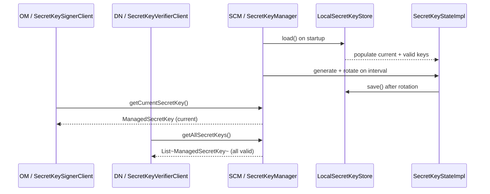

# Security / security-symmetric

**Classes:** 13    **Kinds:** service:7, interface:5, config:1

## Overview

This feature implements the SCM-managed symmetric key lifecycle that replaced asymmetric certificate signing for block and container tokens (HDDS-7733). SCM owns key generation, rotation, and storage: `SecretKeyManager` runs a background thread that generates a new `ManagedSecretKey` on a configurable interval, marks older keys as expired, and persists the set via `SecretKeyStore`. The current state (one active signing key plus all still-valid verifying keys) is held in `SecretKeyState` / `SecretKeyStateImpl`. OM fetches the current signing key via `SecretKeySignerClient`; datanodes fetch all valid keys for token verification via `SecretKeyVerifierClient`. The `Default*` client implementations call SCM over `SCMSecurityProtocol`. `LocalSecretKeyStore` writes the key set to a JSON file on the SCM local filesystem, providing persistence across restarts without a RocksDB dependency.

## Diagram

## Class table

### Sub-feature: `security.symmetric`

| reading_order | fqcn | kind | logic | loc | study (min) | role |
|--:|---|---|---|--:|--:|---|
| 1623 | `org.apache.hadoop.hdds.security.symmetric.SecretKeyVerifierClient` | interface | mixed | 25~ | 20 | Define the client-side API that the token verifiers (or datanodes) use to retrieve the relevant secret key to validat... |
| 1624 | `org.apache.hadoop.hdds.security.symmetric.SecretKeyClient` | interface | mixed | 25~ | 20 | Composite client for those components that need to perform both signing and verifying. |
| 1625 | `org.apache.hadoop.hdds.security.symmetric.SecretKeySignerClient` | interface | mixed | 25~ | 20 | Define the client-side API that the token signers (like OM) uses to retrieve the secret key to sign data. |
| 1626 | `org.apache.hadoop.hdds.security.symmetric.SecretKeyState` | interface | mixed | 25~ | 20 | This component holds the state of managed SecretKeys, including the current key and all active keys. |
| 1627 | `org.apache.hadoop.hdds.security.symmetric.SecretKeyStore` | interface | mixed | 25~ | 20 | Interface for SecretKey storage component, which is responsible for saving the SecretKeys states persistently to ensu... |
| 1628 | `org.apache.hadoop.hdds.security.symmetric.LocalSecretKeyStore` | service | mixed | 125~ | 30 | A SecretKeyStore that saves and loads SecretKeys from/to a JSON file on local file system. |
| 1629 | `org.apache.hadoop.hdds.security.symmetric.ManagedSecretKey` | service | mixed | 100~ | 30 | Enclosed a symmetric SecretKey with additional data for life-cycle management. |
| 1630 | `org.apache.hadoop.hdds.security.symmetric.SecretKeyManager` | service | mixed | 100~ | 30 | This component manages symmetric SecretKey life-cycle, including generation, rotation and destruction. |
| 1631 | `org.apache.hadoop.hdds.security.symmetric.DefaultSecretKeySignerClient` | service | mixed | 100~ | 30 | Default implementation of SecretKeySignerClient that fetches secret keys from SCM. |
| 1632 | `org.apache.hadoop.hdds.security.symmetric.SecretKeyStateImpl` | service | mixed | 75~ | 30 | Default implementation of SecretKeyState. |
| 1633 | `org.apache.hadoop.hdds.security.symmetric.DefaultSecretKeyVerifierClient` | service | mixed | 50~ | 30 | Default implementation of SecretKeyVerifierClient that fetches SecretKeys remotely via SCMSecurityProtocol and cache... |
| 1634 | `org.apache.hadoop.hdds.security.symmetric.DefaultSecretKeyClient` | service | mixed | 25~ | 30 | A composition of DefaultSecretKeySignerClient and DefaultSecretKeyVerifierClient for components need both APIs. |
| 1635 | `org.apache.hadoop.hdds.security.symmetric.SecretKeyConfig` | config | data-only | 50~ | 20 | Configurations related to SecretKeys lifecycle management. |

## Anchor details

_No logic-heavy anchors in this feature (all classes are `mixed` or `data-only`). Key observations:_

- `ManagedSecretKey` wraps a `javax.crypto.SecretKey` with id, creation time, and expiry; it exposes `sign(byte[])` and `isValidToVerify(Instant)` methods so both signing and verification go through a single object rather than raw key material. HDDS-10089 fixed a `ThreadLocal` holding `Mac` instances that caused heap growth per thread.
- `SecretKeyStateImpl` maintains a `current` key reference and a `ConcurrentHashMap<UUID, ManagedSecretKey>` of all still-valid keys; the rotation lock is at the `SecretKeyManager` level, not in `SecretKeyStateImpl` itself, so callers reading the state during a rotation can observe a stale `current` pointer briefly.
- `LocalSecretKeyStore` serializes to JSON (Jackson) rather than Protobuf; the on-disk schema is not versioned, so upgrading the `ManagedSecretKey` fields is a compatibility concern (HDDS-7945 integrated the store into SCM snapshots).

## Design docs

- `hadoop-hdds/docs/content/design/symmetric-token-signatures.md` — design document (HDDS-7733, status: implemented) that defines this entire feature: motivation, key lifecycle, rotation interval, and the signer/verifier client split.
- `hadoop-hdds/docs/content/security/SecuringDatanodes.md` — explains how datanodes obtain and use block tokens; the symmetric key path is the current default.
- No dedicated operational doc for `LocalSecretKeyStore` on this branch.

## Seminal JIRAs / PRs

- HDDS-7734. Implement symmetric SecretKeys lifecycle management in SCM.
- HDDS-7830. SCM API for OM and Datanode to get secret keys.
- HDDS-7831. Use symmetric secret key to sign and verify token.
- HDDS-7945. Integrate secret keys to SCM snapshot.
- HDDS-8164. Authorize secret key APIs.
- HDDS-9020. Datanodes fail to start up when secret key has not yet been initialized in SCM.
- HDDS-10089. ManagedSecretKey.macInstances should not be ThreadLocal.

## Sharp edges

- A datanode that starts before SCM has generated its first `ManagedSecretKey` will fail to start; HDDS-9020 added a retry loop, but the window still exists under a fresh cluster bootstrap.
- `LocalSecretKeyStore` serializes to unversioned JSON; adding a new field to `ManagedSecretKey` without a migration step will silently produce `null` for old on-disk entries on the first restart after an upgrade.
- `SecretKeyStateImpl` does not hold a rotation lock; a reader calling `getCurrentSecretKey` while `SecretKeyManager` is mid-rotation may get the old key for one token signing cycle (inferred: the impact is a token signed with a key about to be removed from the valid set before the next rotation).

## Related features

- `components/security/security-tokens.md` — block and container token managers call `SecretKeySignerClient.getCurrentSecretKey()` to sign, and `SecretKeyVerifierClient.getSecretKey(UUID)` to verify.
- `components/security/security-framework.md` — `OzoneSecretManager` is the older HMAC-based signing layer that this symmetric feature supersedes for block tokens.
- `components/security/security-x509.md` — SCM PKI layer that runs alongside symmetric keys; x509 certs are still used for service-to-service TLS, not token signing.

## Self-quiz

1. `SecretKeyManager` generates a new key on a configurable interval. Which `SecretKeyConfig` fields control the rotation interval and the key validity window, and what is the relationship between them?
2. Why does `ManagedSecretKey` expose both `sign(byte[])` and `isValidToVerify(Instant)` rather than just exposing the raw `SecretKey`?
3. `DefaultSecretKeyVerifierClient` calls `SCMSecurityProtocol` to fetch keys. Why does a datanode need all valid keys rather than just the current one?
4. `LocalSecretKeyStore` persists to a JSON file rather than RocksDB. What is the operational implication if the SCM local disk holding this file is lost?
5. HDDS-10089 fixed a `ThreadLocal` holding `Mac` instances in `ManagedSecretKey`. Why is a per-thread `Mac` cache problematic in a thread-pool environment?

Answers

Answer 1: `SecretKeyConfig` has a rotation period (e.g. 7 days) and an expiry duration (e.g. 56 days); the expiry must be longer than the rotation period so that keys generated in the previous cycle are still valid when a token signed with them is presented for verification.
Answer 2: Encapsulating both operations hides the raw `javax.crypto.SecretKey` from callers, prevents accidental key material exposure via `getEncoded()`, and allows the implementation to replace the underlying crypto provider without changing the caller's API.
Answer 3: A datanode receives block tokens that may have been signed with any key in the valid window; it needs the full set so it can look up the signing key by UUID from the token identifier.
Answer 4: SCM would lose all active symmetric keys on restart; datanodes holding tokens signed with those keys would receive verification failures until new keys are generated and tokens re-issued.
Answer 5: A `ThreadLocal<Mac>` grows the pool by one `Mac` instance per thread; in a large thread pool (or when threads are reused across operations after `Mac.doFinal`) the state machine of the recycled `Mac` may not be reset, potentially producing incorrect HMAC results.

