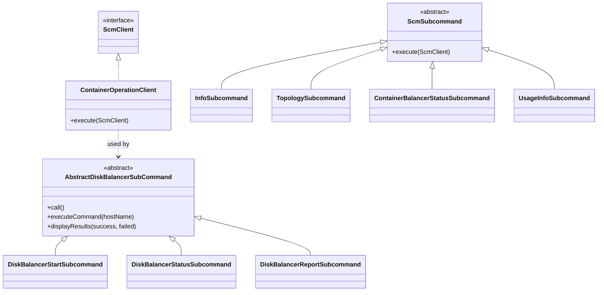

# admin-clis / admin

_This feature page was generated from `study/atlas/components/admin-clis/admin.md`. Author prose belongs above or below the BEGIN/END markers._

{/* BEGIN atlas-generated */}

**Classes:** 101    **Kinds:** cli:80, service:20, dto:1

## Overview

The `admin` feature group implements `ozone admin`, the operator-facing CLI for SCM and OM management. Its 101 classes split into two layers: a thin RPC facade (`ContainerOperationClient` implements `ScmClient` and delegates every call to `StorageContainerLocationProtocol`) and a large set of Picocli subcommands that call through that facade. Subcommands cover containers, pipelines, datanodes, disk balancing, container balancing, safe mode, certificates, replication manager, OM lifecycle, upgrade finalization, and namespace summary. `AbstractDiskBalancerSubCommand` adds a batch-execution loop that resolves UUID-based node IDs through SCM before dispatching to individual datanode gRPC endpoints. `ContainerBalancerStatusSubcommand` reads rich iteration-history protos from SCM and formats them for human or JSON output. The OM-facing subcommands (under `org.apache.hadoop.ozone.admin.om`) connect via the OM admin protocol rather than SCM, keeping the two service paths independent.

## Diagram

## Class table

### Sub-feature: `admin.nssummary`

| reading_order | fqcn | kind | logic | loc | study (min) | role |
|--:|---|---|---|--:|--:|---|
| 1207 | <Fqcn>org.apache.hadoop.ozone.admin.nssummary.NSSummaryCLIUtils</Fqcn> | service | mixed | 100~ | 30 | Utility class to support Namespace CLI. |
| 1208 | <Fqcn>org.apache.hadoop.ozone.admin.nssummary.NSSummaryAdmin</Fqcn> | service | mixed | 50~ | 30 | Subcommand for admin operations related to OM. |
| 1209 | <Fqcn>org.apache.hadoop.ozone.admin.nssummary.DiskUsageSubCommand</Fqcn> | cli | mixed | 150~ | 20 | Disk Usage Subcommand. |
| 1210 | <Fqcn>org.apache.hadoop.ozone.admin.nssummary.SummarySubCommand</Fqcn> | cli | mixed | 75~ | 20 | Namespace Summary Subcommand. |
| 1211 | <Fqcn>org.apache.hadoop.ozone.admin.nssummary.QuotaUsageSubCommand</Fqcn> | cli | mixed | 75~ | 20 | Quota Usage Subcommand. |
| 1212 | <Fqcn>org.apache.hadoop.ozone.admin.nssummary.FileSizeDistSubCommand</Fqcn> | cli | mixed | 75~ | 20 | File Size Distribution Subcommand. |

### Sub-feature: `admin.om`

| reading_order | fqcn | kind | logic | loc | study (min) | role |
|--:|---|---|---|--:|--:|---|
| 1213 | <Fqcn>org.apache.hadoop.ozone.admin.om.OmAddressOptions</Fqcn> | service | mixed | 100~ | 30 | Defines command-line options for OM address, whether service or single host. |
| 1214 | <Fqcn>org.apache.hadoop.ozone.admin.om.OMAdmin</Fqcn> | service | mixed | 75~ | 30 | Subcommand for admin operations related to OM. |
| 1215 | <Fqcn>org.apache.hadoop.ozone.admin.om.ListOpenFilesSubCommand</Fqcn> | cli | mixed | 175~ | 20 | inferred: ListOpenFilesSubCommand — role not documented. |
| 1216 | <Fqcn>org.apache.hadoop.ozone.admin.om.PrepareSubCommand</Fqcn> | cli | mixed | 125~ | 20 | Handler of ozone admin om prepare command. |
| 1217 | <Fqcn>org.apache.hadoop.ozone.admin.om.DecommissionOMSubcommand</Fqcn> | cli | mixed | 125~ | 20 | inferred: DecommissionOMSubcommand — role not documented. |
| 1218 | <Fqcn>org.apache.hadoop.ozone.admin.om.FinalizeUpgradeSubCommand</Fqcn> | cli | mixed | 100~ | 20 | Handler of ozone admin om finalizeUpgrade command. |
| 1219 | <Fqcn>org.apache.hadoop.ozone.admin.om.GetServiceRolesSubcommand</Fqcn> | cli | mixed | 75~ | 20 | Handler of om roles command. |
| 1220 | <Fqcn>org.apache.hadoop.ozone.admin.om.LifecycleStatusSubCommand</Fqcn> | cli | mixed | 50~ | 20 | Handler of ozone admin om lifecycle status command. |
| 1221 | <Fqcn>org.apache.hadoop.ozone.admin.om.LifecycleSuspendSubCommand</Fqcn> | cli | mixed | 50~ | 20 | Handler of ozone admin om lifecycle suspend command. |
| 1222 | <Fqcn>org.apache.hadoop.ozone.admin.om.TransferOmLeaderSubCommand</Fqcn> | cli | mixed | 25~ | 20 | Handler of ozone admin om transfer command. |
| 1223 | <Fqcn>org.apache.hadoop.ozone.admin.om.CancelPrepareSubCommand</Fqcn> | cli | mixed | 25~ | 20 | Handler of ozone admin om cancelprepare command. |
| 1224 | <Fqcn>org.apache.hadoop.ozone.admin.om.FetchKeySubCommand</Fqcn> | cli | mixed | 25~ | 20 | Handler of ozone admin om fetch-key command. |
| 1225 | <Fqcn>org.apache.hadoop.ozone.admin.om.LifecycleSubCommand</Fqcn> | cli | mixed | 25~ | 20 | Subcommand to admin operations related to Lifecycle Service. |
| 1226 | <Fqcn>org.apache.hadoop.ozone.admin.om.FinalizationStatusSubCommand</Fqcn> | cli | mixed | 25~ | 20 | Handler of ozone admin om finalizationstatus command. |
| 1227 | <Fqcn>org.apache.hadoop.ozone.admin.om.UpdateRangerSubcommand</Fqcn> | cli | mixed | 25~ | 20 | Handler of om updateranger command. |
| 1228 | <Fqcn>org.apache.hadoop.ozone.admin.om.LifecycleResumeSubCommand</Fqcn> | cli | mixed | 25~ | 20 | Handler of ozone admin om lifecycle resume command. |

### Sub-feature: `admin.reconfig`

| reading_order | fqcn | kind | logic | loc | study (min) | role |
|--:|---|---|---|--:|--:|---|
| 1229 | <Fqcn>org.apache.hadoop.ozone.admin.reconfig.ReconfigureSubCommandUtil</Fqcn> | service | mixed | 75~ | 30 | Reconfigure subcommand utils. |
| 1230 | <Fqcn>org.apache.hadoop.ozone.admin.reconfig.ReconfigureCommands</Fqcn> | cli | mixed | 50~ | 20 | Subcommand to group reconfigure OM related operations. |
| 1231 | <Fqcn>org.apache.hadoop.ozone.admin.reconfig.ReconfigureStatusSubcommand</Fqcn> | cli | mixed | 50~ | 20 | Handler of ozone admin reconfig status command. |
| 1232 | <Fqcn>org.apache.hadoop.ozone.admin.reconfig.AbstractReconfigureSubCommand</Fqcn> | cli | mixed | 25~ | 20 | An abstract Class use to ReconfigureSubCommand. |
| 1233 | <Fqcn>org.apache.hadoop.ozone.admin.reconfig.ReconfigurePropertiesSubcommand</Fqcn> | cli | mixed | 25~ | 20 | Handler of ozone admin reconfig properties command. |
| 1234 | <Fqcn>org.apache.hadoop.ozone.admin.reconfig.ReconfigureStartSubcommand</Fqcn> | cli | mixed | 25~ | 20 | Handler of ozone admin reconfig start command. |

### Sub-feature: `admin.scm`

| reading_order | fqcn | kind | logic | loc | study (min) | role |
|--:|---|---|---|--:|--:|---|
| 1235 | <Fqcn>org.apache.hadoop.ozone.admin.scm.DeletedBlocksTxnCommands</Fqcn> | service | mixed | 25~ | 30 | Subcommand to group container related operations. |
| 1236 | <Fqcn>org.apache.hadoop.ozone.admin.scm.ScmAdmin</Fqcn> | service | mixed | 25~ | 30 | Subcommand for admin operations related to SCM. |
| 1237 | <Fqcn>org.apache.hadoop.ozone.admin.scm.FinalizeScmUpgradeSubcommand</Fqcn> | cli | mixed | 100~ | 20 | Handler of Finalize SCM command. |
| 1238 | <Fqcn>org.apache.hadoop.ozone.admin.scm.GetScmRatisRolesSubcommand</Fqcn> | cli | mixed | 75~ | 20 | Handler of scm status command. |
| 1239 | <Fqcn>org.apache.hadoop.ozone.admin.scm.DecommissionScmSubcommand</Fqcn> | cli | mixed | 25~ | 20 | Handler of ozone admin scm decommission command. |
| 1240 | <Fqcn>org.apache.hadoop.ozone.admin.scm.RotateKeySubCommand</Fqcn> | cli | mixed | 25~ | 20 | inferred: RotateKeySubCommand — role not documented. |
| 1241 | <Fqcn>org.apache.hadoop.ozone.admin.scm.TransferScmLeaderSubCommand</Fqcn> | cli | mixed | 25~ | 20 | Handler of ozone admin scm transfer command. |
| 1242 | <Fqcn>org.apache.hadoop.ozone.admin.scm.GetDeletedBlockSummarySubcommand</Fqcn> | cli | mixed | 25~ | 20 | Handler of getting deleted blocks summary from SCM side. |
| 1243 | <Fqcn>org.apache.hadoop.ozone.admin.scm.FinalizationScmStatusSubcommand</Fqcn> | cli | mixed | 25~ | 20 | Handler of FinalizationStatus SCM command. |

### Sub-feature: `cli.cert`

| reading_order | fqcn | kind | logic | loc | study (min) | role |
|--:|---|---|---|--:|--:|---|
| 1244 | <Fqcn>org.apache.hadoop.hdds.scm.cli.cert.ListSubcommand</Fqcn> | cli | mixed | 125~ | 20 | This is the handler that process certificate list command. |
| 1245 | <Fqcn>org.apache.hadoop.hdds.scm.cli.cert.CertCommands</Fqcn> | cli | mixed | 25~ | 20 | Sub command for certificate related operations. |
| 1246 | <Fqcn>org.apache.hadoop.hdds.scm.cli.cert.InfoSubcommand</Fqcn> | cli | mixed | 25~ | 20 | This is the handler that process certificate info command. |
| 1247 | <Fqcn>org.apache.hadoop.hdds.scm.cli.cert.CleanExpiredCertsSubcommand</Fqcn> | cli | mixed | 25~ | 20 | This is the handler to clean SCM database from expired certificates. |
| 1248 | <Fqcn>org.apache.hadoop.hdds.scm.cli.cert.ScmCertSubcommand</Fqcn> | cli | mixed | 25~ | 20 | Base class for admin commands that connect via SCM security client. |

### Sub-feature: `cli.container`

| reading_order | fqcn | kind | logic | loc | study (min) | role |
|--:|---|---|---|--:|--:|---|
| 1249 | <Fqcn>org.apache.hadoop.hdds.scm.cli.container.ContainerIDParameters</Fqcn> | service | mixed | 50~ | 30 | Parameter for specifying list of container IDs. |
| 1250 | <Fqcn>org.apache.hadoop.hdds.scm.cli.container.InfoSubcommand</Fqcn> | cli | logic-heavy | 225~ | 20 | This is the handler that process container info command. |
| 1251 | <Fqcn>org.apache.hadoop.hdds.scm.cli.container.ReconcileSubcommand</Fqcn> | cli | mixed | 175~ | 20 | Handle the container reconcile CLI command. |
| 1252 | <Fqcn>org.apache.hadoop.hdds.scm.cli.container.ReportSubcommand</Fqcn> | cli | mixed | 125~ | 20 | This is the handler to process the container report command. |
| 1253 | <Fqcn>org.apache.hadoop.hdds.scm.cli.container.ListSubcommand</Fqcn> | cli | mixed | 100~ | 20 | The ListSubcommand class represents a command to list containers in a structured way. |
| 1254 | <Fqcn>org.apache.hadoop.hdds.scm.cli.container.UpgradeSubcommand</Fqcn> | cli | mixed | 25~ | 20 | inferred: UpgradeSubcommand — role not documented. |
| 1255 | <Fqcn>org.apache.hadoop.hdds.scm.cli.container.ContainerCommands</Fqcn> | cli | mixed | 25~ | 20 | Subcommand to group container related operations. |
| 1256 | <Fqcn>org.apache.hadoop.hdds.scm.cli.container.CreateSubcommand</Fqcn> | cli | mixed | 25~ | 20 | This is the handler that process container creation command. |
| 1257 | <Fqcn>org.apache.hadoop.hdds.scm.cli.container.CloseSubcommand</Fqcn> | cli | mixed | 25~ | 20 | The handler of close container command. |

### Sub-feature: `cli.datanode`

| reading_order | fqcn | kind | logic | loc | study (min) | role |
|--:|---|---|---|--:|--:|---|
| 1258 | <Fqcn>org.apache.hadoop.hdds.scm.cli.datanode.DiskBalancerSubCommandUtil</Fqcn> | service | mixed | 125~ | 30 | DiskBalancer subcommand utilities. |
| 1259 | <Fqcn>org.apache.hadoop.hdds.scm.cli.datanode.NodeSelectionMixin</Fqcn> | service | mixed | 25~ | 30 | Picocli mixin providing standardized datanode selection options for consistent CLI usage across commands. |
| 1260 | <Fqcn>org.apache.hadoop.hdds.scm.cli.datanode.DatanodeCommands</Fqcn> | service | mixed | 25~ | 30 | Subcommand for datanode related operations. |
| 1261 | <Fqcn>org.apache.hadoop.hdds.scm.cli.datanode.DatanodeParameters</Fqcn> | service | mixed | 25~ | 30 | Parameter for specifying list of datanode addresses. |
| 1262 | <Fqcn>org.apache.hadoop.hdds.scm.cli.datanode.DiskBalancerCommonOptions</Fqcn> | service | mixed | 25~ | 30 | Common options for DiskBalancer commands. |
| 1263 | <Fqcn>org.apache.hadoop.hdds.scm.cli.datanode.HostNameParameters</Fqcn> | service | mixed | 25~ | 30 | Parameter for specifying list of hostnames. |
| 1264 | <Fqcn>org.apache.hadoop.hdds.scm.cli.datanode.UsageInfoSubcommand</Fqcn> | cli | logic-heavy | 250~ | 20 | Command to list the usage info of a datanode. |
| 1265 | <Fqcn>org.apache.hadoop.hdds.scm.cli.datanode.AbstractDiskBalancerSubCommand</Fqcn> | cli | logic-heavy | 225~ | 20 | Abstract base class for DiskBalancer subcommands. |
| 1266 | <Fqcn>org.apache.hadoop.hdds.scm.cli.datanode.BasicDatanodeInfo</Fqcn> | dto | data-only | 175~ | 10 | Represents filtered Datanode information for json use. |
| 1267 | <Fqcn>org.apache.hadoop.hdds.scm.cli.datanode.ListInfoSubcommand</Fqcn> | cli | mixed | 175~ | 20 | Handler of list datanodes info command. |
| 1268 | <Fqcn>org.apache.hadoop.hdds.scm.cli.datanode.DiskBalancerReportSubcommand</Fqcn> | cli | mixed | 175~ | 20 | Handler to get disk balancer report. |
| 1269 | <Fqcn>org.apache.hadoop.hdds.scm.cli.datanode.DiskBalancerStatusSubcommand</Fqcn> | cli | mixed | 150~ | 20 | Handler to get disk balancer status. |
| 1270 | <Fqcn>org.apache.hadoop.hdds.scm.cli.datanode.DiskBalancerUpdateSubcommand</Fqcn> | cli | mixed | 125~ | 20 | Handler to update disk balancer configuration. |
| 1271 | <Fqcn>org.apache.hadoop.hdds.scm.cli.datanode.DecommissionStatusSubCommand</Fqcn> | cli | mixed | 125~ | 20 | Handler to print decommissioning nodes status. |
| 1272 | <Fqcn>org.apache.hadoop.hdds.scm.cli.datanode.DiskBalancerStartSubcommand</Fqcn> | cli | mixed | 125~ | 20 | Handler to start disk balancer. |
| 1273 | <Fqcn>org.apache.hadoop.hdds.scm.cli.datanode.DiskBalancerStopSubcommand</Fqcn> | cli | mixed | 50~ | 20 | Handler to stop disk balancer. |
| 1274 | <Fqcn>org.apache.hadoop.hdds.scm.cli.datanode.StatusSubCommand</Fqcn> | cli | mixed | 25~ | 20 | View status of one or more datanodes. |
| 1275 | <Fqcn>org.apache.hadoop.hdds.scm.cli.datanode.DiskBalancerCommands</Fqcn> | cli | mixed | 25~ | 20 | DiskBalancer command group for managing disk space balancing on Ozone datanodes. |
| 1276 | <Fqcn>org.apache.hadoop.hdds.scm.cli.datanode.MaintenanceSubCommand</Fqcn> | cli | mixed | 25~ | 20 | Place one or more datanodes into Maintenance Mode. |
| 1277 | <Fqcn>org.apache.hadoop.hdds.scm.cli.datanode.DecommissionSubCommand</Fqcn> | cli | mixed | 25~ | 20 | Decommission one or more datanodes. |
| 1278 | <Fqcn>org.apache.hadoop.hdds.scm.cli.datanode.RecommissionSubCommand</Fqcn> | cli | mixed | 25~ | 20 | Recommission one or more datanodes. |

### Sub-feature: `cli.pipeline`

| reading_order | fqcn | kind | logic | loc | study (min) | role |
|--:|---|---|---|--:|--:|---|
| 1279 | <Fqcn>org.apache.hadoop.hdds.scm.cli.pipeline.FilterPipelineOptions</Fqcn> | service | mixed | 50~ | 30 | Defines command-line option for filtering pipelines. |
| 1280 | <Fqcn>org.apache.hadoop.hdds.scm.cli.pipeline.ClosePipelineSubcommand</Fqcn> | cli | mixed | 50~ | 20 | Handler of close pipeline command. |
| 1281 | <Fqcn>org.apache.hadoop.hdds.scm.cli.pipeline.ListPipelinesSubcommand</Fqcn> | cli | mixed | 50~ | 20 | Handler of list pipelines command. |
| 1282 | <Fqcn>org.apache.hadoop.hdds.scm.cli.pipeline.CreatePipelineSubcommand</Fqcn> | cli | mixed | 25~ | 20 | Handler of createPipeline command. |
| 1283 | <Fqcn>org.apache.hadoop.hdds.scm.cli.pipeline.ActivatePipelineSubcommand</Fqcn> | cli | mixed | 25~ | 20 | Handler of activate pipeline command. |
| 1284 | <Fqcn>org.apache.hadoop.hdds.scm.cli.pipeline.PipelineCommands</Fqcn> | cli | mixed | 25~ | 20 | Subcommand to group pipeline related operations. |
| 1285 | <Fqcn>org.apache.hadoop.hdds.scm.cli.pipeline.DeactivatePipelineSubcommand</Fqcn> | cli | mixed | 25~ | 20 | Handler of deactivate pipeline command. |

### Sub-feature: `hdds.util`

| reading_order | fqcn | kind | logic | loc | study (min) | role |
|--:|---|---|---|--:|--:|---|
| 1286 | <Fqcn>org.apache.hadoop.hdds.util.DurationUtil</Fqcn> | service | mixed | 25~ | 30 | Pretty duration string representation. |

### Sub-feature: `om.lease`

| reading_order | fqcn | kind | logic | loc | study (min) | role |
|--:|---|---|---|--:|--:|---|
| 1287 | <Fqcn>org.apache.hadoop.ozone.admin.om.lease.LeaseRecoverer</Fqcn> | service | mixed | 25~ | 30 | CLI to recover the lease of a specified file. |
| 1288 | <Fqcn>org.apache.hadoop.ozone.admin.om.lease.LeaseSubCommand</Fqcn> | cli | mixed | 25~ | 20 | Handler of ozone admin om lease command. |

### Sub-feature: `om.snapshot`

| reading_order | fqcn | kind | logic | loc | study (min) | role |
|--:|---|---|---|--:|--:|---|
| 1289 | <Fqcn>org.apache.hadoop.ozone.admin.om.snapshot.DefragSubCommand</Fqcn> | cli | mixed | 75~ | 20 | Handler of ozone admin om snapshot defrag command. |
| 1290 | <Fqcn>org.apache.hadoop.ozone.admin.om.snapshot.SnapshotSubCommand</Fqcn> | cli | mixed | 25~ | 20 | Handler of ozone admin om snapshot command. |

### Sub-feature: `ozone.admin`

| reading_order | fqcn | kind | logic | loc | study (min) | role |
|--:|---|---|---|--:|--:|---|
| 1291 | <Fqcn>org.apache.hadoop.ozone.admin.OzoneAdmin</Fqcn> | service | mixed | 25~ | 30 | Ozone Admin Command line tool. |

### Sub-feature: `scm.cli`

| reading_order | fqcn | kind | logic | loc | study (min) | role |
|--:|---|---|---|--:|--:|---|
| 1292 | <Fqcn>org.apache.hadoop.hdds.scm.cli.ContainerOperationClient</Fqcn> | service | logic-heavy | 475~ | 60 | This class provides the client-facing APIs of container operations. |
| 1293 | <Fqcn>org.apache.hadoop.hdds.scm.cli.ScmOption</Fqcn> | service | mixed | 50~ | 30 | Defines command-line option for SCM address. |
| 1294 | <Fqcn>org.apache.hadoop.hdds.scm.cli.TopologySubcommand</Fqcn> | cli | logic-heavy | 225~ | 20 | Handler of printTopology command. |
| 1295 | <Fqcn>org.apache.hadoop.hdds.scm.cli.ContainerBalancerStatusSubcommand</Fqcn> | cli | logic-heavy | 200~ | 20 | Handler to query status of container balancer. |
| 1296 | <Fqcn>org.apache.hadoop.hdds.scm.cli.SafeModeCheckSubcommand</Fqcn> | cli | mixed | 150~ | 20 | This is the handler that process safe mode check command. |
| 1297 | <Fqcn>org.apache.hadoop.hdds.scm.cli.ContainerBalancerStartSubcommand</Fqcn> | cli | mixed | 100~ | 20 | Handler to start container balancer. |
| 1298 | <Fqcn>org.apache.hadoop.hdds.scm.cli.SafeModeWaitSubcommand</Fqcn> | cli | mixed | 50~ | 20 | This is the handler that process safe mode wait command. |
| 1299 | <Fqcn>org.apache.hadoop.hdds.scm.cli.ScmSubcommand</Fqcn> | cli | mixed | 25~ | 20 | Base class for admin commands that connect via SCM client. |
| 1300 | <Fqcn>org.apache.hadoop.hdds.scm.cli.SafeModeCommands</Fqcn> | cli | mixed | 25~ | 20 | Subcommand to group safe mode related operations. |
| 1301 | <Fqcn>org.apache.hadoop.hdds.scm.cli.ReplicationManagerCommands</Fqcn> | cli | mixed | 25~ | 20 | Subcommand to group replication manager related operations. |
| 1302 | <Fqcn>org.apache.hadoop.hdds.scm.cli.ReplicationManagerStatusSubcommand</Fqcn> | cli | mixed | 25~ | 20 | Handler to query status of replication manager. |
| 1303 | <Fqcn>org.apache.hadoop.hdds.scm.cli.ContainerBalancerStopSubcommand</Fqcn> | cli | mixed | 25~ | 20 | Handler to stop container balancer. |
| 1304 | <Fqcn>org.apache.hadoop.hdds.scm.cli.ReplicationManagerStartSubcommand</Fqcn> | cli | mixed | 25~ | 20 | Handler to start replication manager. |
| 1305 | <Fqcn>org.apache.hadoop.hdds.scm.cli.SafeModeExitSubcommand</Fqcn> | cli | mixed | 25~ | 20 | This is the handler that process safe mode exit command. |
| 1306 | <Fqcn>org.apache.hadoop.hdds.scm.cli.ReplicationManagerStopSubcommand</Fqcn> | cli | mixed | 25~ | 20 | Handler to stop replication manager. |
| 1307 | <Fqcn>org.apache.hadoop.hdds.scm.cli.ContainerBalancerCommands</Fqcn> | cli | mixed | 25~ | 20 | Subcommand to group container balancer related operations. |

## Anchor details

### `ContainerOperationClient`

- **path:** `hadoop-ozone/cli-admin/src/main/java/org/apache/hadoop/hdds/scm/cli/ContainerOperationClient.java`
- **loc:** 475~    **difficulty:** 5    **study:** 60 min    **concurrency:** single-threaded    **persistence:** in-memory
- **entry points:** `close`
- **key collaborators:** `org.apache.hadoop.hdds.client.ReplicationConfig`, `org.apache.hadoop.hdds.conf.ConfigurationSource`, `org.apache.hadoop.hdds.conf.OzoneConfiguration`, `org.apache.hadoop.hdds.protocol.DatanodeDetails`, `org.apache.hadoop.hdds.protocol.SecretKeyProtocolScm`, `org.apache.hadoop.hdds.scm.DatanodeAdminError`
- **role:** This class provides the client-facing APIs of container operations.

`createContainer` allocates via SCM then immediately issues a datanode `ContainerProtocolCalls.createContainer` RPC on the pipeline leader — two-phase create in one method. The `XceiverClientManager` is lazily initialized and guarded by `synchronized getXceiverClientManager()` to avoid creating it for read-only commands that never touch datanodes. `listContainer` silently caps the requested count at `OZONE_SCM_CONTAINER_LIST_MAX_COUNT` and logs a warning rather than throwing, which can confuse callers expecting a full page.

### `UsageInfoSubcommand`

- **path:** `hadoop-ozone/cli-admin/src/main/java/org/apache/hadoop/hdds/scm/cli/datanode/UsageInfoSubcommand.java`
- **loc:** 250~    **difficulty:** 2    **study:** 20 min    **concurrency:** single-threaded    **persistence:** in-memory
- **entry points:** `execute`
- **key collaborators:** `org.apache.hadoop.hdds.scm.cli.ScmSubcommand`, `org.apache.hadoop.hdds.cli.HddsVersionProvider`, `org.apache.hadoop.hdds.protocol.DatanodeDetails`, `org.apache.hadoop.hdds.scm.client.ScmClient`, `org.apache.hadoop.hdds.server.JsonUtils`
- **test exemplar:** `hadoop-ozone/cli-admin/src/test/java/org/apache/hadoop/hdds/scm/cli/datanode/TestUsageInfoSubcommand.java`
- **role:** Command to list the usage info of a datanode.

The `execute` method branches on whether a specific node address/UUID is given or a most/least-used count query: node-specific calls `getDatanodeUsageInfo(address, uuid)` while the sorted query calls `getDatanodeUsageInfo(mostUsed, count)`. The inner `DatanodeUsage` class holds both "Filesystem" stats (raw OS metrics, optional — guarded by `hasFsCapacity && hasFsAvailable`) and "Ozone" stats (capacity after reserved-space deduction), printed as separate labeled blocks to help diagnose disk-pressure situations.

### `AbstractDiskBalancerSubCommand`

- **path:** `hadoop-ozone/cli-admin/src/main/java/org/apache/hadoop/hdds/scm/cli/datanode/AbstractDiskBalancerSubCommand.java`
- **loc:** 225~    **difficulty:** 2    **study:** 20 min    **concurrency:** single-threaded    **persistence:** in-memory
- **entry points:** `call`
- **key collaborators:** `org.apache.hadoop.hdds.scm.cli.ContainerOperationClient`, `org.apache.hadoop.hdds.HddsConfigKeys`, `org.apache.hadoop.hdds.conf.OzoneConfiguration`, `org.apache.hadoop.hdds.scm.client.ScmClient`, `org.apache.hadoop.hdds.server.JsonUtils`
- **role:** Abstract base class for DiskBalancer subcommands.

`call()` checks `HDDS_DATANODE_DISK_BALANCER_ENABLED_KEY` from a locally loaded `OzoneConfiguration` before doing any RPC — if disk balancer is disabled in config the command exits immediately with a message rather than returning an error code. UUID-to-address resolution opens a short-lived `ContainerOperationClient` only when `--node-id` args are present or `--in-service-datanodes` is set, then closes it in a `finally` block. The `datanodeDisplayNames` map preserves pre-fetched SCM metadata for pretty-printing even when the per-node RPC later fails.

### `InfoSubcommand`

- **path:** `hadoop-ozone/cli-admin/src/main/java/org/apache/hadoop/hdds/scm/cli/container/InfoSubcommand.java`
- **loc:** 225~    **difficulty:** 2    **study:** 20 min    **concurrency:** single-threaded    **persistence:** in-memory
- **entry points:** `execute`
- **key collaborators:** `org.apache.hadoop.hdds.scm.cli.ScmSubcommand`, `org.apache.hadoop.hdds.HddsUtils`, `org.apache.hadoop.hdds.cli.HddsVersionProvider`, `org.apache.hadoop.hdds.client.ReplicationConfig`, `org.apache.hadoop.hdds.protocol.DatanodeDetails`, `org.apache.hadoop.hdds.scm.client.ScmClient`
- **role:** This is the handler that process container info command.

When a container's pipeline is empty (all associated datanodes are down or pipeline is deleted), `InfoSubcommand` wraps the output in `ContainerWithoutDatanodes` rather than `ContainerWithPipelineAndReplicas` to avoid serializing null datanode lists. For text output it attempts a second RPC (`getPipeline`) to show write-pipeline state, but catches `PipelineNotFoundException` and prints "CLOSED" — a deliberate graceful-degradation branch at line ~153 that makes the command safe to run on closed containers.

### `TopologySubcommand`

- **path:** `hadoop-ozone/cli-admin/src/main/java/org/apache/hadoop/hdds/scm/cli/TopologySubcommand.java`
- **loc:** 225~    **difficulty:** 2    **study:** 20 min    **concurrency:** single-threaded    **persistence:** in-memory
- **entry points:** `execute`
- **key collaborators:** `org.apache.hadoop.hdds.cli.AdminSubcommand`, `org.apache.hadoop.hdds.cli.HddsVersionProvider`, `org.apache.hadoop.hdds.protocol.DatanodeDetails`, `org.apache.hadoop.hdds.scm.client.ScmClient`, `org.apache.hadoop.hdds.server.JsonUtils`
- **role:** Handler of printTopology command.

`execute` iterates the fixed `STATES` list (HEALTHY, STALE, DEAD) and calls `queryNode` once per state, applying `--operational-state` and `--node-state` string filters client-side rather than server-side. The `--order` flag switches between `printOrderedByLocation` (groups by `networkLocation`, sorts alphabetically) and `printNodesWithLocation` (flat list with location column). Invalid state strings throw `InvalidPropertiesFormatException` rather than a picocli validation error — a rough edge in the user experience.

### `ContainerBalancerStatusSubcommand`

- **path:** `hadoop-ozone/cli-admin/src/main/java/org/apache/hadoop/hdds/scm/cli/ContainerBalancerStatusSubcommand.java`
- **loc:** 200~    **difficulty:** 2    **study:** 20 min    **concurrency:** single-threaded    **persistence:** in-memory
- **entry points:** `execute`
- **key collaborators:** `org.apache.hadoop.hdds.cli.HddsVersionProvider`, `org.apache.hadoop.hdds.scm.client.ScmClient`, `org.apache.hadoop.ozone.OzoneConsts`
- **role:** Handler to query status of container balancer.

`execute` calls `getContainerBalancerStatusInfo()` which returns a `ContainerBalancerStatusInfoResponseProto` containing the full iteration history. The `-v` flag gates the verbose path; `-H` (history) only has effect combined with `-v` — passing `-H` alone prints a warning but does not fail. Distinguishing the "currently running iteration" from completed iterations is done by filtering `iterationResult.isEmpty()` (empty string = in-progress) vs non-empty (finished).

## Design docs

- `hadoop-hdds/docs/content/tools/Admin.md` — operator reference for `ozone admin` subcommands.
- `hadoop-hdds/docs/content/design/diskbalancer.md` — design doc for the DiskBalancer feature that the disk-balancer subcommand group drives.
- `hadoop-hdds/docs/content/feature/ContainerBalancer.md` — ContainerBalancer feature doc, background for `ContainerBalancerStatusSubcommand` and `ContainerBalancerStartSubcommand`.

## Seminal JIRAs / PRs

- [HDDS-14195](https://issues.apache.org/jira/browse/HDDS-14195). [DiskBalancer] Improve DiskBalancer CLI Output Readability and Usability
- [HDDS-15306](https://issues.apache.org/jira/browse/HDDS-15306). Expose Disk Balancer CLI in top-level datanode help and improve usability
- [HDDS-15490](https://issues.apache.org/jira/browse/HDDS-15490). [DiskBalancer] Align batch CLI success messages with HEALTHY IN_SERVICE datanode selection
- [HDDS-15667](https://issues.apache.org/jira/browse/HDDS-15667). `containerbalancer status`: show stop reason and iteration details after stop
- [HDDS-15690](https://issues.apache.org/jira/browse/HDDS-15690). Support Node-ID for DiskBalancer Commands
- [HDDS-14108](https://issues.apache.org/jira/browse/HDDS-14108). Provide option in 'scm safemode status' to show status of all SCM nodes
- [HDDS-14103](https://issues.apache.org/jira/browse/HDDS-14103). Create an option to suppress/unsuppress containers from report

## Sharp edges

- `ContainerOperationClient.listContainer` silently caps the page size at `OZONE_SCM_CONTAINER_LIST_MAX_COUNT` (default 50 000) with only a WARN log — callers expecting the full count get fewer results without an error (see `ContainerOperationClient.java` lines 368-375 and 383-390).
- `TopologySubcommand` filters operational state and node state strings client-side using raw string comparison. An unrecognized state string throws `InvalidPropertiesFormatException` rather than a picocli `ParameterException`, so the error message is less user-friendly (TopologySubcommand.java lines 102-122).
- `AbstractDiskBalancerSubCommand.call()` reads `HDDS_DATANODE_DISK_BALANCER_ENABLED_KEY` from a fresh local `OzoneConfiguration`, not from the cluster config fetched via SCM — if the operator has enabled disk balancer only on the server, the CLI may still refuse to run (AbstractDiskBalancerSubCommand.java lines 76-82).

## Related features

- `components/admin-clis/cli-common.md` — base classes (`GenericCli`, `ScmSubcommand`) that all admin subcommands extend.
- `components/admin-clis/shell.md` — user-facing `ozone sh` commands that share the same Picocli scaffolding.
- `components/admin-clis/interactive-shell.md` — `ozone interactive` wraps both admin and shell commands.
- `components/SCM/container-balancer.md` — server-side ContainerBalancer that the `containerbalancer` subcommands control.
- `components/Datanode/disk-balancer.md` — server-side DiskBalancer that the `diskbalancer` subcommands drive.

## Self-quiz

1. `ContainerOperationClient.createContainer` performs a two-phase operation. Name the two RPCs it issues and the order they occur.
2. `AbstractDiskBalancerSubCommand.call()` guards execution with a local config check before opening any SCM connection. Which config key does it read, and what happens if the check fails?
3. `InfoSubcommand.printDetails` uses two different JSON wrapper classes depending on pipeline state. What condition triggers `ContainerWithoutDatanodes` vs `ContainerWithPipelineAndReplicas`?
4. `TopologySubcommand.execute` queries SCM three times. What drives this loop, and what are the three values?
5. `ContainerBalancerStatusSubcommand` distinguishes an in-progress iteration from a completed one without a separate boolean field. What property of the proto message is used for this test?

Answers

Answer 1: First `storageContainerLocationClient.allocateContainer` (SCM RPC to register the container and get a pipeline), then `ContainerProtocolCalls.createContainer` (datanode RPC on the pipeline leader to physically create the container). SCM allocation always precedes datanode creation.

Answer 2: It reads `HddsConfigKeys.HDDS_DATANODE_DISK_BALANCER_ENABLED_KEY`. If the key evaluates to false it prints an error to stderr and returns null, aborting execution without contacting SCM.

Answer 3: `container.getPipeline().isEmpty()` — when the pipeline has no nodes (all datanodes unreachable or pipeline deleted), `ContainerWithoutDatanodes` is used; otherwise `ContainerWithPipelineAndReplicas` is used.

Answer 4: The static `STATES` list: `[HEALTHY, STALE, DEAD]`. `execute` calls `scmClient.queryNode(null, state, CLUSTER, "")` once for each of those three values.

Answer 5: `iterationResult.isEmpty()` on `ContainerBalancerTaskIterationStatusInfoProto`. An empty string means the iteration is still running; a non-empty string (e.g. "ITERATION_COMPLETED") means it has finished.

{/* END atlas-generated */}
