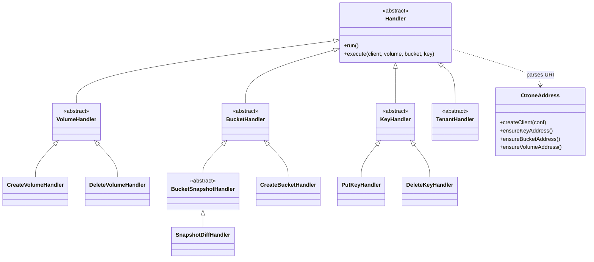

# admin-clis / shell

_This feature page was generated from `study/atlas/components/admin-clis/shell.md`. Author prose belongs above or below the BEGIN/END markers._

{/* BEGIN atlas-generated */}

**Classes:** 112    **Kinds:** service:62, cli:36, abstract:11, interface:3

## Overview

The `shell` feature group implements `ozone sh`, the user-facing CLI for managing volumes, buckets, keys, snapshots, tokens, tenants, prefixes, and ACLs. Its 112 classes follow a strict hierarchy: `OzoneAddress` parses and validates an `o3://[host]/vol/bucket/key` URI and manufactures the appropriate `OzoneClient` (plain, HA service-ID, or host+port); `Handler` is the abstract base that opens a client via `OzoneAddress` and delegates to a concrete handler's `execute(ObjectStore, OzoneVolume, ...)` method; domain-specific abstract classes (`VolumeHandler`, `BucketHandler`, `KeyHandler`, etc.) narrow the open client to the appropriate Ozone object before passing control to the leaf handler. The `Shell` interface and `OzoneShell` class are the Picocli parent commands that group sub-trees by object type. The snapshot, tenant, S3-secret, token, and prefix namespaces each contribute their own handler and command-grouping classes following the same pattern. All handlers are single-use, single-threaded CLI invocations; none hold persistent state.

## Diagram

## Class table

### Sub-feature: `ozone.shell`

| reading_order | fqcn | kind | logic | loc | study (min) | role |
|--:|---|---|---|--:|--:|---|
| 2561 | <Fqcn>org.apache.hadoop.ozone.shell.Shell</Fqcn> | abstract | mixed | 75~ | 20 | Ozone user interface commands. |
| 2562 | <Fqcn>org.apache.hadoop.ozone.shell.Handler</Fqcn> | abstract | mixed | 50~ | 30 | inferred: Handler — role not documented. |
| 2563 | <Fqcn>org.apache.hadoop.ozone.shell.ReplicationOptions</Fqcn> | abstract | mixed | 50~ | 30 | Common options for specifying replication config: specialized for Ozone Shell and Freon commands. |
| 2564 | <Fqcn>org.apache.hadoop.ozone.shell.OzoneAddress</Fqcn> | service | logic-heavy | 325~ | 45 | Address of an ozone object for ozone shell. |
| 2565 | <Fqcn>org.apache.hadoop.ozone.shell.OzoneInteractiveWelcome</Fqcn> | service | mixed | 50~ | 30 | Startup banner for ozone interactive. |
| 2566 | <Fqcn>org.apache.hadoop.ozone.shell.REPL</Fqcn> | service | mixed | 50~ | 30 | Interactive shell for Ozone commands. |
| 2567 | <Fqcn>org.apache.hadoop.ozone.shell.StoreTypeOption</Fqcn> | service | mixed | 25~ | 30 | Option for org.apache.hadoop.ozone.security.acl.OzoneObj.StoreType. |
| 2568 | <Fqcn>org.apache.hadoop.ozone.shell.MandatoryReplicationOptions</Fqcn> | service | mixed | 25~ | 30 | Options for requiring replication config in 'ozone shell' commands. |
| 2569 | <Fqcn>org.apache.hadoop.ozone.shell.SetSpaceQuotaOptions</Fqcn> | service | mixed | 25~ | 30 | Common options for 'quota' commands. |
| 2570 | <Fqcn>org.apache.hadoop.ozone.shell.PrefixFilterOption</Fqcn> | service | mixed | 25~ | 30 | Option for filtering lists by prefix. |
| 2571 | <Fqcn>org.apache.hadoop.ozone.shell.ShellReplicationOptions</Fqcn> | service | mixed | 25~ | 30 | Options for specifying replication config in 'ozone shell' commands. |
| 2572 | <Fqcn>org.apache.hadoop.ozone.shell.ListLimitOptions</Fqcn> | service | mixed | 25~ | 30 | Options for limiting the size of lists. |
| 2573 | <Fqcn>org.apache.hadoop.ozone.shell.ListPaginationOptions</Fqcn> | service | mixed | 25~ | 30 | Options to provide pagination of lists. |
| 2574 | <Fqcn>org.apache.hadoop.ozone.shell.ClearSpaceQuotaOptions</Fqcn> | service | mixed | 25~ | 30 | Common options for 'clrquota' commands. |
| 2575 | <Fqcn>org.apache.hadoop.ozone.shell.OzoneShell</Fqcn> | cli | mixed | 25~ | 20 | Shell commands for native rpc object manipulation. |

### Sub-feature: `shell.acl`

| reading_order | fqcn | kind | logic | loc | study (min) | role |
|--:|---|---|---|--:|--:|---|
| 2576 | <Fqcn>org.apache.hadoop.ozone.shell.acl.AclHandler</Fqcn> | abstract | mixed | 25~ | 30 | Base class for ACL-related commands. |
| 2577 | <Fqcn>org.apache.hadoop.ozone.shell.acl.GetAclHandler</Fqcn> | abstract | mixed | 25~ | 30 | Get ACLs. |
| 2578 | <Fqcn>org.apache.hadoop.ozone.shell.acl.AclOption</Fqcn> | service | mixed | 50~ | 30 | Defines command-line option for specifying one or more ACLs. |

### Sub-feature: `shell.bucket`

| reading_order | fqcn | kind | logic | loc | study (min) | role |
|--:|---|---|---|--:|--:|---|
| 2579 | <Fqcn>org.apache.hadoop.ozone.shell.bucket.BucketHandler</Fqcn> | abstract | mixed | 25~ | 30 | Base class for bucket command handlers. |
| 2580 | <Fqcn>org.apache.hadoop.ozone.shell.bucket.GetAclBucketHandler</Fqcn> | service | mixed | 50~ | 30 | Get ACL of bucket. |
| 2581 | <Fqcn>org.apache.hadoop.ozone.shell.bucket.SetReplicationConfigHandler</Fqcn> | service | mixed | 25~ | 30 | set replication configuration of the bucket. |
| 2582 | <Fqcn>org.apache.hadoop.ozone.shell.bucket.SetEncryptionKey</Fqcn> | service | mixed | 25~ | 30 | inferred: SetEncryptionKey — role not documented. |
| 2583 | <Fqcn>org.apache.hadoop.ozone.shell.bucket.BucketUri</Fqcn> | service | mixed | 25~ | 30 | URI parameter for bucket-specific commands. |
| 2584 | <Fqcn>org.apache.hadoop.ozone.shell.bucket.AddAclBucketHandler</Fqcn> | service | mixed | 25~ | 30 | Add ACL to bucket. |
| 2585 | <Fqcn>org.apache.hadoop.ozone.shell.bucket.SetAclBucketHandler</Fqcn> | service | mixed | 25~ | 30 | Set ACL on bucket. |
| 2586 | <Fqcn>org.apache.hadoop.ozone.shell.bucket.RemoveAclBucketHandler</Fqcn> | service | mixed | 25~ | 30 | Remove ACL from bucket. |
| 2587 | <Fqcn>org.apache.hadoop.ozone.shell.bucket.DeleteBucketHandler</Fqcn> | cli | mixed | 100~ | 20 | Delete bucket Handler. |
| 2588 | <Fqcn>org.apache.hadoop.ozone.shell.bucket.CreateBucketHandler</Fqcn> | cli | mixed | 100~ | 20 | create bucket handler. |
| 2589 | <Fqcn>org.apache.hadoop.ozone.shell.bucket.SetQuotaHandler</Fqcn> | cli | mixed | 50~ | 20 | set quota of the bucket. |
| 2590 | <Fqcn>org.apache.hadoop.ozone.shell.bucket.InfoBucketHandler</Fqcn> | cli | mixed | 50~ | 20 | Executes Info bucket. |
| 2591 | <Fqcn>org.apache.hadoop.ozone.shell.bucket.UpdateBucketHandler</Fqcn> | cli | mixed | 25~ | 20 | Executes update bucket calls. |
| 2592 | <Fqcn>org.apache.hadoop.ozone.shell.bucket.ListBucketHandler</Fqcn> | cli | mixed | 25~ | 20 | Executes List Bucket. |
| 2593 | <Fqcn>org.apache.hadoop.ozone.shell.bucket.BucketCommands</Fqcn> | cli | mixed | 25~ | 20 | Subcommands for the bucket related operations. |
| 2594 | <Fqcn>org.apache.hadoop.ozone.shell.bucket.LinkBucketHandler</Fqcn> | cli | mixed | 25~ | 20 | Creates a symlink to another bucket. |
| 2595 | <Fqcn>org.apache.hadoop.ozone.shell.bucket.ClearQuotaHandler</Fqcn> | cli | mixed | 25~ | 20 | clean quota of the bucket. |

### Sub-feature: `shell.common`

| reading_order | fqcn | kind | logic | loc | study (min) | role |
|--:|---|---|---|--:|--:|---|
| 2596 | <Fqcn>org.apache.hadoop.ozone.shell.common.VolumeBucketHandler</Fqcn> | abstract | mixed | 25~ | 30 | Base class for commands that accept both volume and bucket. |
| 2597 | <Fqcn>org.apache.hadoop.ozone.shell.common.VolumeBucketUri</Fqcn> | service | mixed | 25~ | 30 | URI parameter for volume or bucket specific commands. |

### Sub-feature: `shell.keys`

| reading_order | fqcn | kind | logic | loc | study (min) | role |
|--:|---|---|---|--:|--:|---|
| 2598 | <Fqcn>org.apache.hadoop.ozone.shell.keys.DeleteKeyHandler</Fqcn> | cli | mixed | 100~ | 20 | Executes Delete Key. |
| 2599 | <Fqcn>org.apache.hadoop.ozone.shell.keys.KeyHandler</Fqcn> | abstract | mixed | 25~ | 30 | Base class for key command handlers. |
| 2600 | <Fqcn>org.apache.hadoop.ozone.shell.keys.ChecksumKeyHandler</Fqcn> | service | mixed | 50~ | 30 | Class to display checksum information about an existing key. |
| 2601 | <Fqcn>org.apache.hadoop.ozone.shell.keys.KeyUri</Fqcn> | service | mixed | 25~ | 30 | URI parameter for key-specific commands. |
| 2602 | <Fqcn>org.apache.hadoop.ozone.shell.keys.RewriteKeyHandler</Fqcn> | service | mixed | 25~ | 30 | Rewrite a key with different replication. |
| 2603 | <Fqcn>org.apache.hadoop.ozone.shell.keys.GetAclKeyHandler</Fqcn> | service | mixed | 25~ | 30 | Get ACL of key. |
| 2604 | <Fqcn>org.apache.hadoop.ozone.shell.keys.SetAclKeyHandler</Fqcn> | service | mixed | 25~ | 30 | Set ACL on keys. |
| 2605 | <Fqcn>org.apache.hadoop.ozone.shell.keys.AddAclKeyHandler</Fqcn> | service | mixed | 25~ | 30 | Add ACL to key. |
| 2606 | <Fqcn>org.apache.hadoop.ozone.shell.keys.RemoveAclKeyHandler</Fqcn> | service | mixed | 25~ | 30 | Remove ACL from keys. |
| 2607 | <Fqcn>org.apache.hadoop.ozone.shell.keys.ListKeyHandler</Fqcn> | cli | mixed | 100~ | 20 | Executes List Keys for a bucket or snapshot. |
| 2608 | <Fqcn>org.apache.hadoop.ozone.shell.keys.PutKeyHandler</Fqcn> | cli | mixed | 100~ | 20 | Puts a file into an ozone bucket. |
| 2609 | <Fqcn>org.apache.hadoop.ozone.shell.keys.GetKeyHandler</Fqcn> | cli | mixed | 50~ | 20 | Gets an existing key. |
| 2610 | <Fqcn>org.apache.hadoop.ozone.shell.keys.CopyKeyHandler</Fqcn> | cli | mixed | 50~ | 20 | Copy an existing key to another one within the same bucket. |
| 2611 | <Fqcn>org.apache.hadoop.ozone.shell.keys.KeyCommands</Fqcn> | cli | mixed | 25~ | 20 | Subcommand to group key related operations. |
| 2612 | <Fqcn>org.apache.hadoop.ozone.shell.keys.CatKeyHandler</Fqcn> | cli | mixed | 25~ | 20 | Cat an existing key. |
| 2613 | <Fqcn>org.apache.hadoop.ozone.shell.keys.InfoKeyHandler</Fqcn> | cli | mixed | 25~ | 20 | Executes Info Object. |
| 2614 | <Fqcn>org.apache.hadoop.ozone.shell.keys.RenameKeyHandler</Fqcn> | cli | mixed | 25~ | 20 | Renames an existing key. |

### Sub-feature: `shell.prefix`

| reading_order | fqcn | kind | logic | loc | study (min) | role |
|--:|---|---|---|--:|--:|---|
| 2615 | <Fqcn>org.apache.hadoop.ozone.shell.prefix.AddAclPrefixHandler</Fqcn> | service | mixed | 25~ | 30 | Add ACL to prefix. |
| 2616 | <Fqcn>org.apache.hadoop.ozone.shell.prefix.SetAclPrefixHandler</Fqcn> | service | mixed | 25~ | 30 | Set ACL on prefix. |
| 2617 | <Fqcn>org.apache.hadoop.ozone.shell.prefix.RemoveAclPrefixHandler</Fqcn> | service | mixed | 25~ | 30 | Remove ACL from prefix. |
| 2618 | <Fqcn>org.apache.hadoop.ozone.shell.prefix.GetAclPrefixHandler</Fqcn> | service | mixed | 25~ | 30 | Get ACL of prefix. |
| 2619 | <Fqcn>org.apache.hadoop.ozone.shell.prefix.PrefixUri</Fqcn> | service | mixed | 25~ | 30 | URI parameter for prefix-specific commands. |
| 2620 | <Fqcn>org.apache.hadoop.ozone.shell.prefix.PrefixCommands</Fqcn> | cli | mixed | 25~ | 20 | Subcommands for the prefix related operations. |

### Sub-feature: `shell.s3`

| reading_order | fqcn | kind | logic | loc | study (min) | role |
|--:|---|---|---|--:|--:|---|
| 2621 | <Fqcn>org.apache.hadoop.ozone.shell.s3.S3Handler</Fqcn> | abstract | mixed | 25~ | 20 | Common interface for S3 command handling. |
| 2622 | <Fqcn>org.apache.hadoop.ozone.shell.s3.RevokeS3SecretHandler</Fqcn> | cli | mixed | 25~ | 20 | Executes revokesecret calls. |
| 2623 | <Fqcn>org.apache.hadoop.ozone.shell.s3.GetS3SecretHandler</Fqcn> | cli | mixed | 25~ | 20 | Executes getsecret calls. |
| 2624 | <Fqcn>org.apache.hadoop.ozone.shell.s3.SetS3SecretHandler</Fqcn> | cli | mixed | 25~ | 20 | ozone s3 setsecret. |
| 2625 | <Fqcn>org.apache.hadoop.ozone.shell.s3.S3Shell</Fqcn> | cli | mixed | 25~ | 20 | Shell for s3 related operations. |

### Sub-feature: `shell.snapshot`

| reading_order | fqcn | kind | logic | loc | study (min) | role |
|--:|---|---|---|--:|--:|---|
| 2626 | <Fqcn>org.apache.hadoop.ozone.shell.snapshot.BucketSnapshotHandler</Fqcn> | abstract | mixed | 25~ | 30 | Base class for bucket commands that require a snapshot URI. |
| 2627 | <Fqcn>org.apache.hadoop.ozone.shell.snapshot.SnapshotDiffHandler</Fqcn> | service | mixed | 150~ | 45 | ozone sh snapshot diff. |
| 2628 | <Fqcn>org.apache.hadoop.ozone.shell.snapshot.InfoSnapshotHandler</Fqcn> | service | mixed | 25~ | 30 | ozone sh snapshot info. |
| 2629 | <Fqcn>org.apache.hadoop.ozone.shell.snapshot.ListSnapshotDiffHandler</Fqcn> | service | mixed | 25~ | 30 | ozone sh snapshot listDiff. |
| 2630 | <Fqcn>org.apache.hadoop.ozone.shell.snapshot.RenameSnapshotHandler</Fqcn> | service | mixed | 25~ | 30 | ozone sh snapshot rename. |
| 2631 | <Fqcn>org.apache.hadoop.ozone.shell.snapshot.ListSnapshotHandler</Fqcn> | service | mixed | 25~ | 30 | ozone sh snapshot list. |
| 2632 | <Fqcn>org.apache.hadoop.ozone.shell.snapshot.CreateSnapshotHandler</Fqcn> | service | mixed | 25~ | 30 | ozone sh snapshot create. |
| 2633 | <Fqcn>org.apache.hadoop.ozone.shell.snapshot.SnapshotUri</Fqcn> | service | mixed | 25~ | 30 | URI parameter for snapshot-specific commands. |
| 2634 | <Fqcn>org.apache.hadoop.ozone.shell.snapshot.DeleteSnapshotHandler</Fqcn> | service | mixed | 25~ | 30 | ozone sh snapshot delete. |
| 2635 | <Fqcn>org.apache.hadoop.ozone.shell.snapshot.SnapshotCommands</Fqcn> | cli | mixed | 25~ | 20 | Subcommands for the snapshot related operations. |

### Sub-feature: `shell.tenant`

| reading_order | fqcn | kind | logic | loc | study (min) | role |
|--:|---|---|---|--:|--:|---|
| 2636 | <Fqcn>org.apache.hadoop.ozone.shell.tenant.TenantHandler</Fqcn> | abstract | mixed | 25~ | 30 | Base class for tenant command handlers. |
| 2637 | <Fqcn>org.apache.hadoop.ozone.shell.tenant.GetUserInfoHandler</Fqcn> | service | mixed | 50~ | 30 | ozone tenant user info. |
| 2638 | <Fqcn>org.apache.hadoop.ozone.shell.tenant.TenantListHandler</Fqcn> | service | mixed | 25~ | 30 | ozone tenant list. |
| 2639 | <Fqcn>org.apache.hadoop.ozone.shell.tenant.TenantUserCommands</Fqcn> | service | mixed | 25~ | 30 | Subcommand to group tenant user related operations. |
| 2640 | <Fqcn>org.apache.hadoop.ozone.shell.tenant.TenantListUsersHandler</Fqcn> | service | mixed | 25~ | 30 | Command to list users in a tenant along with corresponding accessId. |
| 2641 | <Fqcn>org.apache.hadoop.ozone.shell.tenant.TenantAssignUserAccessIdHandler</Fqcn> | service | mixed | 25~ | 30 | ozone tenant user assign. |
| 2642 | <Fqcn>org.apache.hadoop.ozone.shell.tenant.TenantBucketLinkHandler</Fqcn> | service | mixed | 25~ | 30 | ozone tenant linkbucket. |
| 2643 | <Fqcn>org.apache.hadoop.ozone.shell.tenant.TenantDeleteHandler</Fqcn> | service | mixed | 25~ | 30 | ozone tenant delete. |
| 2644 | <Fqcn>org.apache.hadoop.ozone.shell.tenant.TenantGetSecretHandler</Fqcn> | service | mixed | 25~ | 30 | ozone tenant user get-secret. |
| 2645 | <Fqcn>org.apache.hadoop.ozone.shell.tenant.TenantCreateHandler</Fqcn> | service | mixed | 25~ | 30 | ozone tenant create. |
| 2646 | <Fqcn>org.apache.hadoop.ozone.shell.tenant.TenantAssignAdminHandler</Fqcn> | service | mixed | 25~ | 30 | ozone tenant user assign-admin. |
| 2647 | <Fqcn>org.apache.hadoop.ozone.shell.tenant.TenantRevokeAdminHandler</Fqcn> | service | mixed | 25~ | 30 | ozone tenant user revoke-admin. |
| 2648 | <Fqcn>org.apache.hadoop.ozone.shell.tenant.TenantSetSecretHandler</Fqcn> | service | mixed | 25~ | 30 | ozone tenant user set-secret. |
| 2649 | <Fqcn>org.apache.hadoop.ozone.shell.tenant.TenantRevokeUserAccessIdHandler</Fqcn> | service | mixed | 25~ | 30 | ozone tenant user revoke. |
| 2650 | <Fqcn>org.apache.hadoop.ozone.shell.tenant.TenantShell</Fqcn> | cli | mixed | 25~ | 20 | Shell for multi-tenant related operations. |

### Sub-feature: `shell.token`

| reading_order | fqcn | kind | logic | loc | study (min) | role |
|--:|---|---|---|--:|--:|---|
| 2651 | <Fqcn>org.apache.hadoop.ozone.shell.token.TokenHandler</Fqcn> | abstract | mixed | 25~ | 30 | Handler for requests with an existing token. |
| 2652 | <Fqcn>org.apache.hadoop.ozone.shell.token.TokenOption</Fqcn> | service | mixed | 50~ | 30 | Option for token file. |
| 2653 | <Fqcn>org.apache.hadoop.ozone.shell.token.PrintTokenHandler</Fqcn> | cli | mixed | 25~ | 30 | inferred: PrintTokenHandler — role not documented. |
| 2654 | <Fqcn>org.apache.hadoop.ozone.shell.token.RenewerOption</Fqcn> | service | mixed | 25~ | 30 | Option for token renewer. |
| 2655 | <Fqcn>org.apache.hadoop.ozone.shell.token.TokenCommands</Fqcn> | cli | mixed | 25~ | 20 | Sub-command to group token related operations. |
| 2656 | <Fqcn>org.apache.hadoop.ozone.shell.token.GetTokenHandler</Fqcn> | cli | mixed | 25~ | 20 | Executes getDelegationToken api. |
| 2657 | <Fqcn>org.apache.hadoop.ozone.shell.token.RenewTokenHandler</Fqcn> | cli | mixed | 25~ | 20 | Executes renewDelegationToken api. |
| 2658 | <Fqcn>org.apache.hadoop.ozone.shell.token.CancelTokenHandler</Fqcn> | cli | mixed | 25~ | 20 | Executes cancelDelegationToken api. |

### Sub-feature: `shell.volume`

| reading_order | fqcn | kind | logic | loc | study (min) | role |
|--:|---|---|---|--:|--:|---|
| 2659 | <Fqcn>org.apache.hadoop.ozone.shell.volume.VolumeHandler</Fqcn> | abstract | mixed | 25~ | 30 | Base class for volume command handlers. |
| 2660 | <Fqcn>org.apache.hadoop.ozone.shell.volume.DeleteVolumeHandler</Fqcn> | cli | mixed | 150~ | 45 | Executes deleteVolume call for the shell. |
| 2661 | <Fqcn>org.apache.hadoop.ozone.shell.volume.VolumeUri</Fqcn> | service | mixed | 25~ | 30 | URI parameter for volume-specific commands. |
| 2662 | <Fqcn>org.apache.hadoop.ozone.shell.volume.RemoveAclVolumeHandler</Fqcn> | service | mixed | 25~ | 30 | Remove ACL from volume. |
| 2663 | <Fqcn>org.apache.hadoop.ozone.shell.volume.SetAclVolumeHandler</Fqcn> | service | mixed | 25~ | 30 | Set ACL on volume. |
| 2664 | <Fqcn>org.apache.hadoop.ozone.shell.volume.AddAclVolumeHandler</Fqcn> | service | mixed | 25~ | 30 | Add ACL to volume. |
| 2665 | <Fqcn>org.apache.hadoop.ozone.shell.volume.GetAclVolumeHandler</Fqcn> | service | mixed | 25~ | 30 | Get ACL of volume. |
| 2666 | <Fqcn>org.apache.hadoop.ozone.shell.volume.ListVolumeHandler</Fqcn> | cli | mixed | 50~ | 20 | Executes List Volume call. |
| 2667 | <Fqcn>org.apache.hadoop.ozone.shell.volume.InfoVolumeHandler</Fqcn> | cli | mixed | 25~ | 20 | Executes volume Info calls. |
| 2668 | <Fqcn>org.apache.hadoop.ozone.shell.volume.CreateVolumeHandler</Fqcn> | cli | mixed | 25~ | 20 | Executes the create volume call for the shell. |
| 2669 | <Fqcn>org.apache.hadoop.ozone.shell.volume.SetQuotaHandler</Fqcn> | cli | mixed | 25~ | 20 | Executes set volume quota calls. |
| 2670 | <Fqcn>org.apache.hadoop.ozone.shell.volume.ClearQuotaHandler</Fqcn> | cli | mixed | 25~ | 20 | clear quota of the volume. |
| 2671 | <Fqcn>org.apache.hadoop.ozone.shell.volume.VolumeCommands</Fqcn> | cli | mixed | 25~ | 20 | Subcommand to group volume related operations. |
| 2672 | <Fqcn>org.apache.hadoop.ozone.shell.volume.UpdateVolumeHandler</Fqcn> | cli | mixed | 25~ | 20 | Executes update volume calls. |

## Anchor details

### `OzoneAddress`

- **path:** `hadoop-ozone/cli-shell/src/main/java/org/apache/hadoop/ozone/shell/OzoneAddress.java`
- **loc:** 325~    **difficulty:** 4    **study:** 45 min    **concurrency:** single-threaded    **persistence:** in-memory
- **key collaborators:** `org.apache.hadoop.hdds.conf.ConfigurationSource`, `org.apache.hadoop.hdds.conf.MutableConfigurationSource`, `org.apache.hadoop.hdds.conf.OzoneConfiguration`, `org.apache.hadoop.ozone.OmUtils`, `org.apache.hadoop.ozone.client.OzoneClient`, `org.apache.hadoop.ozone.client.OzoneClientException`
- **test exemplar:** `hadoop-ozone/cli-shell/src/test/java/org/apache/hadoop/ozone/shell/TestOzoneAddress.java`
- **role:** Address of an ozone object for ozone shell.

`createClient` contains a three-way branch on the URI host: (a) if the host matches a configured OM HA service ID, it calls `createRpcClientFromServiceId` and rejects any port; (b) if the host is a plain hostname without port, it calls `createRpcClientFromHostPort` using `OmUtils.getOmRpcPort(conf)` as the default port; (c) if no host is given, it falls back to `OZONE_OM_INTERNAL_SERVICE_ID` then `OZONE_OM_SERVICE_IDS_KEY`. The private `stringToUri` method custom-parses the path to avoid `?` and `#` being URL-encoded by `java.net.URI`, which is important for key names containing those characters. The `EMPTY_HOST` sentinel (`"___DEFAULT___"`) is used to detect the host-omitted case after URI construction.

## Design docs

- `hadoop-hdds/docs/content/interface/Cli.md` — user-facing CLI reference covering `ozone sh` commands.
- `hadoop-hdds/docs/content/design/topology.md` — design doc for network topology, referenced by snapshot and key placement commands.
- no dedicated design doc for the shell command layer under `hadoop-hdds/docs/content/` on this branch.

## Seminal JIRAs / PRs

- [HDDS-12155](https://issues.apache.org/jira/browse/HDDS-12155). Create new submodule for ozone shell
- [HDDS-12686](https://issues.apache.org/jira/browse/HDDS-12686). Remove output of OzoneAddress in --verbose mode CLI
- [HDDS-12687](https://issues.apache.org/jira/browse/HDDS-12687). Avoid ambiguity in URI descriptions
- [HDDS-13376](https://issues.apache.org/jira/browse/HDDS-13376). Add server-side limit note to ozone sh snapshot diff --page-size option
- [HDDS-7956](https://issues.apache.org/jira/browse/HDDS-7956). Deprecate camelCase and under_score style long options
- [HDDS-15877](https://issues.apache.org/jira/browse/HDDS-15877). Extend getFileStatus head-op optimization to o3fs and remaining type-only callers
- [HDDS-5306](https://issues.apache.org/jira/browse/HDDS-5306). Add `ozone sh * getacl` option to match `setacl` input format

## Sharp edges

- `OzoneAddress.createClient` throws `OzoneClientException` with the message "Service ID or host name must not be omitted when multiple ozone.om.service.ids is defined" when more than one OM service ID is configured and the URI has no host and `OZONE_OM_INTERNAL_SERVICE_ID` is not set — this is a silent runtime failure for multi-OM clusters where the user forgets to specify the service ID in the URI (OzoneAddress.java lines 163-167).
- The HTTP REST scheme (`o3://` vs old `http://`) throws `UnsupportedOperationException` with a message about AWS S3 — operators who were using HTTP REST will hit this immediately on upgrade (OzoneAddress.java lines 130-133).

## Related features

- `components/admin-clis/cli-common.md` — `Handler`, `GenericCli`, and base mixin classes that `OzoneAddress` collaborates with.
- `components/admin-clis/admin.md` — `ozone admin` commands that share the same Picocli launch infrastructure.
- `components/admin-clis/interactive-shell.md` — `ozone interactive` includes `OzoneShell` as the `sh` subtree.
- `components/OM/namespace.md` — server-side OM request handling for the volume/bucket/key operations triggered by these handlers.
- `components/OM/snapshot.md` — server-side snapshot logic driven by `SnapshotDiffHandler`, `CreateSnapshotHandler`, etc.

## Self-quiz

1. `OzoneAddress.createClient` has three client-creation paths for the `o3://` scheme. Describe the condition for each path and which factory method it calls.
2. `OzoneAddress` uses a custom `stringToUri` method rather than `new URI(string)` directly. What parsing problem does it solve, and for what type of Ozone object names does it matter?
3. `DeleteVolumeHandler` has ~150 LOC despite a conceptually simple delete operation. What extra logic does it contain beyond calling `objectStore.deleteVolume(name)`?
4. `SnapshotDiffHandler` is the most complex handler in this feature. What does it do to handle large diffs, and which proto field enables it?
5. `OzoneAddress.ensureSnapshotAddress` accepts a bucket path with a snapshot indicator but rejects a key path. What method does it call to determine whether a trailing path segment is a valid snapshot indicator?

Answers

Answer 1: (a) Host matches an OM HA service ID (`OmUtils.isOmHAServiceId`) → `createRpcClientFromServiceId`; port in URI throws. (b) Host is present but not an HA service ID → `createRpcClientFromHostPort` (using `OmUtils.getOmRpcPort` if no port). (c) No host → fall through `OZONE_OM_INTERNAL_SERVICE_ID` / `OZONE_OM_SERVICE_IDS_KEY` to `createRpcClientFromServiceId` or `createRpcClient`.

Answer 2: `java.net.URI` percent-encodes `?` and `#` in path segments, which would corrupt key names that legitimately contain those characters. `stringToUri` manually splits scheme, authority, and path before passing them to the `URI(scheme, authority, path, null, null)` constructor, which does not re-encode the path.

Answer 3: inferred: it checks whether the volume is empty before deleting, and handles errors such as the volume not existing or the user lacking permission; it may also have a `--force` flag to skip the emptiness check.

Answer 4: `SnapshotDiffHandler` uses pagination (`--page-size`, `--page-token`) to handle large diffs by submitting a job and then retrieving pages of results via separate RPC calls. The `pageToken` field from the response is passed as input to the next call to retrieve the next page.

Answer 5: `OmUtils.isBucketSnapshotIndicator(keyName)` — if true, the trailing segment is treated as a snapshot indicator and stored in `snapshotNameWithIndicator`; if false, `OzoneClientException` is thrown.

{/* END atlas-generated */}
