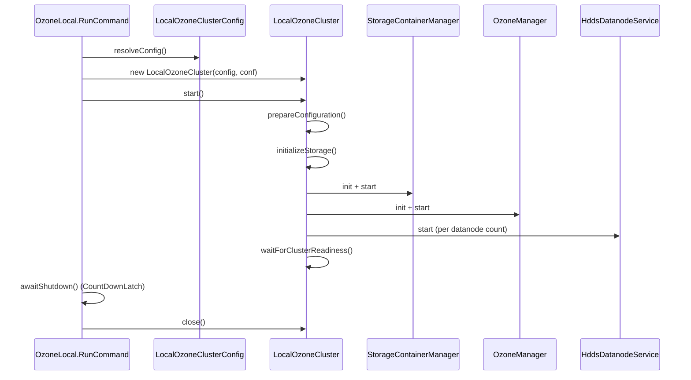

# bench-insight / ozone-tools

_This feature page was generated from `study/atlas/components/bench-insight/ozone-tools.md`. Author prose belongs above or below the BEGIN/END markers._

{/* BEGIN atlas-generated */}

**Classes:** 14    **Kinds:** service:11, interface:1, config:1, cli:1

## Overview

The `ozone-tools` feature group collects miscellaneous operational CLIs that do not belong to a single service. The dominant piece is the `ozone local` command: `OzoneLocal` is the picocli top-level entry point, its inner `RunCommand` reads `LocalOzoneClusterConfig` (populated from CLI flags and environment variables), instantiates a `LocalOzoneCluster`, and blocks until the JVM is asked to shut down via a `CountDownLatch`-based shutdown hook. `LocalOzoneCluster` does the heavy lifting: it allocates free ports, writes a `ports.properties` state file for restartability, initialises SCM/OM storage directories (with configurable format modes `if-needed`, `always`, `never`), starts `StorageContainerManager`, `OzoneManager`, and one or more `HddsDatanodeService` instances in the same JVM, then polls for cluster readiness. The remaining classes in the feature are standalone utilities: `OzoneGetConf` and its handlers expose ozone-site.xml values, `OzoneFsShell` wraps the Hadoop FileSystem shell against OzoneFS, `GenerateOzoneRequiredConfigurations` emits a minimal ozone-site template, and `AutoCompletion` generates shell completion scripts.

## Class table

### Sub-feature: `fs.ozone`

| reading_order | fqcn | kind | logic | loc | study (min) | role |
|--:|---|---|---|--:|--:|---|
| 2721 | <Fqcn>org.apache.hadoop.fs.ozone.OzoneFsDelete</Fqcn> | service | mixed | 125~ | 30 | Classes that delete paths. |
| 2722 | <Fqcn>org.apache.hadoop.fs.ozone.OzoneFsShell</Fqcn> | service | mixed | 50~ | 30 | Provide command line access to a Ozone FileSystem. |

### Sub-feature: `ozone.conf`

| reading_order | fqcn | kind | logic | loc | study (min) | role |
|--:|---|---|---|--:|--:|---|
| 2723 | <Fqcn>org.apache.hadoop.ozone.conf.PrintConfKeyCommandHandler</Fqcn> | cli | mixed | 25~ | 30 | Handler for ozone getconf confKey [key]. |
| 2724 | <Fqcn>org.apache.hadoop.ozone.conf.OzoneManagersCommandHandler</Fqcn> | cli | mixed | 25~ | 30 | Handler for ozone getconf ozonemanagers. |
| 2725 | <Fqcn>org.apache.hadoop.ozone.conf.StorageContainerManagersCommandHandler</Fqcn> | cli | mixed | 25~ | 30 | Handler for ozone getconf storagecontainermanagers. |
| 2726 | <Fqcn>org.apache.hadoop.ozone.conf.OzoneGetConf</Fqcn> | service | mixed | 25~ | 30 | CLI utility to print out ozone related configuration. |

### Sub-feature: `ozone.genconf`

| reading_order | fqcn | kind | logic | loc | study (min) | role |
|--:|---|---|---|--:|--:|---|
| 2727 | <Fqcn>org.apache.hadoop.ozone.genconf.GenerateOzoneRequiredConfigurations</Fqcn> | cli | mixed | 100~ | 30 | GenerateOzoneRequiredConfigurations - A tool to generate ozone-site.xml&lt;br&gt; This tool generates an ozone-site.xml wit... |

### Sub-feature: `ozone.local`

| reading_order | fqcn | kind | logic | loc | study (min) | role |
|--:|---|---|---|--:|--:|---|
| 2728 | <Fqcn>org.apache.hadoop.ozone.local.LocalOzoneRuntime</Fqcn> | interface | mixed | 25~ | 20 | Runtime contract for local Ozone cluster commands. |
| 2729 | <Fqcn>org.apache.hadoop.ozone.local.LocalOzoneCluster</Fqcn> | service | logic-heavy | 700~ | 60 | Starts the SCM, OM, and datanode portion of the ozone local runtime. |
| 2730 | <Fqcn>org.apache.hadoop.ozone.local.OzoneLocal</Fqcn> | cli | logic-heavy | 250~ | 45 | CLI entry point for local single-node Ozone. |
| 2731 | <Fqcn>org.apache.hadoop.ozone.local.LocalOzoneClusterConfig</Fqcn> | config | logic-heavy | 200~ | 20 | Configuration for a local Ozone cluster runtime. |

### Sub-feature: `ozone.shell`

| reading_order | fqcn | kind | logic | loc | study (min) | role |
|--:|---|---|---|--:|--:|---|
| 2732 | <Fqcn>org.apache.hadoop.ozone.shell.OzoneRatis</Fqcn> | service | mixed | 25~ | 30 | Ozone Ratis Command line tool. |

### Sub-feature: `ozone.utils`

| reading_order | fqcn | kind | logic | loc | study (min) | role |
|--:|---|---|---|--:|--:|---|
| 2733 | <Fqcn>org.apache.hadoop.ozone.utils.AsyncRollingFileAppender</Fqcn> | service | mixed | 75~ | 30 | The AsyncRollingFileAppender shall take the required parameters for supplying RollingFileAppender to AsyncAppender. |
| 2734 | <Fqcn>org.apache.hadoop.ozone.utils.AutoCompletion</Fqcn> | cli | mixed | 125~ | 20 | Tool to generate auto-completion scripts for Ozone CLI. |

## Diagram

## Anchor details

### `LocalOzoneCluster`

- **path:** `hadoop-ozone/tools/src/main/java/org/apache/hadoop/ozone/local/LocalOzoneCluster.java`
- **loc:** 700~    **difficulty:** 5    **study:** 60 min    **concurrency:** single-threaded    **persistence:** in-memory
- **entry points:** `start`, `close`
- **key collaborators:** `org.apache.hadoop.hdds.client.ReplicationFactor`, `org.apache.hadoop.hdds.client.ReplicationType`, `org.apache.hadoop.hdds.conf.OzoneConfiguration`, `org.apache.hadoop.hdds.scm.proxy.SCMClientConfig`, `org.apache.hadoop.hdds.scm.server.SCMStorageConfig`, `org.apache.hadoop.hdds.scm.server.StorageContainerManager`
- **test exemplar:** `hadoop-ozone/tools/src/test/java/org/apache/hadoop/ozone/local/TestLocalOzoneCluster.java`
- **role:** Starts the SCM, OM, and datanode portion of the `ozone local` runtime.
- Port allocation follows a "persist and reuse" contract: on first run, `PortAllocator` allocates free OS ports and writes them to `ports.properties` (`LocalOzoneCluster.PORTS_STATE_FILE_NAME`); on restart with `FormatMode.IF_NEEDED`, the same ports are reloaded so clients do not need reconfiguration. The cap `MAX_DATANODES = 20` (line 187) guards against local port exhaustion: each datanode consumes 8 ports (from `DATANODE_PORT_KEY_SUFFIXES`).

### `OzoneLocal`

- **path:** `hadoop-ozone/tools/src/main/java/org/apache/hadoop/ozone/local/OzoneLocal.java`
- **loc:** 250~    **difficulty:** 4    **study:** 45 min    **concurrency:** single-threaded    **persistence:** in-memory
- **entry points:** `call`
- **key collaborators:** `org.apache.hadoop.hdds.cli.AbstractSubcommand`, `org.apache.hadoop.hdds.cli.GenericCli`, `org.apache.hadoop.hdds.cli.HddsVersionProvider`, `org.apache.hadoop.hdds.conf.OzoneConfiguration`, `org.apache.hadoop.hdds.conf.TimeDurationUtil`
- **test exemplar:** `hadoop-ozone/tools/src/test/java/org/apache/hadoop/ozone/local/TestOzoneLocal.java`
- **role:** CLI entry point for local single-node Ozone.
- `OzoneLocal.RunCommand.awaitShutdown()` installs a JVM shutdown hook that calls `runtime.close()` and decrements a `CountDownLatch`. The main thread blocks on `stopped.await()`, so the command does not return until the shutdown hook's `close()` finishes, giving services a clean teardown window. The `--ephemeral` flag, if set, causes `LocalOzoneCluster.close()` to delete the data directory after stopping services.

## Design docs

- no dedicated design doc under `hadoop-hdds/docs/content/` on this branch for `ozone local` or the ozone-tools utilities.
- `hadoop-hdds/docs/content/design/scmha.md` and `hadoop-hdds/docs/content/design/omha.md` describe the services that `LocalOzoneCluster` starts in single-node mode.

## Seminal JIRAs / PRs

- [HDDS-15081](https://issues.apache.org/jira/browse/HDDS-15081). Add Internal Scaffold (initial `ozone local` submodule structure).
- [HDDS-15082](https://issues.apache.org/jira/browse/HDDS-15082). Add User facing Config Contract for `ozone local` (added `LocalOzoneClusterConfig`).
- [HDDS-15083](https://issues.apache.org/jira/browse/HDDS-15083). Add local filesystem lifecycle implementation (ephemeral/persistent data dir handling).
- [HDDS-15084](https://issues.apache.org/jira/browse/HDDS-15084). Core Runtime: SCM + OM (wired SCM and OM into `LocalOzoneCluster.start()`).
- [HDDS-15085](https://issues.apache.org/jira/browse/HDDS-15085). Add DN and Cluster Readiness (added datanode start and `waitForClusterReadiness()`).
- [HDDS-15086](https://issues.apache.org/jira/browse/HDDS-15086). Wire ozone local command (connected `OzoneLocal` CLI to `LocalOzoneCluster`).
- [HDDS-15747](https://issues.apache.org/jira/browse/HDDS-15747). Address review comments for [HDDS-15083](https://issues.apache.org/jira/browse/HDDS-15083) (ephemeral cleanup fixes).

## Sharp edges

- `LocalOzoneCluster.start()` catches all exceptions, calls `stopServices()`, and rethrows. However, `stopServices()` does not set `closed = true`, so a failed `start()` leaves the cluster in a state where a second `start()` call would proceed rather than throw `IOException("already closed")`. This is intentional (the comment on line 231 says "the caller's close() still owns the ephemeral data dir lifecycle") but can surprise callers expecting idempotent start semantics.
- `MAX_DATANODES = 20` is enforced only by the JavaDoc comment, not by a runtime validation in `LocalOzoneCluster`. `OzoneLocal.RunCommand.resolveConfig()` validates `datanodes >= 1` but does not cap it at 20, so passing `--datanodes 30` will exhaust OS ephemeral ports silently mid-startup.

## Related features

- `components/bench-insight/freon.md` — Freon is the primary workload tool used against a local cluster.
- `components/bench-insight/insight.md` — `ozone insight` can observe services started by `ozone local`.
- `components/SCM/scm-node.md` — SCM node management is exercised by the datanodes started inside `LocalOzoneCluster`.
- `components/Ozone Manager/om-request.md` — the OM instance started in-JVM processes all requests from local clients.

## Self-quiz

1. `LocalOzoneCluster.start()` calls `prepareConfiguration()` before starting any services. What does `PersistedPortState` do, and which file on disk does it read from?
2. `OzoneLocal.RunCommand.awaitShutdown()` uses a `CountDownLatch`. What would happen if the shutdown hook's `runtime.close()` threw an exception — would the main thread ever unblock?
3. `LocalOzoneCluster` enforces `MAX_DATANODES = 20`. How many OS ports does a single simulated datanode consume, and which array in the source encodes these port roles?
4. `LocalOzoneClusterConfig` supports three `FormatMode` values: `if-needed`, `always`, `never`. When would you use `never`, and what exception would occur if no storage has been previously initialized?
5. `OzoneLocal` extends `GenericCli` rather than implementing `Callable` directly. What does this inheritance provide that a plain `Callable` subcommand would not?

Answers

Answer 1: `PersistedPortState` loads the `ports.properties` file from the data directory (filename in `LocalOzoneCluster.PORTS_STATE_FILE_NAME`). On first run the file does not exist and all ports are auto-allocated; on restart it provides the previously allocated ports so clients connecting to fixed addresses continue to work.

Answer 2: The `finally` block in `awaitShutdown()`'s shutdown thread always calls `stopped.countDown()`, so the main thread unblocks regardless of whether `runtime.close()` throws. The exception is caught and logged with `LOG.warn` but does not propagate to the main thread.

Answer 3: Each datanode consumes 8 ports, defined in `DATANODE_PORT_KEY_SUFFIXES`: http, client, container.ipc, ratis.ipc, ratis.admin, ratis.server, ratis.datastream, replication. With 20 datanodes that is 160 ports for datanodes alone.

Answer 4: `FormatMode.NEVER` is used when you want to start a cluster against pre-existing storage (e.g., after copying a snapshot) without risk of accidental reformatting. If the storage has never been initialized, `initializeStorage()` will throw `InconsistentStorageStateException` or a similar failure when SCM/OM try to read their version files.

Answer 5: `GenericCli` wires Hadoop configuration loading, logging setup, and the picocli command infrastructure. It provides `getOzoneConf()` (which merges ozone-default.xml with ozone-site.xml), `run(args)` for the main method, and the `--conf` flag that lets users point to a custom config directory — all of which a bare `Callable` subcommand would need to implement manually.

{/* END atlas-generated */}
