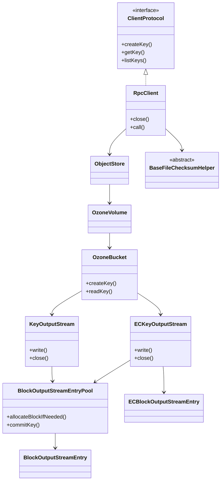

# client / ozone-client

_This feature page was generated from `study/atlas/components/client/ozone-client.md`. Author prose belongs above or below the BEGIN/END markers._

{/* BEGIN atlas-generated */}

**Classes:** 47    **Kinds:** service:38, interface:4, abstract:2, factory:2, exception:1

## Overview

The `ozone-client` feature is the public API and write-path orchestration layer that sits between the user-visible `OzoneClient` / `OzoneBucket` / `ObjectStore` objects and the low-level HDDS block I/O primitives. `RpcClient` is the sole implementation of `ClientProtocol` and routes every user operation — create key, read key, list bucket, multipart upload — through an OM RPC stub. For writes, `RpcClient` hands an `OpenKeySession` to `KeyOutputStream` (Ratis/replicated) or `ECKeyOutputStream` (erasure-coded); each of those manages a `BlockOutputStreamEntryPool` that allocates blocks from OM on demand and tracks the ordered list of `BlockOutputStreamEntry` objects corresponding to those blocks. On flush or close, the pool commits block metadata back to OM so the key becomes visible atomically. `ECKeyOutputStream` additionally runs a `RawErasureEncoder` in a background thread to produce parity cells before dispatching to `ECBlockOutputStreamEntry`. `BaseFileChecksumHelper` and its two concrete subclasses compute HDFS-compatible file checksums for `getFileChecksum` by fetching per-block checksums from datanodes.

## Diagram

## Class table

### Sub-feature: `client-facade`

| reading_order | fqcn | kind | logic | loc | study (min) | role |
|--:|---|---|---|--:|--:|---|
| 1 | <Fqcn>org.apache.hadoop.ozone.client.protocol.ClientProtocol</Fqcn> | interface | logic-heavy | 325~ | 20 | An implementer of this interface is capable of connecting to Ozone Cluster and perform client operations. |
| 2 | <Fqcn>org.apache.hadoop.ozone.client.rpc.RpcClient</Fqcn> | service | logic-heavy | 2325~ | 60 | Ozone RPC Client Implementation, it connects to OM, SCM and DataNode to execute client calls. |
| 3 | <Fqcn>org.apache.hadoop.ozone.client.OzoneClientUtils</Fqcn> | service | mixed | 150~ | 45 | Shared Utilities for Ozone FS and related classes. |
| 4 | <Fqcn>org.apache.hadoop.ozone.client.OzoneClient</Fqcn> | service | mixed | 25~ | 30 | OzoneClient connects to Ozone Cluster and perform basic operations. |
| 5 | <Fqcn>org.apache.hadoop.ozone.client.OzoneClientFactory</Fqcn> | factory | mixed | 125~ | 20 | Factory class to create OzoneClients. |
| 6 | <Fqcn>org.apache.hadoop.ozone.client.OzoneClientException</Fqcn> | exception | data-only | 25~ | 10 | This exception is thrown by the Ozone Clients. |

### Sub-feature: `user-api-types`

| reading_order | fqcn | kind | logic | loc | study (min) | role |
|--:|---|---|---|--:|--:|---|
| 7 | <Fqcn>org.apache.hadoop.ozone.client.OzoneVolume</Fqcn> | service | logic-heavy | 250~ | 20 | A class that encapsulates OzoneVolume. |
| 8 | <Fqcn>org.apache.hadoop.ozone.client.OzoneBucket</Fqcn> | service | logic-heavy | 950~ | 60 | A class that encapsulates OzoneBucket. |
| 9 | <Fqcn>org.apache.hadoop.ozone.client.ObjectStore</Fqcn> | service | logic-heavy | 375~ | 45 | ObjectStore class is responsible for the client operations that can be performed on Ozone Object Store. |
| 10 | <Fqcn>org.apache.hadoop.ozone.client.OzoneLifecycleConfiguration</Fqcn> | service | mixed | 150~ | 45 | A class that encapsulates OzoneLifecycleConfiguration. |
| 11 | <Fqcn>org.apache.hadoop.ozone.client.BucketArgs</Fqcn> | service | mixed | 150~ | 45 | This class encapsulates the arguments that are required for creating a bucket. |
| 12 | <Fqcn>org.apache.hadoop.ozone.client.OzoneSnapshot</Fqcn> | service | mixed | 125~ | 30 | A class that encapsulates OzoneSnapshot. |
| 13 | <Fqcn>org.apache.hadoop.ozone.client.OzoneKey</Fqcn> | service | mixed | 100~ | 30 | A class that encapsulates OzoneKey. |
| 14 | <Fqcn>org.apache.hadoop.ozone.client.VolumeArgs</Fqcn> | service | mixed | 75~ | 30 | This class encapsulates the arguments that are required for creating a volume. |
| 15 | <Fqcn>org.apache.hadoop.ozone.client.OzoneMultipartUploadPartListParts</Fqcn> | service | mixed | 75~ | 30 | Class that represents Multipart upload List parts response. |
| 16 | <Fqcn>org.apache.hadoop.ozone.client.OzoneMultipartUpload</Fqcn> | service | mixed | 75~ | 30 | Information about one initialized upload. |
| 17 | <Fqcn>org.apache.hadoop.ozone.client.OzoneSnapshotDiff</Fqcn> | service | mixed | 50~ | 30 | A class that encapsulates SnapshotDiffJob. |
| 18 | <Fqcn>org.apache.hadoop.ozone.client.OzoneKeyDetails</Fqcn> | service | mixed | 50~ | 30 | A class that encapsulates OzoneKeyLocation. |
| 19 | <Fqcn>org.apache.hadoop.ozone.client.TenantArgs</Fqcn> | service | mixed | 25~ | 30 | This class encapsulates the arguments for creating a tenant. |
| 20 | <Fqcn>org.apache.hadoop.ozone.client.OzoneMultipartUploadList</Fqcn> | service | mixed | 25~ | 30 | List of in-flight MPU upoads. |
| 21 | <Fqcn>org.apache.hadoop.ozone.client.OzoneKeyLocation</Fqcn> | service | mixed | 25~ | 30 | One key can be stored in one or more containers as one or more blocks. |

### Sub-feature: `io-streams`

| reading_order | fqcn | kind | logic | loc | study (min) | role |
|--:|---|---|---|--:|--:|---|
| 22 | <Fqcn>org.apache.hadoop.ozone.client.io.KeyOutputStream</Fqcn> | service | logic-heavy | 575~ | 60 | Maintaining a list of BlockInputStream. |
| 23 | <Fqcn>org.apache.hadoop.ozone.client.io.KeyDataStreamOutput</Fqcn> | service | logic-heavy | 375~ | 45 | Maintaining a list of BlockInputStream. |
| 24 | <Fqcn>org.apache.hadoop.ozone.client.io.BlockOutputStreamEntry</Fqcn> | service | logic-heavy | 275~ | 45 | A BlockOutputStreamEntry manages the data writes into the DataNodes. |
| 25 | <Fqcn>org.apache.hadoop.ozone.client.io.BlockOutputStreamEntryPool</Fqcn> | service | logic-heavy | 250~ | 45 | A BlockOutputStreamEntryPool manages the communication with OM during writing a Key to Ozone with KeyOutputStream. |
| 26 | <Fqcn>org.apache.hadoop.ozone.client.io.KeyInputStream</Fqcn> | service | mixed | 125~ | 30 | Maintaining a list of BlockInputStream. |
| 27 | <Fqcn>org.apache.hadoop.ozone.client.io.OzoneDataStreamOutput</Fqcn> | service | mixed | 125~ | 30 | OzoneDataStreamOutput is used to write data into Ozone. |
| 28 | <Fqcn>org.apache.hadoop.ozone.client.io.OzoneOutputStream</Fqcn> | service | mixed | 100~ | 30 | OzoneOutputStream is used to write data into Ozone. |
| 29 | <Fqcn>org.apache.hadoop.ozone.client.io.OzoneCryptoInputStream</Fqcn> | service | mixed | 100~ | 30 | A CryptoInputStream for Ozone with length. |
| 30 | <Fqcn>org.apache.hadoop.ozone.client.io.OzoneInputStream</Fqcn> | service | mixed | 75~ | 30 | OzoneInputStream is used to read data from Ozone. |
| 31 | <Fqcn>org.apache.hadoop.ozone.client.io.KeyOutputStreamSemaphore</Fqcn> | service | mixed | 50~ | 30 | Helper class that streamlines request semaphore usage in KeyOutputStream. |
| 32 | <Fqcn>org.apache.hadoop.ozone.client.io.CipherOutputStreamOzone</Fqcn> | service | mixed | 25~ | 30 | Wrap javax.crypto.CipherOutputStream with the method to return wrapped output stream. |

### Sub-feature: `client.io`

| reading_order | fqcn | kind | logic | loc | study (min) | role |
|--:|---|---|---|--:|--:|---|
| 33 | <Fqcn>org.apache.hadoop.ozone.client.io.KeyMetadataAware</Fqcn> | interface | mixed | 25~ | 20 | Interface to provide methods related to key metadata. |
| 34 | <Fqcn>org.apache.hadoop.ozone.client.io.KeyCommitOutput</Fqcn> | interface | mixed | 25~ | 20 | Common commit-time behavior for key output implementations. |
| 35 | <Fqcn>org.apache.hadoop.ozone.client.io.BlockDataStreamOutputEntryPool</Fqcn> | service | logic-heavy | 225~ | 45 | This class manages the stream entries list and handles block allocation from OzoneManager. |
| 36 | <Fqcn>org.apache.hadoop.ozone.client.io.BlockDataStreamOutputEntry</Fqcn> | service | logic-heavy | 200~ | 45 | Helper class used inside BlockDataStreamOutput. |

### Sub-feature: `client.rpc`

| reading_order | fqcn | kind | logic | loc | study (min) | role |
|--:|---|---|---|--:|--:|---|
| 37 | <Fqcn>org.apache.hadoop.ozone.client.rpc.OzoneKMSUtil</Fqcn> | service | mixed | 125~ | 30 | KMS utility class for Ozone Data Encryption At-Rest. |

### Sub-feature: `ec-client`

| reading_order | fqcn | kind | logic | loc | study (min) | role |
|--:|---|---|---|--:|--:|---|
| 38 | <Fqcn>org.apache.hadoop.ozone.client.io.ECKeyOutputStream</Fqcn> | service | logic-heavy | 525~ | 60 | ECKeyOutputStream handles the EC writes by writing the data into underlying block output streams chunk by chunk. |
| 39 | <Fqcn>org.apache.hadoop.ozone.client.io.ECBlockOutputStreamEntry</Fqcn> | service | logic-heavy | 275~ | 45 | ECBlockOutputStreamEntry manages write into EC keys' data block groups. |
| 40 | <Fqcn>org.apache.hadoop.ozone.client.checksum.ECBlockChecksumComputer</Fqcn> | service | mixed | 100~ | 30 | The implementation of AbstractBlockChecksumComputer for EC blocks. |
| 41 | <Fqcn>org.apache.hadoop.ozone.client.checksum.ECFileChecksumHelper</Fqcn> | service | mixed | 75~ | 30 | The helper class to compute file checksum for EC files. |
| 42 | <Fqcn>org.apache.hadoop.ozone.client.io.ECBlockOutputStreamEntryPool</Fqcn> | service | mixed | 25~ | 30 | BlockOutputStreamEntryPool is responsible to manage OM communication regarding writing a block to Ozone in a non-EC w... |

### Sub-feature: `checksum`

| reading_order | fqcn | kind | logic | loc | study (min) | role |
|--:|---|---|---|--:|--:|---|
| 43 | <Fqcn>org.apache.hadoop.ozone.client.checksum.BaseFileChecksumHelper</Fqcn> | abstract | logic-heavy | 250~ | 45 | The base class to support file checksum. |
| 44 | <Fqcn>org.apache.hadoop.ozone.client.checksum.AbstractBlockChecksumComputer</Fqcn> | abstract | mixed | 25~ | 30 | Base class for computing block checksum which is a function of chunk checksums. |
| 45 | <Fqcn>org.apache.hadoop.ozone.client.checksum.ReplicatedBlockChecksumComputer</Fqcn> | service | mixed | 100~ | 30 | The implementation of AbstractBlockChecksumComputer for replicated blocks. |
| 46 | <Fqcn>org.apache.hadoop.ozone.client.checksum.ReplicatedFileChecksumHelper</Fqcn> | service | mixed | 50~ | 30 | The helper class to compute file checksum for replicated files. |
| 47 | <Fqcn>org.apache.hadoop.ozone.client.checksum.ChecksumHelperFactory</Fqcn> | factory | mixed | 25~ | 20 | Class to create BaseFileChecksumHelper based on the Replication Type. |

## Anchor details

### `ClientProtocol`

- **path:** `hadoop-ozone/client/src/main/java/org/apache/hadoop/ozone/client/protocol/ClientProtocol.java`
- **loc:** 325~    **difficulty:** 2    **study:** 20 min    **concurrency:** single-threaded    **persistence:** in-memory
- **key collaborators:** `org.apache.hadoop.ozone.client.BucketArgs`, `org.apache.hadoop.ozone.client.OzoneBucket`, `org.apache.hadoop.ozone.client.OzoneKey`, `org.apache.hadoop.ozone.client.OzoneKeyDetails`, `org.apache.hadoop.ozone.client.OzoneLifecycleConfiguration`, `org.apache.hadoop.ozone.client.OzoneMultipartUploadList`
- **role:** An implementer of this interface is capable of connecting to Ozone Cluster and perform client operations.

Defines every user-visible namespace and data operation. Notably, `createKey` returns a pre-opened `OzoneOutputStream` wrapping an `OpenKeySession` from OM, which means failure to close the output stream leaves an open key in OM until the lease expires. `getKey` and `listKeys` return client-side objects (`OzoneKeyDetails`, `Iterator<OzoneKey>`) rather than raw Protobuf so callers are isolated from wire-format changes.

### `OzoneVolume`

- **path:** `hadoop-ozone/client/src/main/java/org/apache/hadoop/ozone/client/OzoneVolume.java`
- **loc:** 250~    **difficulty:** 2    **study:** 20 min    **concurrency:** single-threaded    **persistence:** in-memory
- **entry points:** `build`
- **key collaborators:** `org.apache.hadoop.ozone.client.protocol.ClientProtocol`, `org.apache.hadoop.hdds.client.OzoneQuota`, `org.apache.hadoop.hdds.conf.ConfigurationSource`, `org.apache.hadoop.hdds.scm.client.HddsClientUtils`, `org.apache.hadoop.ozone.OzoneAcl`, `org.apache.hadoop.ozone.om.helpers.WithMetadata`
- **role:** A class that encapsulates OzoneVolume.

A thin client-side view of OM's `OmVolumeArgs`; it holds a reference back to `ClientProtocol` and delegates all mutating operations (`createBucket`, `setQuota`, `setAcl`) to it so callers do not need a separate protocol handle. The `build` entry point is the static factory used by `RpcClient.getVolume` to assemble an instance from `OmVolumeArgs`.

### `BaseFileChecksumHelper`

- **path:** `hadoop-ozone/client/src/main/java/org/apache/hadoop/ozone/client/checksum/BaseFileChecksumHelper.java`
- **loc:** 250~    **difficulty:** 4    **study:** 45 min    **concurrency:** single-threaded    **persistence:** in-memory
- **key collaborators:** `org.apache.hadoop.ozone.client.OzoneBucket`, `org.apache.hadoop.ozone.client.OzoneVolume`, `org.apache.hadoop.ozone.client.protocol.ClientProtocol`, `org.apache.hadoop.ozone.client.rpc.RpcClient`, `org.apache.hadoop.hdds.scm.OzoneClientConfig`, `org.apache.hadoop.hdds.scm.XceiverClientFactory`
- **role:** The base class to support file checksum.

Iterates over block locations via `ClientProtocol.getKeyDetails` and dispatches per-block checksum computation to `AbstractBlockChecksumComputer`. The result is an HDFS-compatible `MD5MD5CRC32` or `COMPOSITE_CRC` file checksum depending on the `ChecksumType` of the blocks. The factory method `ChecksumHelperFactory.getChecksumHelper` selects the concrete subclass (`ReplicatedFileChecksumHelper` or `ECFileChecksumHelper`).

### `RpcClient`

- **path:** `hadoop-ozone/client/src/main/java/org/apache/hadoop/ozone/client/rpc/RpcClient.java`
- **loc:** 2325~    **difficulty:** 5    **study:** 60 min    **concurrency:** actor/queue    **persistence:** in-memory
- **entry points:** `close`, `call`
- **key collaborators:** `org.apache.hadoop.ozone.client.BucketArgs`, `org.apache.hadoop.ozone.client.OzoneBucket`, `org.apache.hadoop.ozone.client.OzoneKey`, `org.apache.hadoop.ozone.client.OzoneKeyDetails`, `org.apache.hadoop.ozone.client.OzoneKeyLocation`, `org.apache.hadoop.ozone.client.OzoneLifecycleConfiguration`
- **test exemplar:** `hadoop-ozone/client/src/test/java/org/apache/hadoop/ozone/client/rpc/TestRpcClient.java`
- **role:** The sole implementation of `ClientProtocol`; translates user API calls into OM Protobuf RPCs and assembles response objects.

`RpcClient` is the sole `ClientProtocol` implementation. It translates every user operation into an OM Protobuf RPC, assembles `KeyOutputStream` / `ECKeyOutputStream` / `KeyInputStream` / `MultipartInputStream` instances, and manages the `XceiverClientManager` that is shared across all I/O streams created from this client. A Guava `Cache` keyed by `KeyProvider.URI` caches `KeyProvider` instances to avoid repeated KMS lookups for HDDS encryption; the cache is closed on `RpcClient.close()`. The `ThreadPoolExecutor` used for async stream operations has a `SynchronousQueue` so task submission blocks when all threads are busy, providing natural back-pressure.

### `OzoneBucket`

- **path:** `hadoop-ozone/client/src/main/java/org/apache/hadoop/ozone/client/OzoneBucket.java`
- **loc:** 950~    **difficulty:** 5    **study:** 60 min    **concurrency:** single-threaded    **persistence:** in-memory
- **entry points:** `build`
- **key collaborators:** `org.apache.hadoop.ozone.client.io.OzoneDataStreamOutput`, `org.apache.hadoop.ozone.client.io.OzoneInputStream`, `org.apache.hadoop.ozone.client.io.OzoneOutputStream`, `org.apache.hadoop.ozone.client.protocol.ClientProtocol`, `org.apache.hadoop.hdds.client.DefaultReplicationConfig`, `org.apache.hadoop.hdds.client.OzoneQuota`
- **test exemplar:** `hadoop-ozone/client/src/test/java/org/apache/hadoop/ozone/client/TestOzoneBucket.java`
- **role:** A class that encapsulates OzoneBucket.

The primary entry point for user key I/O; `createKey`, `readKey`, `createMultipartKey`, and `initiateMultipartUpload` all delegate to `ClientProtocol`. The `replicationConfig` held in `OzoneBucket` is the bucket-level default that is overridden by per-call `ReplicationConfig` arguments; if neither is set the server default from `getFsServerDefaults` is used. `OzoneBucket` also caches the bucket's encryption key name so each `createKey` call does not need an extra OM RPC to look it up.

### `KeyOutputStream`

- **path:** `hadoop-ozone/client/src/main/java/org/apache/hadoop/ozone/client/io/KeyOutputStream.java`
- **loc:** 575~    **difficulty:** 5    **study:** 60 min    **concurrency:** thread-safe    **persistence:** in-memory
- **entry points:** `write`, `close`, `build`
- **key collaborators:** `org.apache.hadoop.hdds.client.ReplicationConfig`, `org.apache.hadoop.hdds.protocol.DatanodeDetails`, `org.apache.hadoop.hdds.scm.ContainerClientMetrics`, `org.apache.hadoop.hdds.scm.OzoneClientConfig`, `org.apache.hadoop.hdds.scm.StreamBufferArgs`, `org.apache.hadoop.hdds.scm.XceiverClientFactory`
- **test exemplar:** `hadoop-ozone/client/src/test/java/org/apache/hadoop/ozone/client/io/TestKeyOutputStream.java`
- **role:** Maintaining a list of BlockOutputStreamEntry objects; writes are distributed across blocks.

`KeyOutputStream` delegates writes to the current `BlockOutputStreamEntry` in the pool; when a block fills up or the current block's container is closed, it calls `BlockOutputStreamEntryPool.allocateBlockIfNeeded` to get the next entry (triggering an OM `AllocateBlock` RPC). The `handleException` method classifies `StorageContainerException` to decide whether to exclude a pipeline, refresh a pipeline, or fail completely. A `ReentrantLock` with a `Condition` serialises concurrent `write`/`hsync` calls via `KeyOutputStreamSemaphore`.

### `ECKeyOutputStream`

- **path:** `hadoop-ozone/client/src/main/java/org/apache/hadoop/ozone/client/io/ECKeyOutputStream.java`
- **loc:** 525~    **difficulty:** 5    **study:** 60 min    **concurrency:** actor/queue    **persistence:** in-memory
- **entry points:** `write`, `close`, `build`
- **key collaborators:** `org.apache.hadoop.hdds.client.ECReplicationConfig`, `org.apache.hadoop.hdds.scm.OzoneClientConfig`, `org.apache.hadoop.hdds.scm.client.HddsClientUtils`, `org.apache.hadoop.hdds.scm.container.common.helpers.ContainerNotOpenException`, `org.apache.hadoop.hdds.scm.pipeline.Pipeline`, `org.apache.hadoop.hdds.scm.storage.ECBlockOutputStream`
- **test exemplar:** `hadoop-ozone/integration-test/src/test/java/org/apache/hadoop/ozone/client/rpc/TestECKeyOutputStream.java`
- **role:** ECKeyOutputStream handles the EC writes by writing the data into underlying block output streams chunk by chunk.

Accumulates incoming bytes into `ecChunkBufferCache` (one cell-sized `ByteBuffer` per data cell of a stripe). Once a full stripe is buffered, it encodes parity cells with `RawErasureEncoder.encode`, then flushes all cells — data and parity — in parallel to their respective `ECBlockOutputStream` instances through a `BlockingQueue<ECChunkBuffers>` processed by a dedicated `flushFuture` thread. The `flushFuture` thread is the sole writer to all `ECBlockOutputStream` instances, which means the whole stripe either completes or is retried as a unit.

### `KeyDataStreamOutput`

- **path:** `hadoop-ozone/client/src/main/java/org/apache/hadoop/ozone/client/io/KeyDataStreamOutput.java`
- **loc:** 375~    **difficulty:** 4    **study:** 45 min    **concurrency:** single-threaded    **persistence:** in-memory
- **entry points:** `write`, `close`, `build`
- **key collaborators:** `org.apache.hadoop.hdds.client.ReplicationConfig`, `org.apache.hadoop.hdds.protocol.DatanodeDetails`, `org.apache.hadoop.hdds.scm.OzoneClientConfig`, `org.apache.hadoop.hdds.scm.XceiverClientFactory`, `org.apache.hadoop.hdds.scm.client.HddsClientUtils`, `org.apache.hadoop.hdds.scm.container.ContainerID`
- **test exemplar:** `hadoop-ozone/client/src/test/java/org/apache/hadoop/ozone/client/io/TestKeyDataStreamOutput.java`
- **role:** The Ratis DataStream variant of `KeyOutputStream`; maintains a list of `BlockDataStreamOutputEntry` objects for streaming writes.

Mirrors `KeyOutputStream` in structure but hands `ByteBuffer` objects directly to `BlockDataStreamOutputEntry` (backed by `BlockDataStreamOutput`) rather than serialising through a `BufferPool`. Used when `OzoneClientConfig.isDataStreamEnabled()` is true and the pipeline supports the Ratis DataStream API. inferred: because DataStream bypasses the standard Raft log path for data, the `BlockDataStreamOutputEntryPool` still uses regular OM RPCs for block allocation and key commit.

### `ObjectStore`

- **path:** `hadoop-ozone/client/src/main/java/org/apache/hadoop/ozone/client/ObjectStore.java`
- **loc:** 375~    **difficulty:** 4    **study:** 45 min    **concurrency:** single-threaded    **persistence:** in-memory
- **key collaborators:** `org.apache.hadoop.ozone.client.protocol.ClientProtocol`, `org.apache.hadoop.hdds.conf.ConfigurationSource`, `org.apache.hadoop.hdds.scm.client.HddsClientUtils`, `org.apache.hadoop.ozone.OmUtils`, `org.apache.hadoop.ozone.OzoneAcl`, `org.apache.hadoop.ozone.OzoneConfigKeys`
- **test exemplar:** `hadoop-ozone/integration-test/src/test/java/org/apache/hadoop/ozone/om/TestObjectStore.java`
- **role:** ObjectStore class is responsible for the client operations that can be performed on Ozone Object Store.

Top-level handle returned by `OzoneClient.getObjectStore()`; covers volume lifecycle, tenant management, and cross-cutting operations such as `getS3Bucket`. Delegates every call to `ClientProtocol` and wraps raw `OmVolumeArgs` into `OzoneVolume` objects. `listVolumesByUser` paginates using a startVolume marker, so callers must pass the last returned volume name to get the next page.

### `ECBlockOutputStreamEntry`

- **path:** `hadoop-ozone/client/src/main/java/org/apache/hadoop/ozone/client/io/ECBlockOutputStreamEntry.java`
- **loc:** 275~    **difficulty:** 4    **study:** 45 min    **concurrency:** actor/queue    **persistence:** in-memory
- **entry points:** `close`, `build`
- **key collaborators:** `org.apache.hadoop.hdds.client.BlockID`, `org.apache.hadoop.hdds.client.ECReplicationConfig`, `org.apache.hadoop.hdds.protocol.DatanodeDetails`, `org.apache.hadoop.hdds.scm.pipeline.Pipeline`, `org.apache.hadoop.hdds.scm.storage.BlockOutputStream`, `org.apache.hadoop.hdds.scm.storage.ECBlockOutputStream`
- **test exemplar:** `hadoop-ozone/client/src/test/java/org/apache/hadoop/ozone/client/io/TestECBlockOutputStreamEntry.java`
- **role:** ECBlockOutputStreamEntry manages write into EC keys' data block groups.

Holds one `ECBlockOutputStream` per stripe cell (indices 0 to `dataNum + parityNum - 1`). The `currentStreamIdx` pointer advances on each `write` call so that successive `write` calls go to successive cell streams, distributing a stripe across cells. `close` waits for all cell `putBlock` futures before committing the group; if any cell fails, the entire group is excluded and the write is retried with a new block allocation.

### `BlockOutputStreamEntry`

- **path:** `hadoop-ozone/client/src/main/java/org/apache/hadoop/ozone/client/io/BlockOutputStreamEntry.java`
- **loc:** 275~    **difficulty:** 4    **study:** 45 min    **concurrency:** actor/queue    **persistence:** in-memory
- **entry points:** `write`, `close`, `build`
- **key collaborators:** `org.apache.hadoop.hdds.client.BlockID`, `org.apache.hadoop.hdds.protocol.DatanodeDetails`, `org.apache.hadoop.hdds.scm.ContainerClientMetrics`, `org.apache.hadoop.hdds.scm.OzoneClientConfig`, `org.apache.hadoop.hdds.scm.StreamBufferArgs`, `org.apache.hadoop.hdds.scm.XceiverClientFactory`
- **role:** A BlockOutputStreamEntry manages the data writes into the DataNodes.

Lazy-constructs a `RatisBlockOutputStream` (subclass of `BlockOutputStream`) on the first `write` call. Tracks `currentPosition` and `length` to allow `KeyOutputStream` to know exactly how many bytes were committed to this block. The `writeLen` field distinguishes bytes that have been written to the stream from bytes that have been durably acknowledged, which is the boundary `BlockOutputStreamEntryPool` uses for key-commit length calculation.

### `BlockOutputStreamEntryPool`

- **path:** `hadoop-ozone/client/src/main/java/org/apache/hadoop/ozone/client/io/BlockOutputStreamEntryPool.java`
- **loc:** 250~    **difficulty:** 4    **study:** 45 min    **concurrency:** actor/queue    **persistence:** in-memory
- **key collaborators:** `org.apache.hadoop.hdds.client.ContainerBlockID`, `org.apache.hadoop.hdds.scm.ByteStringConversion`, `org.apache.hadoop.hdds.scm.ContainerClientMetrics`, `org.apache.hadoop.hdds.scm.OzoneClientConfig`, `org.apache.hadoop.hdds.scm.StreamBufferArgs`, `org.apache.hadoop.hdds.scm.XceiverClientFactory`
- **role:** A BlockOutputStreamEntryPool manages the communication with OM during writing a Key to Ozone with `KeyOutputStream`.

Maintains the canonical `streamEntries` list and the `currentStreamIndex` cursor. Pre-allocated blocks from `openKey` are consumed first; when exhausted, `omClient.allocateBlock` is called to get more. On key commit, `commitKey` sends the ordered `OmKeyLocationInfo` list back to OM; the list is built from `streamEntries` in order, using `currentPosition` per entry as the committed length. The `metadata` map carries user-defined key-value pairs that are passed through to OM on `commitKey`.

## Design docs

- `hadoop-hdds/docs/content/design/ec.md` — Erasure Coding design covering `ECKeyOutputStream`, `ECBlockOutputStreamEntry`, and the overall EC write/read client architecture ([HDDS-3816](https://issues.apache.org/jira/browse/HDDS-3816)).
- `hadoop-hdds/docs/content/design/s3-performance.md` — S3 Gateway persistent OM connection design relevant to `RpcClient` OM stub lifecycle and connection reuse ([HDDS-4440](https://issues.apache.org/jira/browse/HDDS-4440)).
- `hadoop-hdds/docs/content/design/mpu-gc-optimization.md` — multipart upload GC design relevant to how `BlockOutputStreamEntryPool.commitKey` interacts with OM's open-key table.

## Seminal JIRAs / PRs

- [HDDS-15193](https://issues.apache.org/jira/browse/HDDS-15193). Move the "atomic key creation" logic from output stream to S3 endpoints (refactored `KeyOutputStream` commit path).
- [HDDS-15213](https://issues.apache.org/jira/browse/HDDS-15213). Use common commit output for stream outputs (`KeyCommitOutput` interface introduced).
- [HDDS-13919](https://issues.apache.org/jira/browse/HDDS-13919). S3 Conditional Writes / PutObject (`RpcClient` conditional-create support).
- [HDDS-13400](https://issues.apache.org/jira/browse/HDDS-13400). S3g accumulated memory pressure due to unlimited `ElasticByteBufferPool` in `RpcClient` (memory cap added).
- [HDDS-15522](https://issues.apache.org/jira/browse/HDDS-15522). Make `RpcClient.close` idempotent.
- [HDDS-14467](https://issues.apache.org/jira/browse/HDDS-14467). Expose pending delete bytes/namespace in `OzoneBucket`.
- [HDDS-12782](https://issues.apache.org/jira/browse/HDDS-12782). Implement create/delete/get for bucket lifecycle configurations in OM (`OzoneLifecycleConfiguration` introduced).

## Sharp edges

- `KeyOutputStream` does not roll back successfully written blocks when a later block fails. The committed blocks are orphaned in OM's open-key table until the key is explicitly deleted or the open-key cleanup runs. (`hadoop-ozone/client/src/main/java/org/apache/hadoop/ozone/client/io/KeyOutputStream.java`, javadoc: "the succeeded writes are not rolled back")
- `RpcClient` holds a `KeyProvider` cache with `OZONE_CLIENT_KEY_PROVIDER_CACHE_EXPIRY` expiry; if the KMS key is revoked or rotated before expiry, the stale cached provider will be used. (`hadoop-ozone/client/src/main/java/org/apache/hadoop/ozone/client/rpc/RpcClient.java`, around the `keyProviderCache` field)
- `ECKeyOutputStream` uses a `BlockingQueue` with bounded capacity (`ecStripeQueue`); if the flush thread falls behind the write thread, the `write` call will block indefinitely rather than throw an exception. The only way to unblock is to close the stream. ([HDDS-3816](https://issues.apache.org/jira/browse/HDDS-3816); `hadoop-ozone/client/src/main/java/org/apache/hadoop/ozone/client/io/ECKeyOutputStream.java`, `ecStripeQueue` field)

## Related features

- `components/client/hdds-client.md` — the HDDS-layer block I/O primitives (`BlockOutputStream`, `BlockInputStream`, `XceiverClient*`) that this feature orchestrates.
- `components/om/key-write.md` — OM-side `AllocateBlock`, `CommitKey`, and `OpenKey` RPC handlers that `BlockOutputStreamEntryPool` calls.
- `components/interfaces/om-proto.md` — Protobuf definitions for `ClientProtocol` wire types.
- `components/security/token.md` — block token acquisition in `RpcClient` used to authenticate per-block I/O.

## Self-quiz

1. `BlockOutputStreamEntryPool.commitKey` sends a list of `OmKeyLocationInfo` objects to OM. What field on each entry determines the committed byte length, and where is that field updated during a write?
2. `RpcClient` creates a `ThreadPoolExecutor` with a `SynchronousQueue`. What back-pressure behavior does that produce when all threads are busy, and how does it differ from an unbounded queue?
3. `ECKeyOutputStream` accumulates data in `ecChunkBufferCache` before encoding. What triggers the encoding step, and which class performs the actual parity computation?
4. `OzoneBucket.createKey` can silently use a bucket-level `replicationConfig` that overrides the server default. Trace the three places where a replication config can be set and the precedence order that `RpcClient` applies.
5. `BaseFileChecksumHelper` iterates block locations to compute a file checksum. What RPC does it use to get the per-block `ChunkInfo` list, and why is `ECFileChecksumHelper` a separate subclass rather than a branch in the base class?

Answers

Answer 1: `BlockOutputStreamEntry.currentPosition` tracks acknowledged bytes. It is updated in `BlockOutputStreamEntry.updateWrittenDataLength` after `BlockOutputStream.close()` succeeds. `BlockOutputStreamEntryPool.commitKey` reads `entry.getCurrentPosition()` for each entry to build the `OmKeyLocationInfoList`.

Answer 2: A `SynchronousQueue` has zero capacity, so a `submit` blocks the caller until a worker thread picks up the task. With an unbounded `LinkedBlockingQueue`, submissions never block but memory grows without limit — the scenario fixed by [HDDS-13400](https://issues.apache.org/jira/browse/HDDS-13400).

Answer 3: `ECKeyOutputStream.write` accumulates data until `ecChunkBufferCache` holds a full stripe (all `numDataBlks` cells at `ecChunkSize` each). At that boundary it enqueues the buffer set to `ecStripeQueue`; the `flushFuture` thread dequeues, calls `RawErasureEncoder.encode(dataBuffers, parityBuffers)`, then dispatches all cells to their `ECBlockOutputStream` instances.

Answer 4: (1) Per-call `ReplicationConfig` argument on `OzoneBucket.createKey` — highest precedence. (2) `OzoneBucket.replicationConfig` set at bucket level via `setReplicationConfig`. (3) Server default from `RpcClient.getFsServerDefaults()` — lowest precedence. `RpcClient.createKey` uses the first non-null in that order.

Answer 5: `BaseFileChecksumHelper.getBlockChecksums` calls `clientProtocol.getKeyDetails` to fetch `OzoneKeyDetails` which contains the block location list including `ChunkInfo`. `ECFileChecksumHelper` is a separate subclass because EC blocks require fetching chunk checksums from each individual stripe cell (one per `ECBlockInputStream`) and combining them according to the EC codec, whereas replicated blocks have identical checksum data on every replica and only one fetch is needed.

<UnresolvedNote context="this feature page" items={["javax.crypto.CipherOutputStream"]} />

{/* END atlas-generated */}
