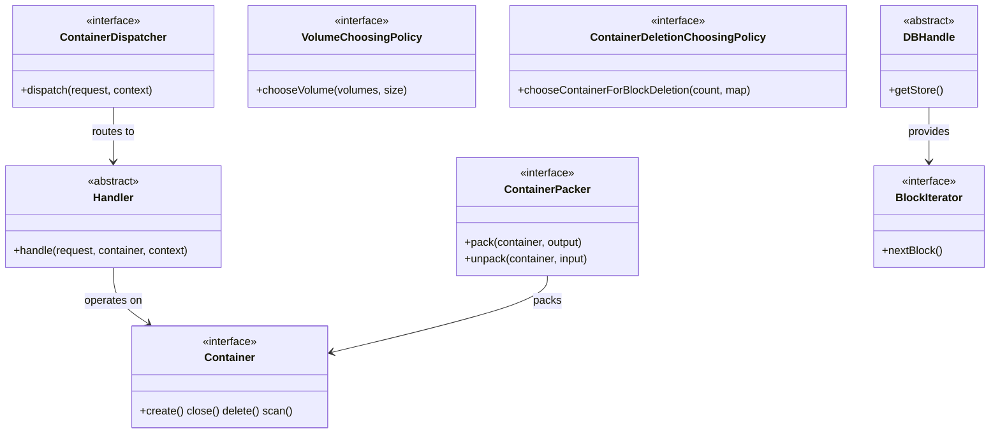

# dn / container-interfaces

_This feature page was generated from `study/atlas/components/dn/container-interfaces.md`. Author prose belongs above or below the BEGIN/END markers._

{/* BEGIN atlas-generated */}

**Classes:** 14    **Kinds:** interface:11, abstract:3

## Overview

The `container-interfaces` feature group holds the interfaces and abstract base types that define the contracts shared across all container implementations. `Container` is the top-level interface for all container lifecycle operations (create, import, export, close, delete, scan). `ContainerDispatcher` bridges the transport layer to container handlers; implementations receive a `ContainerCommandRequestProto` and return a response. `Handler` is the abstract base for type-specific handlers such as `KeyValueHandler`. `ContainerPacker` defines the binary serialization contract used during replication (implemented by `TarContainerPacker`). Policy interfaces (`VolumeChoosingPolicy`, `ContainerDeletionChoosingPolicy`, `ContainerDeletionChoosingPolicyTemplate`) decouple selection strategies from the scheduler loop. `DBHandle` and `BlockIterator` are narrow contracts for RocksDB access and block-level iteration used by scanners and deletion tasks. No production logic lives in this feature; its value is in defining stable contracts that all container types must satisfy.

## Diagram

## Class table

### Sub-feature: `common.interfaces`

| reading_order | fqcn | kind | logic | loc | study (min) | role |
|--:|---|---|---|--:|--:|---|
| 196 | <Fqcn>org.apache.hadoop.ozone.container.common.interfaces.Container</Fqcn> | interface | mixed | 50~ | 20 | Interface for Container Operations. |
| 197 | <Fqcn>org.apache.hadoop.ozone.container.common.interfaces.ContainerInspector</Fqcn> | interface | mixed | 25~ | 20 | A ContainerInspector is tool used to log information about all containers as they are being processed during datanode... |
| 198 | <Fqcn>org.apache.hadoop.ozone.container.common.interfaces.BlockIterator</Fqcn> | interface | mixed | 25~ | 20 | Block Iterator for container. |
| 199 | <Fqcn>org.apache.hadoop.ozone.container.common.interfaces.StorageLocationReportMXBean</Fqcn> | interface | mixed | 25~ | 20 | Contract to define properties available on the JMX interface. |
| 200 | <Fqcn>org.apache.hadoop.ozone.container.common.interfaces.ContainerLocationManager</Fqcn> | interface | mixed | 25~ | 20 | Returns physical path locations, where the containers will be created. |
| 201 | <Fqcn>org.apache.hadoop.ozone.container.common.interfaces.ContainerLocationManagerMXBean</Fqcn> | interface | mixed | 25~ | 20 | Returns physical path locations, where the containers will be created. |
| 202 | <Fqcn>org.apache.hadoop.ozone.container.common.interfaces.ContainerDeletionChoosingPolicy</Fqcn> | interface | mixed | 25~ | 20 | This interface is used for choosing desired containers for block deletion. |
| 203 | <Fqcn>org.apache.hadoop.ozone.container.common.interfaces.VolumeChoosingPolicy</Fqcn> | interface | mixed | 25~ | 20 | This interface specifies the policy for choosing volumes to store replicas. |
| 204 | <Fqcn>org.apache.hadoop.ozone.container.common.interfaces.ContainerPacker</Fqcn> | interface | mixed | 25~ | 20 | Service to pack/unpack ContainerData container data to/from a single byte stream. |
| 205 | <Fqcn>org.apache.hadoop.ozone.container.common.interfaces.ScanResult</Fqcn> | interface | mixed | 25~ | 20 | Encapsulates the result of a container scan. |
| 206 | <Fqcn>org.apache.hadoop.ozone.container.common.interfaces.ContainerDispatcher</Fqcn> | interface | mixed | 25~ | 20 | Dispatcher acts as the bridge between the transport layer and the actual container layer. |
| 207 | <Fqcn>org.apache.hadoop.ozone.container.common.interfaces.Handler</Fqcn> | abstract | mixed | 125~ | 30 | Dispatcher sends ContainerCommandRequests to Handler. |
| 208 | <Fqcn>org.apache.hadoop.ozone.container.common.interfaces.ContainerDeletionChoosingPolicyTemplate</Fqcn> | abstract | mixed | 50~ | 30 | Abstract class that serves as the template for deletion choosing policy. |
| 209 | <Fqcn>org.apache.hadoop.ozone.container.common.interfaces.DBHandle</Fqcn> | abstract | mixed | 25~ | 30 | DB handle abstract class. |

## Anchor details

_No logic-heavy anchors in this feature; the classes are primarily data / dto / config / cli._

## Design docs

- `hadoop-hdds/docs/content/concept/Containers.md` — overview of the container abstraction and its lifecycle states.
- `hadoop-hdds/docs/content/concept/Datanodes.md` — how containers are hosted on datanodes and served through the transport layer.

## Seminal JIRAs / PRs

- [HDDS-13617](https://issues.apache.org/jira/browse/HDDS-13617). Avoid immediate ICR for close container (touches `IncrementalReportSender`).
- [HDDS-13341](https://issues.apache.org/jira/browse/HDDS-13341). Rename `ScanResult.isHealthy()` to `hasErrors()` — API change to `ScanResult` interface.
- [HDDS-5267](https://issues.apache.org/jira/browse/HDDS-5267). Full Container Report can remove replicas added by an Incremental Report.
- [HDDS-8077](https://issues.apache.org/jira/browse/HDDS-8077). Enforce NewlineAtEndOfFile checkstyle (initial baseline for these interfaces).

## Sharp edges

- No concrete logic lives here. A missing `@Override` on any method that happens to match an interface method by name but not signature will silently skip the override; [HDDS-12364](https://issues.apache.org/jira/browse/HDDS-12364) added `@Override` enforcement to catch this class of bug.

## Related features

- `components/dn/kv-container.md` — `KeyValueHandler` extends `Handler`; `KeyValueContainer` implements `Container`.
- `components/dn/dn-service.md` — `HddsDispatcher` implements `ContainerDispatcher`.
- `components/dn/dn-reports.md` — `IncrementalReportSender` is defined here and used by report publishers.
- `components/dn/hdds-volume.md` — `VolumeChoosingPolicy` implementations live in that feature.

## Self-quiz

1. `Handler.handle` takes a `ContainerCommandRequestProto` and a `DispatcherContext`. What is the purpose of `DispatcherContext` and which concrete class carries the Ratis-specific fields inside it?
2. `ContainerDeletionChoosingPolicyTemplate` provides a template method. Which method must subclasses override, and what does the template method compute before delegating?
3. `DBHandle` is abstract. Which concrete class in `dn-utils` wraps it with reference counting, and why is reference counting needed?
4. `ContainerPacker` operates on a `ContainerData` instance. Which concrete implementation in `kv-container` produces a tar archive, and what is the wire format used during push replication?
5. `ScanResult` is returned by container scan operations. Name the two concrete implementations in `dn-service` and what each covers.

Answers

Answer 1: `DispatcherContext` (in `ratis-statemachine-dn`) carries stage (WRITE_STATE_MACHINE_DATA / COMMIT_STAGE / COMBINED) and Ratis log index so `KeyValueHandler` can distinguish streaming writes from commit-only calls.
Answer 2: `chooseContainerForBlockDeletion(count, containerDataMap)` must be overridden; the template method filters out containers below the minimum block threshold before calling the subclass method.
Answer 3: `ReferenceCountedDB` in `dn-utils` wraps `DBHandle`; reference counting is needed because `ContainerCache` is an LRU map and a DB handle must not be closed while a concurrent reader holds it.
Answer 4: `TarContainerPacker` in `kv-container` produces a `.tar` stream containing the container YAML and chunk files; the wire format during push replication is a gRPC `SendContainerResponse` stream carrying the tar bytes.
Answer 5: `MetadataScanResult` covers the metadata (RocksDB) scan; `DataScanResult` covers the data (chunk file checksum) scan.

{/* END atlas-generated */}
