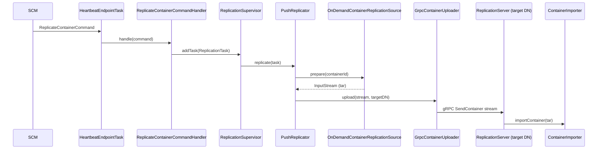

# dn / container-replication-dn

_This feature page was generated from `study/atlas/components/dn/container-replication-dn.md`. Author prose belongs above or below the BEGIN/END markers._

{/* BEGIN atlas-generated */}

**Classes:** 20    **Kinds:** service:13, interface:3, data:2, abstract:1, metrics:1

## Overview

The `container-replication-dn` feature group contains the push-based server-to-server container replication pipeline on the datanode. `ReplicationSupervisor` is the single scheduling hub: it holds a priority-blocking queue of `AbstractReplicationTask` subclasses, assigns each to a per-volume thread pool (from `VolumeReplicationThreadPools` added in [HDDS-15412](https://issues.apache.org/jira/browse/HDDS-15412)), and tracks in-flight tasks to avoid duplicates. For push replication, `ReplicateContainerCommandHandler` enqueues a `ReplicationTask`; `PushReplicator` calls `OnDemandContainerReplicationSource` to pack the container on-demand into a tar stream, then `GrpcContainerUploader` streams it to the target using `GrpcReplicationClient`. The receiving side runs `ReplicationServer` (a standalone gRPC server on a separate port) which delegates to `SendContainerRequestHandler` to import the container via `ContainerImporter`. `CopyContainerCompression` selects the compression codec (none/gzip/lz4/snappy). [HDDS-15614](https://issues.apache.org/jira/browse/HDDS-15614) removed download/pull replication; only push replication remains.

## Diagram

## Class table

### Sub-feature: `container.replication`

| reading_order | fqcn | kind | logic | loc | study (min) | role |
|--:|---|---|---|--:|--:|---|
| 925 | <Fqcn>org.apache.hadoop.ozone.container.replication.ContainerReplicator</Fqcn> | interface | mixed | 25~ | 20 | Service to do the real replication task. |
| 926 | <Fqcn>org.apache.hadoop.ozone.container.replication.ContainerReplicationSource</Fqcn> | interface | mixed | 25~ | 20 | Contract to prepare provide the container in binary form.. |
| 927 | <Fqcn>org.apache.hadoop.ozone.container.replication.ContainerUploader</Fqcn> | interface | mixed | 25~ | 20 | Client-side interface for sending a container to a target datanode. |
| 928 | <Fqcn>org.apache.hadoop.ozone.container.replication.GrpcOutputStream</Fqcn> | abstract | mixed | 125~ | 30 | Adapter from OutputStream to gRPC StreamObserver. |
| 929 | <Fqcn>org.apache.hadoop.ozone.container.replication.ReplicationSupervisor</Fqcn> | service | logic-heavy | 525~ | 60 | Single point to schedule container replication tasks based on priorities. |
| 930 | <Fqcn>org.apache.hadoop.ozone.container.replication.ReplicationServer</Fqcn> | service | logic-heavy | 250~ | 45 | Separated network server for server2server container replication. |
| 931 | <Fqcn>org.apache.hadoop.ozone.container.replication.GrpcContainerUploader</Fqcn> | service | mixed | 150~ | 45 | Uploads container to target datanode via gRPC. |
| 932 | <Fqcn>org.apache.hadoop.ozone.container.replication.VolumeReplicationThreadPools</Fqcn> | service | mixed | 125~ | 30 | Per-volume replication handler thread pools for push-based replication. |
| 933 | <Fqcn>org.apache.hadoop.ozone.container.replication.ContainerImporter</Fqcn> | service | mixed | 125~ | 30 | Imports container from tarball. |
| 934 | <Fqcn>org.apache.hadoop.ozone.container.replication.SendContainerRequestHandler</Fqcn> | service | mixed | 100~ | 30 | Handles incoming container pushed by other datanode. |
| 935 | <Fqcn>org.apache.hadoop.ozone.container.replication.ReplicationTask</Fqcn> | service | mixed | 75~ | 30 | Task to push a container to a target datanode. |
| 936 | <Fqcn>org.apache.hadoop.ozone.container.replication.MeasuredReplicator</Fqcn> | service | mixed | 75~ | 30 | ContainerReplicator wrapper with additional metrics. |
| 937 | <Fqcn>org.apache.hadoop.ozone.container.replication.GrpcReplicationClient</Fqcn> | service | mixed | 50~ | 30 | Client to push container data to another datanode via gRPC. |
| 938 | <Fqcn>org.apache.hadoop.ozone.container.replication.PushReplicator</Fqcn> | service | mixed | 50~ | 30 | Pushes the container to the target datanode. |
| 939 | <Fqcn>org.apache.hadoop.ozone.container.replication.GrpcReplicationService</Fqcn> | service | mixed | 50~ | 30 | Service to make containers available for replication. |
| 940 | <Fqcn>org.apache.hadoop.ozone.container.replication.OnDemandContainerReplicationSource</Fqcn> | service | mixed | 25~ | 30 | A naive implementation of the replication source which creates a tar file on-demand without pre-create the compressed... |
| 941 | <Fqcn>org.apache.hadoop.ozone.container.replication.SendContainerOutputStream</Fqcn> | service | mixed | 25~ | 30 | Output stream adapter for SendContainerResponse. |
| 942 | <Fqcn>org.apache.hadoop.ozone.container.replication.AbstractReplicationTask</Fqcn> | abstract | mixed | 75~ | 10 | Abstract class to capture common variables and methods for different types of replication tasks. |
| 943 | <Fqcn>org.apache.hadoop.ozone.container.replication.CopyContainerCompression</Fqcn> | data | data-only | 75~ | 10 | Defines compression algorithm for container replication. |
| 944 | <Fqcn>org.apache.hadoop.ozone.container.replication.ReplicationSupervisorMetrics</Fqcn> | metrics | mixed | 75~ | 20 | Metrics source to report number of replication tasks. |

## Anchor details

### `ReplicationSupervisor`

- **path:** `hadoop-hdds/container-service/src/main/java/org/apache/hadoop/ozone/container/replication/ReplicationSupervisor.java`
- **loc:** 525~    **difficulty:** 5    **study:** 60 min    **concurrency:** thread-safe    **persistence:** in-memory
- **entry points:** `build`, `run`
- **key collaborators:** `org.apache.hadoop.hdds.conf.ConfigurationSource`, `org.apache.hadoop.hdds.conf.OzoneConfiguration`, `org.apache.hadoop.hdds.protocol.DatanodeDetails`, `org.apache.hadoop.ozone.container.common.impl.ContainerSet`, `org.apache.hadoop.ozone.container.common.interfaces.Container`, `org.apache.hadoop.ozone.container.common.statemachine.DatanodeConfiguration`
- **test exemplar:** `hadoop-hdds/container-service/src/test/java/org/apache/hadoop/ozone/container/replication/TestReplicationSupervisor.java`
- **role:** Single point to schedule container replication tasks based on priorities.

The supervisor uses a `PriorityBlockingQueue<TaskRunner>` ordered by `ReplicationCommandPriority` then queue-time (FIFO for equal priority). Duplicate suppression uses a `ConcurrentHashMap<TaskRunner, AtomicInteger>` keyed by (containerId, targetDN); when a task's counter exceeds 1 the second submission is skipped. [HDDS-10237](https://issues.apache.org/jira/browse/HDDS-10237) added dynamic reconfiguration of the pool size without restarting the datanode.

### `ReplicationServer`

- **path:** `hadoop-hdds/container-service/src/main/java/org/apache/hadoop/ozone/container/replication/ReplicationServer.java`
- **loc:** 250~    **difficulty:** 4    **study:** 45 min    **concurrency:** actor/queue    **persistence:** in-memory
- **entry points:** `init`, `start`
- **key collaborators:** `org.apache.hadoop.hdds.conf.Config`, `org.apache.hadoop.hdds.conf.ConfigGroup`, `org.apache.hadoop.hdds.conf.ConfigType`, `org.apache.hadoop.hdds.conf.PostConstruct`, `org.apache.hadoop.hdds.security.SecurityConfig`, `org.apache.hadoop.hdds.security.x509.certificate.client.CertificateClient`
- **role:** Separated network server for server2server container replication.

`ReplicationServer` owns its own `ReplicationConfig` inner class, binds a dedicated port (`hdds.container.ratis.replication.port`), and registers a `GrpcReplicationService` that serves `SendContainer` RPCs. It is started from `OzoneContainer.start()` alongside the regular `XceiverServerGrpc`. The separate port allows firewall policies that block client traffic to permit inter-DN replication.

## Design docs

- `hadoop-hdds/docs/content/concept/Containers.md` — general container lifecycle including replication triggers.
- `hadoop-hdds/docs/content/concept/Datanodes.md` — datanode architecture and how the replication server fits in.

## Seminal JIRAs / PRs

- [HDDS-15412](https://issues.apache.org/jira/browse/HDDS-15412). Add per-volume push replication thread pools on DataNode.
- [HDDS-15614](https://issues.apache.org/jira/browse/HDDS-15614). Remove Datanode download/pull container replication (push-only now).
- [HDDS-10237](https://issues.apache.org/jira/browse/HDDS-10237). Dynamic reconfiguration of replication supervisor thread pool.
- [HDDS-12235](https://issues.apache.org/jira/browse/HDDS-12235). Reserve space on DN during container import operation.
- [HDDS-12547](https://issues.apache.org/jira/browse/HDDS-12547). Container creation and import use the same `VolumeChoosingPolicy`.
- [HDDS-13238](https://issues.apache.org/jira/browse/HDDS-13238). Scan container and volume during import/export and EC reconstruction.
- [HDDS-15326](https://issues.apache.org/jira/browse/HDDS-15326). Clamp out-of-service limit factor to bounds instead of resetting to default.

## Sharp edges

- `ReplicationSupervisor` deduplicates tasks by (containerId, targetDN) key; if the same container needs replication to two different targets concurrently both tasks are submitted, but a second task to the same target is silently dropped while the first is in flight ([HDDS-10237](https://issues.apache.org/jira/browse/HDDS-10237) covers pool resize; no explicit fix for the drop window).
- `ContainerImporter` calls `VolumeChoosingPolicy` to select the destination volume; if the target volume has insufficient space the import fails and no fallback to another volume is attempted — callers must pre-check via `AvailableSpaceFilter` ([HDDS-12235](https://issues.apache.org/jira/browse/HDDS-12235)).

## Related features

- `components/dn/dn-statemachine.md` — `ReplicateContainerCommandHandler` lives there and calls into this feature.
- `components/dn/container-checksum.md` — `ReconcileContainerTask` also runs through `ReplicationSupervisor`.
- `components/dn/grpc-server-dn.md` — `ReplicationServer` is a sibling gRPC server started alongside `XceiverServerGrpc`.
- `components/dn/hdds-volume.md` — `VolumeReplicationThreadPools` maps each volume to its own executor.
- `components/dn/erasure-coding.md` — `ECReconstructionCoordinatorTask` also runs through the supervisor.

## Self-quiz

1. Why does `ReplicationSupervisor` use a `PriorityBlockingQueue` rather than a standard FIFO queue, and what two fields determine task ordering?
2. `OnDemandContainerReplicationSource` creates the tar stream on demand without pre-creation. What is the performance trade-off compared to a pre-created snapshot approach?
3. `ReplicationServer` listens on a dedicated port separate from the main `XceiverServerGrpc` port. What configuration key controls the replication port, and why is a separate port useful?
4. `CopyContainerCompression` selects a codec. Which codecs are supported, and where is the codec negotiated between sender and receiver?
5. What invariant must hold on the target datanode before `ContainerImporter` writes the container data, and which class enforces the space pre-reservation?

Answers

Answer 1: Tasks are ordered first by `ReplicationCommandPriority` (NORMAL &lt; LOW), then by queue time (FIFO within same priority) so urgent replication is not starved behind low-priority background tasks.
Answer 2: On-demand creation means no disk I/O before the transfer starts (no pre-created snapshot file), but it holds the container read lock for the duration of the tar streaming, increasing latency under read contention.
Answer 3: `hdds.container.ratis.replication.port`; a separate port lets operators apply firewall rules or QoS policies that differ between client I/O and inter-DN replication traffic.
Answer 4: `CopyContainerCompression` supports NONE, GZIP, LZ4, SNAPPY; the sender specifies the codec in the `SendContainerRequest` proto, and the receiver uses whichever codec is advertised.
Answer 5: `ContainerImporter` must verify that the destination volume has enough free space (checked via `AvailableSpaceFilter` / `HddsVolume.reserveSpace`); without the reservation, concurrent imports can overcommit a volume ([HDDS-12235](https://issues.apache.org/jira/browse/HDDS-12235)).

{/* END atlas-generated */}
