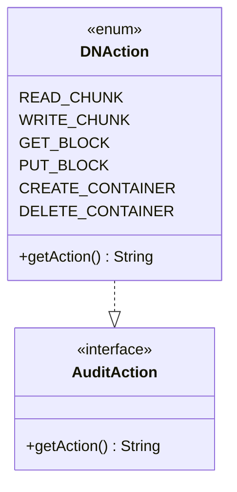

# dn / dn-audit

_This feature page was generated from `study/atlas/components/dn/dn-audit.md`. Author prose belongs above or below the BEGIN/END markers._

{/* BEGIN atlas-generated */}

**Classes:** 1    **Kinds:** data:1

## Overview

The `dn-audit` feature group contains a single enum, `DNAction`, that enumerates all auditable operations performed by a datanode. It implements the `AuditAction` interface from the Ozone audit framework and is used as the action type passed to the audit logger in `KeyValueHandler` and `HddsDispatcher` when recording container command events such as READ_CHUNK, WRITE_CHUNK, GET_BLOCK, PUT_BLOCK, CREATE_CONTAINER, and DELETE_CONTAINER. There is no business logic in this feature; its value is as the shared vocabulary for datanode audit entries.

## Diagram

## Class table

### Sub-feature: `ozone.audit`

| reading_order | fqcn | kind | logic | loc | study (min) | role |
|--:|---|---|---|--:|--:|---|
| 1525 | <Fqcn>org.apache.hadoop.ozone.audit.DNAction</Fqcn> | data | data-only | 25~ | 10 | Enum to define Audit Action types for Datanode. |

## Anchor details

_No logic-heavy anchors in this feature; the classes are primarily data / dto / config / cli._

## Design docs

- no dedicated design doc under hadoop-hdds/docs/content/ on this branch.

## Seminal JIRAs / PRs

- TODO(verify) — no HDDS commits touch only this file; it was introduced as part of the initial audit framework and has been stable since.

## Sharp edges

- No sharp edges. `DNAction` is a pure enum with no mutable state.

## Related features

- `components/dn/kv-container.md` — `KeyValueHandler` logs `DNAction` entries for each container command.
- `components/dn/dn-service.md` — `HddsDispatcher` records audit events using `DNAction`.

## Self-quiz

1. `DNAction` implements the `AuditAction` interface. What single method must it implement, and what does the method return?
2. Which class in `kv-container` calls the datanode audit logger with a `DNAction` value, and on which code path?
3. Enum constants in `DNAction` correspond to container-level operations. Name one operation that is NOT represented (e.g., a metadata-only operation) and explain why it may be absent.
4. Is there a separate `SCMAction` enum for SCM-side audit events? Where would it reside relative to `DNAction`?
5. If a new container command type (e.g., RECONCILE_CONTAINER) is added, what changes are needed in `DNAction` and which other class(es) must also be updated?

Answers

Answer 1: `getAction()` returning a `String` name of the operation.
Answer 2: `KeyValueHandler.handle()` calls the audit logger with the appropriate `DNAction` constant after the container command is processed.
Answer 3: `TODO(verify)` — e.g., LIST_BLOCK or GET_CONTAINER_INFO may be absent if they are considered read-only and excluded from the audit policy.
Answer 4: There is an `SCMAction` enum in the SCM module under a parallel `audit` package; it is separate from `DNAction` because SCM and DN audit different operation domains.
Answer 5: Add the new constant to `DNAction`; update `KeyValueHandler` (or the relevant command handler) to log the new action; if audit filtering is configured by action name, update audit policy files.

{/* END atlas-generated */}
