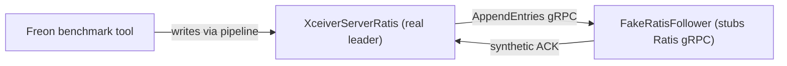

# dn / dn-freon

_This feature page was generated from `study/atlas/components/dn/dn-freon.md`. Author prose belongs above or below the BEGIN/END markers._

{/* BEGIN atlas-generated */}

**Classes:** 1    **Kinds:** service:1

## Overview

The `dn-freon` feature group contains a single Freon test utility, `FakeRatisFollower`, that stubs out the Ratis gRPC outgoing calls to allow performance testing of the datanode write path without the overhead of real Ratis consensus. It intercepts `AppendEntries` and `RequestVote` RPC calls on the follower side and returns synthetic success responses, enabling Freon workloads (e.g., `HDDS-10442` round-trip latency tests) to measure pure datanode I/O latency without needing a real Ratis cluster. This class is only used in freon tool testing, not in production code paths.

## Diagram

## Class table

### Sub-feature: `hdds.freon`

| reading_order | fqcn | kind | logic | loc | study (min) | role |
|--:|---|---|---|--:|--:|---|
| 1526 | <Fqcn>org.apache.hadoop.hdds.freon.FakeRatisFollower</Fqcn> | service | mixed | 75~ | 30 | Helper class to use it to replace original Ratis GRPC outgoing calls. |

## Anchor details

_No logic-heavy anchors in this feature; the classes are primarily data / dto / config / cli._

## Design docs

- no dedicated design doc under hadoop-hdds/docs/content/ on this branch.

## Seminal JIRAs / PRs

- [HDDS-3023](https://issues.apache.org/jira/browse/HDDS-3023). Create Freon test to test isolated Ratis LEADER (introduced `FakeRatisFollower`).
- [HDDS-10442](https://issues.apache.org/jira/browse/HDDS-10442). Add a Freon tool to measure client-to-DataNode round-trip latency (uses `FakeRatisFollower`).

## Sharp edges

- `FakeRatisFollower` must not be started in a production cluster; it acknowledges all writes unconditionally, making data loss invisible. There is no guard in the class itself.

## Related features

- `components/dn/ratis-statemachine-dn.md` — `XceiverServerRatis` is the real Ratis server `FakeRatisFollower` stands beside.

## Self-quiz

1. `FakeRatisFollower` replaces the Ratis gRPC outgoing calls. What specific gRPC service does it implement, and what does it return for each `AppendEntries` call?
2. Why is using `FakeRatisFollower` in a Freon benchmark useful even though it produces artificially optimistic results?
3. How would you start a datanode with `FakeRatisFollower` instead of a real Ratis follower in a local test?
4. What would happen to data durability if `FakeRatisFollower` was used in a 3-replica cluster where two of the three followers are fake?
5. Is `FakeRatisFollower` in the production classpath or the test classpath? What is the implication if it ends up in production jars?

Answers

Answer 1: It implements the Ratis `RaftServerProtocolService` gRPC service; for `AppendEntries` it returns a `RaftProtos.AppendEntriesReplyProto` with SUCCESS and the leader's term, without actually persisting anything.
Answer 2: It isolates the datanode write path (container dispatch, chunk write to disk) from Ratis consensus overhead, giving a pure I/O-bound baseline.
Answer 3: `TODO(verify)` — typically by passing a configuration that overrides the Ratis peer connection to point to a `FakeRatisFollower` server process.
Answer 4: All writes would appear committed but only the leader's disk holds the data; a leader restart would lose all writes acknowledged by the fake followers.
Answer 5: It is in `hadoop-hdds/container-service/src/main/java`, so it is in the production jar. A comment in the class header marks it for Freon use; operators must not enable it via configuration in a real cluster.

{/* END atlas-generated */}
