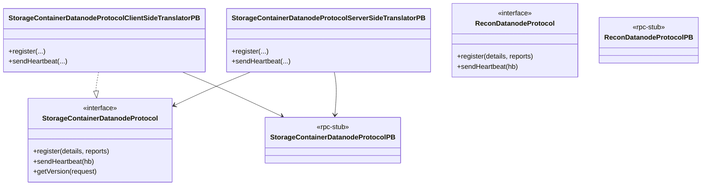

# dn / dn-protocol

_This feature page was generated from `study/atlas/components/dn/dn-protocol.md`. Author prose belongs above or below the BEGIN/END markers._

{/* BEGIN atlas-generated */}

**Classes:** 8    **Kinds:** interface:4, rpc-stub:3, dto:1

## Overview

The `dn-protocol` feature group defines the RPC wire contracts and their Protobuf-backed translators for communication between the datanode and its two management services: SCM and Recon. `StorageContainerDatanodeProtocol` is the core Java interface the datanode uses to register with SCM, send heartbeats, and receive commands. `StorageContainerDatanodeProtocolPB` is the auto-generated Hadoop RPC interface (via the `*.proto` definition); the server-side translator `StorageContainerDatanodeProtocolServerSideTranslatorPB` unmarshals Protobuf requests and delegates to the SCM implementation, while the client-side translator `StorageContainerDatanodeProtocolClientSideTranslatorPB` marshals Java calls into Protobuf. `ReconDatanodeProtocol` and `ReconDatanodeProtocolPB` follow the same pattern for Recon communication. `StorageContainerNodeProtocol` is the broader SCM-side view that includes both registration and heartbeat. `VersionResponse` is the DTO returned by the SCM version endpoint during the initial DN handshake.

## Diagram

## Class table

### Sub-feature: `ozone.protocol`

| reading_order | fqcn | kind | logic | loc | study (min) | role |
|--:|---|---|---|--:|--:|---|
| 1535 | <Fqcn>org.apache.hadoop.ozone.protocol.StorageContainerNodeProtocol</Fqcn> | interface | mixed | 25~ | 20 | The protocol spoken between datanodes and SCM. |
| 1536 | <Fqcn>org.apache.hadoop.ozone.protocol.ReconDatanodeProtocol</Fqcn> | interface | mixed | 25~ | 20 | The protocol spoken between datanodes and Recon. |
| 1537 | <Fqcn>org.apache.hadoop.ozone.protocol.StorageContainerDatanodeProtocol</Fqcn> | interface | mixed | 25~ | 20 | The protocol spoken between datanodes and SCM. |
| 1538 | <Fqcn>org.apache.hadoop.ozone.protocol.VersionResponse</Fqcn> | dto | data-only | 75~ | 10 | Version response class. |

### Sub-feature: `ozone.protocolPB`

| reading_order | fqcn | kind | logic | loc | study (min) | role |
|--:|---|---|---|--:|--:|---|
| 1539 | <Fqcn>org.apache.hadoop.ozone.protocolPB.StorageContainerDatanodeProtocolClientSideTranslatorPB</Fqcn> | service | mixed | 75~ | 20 | This class is the client-side translator to translate the requests made on the StorageContainerDatanodeProtocol inter... |
| 1540 | <Fqcn>org.apache.hadoop.ozone.protocolPB.StorageContainerDatanodeProtocolServerSideTranslatorPB</Fqcn> | rpc-stub | data-only | 75~ | 20 | This class is the server-side translator that forwards requests received on StorageContainerDatanodeProtocolPB to the... |
| 1541 | <Fqcn>org.apache.hadoop.ozone.protocolPB.StorageContainerDatanodeProtocolPB</Fqcn> | rpc-stub | data-only | 25~ | 20 | Protocol used from a datanode to StorageContainerManager. |
| 1542 | <Fqcn>org.apache.hadoop.ozone.protocolPB.ReconDatanodeProtocolPB</Fqcn> | rpc-stub | data-only | 25~ | 20 | Protocol used from a datanode to Recon. |

## Anchor details

_No logic-heavy anchors in this feature; the classes are primarily data / dto / config / cli._

## Design docs

- `hadoop-hdds/docs/content/concept/Datanodes.md` — describes the DN-to-SCM communication model and the protocols involved.
- `hadoop-hdds/docs/content/concept/StorageContainerManager.md` — SCM side of the same protocol.

## Seminal JIRAs / PRs

- [HDDS-13086](https://issues.apache.org/jira/browse/HDDS-13086). Block duplicate reconciliation requests within the datanode (uses `StorageContainerDatanodeProtocol`).
- [HDDS-02](https://issues.apache.org/jira/browse/HDDS-02)f90379. Use forked Hadoop RPC ([HDDS-13753](https://issues.apache.org/jira/browse/HDDS-13753)) — migrated these translators to the forked RPC stack.
- [HDDS-5267](https://issues.apache.org/jira/browse/HDDS-5267). Full Container Report can remove replicas added by an Incremental Report (uses `sendHeartbeat`).
- [HDDS-5111](https://issues.apache.org/jira/browse/HDDS-5111). Datanode should not always report full information in heartbeat.

## Sharp edges

- No sharp edges specific to this feature; the translators are auto-generated boilerplate. Changes to the `.proto` file must maintain backward compatibility or both sides must be upgraded together.

## Related features

- `components/dn/dn-service.md` — `HeartbeatEndpointTask` calls `sendHeartbeat` via `StorageContainerDatanodeProtocolClientSideTranslatorPB`.
- `components/dn/dn-statemachine.md` — `SCMConnectionManager` creates and manages the `StorageContainerDatanodeProtocolClientSideTranslatorPB` instances.
- `components/dn/dn-reports.md` — report publishers populate the heartbeat payload that the protocol sends.

## Self-quiz

1. `StorageContainerDatanodeProtocolClientSideTranslatorPB` wraps a `StorageContainerDatanodeProtocolPB` stub. Who creates the stub, and in what class is the underlying Hadoop RPC channel established?
2. `VersionResponse.build()` is the entry point. What information does the version response contain, and which class on the datanode calls it?
3. `ReconDatanodeProtocol` is a separate interface from `StorageContainerDatanodeProtocol`. Why does Recon need its own protocol instead of reusing the SCM one?
4. `StorageContainerDatanodeProtocolServerSideTranslatorPB` uses `OzoneProtocolMessageDispatcher`. What does the dispatcher add on top of a direct method call?
5. The DN can be configured with multiple SCM endpoints (HA). Which class manages the set of `StorageContainerDatanodeProtocolClientSideTranslatorPB` instances, and how does it handle failover?

Answers

Answer 1: `SCMConnectionManager` creates the stub by calling `StorageContainerDatanodeProtocolPB`'s static `newBlockingStub(channel)` method on a Hadoop IPC channel.
Answer 2: Version (software version string), SCM ID, cluster ID; `VersionEndpointTask` calls it to compare with the local version on first contact.
Answer 3: Recon has different registration and heartbeat semantics (it does not issue commands back to the DN); a separate interface makes the contract explicit and avoids coupling Recon deployments to SCM protocol changes.
Answer 4: `OzoneProtocolMessageDispatcher` adds tracing context propagation and per-method metrics (request count, latency) around every RPC call.
Answer 5: `SCMConnectionManager` holds one translator per SCM endpoint; it iterates endpoints in `RunningDatanodeState` and retries on the next endpoint if one fails (round-robin failover).

{/* END atlas-generated */}
