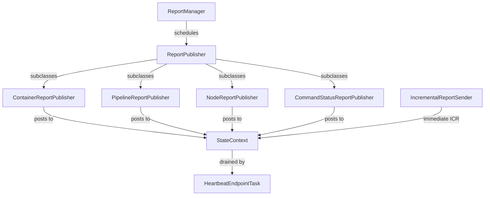

# dn / dn-reports

_This feature page was generated from `study/atlas/components/dn/dn-reports.md`. Author prose belongs above or below the BEGIN/END markers._

{/* BEGIN atlas-generated */}

**Classes:** 8    **Kinds:** service:5, interface:1, abstract:1, factory:1

## Overview

The `dn-reports` feature group manages the periodic and incremental reporting that datanodes send to SCM as part of the heartbeat protocol. `ReportManager` acts as the scheduler: it holds a `ScheduledExecutorService` and a list of `ReportPublisher` instances that it initializes via `ReportPublisherFactory`. Each `ReportPublisher` subclass (`ContainerReportPublisher`, `PipelineReportPublisher`, `NodeReportPublisher`, `CommandStatusReportPublisher`) implements the `run()` method to collect a typed report and post it to the `StateContext` queue that `HeartbeatEndpointTask` drains. `IncrementalReportSender` is a narrow interface for sending immediate (non-scheduled) incremental container reports (ICRs) when a container changes state; callers like `CloseContainerCommandHandler` inject it rather than depending on the full `StateContext`. [HDDS-5267](https://issues.apache.org/jira/browse/HDDS-5267) fixed a race where a full container report could remove replicas that an ICR had just added.

## Diagram

## Class table

### Sub-feature: `common.report`

| reading_order | fqcn | kind | logic | loc | study (min) | role |
|--:|---|---|---|--:|--:|---|
| 828 | <Fqcn>org.apache.hadoop.ozone.container.common.report.IncrementalReportSender</Fqcn> | interface | mixed | 25~ | 20 | IncrementalReportSender is an interface to send ICRs. |
| 829 | <Fqcn>org.apache.hadoop.ozone.container.common.report.ReportPublisher</Fqcn> | abstract | mixed | 50~ | 30 | Abstract class responsible for scheduling the reports based on the configured interval. |
| 830 | <Fqcn>org.apache.hadoop.ozone.container.common.report.ReportManager</Fqcn> | service | mixed | 75~ | 30 | ReportManager is responsible for managing all the ReportPublisher and also provides ScheduledExecutorService to Repor... |
| 831 | <Fqcn>org.apache.hadoop.ozone.container.common.report.PipelineReportPublisher</Fqcn> | service | mixed | 25~ | 30 | Publishes Pipeline which will be sent to SCM as part of heartbeat. |
| 832 | <Fqcn>org.apache.hadoop.ozone.container.common.report.ContainerReportPublisher</Fqcn> | service | mixed | 25~ | 30 | Publishes ContainerReport which will be sent to SCM as part of heartbeat. |
| 833 | <Fqcn>org.apache.hadoop.ozone.container.common.report.NodeReportPublisher</Fqcn> | service | mixed | 25~ | 30 | Publishes NodeReport which will be sent to SCM as part of heartbeat. |
| 834 | <Fqcn>org.apache.hadoop.ozone.container.common.report.CommandStatusReportPublisher</Fqcn> | service | mixed | 25~ | 30 | Publishes CommandStatusReport which will be sent to SCM as part of heartbeat. |
| 835 | <Fqcn>org.apache.hadoop.ozone.container.common.report.ReportPublisherFactory</Fqcn> | factory | mixed | 25~ | 20 | Factory class to construct ReportPublisher for a report. |

## Anchor details

_No logic-heavy anchors in this feature; the classes are primarily data / dto / config / cli._

## Design docs

- `hadoop-hdds/docs/content/concept/Datanodes.md` — describes the heartbeat mechanism and the reports sent to SCM.

## Seminal JIRAs / PRs

- [HDDS-5267](https://issues.apache.org/jira/browse/HDDS-5267). Full Container Report can remove replicas added by an Incremental Report.
- [HDDS-5111](https://issues.apache.org/jira/browse/HDDS-5111). Datanode should not always report full information in heartbeat.
- [HDDS-13617](https://issues.apache.org/jira/browse/HDDS-13617). Avoid immediate ICR for close container (prevents ICR flood on close).
- [HDDS-8882](https://issues.apache.org/jira/browse/HDDS-8882). Manage status of `DeleteBlocksCommand` in SCM to avoid sending duplicates.
- [HDDS-5275](https://issues.apache.org/jira/browse/HDDS-5275). Datanode Report Publisher publishes one extra report after DN shutdown.

## Sharp edges

- [HDDS-5267](https://issues.apache.org/jira/browse/HDDS-5267): a full container report sent immediately after an ICR can cause SCM to conclude that the replica is gone (because full reports are treated as authoritative). To avoid this, `ContainerReportPublisher` must not be triggered right after a state change that also sends an ICR; [HDDS-13617](https://issues.apache.org/jira/browse/HDDS-13617) added a guard that skips an immediate ICR when the container is being closed.

## Related features

- `components/dn/dn-statemachine.md` — `HeartbeatEndpointTask` drains the `StateContext` report queue.
- `components/dn/dn-service.md` — `ReportManager` is initialized inside `OzoneContainer`.
- `components/dn/dn-protocol.md` — reports are encoded into the `SCMHeartbeatRequestProto` that `StorageContainerDatanodeProtocolClientSideTranslatorPB` sends.

## Self-quiz

1. `ReportPublisher` is abstract and scheduled by `ReportManager`. What is the scheduling unit — fixed-rate or fixed-delay — and why does it matter for container report accuracy?
2. `IncrementalReportSender` is an interface injected into command handlers. What would happen if a command handler used `StateContext` directly instead of this interface?
3. `ContainerReportPublisher` sends a full container list. How does SCM reconcile a full report with a previously received ICR that arrived in between?
4. `ReportPublisherFactory` creates publishers by type. Is the factory extensible for custom report types without modifying core code? Where is the binding registered?
5. After a DN crash and restart, which report is sent first — a full container report or an ICR — and what triggers it?

Answers

Answer 1: Fixed-delay (each run starts after the previous one finishes plus the configured interval); this prevents cascading report floods if a single collection takes longer than the interval.
Answer 2: Coupling to `StateContext` would make the command handler depend on the entire state machine, making unit testing harder and creating a circular dependency risk; `IncrementalReportSender` is the narrowest interface needed.
Answer 3: SCM processes reports in order; a full report received after an ICR that added a replica will include that replica (since the replica is now in the container's state), so no conflict. A full report received before an ICR is the race that [HDDS-5267](https://issues.apache.org/jira/browse/HDDS-5267) fixed.
Answer 4: `TODO(verify)` — `ReportPublisherFactory` uses a hard-coded switch/map; it is not a plugin registry.
Answer 5: After restart, `ContainerReportPublisher` fires on the first scheduled interval and sends a full report; the ICR is only sent when a container changes state after the heartbeat connection is established.

{/* END atlas-generated */}
