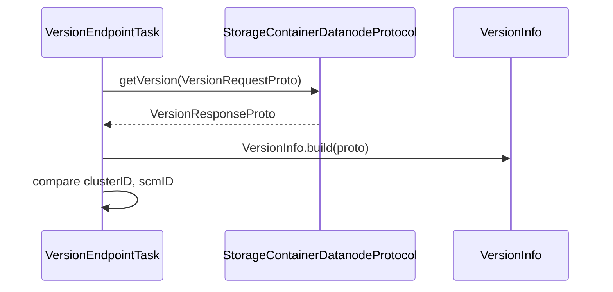

# dn / dn-scm-client

_This feature page was generated from `study/atlas/components/dn/dn-scm-client.md`. Author prose belongs above or below the BEGIN/END markers._

{/* BEGIN atlas-generated */}

**Classes:** 1    **Kinds:** dto:1

## Overview

The `dn-scm-client` feature group contains a single DTO, `VersionInfo`, that represents the version data returned by SCM in response to a datanode's initial version request. It carries the SCM's software version string, cluster ID, and SCM ID; the datanode's `VersionEndpointTask` calls `StorageContainerDatanodeProtocol.getVersion` and compares the returned `VersionInfo` against what is already persisted in the local storage layout. This class has no mutable state and is instantiated via its inner `Builder`.

## Diagram

## Class table

### Sub-feature: `hdds.scm`

| reading_order | fqcn | kind | logic | loc | study (min) | role |
|--:|---|---|---|--:|--:|---|
| 1543 | <Fqcn>org.apache.hadoop.hdds.scm.VersionInfo</Fqcn> | dto | data-only | 25~ | 10 | This is a class that tracks versions of SCM. |

## Anchor details

_No logic-heavy anchors in this feature; the classes are primarily data / dto / config / cli._

## Design docs

- no dedicated design doc under hadoop-hdds/docs/content/ on this branch.

## Seminal JIRAs / PRs

- TODO(verify) — `VersionInfo` has been stable; no dedicated HDDS JIRA found targeting only this class.

## Sharp edges

- No sharp edges. `VersionInfo` is a pure immutable DTO.

## Related features

- `components/dn/dn-protocol.md` — `VersionResponse` (protocol layer) is converted to `VersionInfo` by `VersionEndpointTask`.
- `components/dn/dn-service.md` — `VersionEndpointTask` uses `VersionInfo` to validate cluster identity on first contact.

## Self-quiz

1. `VersionInfo` is built from a `VersionResponseProto`. Name the three fields the datanode validates against its persisted state.
2. What happens if the cluster ID in `VersionInfo` differs from the cluster ID stored on the datanode's storage directory?
3. `VersionInfo` uses a `Builder` pattern. Why is a builder preferred over a public constructor for this class?
4. Which state machine state triggers the `VersionEndpointTask` to call `getVersion`, and what state does the DN transition to after a successful version check?
5. If a datanode is joining a new cluster (blank storage), how is the cluster ID obtained, and where is it first persisted?

Answers

Answer 1: cluster ID, SCM ID, and software version string.
Answer 2: The datanode refuses to register and logs a configuration mismatch error; it will not accept data until the cluster ID is corrected or the storage directory is re-formatted.
Answer 3: A builder allows the `build()` factory method to be called from a Protobuf object without a matching constructor, and makes the class immutable after construction.
Answer 4: `VersionEndpointTask` is called from `RunningDatanodeState` on the first heartbeat cycle; after a successful version check the endpoint transitions to REGISTER state.
Answer 5: The cluster ID from `VersionInfo` is written to the datanode's `VERSION` file (via `DatanodeVersionFile`) on first successful `getVersion` call.

{/* END atlas-generated */}
