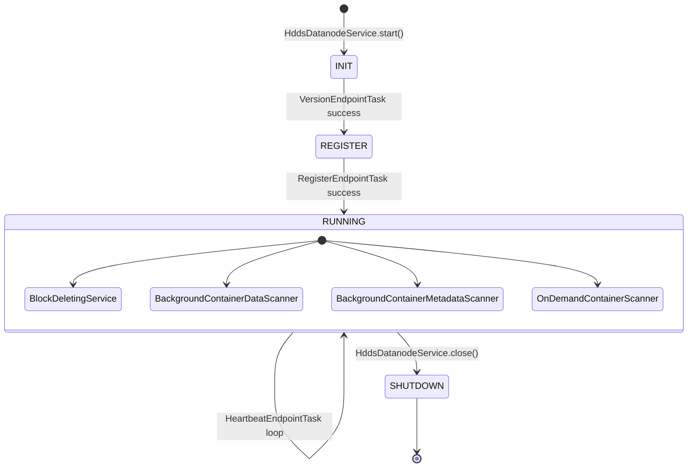

# dn / dn-service

_This feature page was generated from `study/atlas/components/dn/dn-service.md`. Author prose belongs above or below the BEGIN/END markers._

{/* BEGIN atlas-generated */}

**Classes:** 42    **Kinds:** service:31, metrics:4, interface:3, abstract:2, data:2

## Overview

The `dn-service` feature group contains the core datanode process logic and the container lifecycle management layer. `HddsDatanodeService` is the top-level service plugin (implements Hadoop `ServicePlugin`); its `start()` method initializes `DatanodeLayoutStorage`, creates `OzoneContainer`, starts `DatanodeStateMachine`, and wires HTTP/JMX endpoints. `OzoneContainer` is the central coordinator that owns `ContainerSet`, `HddsDispatcher`, `BlockDeletingService`, and all transport servers; its `start()` method starts the gRPC and Ratis servers. `HddsDispatcher` routes incoming `ContainerCommandRequestProto` messages to the appropriate `Handler` (currently always `KeyValueHandler`) after performing security checks and updating `ContainerMetrics`. `ContainerData` is the abstract in-memory representation of container metadata; it is read from and written to disk as a YAML file by `ContainerDataYaml`. `ContainerSet` maintains the authoritative in-memory map from container ID to `Container`, guards concurrent access with a `ReentrantReadWriteLock`, and notifies `OnDemandContainerScanner` of state changes. `BlockDeletingService` is a background thread pool service that periodically calls `BlockDeletingTask` to free deleted blocks. `ContainerReader` runs at startup to scan container directories on each volume and populate `ContainerSet` from YAML files. The scanner classes (`BackgroundContainerDataScanner`, `BackgroundContainerMetadataScanner`, `OnDemandContainerScanner`) check container integrity at different granularities and frequencies. `HeartbeatEndpointTask`, `RegisterEndpointTask`, and `VersionEndpointTask` implement the SCM communication lifecycle for a single endpoint.

## Diagram

## Class table

### Sub-feature: `common.impl`

| reading_order | fqcn | kind | logic | loc | study (min) | role |
|--:|---|---|---|--:|--:|---|
| 1544 | <Fqcn>org.apache.hadoop.ozone.container.common.impl.ContainerData</Fqcn> | abstract | logic-heavy | 400~ | 60 | ContainerData is the in-memory representation of container metadata and is represented on disk by the .container file. |
| 1545 | <Fqcn>org.apache.hadoop.ozone.container.common.impl.HddsDispatcher</Fqcn> | service | logic-heavy | 800~ | 60 | Ozone Container dispatcher takes a call from the netty server and routes it to the right handler function. |
| 1546 | <Fqcn>org.apache.hadoop.ozone.container.common.impl.ContainerSet</Fqcn> | service | logic-heavy | 375~ | 45 | Class that manages Containers created on the datanode. |
| 1547 | <Fqcn>org.apache.hadoop.ozone.container.common.impl.StorageLocationReport</Fqcn> | service | logic-heavy | 300~ | 45 | Storage location stats of datanodes that provide back store for containers. |
| 1548 | <Fqcn>org.apache.hadoop.ozone.container.common.impl.BlockDeletingService</Fqcn> | service | logic-heavy | 250~ | 45 | A per-datanode container block deleting service takes in charge of deleting staled ozone blocks. |
| 1549 | <Fqcn>org.apache.hadoop.ozone.container.common.impl.ContainerDataYaml</Fqcn> | service | logic-heavy | 200~ | 45 | Class for creating and reading .container files. |
| 1550 | <Fqcn>org.apache.hadoop.ozone.container.common.impl.ContainerDataScanOrder</Fqcn> | service | mixed | 25~ | 30 | Orders containers: 1. |
| 1551 | <Fqcn>org.apache.hadoop.ozone.container.common.impl.RandomContainerDeletionChoosingPolicy</Fqcn> | service | mixed | 25~ | 30 | Randomly choosing containers for block deletion. |
| 1552 | <Fqcn>org.apache.hadoop.ozone.container.common.impl.TopNOrderedContainerDeletionChoosingPolicy</Fqcn> | service | mixed | 25~ | 30 | TopN Ordered choosing policy that choosing containers based on pending deletion blocks' number. |
| 1553 | <Fqcn>org.apache.hadoop.ozone.container.common.impl.ContainerLayoutVersion</Fqcn> | data | data-only | 75~ | 10 | Defines layout versions for the Chunks. |

### Sub-feature: `common.states`

| reading_order | fqcn | kind | logic | loc | study (min) | role |
|--:|---|---|---|--:|--:|---|
| 1554 | <Fqcn>org.apache.hadoop.ozone.container.common.states.DatanodeState</Fqcn> | interface | mixed | 25~ | 20 | State Interface that allows tasks to maintain states. |

### Sub-feature: `container.common`

| reading_order | fqcn | kind | logic | loc | study (min) | role |
|--:|---|---|---|--:|--:|---|
| 1555 | <Fqcn>org.apache.hadoop.ozone.container.common.DatanodeLayoutStorage</Fqcn> | service | mixed | 50~ | 30 | DataNodeStorageConfig is responsible for management of the StorageDirectories used by the DataNode. |
| 1556 | <Fqcn>org.apache.hadoop.ozone.container.common.HDDSVolumeLayoutVersion</Fqcn> | service | mixed | 25~ | 30 | Layout version which describes information about the layout version on the datanode volume. |

### Sub-feature: `container.ozoneimpl`

| reading_order | fqcn | kind | logic | loc | study (min) | role |
|--:|---|---|---|--:|--:|---|
| 1557 | <Fqcn>org.apache.hadoop.ozone.container.ozoneimpl.AbstractBackgroundContainerScanner</Fqcn> | abstract | mixed | 125~ | 30 | Base class for scheduled scanners on a Datanode. |
| 1558 | <Fqcn>org.apache.hadoop.ozone.container.ozoneimpl.OzoneContainer</Fqcn> | service | logic-heavy | 525~ | 60 | Ozone main class sets up the network servers and initializes the container layer. |
| 1559 | <Fqcn>org.apache.hadoop.ozone.container.ozoneimpl.ContainerReader</Fqcn> | service | logic-heavy | 250~ | 45 | Class used to read .container files from Volume and build container map. |
| 1560 | <Fqcn>org.apache.hadoop.ozone.container.ozoneimpl.ContainerScanHelper</Fqcn> | service | mixed | 175~ | 45 | Mixin to handle common data and metadata scan operations among background and on-demand scanners. |
| 1561 | <Fqcn>org.apache.hadoop.ozone.container.ozoneimpl.ContainerScannerConfiguration</Fqcn> | service | mixed | 150~ | 45 | This class defines configuration parameters for the container scanners. |
| 1562 | <Fqcn>org.apache.hadoop.ozone.container.ozoneimpl.ContainerController</Fqcn> | service | mixed | 150~ | 45 | Control plane for container management in datanode. |
| 1563 | <Fqcn>org.apache.hadoop.ozone.container.ozoneimpl.OnDemandContainerScanner</Fqcn> | service | mixed | 100~ | 30 | Class for performing on demand scans of containers. |
| 1564 | <Fqcn>org.apache.hadoop.ozone.container.ozoneimpl.BackgroundContainerDataScanner</Fqcn> | service | mixed | 75~ | 30 | Data scanner that full checks a volume. |
| 1565 | <Fqcn>org.apache.hadoop.ozone.container.ozoneimpl.MetadataScanResult</Fqcn> | service | mixed | 50~ | 30 | Represents the result of a container metadata scan. |
| 1566 | <Fqcn>org.apache.hadoop.ozone.container.ozoneimpl.ScanTransientIOUtil</Fqcn> | service | mixed | 50~ | 30 | Utility to catch transient scan failures (typically related to file-descriptor exhaustion) that should not be treated... |
| 1567 | <Fqcn>org.apache.hadoop.ozone.container.ozoneimpl.DataScanResult</Fqcn> | service | mixed | 25~ | 30 | Represents the result of a container data scan. |
| 1568 | <Fqcn>org.apache.hadoop.ozone.container.ozoneimpl.BackgroundContainerMetadataScanner</Fqcn> | service | mixed | 25~ | 30 | This class is responsible to perform metadata verification of the containers. |
| 1569 | <Fqcn>org.apache.hadoop.ozone.container.ozoneimpl.ContainerScanError</Fqcn> | service | mixed | 25~ | 10 | This class is used to identify any error that may be seen while scanning a container. |
| 1570 | <Fqcn>org.apache.hadoop.ozone.container.ozoneimpl.AbstractContainerScannerMetrics</Fqcn> | metrics | mixed | 50~ | 20 | Base class for container scanner metrics. |
| 1571 | <Fqcn>org.apache.hadoop.ozone.container.ozoneimpl.ContainerDataScannerMetrics</Fqcn> | metrics | mixed | 50~ | 20 | This class captures the container data scanner metrics on the data-node. |
| 1572 | <Fqcn>org.apache.hadoop.ozone.container.ozoneimpl.ContainerMetadataScannerMetrics</Fqcn> | metrics | mixed | 25~ | 20 | This class captures the container meta-data scanner metrics on the data-node. |
| 1573 | <Fqcn>org.apache.hadoop.ozone.container.ozoneimpl.OnDemandScannerMetrics</Fqcn> | metrics | mixed | 25~ | 20 | This class captures the on-demand container data scanner metrics. |

### Sub-feature: `ozone`

| reading_order | fqcn | kind | logic | loc | study (min) | role |
|--:|---|---|---|--:|--:|---|
| 1574 | <Fqcn>org.apache.hadoop.ozone.HddsDatanodeStopService</Fqcn> | interface | mixed | 25~ | 20 | Interface which declares a method to stop HddsDatanodeService. |
| 1575 | <Fqcn>org.apache.hadoop.ozone.DNMXBean</Fqcn> | interface | mixed | 25~ | 20 | This is the JMX management interface for DN information. |
| 1576 | <Fqcn>org.apache.hadoop.ozone.HddsDatanodeService</Fqcn> | cli | logic-heavy | 575~ | 60 | Datanode service plugin to start the HDDS container services. |
| 1577 | <Fqcn>org.apache.hadoop.ozone.HddsDatanodeClientProtocolServer</Fqcn> | service | mixed | 100~ | 30 | The RPC server that listens to requests from clients. |
| 1578 | <Fqcn>org.apache.hadoop.ozone.DNMXBeanImpl</Fqcn> | service | mixed | 50~ | 30 | This is the JMX management class for DN information. |
| 1579 | <Fqcn>org.apache.hadoop.ozone.HddsDatanodeHttpServer</Fqcn> | service | mixed | 50~ | 30 | Simple http server to provide basic monitoring for hdds datanode. |
| 1580 | <Fqcn>org.apache.hadoop.ozone.HddsPolicyProvider</Fqcn> | service | mixed | 25~ | 30 | PolicyProvider for Datanode protocols. |

### Sub-feature: `states.datanode`

| reading_order | fqcn | kind | logic | loc | study (min) | role |
|--:|---|---|---|--:|--:|---|
| 1581 | <Fqcn>org.apache.hadoop.ozone.container.common.states.datanode.RunningDatanodeState</Fqcn> | service | mixed | 125~ | 30 | Class that implements handshake with SCM. |
| 1582 | <Fqcn>org.apache.hadoop.ozone.container.common.states.datanode.InitDatanodeState</Fqcn> | service | mixed | 75~ | 30 | Init Datanode State is the task that gets run when we are in Init State. |

### Sub-feature: `states.endpoint`

| reading_order | fqcn | kind | logic | loc | study (min) | role |
|--:|---|---|---|--:|--:|---|
| 1583 | <Fqcn>org.apache.hadoop.ozone.container.common.states.endpoint.HeartbeatEndpointTask</Fqcn> | service | logic-heavy | 350~ | 45 | Heartbeat class for SCMs. |
| 1584 | <Fqcn>org.apache.hadoop.ozone.container.common.states.endpoint.RegisterEndpointTask</Fqcn> | service | mixed | 150~ | 45 | Register a datanode with SCM. |
| 1585 | <Fqcn>org.apache.hadoop.ozone.container.common.states.endpoint.VersionEndpointTask</Fqcn> | service | mixed | 75~ | 30 | Task that returns version. |

## Anchor details

### `ContainerData`

- **path:** `hadoop-hdds/container-service/src/main/java/org/apache/hadoop/ozone/container/common/impl/ContainerData.java`
- **loc:** 400~    **difficulty:** 5    **study:** 60 min    **concurrency:** single-threaded    **persistence:** in-memory
- **key collaborators:** `org.apache.hadoop.ozone.container.common.helpers.ContainerUtils`, `org.apache.hadoop.ozone.container.common.volume.HddsVolume`
- **role:** Abstract in-memory representation of container metadata; serialized to `.container` YAML on disk.

`ContainerData` tracks the container lifecycle state (`OPEN`, `CLOSING`, `QUASI_CLOSED`, `CLOSED`, `UNHEALTHY`, `DELETED`, `RECOVERING`) and key counters (byte counts, block counts, pending-deletion counts). Critically, `bytesUsed`, `blockCount`, and `pendingDeletionBlockCount` are updated by `HddsDispatcher` and `BlockDeletingTask` under the container's read-write lock; passing a stale value to `StorageLocationReport` causes incorrect SCM space reporting ([HDDS-12873](https://issues.apache.org/jira/browse/HDDS-12873) improved synchronization here).

### `HddsDispatcher`

- **path:** `hadoop-hdds/container-service/src/main/java/org/apache/hadoop/ozone/container/common/impl/HddsDispatcher.java`
- **loc:** 800~    **difficulty:** 5    **study:** 60 min    **concurrency:** ratis-applied    **persistence:** in-memory
- **entry points:** `init`
- **key collaborators:** `org.apache.hadoop.ozone.container.ozoneimpl.ContainerScanError`, `org.apache.hadoop.ozone.container.ozoneimpl.DataScanResult`, `org.apache.hadoop.hdds.HddsConfigKeys`, `org.apache.hadoop.hdds.HddsUtils`, `org.apache.hadoop.hdds.client.BlockID`, `org.apache.hadoop.hdds.conf.ConfigurationSource`
- **test exemplar:** `hadoop-hdds/container-service/src/test/java/org/apache/hadoop/ozone/container/common/impl/TestHddsDispatcher.java`
- **role:** Routes `ContainerCommandRequestProto` messages to the correct `Handler` after security and capacity checks.

`HddsDispatcher.dispatch()` is the hot path for all container I/O. It validates the container token (via `TokenHelper`), checks available space before writes, routes to `KeyValueHandler.handle()`, then calls `sendICR` on state transitions. [HDDS-15301](https://issues.apache.org/jira/browse/HDDS-15301) fixed a case where a malformed `PutBlock` request could transition a container to UNHEALTHY without a valid scan result.

### `HddsDatanodeService`

- **path:** `hadoop-hdds/container-service/src/main/java/org/apache/hadoop/ozone/HddsDatanodeService.java`
- **loc:** 575~    **difficulty:** 5    **study:** 60 min    **concurrency:** thread-safe    **persistence:** in-memory
- **entry points:** `call`, `start`, `close`
- **key collaborators:** `org.apache.hadoop.ozone.container.common.DatanodeLayoutStorage`, `org.apache.hadoop.hdds.DatanodeVersion`, `org.apache.hadoop.hdds.HddsConfigKeys`, `org.apache.hadoop.hdds.HddsUtils`, `org.apache.hadoop.hdds.cli.GenericCli`, `org.apache.hadoop.hdds.cli.HddsVersionProvider`
- **test exemplar:** `hadoop-hdds/container-service/src/test/java/org/apache/hadoop/ozone/TestHddsDatanodeService.java`
- **role:** Datanode service plugin to start the HDDS container services.

### `OzoneContainer`

- **path:** `hadoop-hdds/container-service/src/main/java/org/apache/hadoop/ozone/container/ozoneimpl/OzoneContainer.java`
- **loc:** 525~    **difficulty:** 5    **study:** 60 min    **concurrency:** thread-safe    **persistence:** RocksDB
- **entry points:** `start`
- **key collaborators:** `org.apache.hadoop.ozone.HddsDatanodeService`, `org.apache.hadoop.ozone.container.common.DatanodeLayoutStorage`, `org.apache.hadoop.ozone.container.common.impl.BlockDeletingService`, `org.apache.hadoop.ozone.container.common.impl.ContainerSet`, `org.apache.hadoop.ozone.container.common.impl.HddsDispatcher`, `org.apache.hadoop.ozone.container.common.impl.StorageLocationReport`
- **test exemplar:** `hadoop-ozone/integration-test/src/test/java/org/apache/hadoop/ozone/container/ozoneimpl/TestOzoneContainer.java`
- **role:** Ozone main class sets up the network servers and initializes the container layer.

### `ContainerSet`

- **path:** `hadoop-hdds/container-service/src/main/java/org/apache/hadoop/ozone/container/common/impl/ContainerSet.java`
- **loc:** 375~    **difficulty:** 4    **study:** 45 min    **concurrency:** thread-safe    **persistence:** in-memory
- **key collaborators:** `org.apache.hadoop.ozone.container.ozoneimpl.OnDemandContainerScanner`, `org.apache.hadoop.hdds.scm.container.ContainerID`, `org.apache.hadoop.hdds.scm.container.common.helpers.StorageContainerException`, `org.apache.hadoop.hdds.utils.db.Table`, `org.apache.hadoop.ozone.container.common.interfaces.Container`, `org.apache.hadoop.ozone.container.common.statemachine.StateContext`
- **test exemplar:** `hadoop-hdds/container-service/src/test/java/org/apache/hadoop/ozone/container/common/impl/TestContainerSet.java`
- **role:** Class that manages Containers created on the datanode.

### `HeartbeatEndpointTask`

- **path:** `hadoop-hdds/container-service/src/main/java/org/apache/hadoop/ozone/container/common/states/endpoint/HeartbeatEndpointTask.java`
- **loc:** 350~    **difficulty:** 4    **study:** 45 min    **concurrency:** single-threaded    **persistence:** in-memory
- **entry points:** `build`
- **key collaborators:** `org.apache.hadoop.hdds.conf.ConfigurationSource`, `org.apache.hadoop.hdds.protocol.DatanodeDetails`, `org.apache.hadoop.hdds.upgrade.HDDSLayoutVersionManager`, `org.apache.hadoop.hdds.utils.ConnectionFailureUtils`, `org.apache.hadoop.ozone.container.common.helpers.DeletedContainerBlocksSummary`, `org.apache.hadoop.ozone.container.common.statemachine.EndpointStateMachine`
- **test exemplar:** `hadoop-hdds/container-service/src/test/java/org/apache/hadoop/ozone/container/common/states/endpoint/TestHeartbeatEndpointTask.java`
- **role:** Heartbeat class for SCMs.

### `StorageLocationReport`

- **path:** `hadoop-hdds/container-service/src/main/java/org/apache/hadoop/ozone/container/common/impl/StorageLocationReport.java`
- **loc:** 300~    **difficulty:** 4    **study:** 45 min    **concurrency:** single-threaded    **persistence:** in-memory
- **entry points:** `build`
- **key collaborators:** `org.apache.hadoop.ozone.container.common.interfaces.StorageLocationReportMXBean`, `org.apache.hadoop.ozone.container.common.volume.VolumeUsage`
- **test exemplar:** `hadoop-hdds/container-service/src/test/java/org/apache/hadoop/ozone/container/common/impl/TestStorageLocationReport.java`
- **role:** Storage location stats of datanodes that provide back store for containers.

### `BlockDeletingService`

- **path:** `hadoop-hdds/container-service/src/main/java/org/apache/hadoop/ozone/container/common/impl/BlockDeletingService.java`
- **loc:** 250~    **difficulty:** 4    **study:** 45 min    **concurrency:** thread-safe    **persistence:** in-memory
- **entry points:** `build`
- **key collaborators:** `org.apache.hadoop.ozone.container.ozoneimpl.OzoneContainer`, `org.apache.hadoop.hdds.conf.ConfigurationSource`, `org.apache.hadoop.hdds.conf.OzoneConfiguration`, `org.apache.hadoop.hdds.conf.ReconfigurationHandler`, `org.apache.hadoop.hdds.scm.ScmConfigKeys`, `org.apache.hadoop.hdds.scm.container.common.helpers.StorageContainerException`
- **test exemplar:** `hadoop-hdds/container-service/src/test/java/org/apache/hadoop/ozone/container/common/TestBlockDeletingService.java`
- **role:** A per-datanode container block deleting service takes in charge of deleting staled ozone blocks.

### `ContainerReader`

- **path:** `hadoop-hdds/container-service/src/main/java/org/apache/hadoop/ozone/container/ozoneimpl/ContainerReader.java`
- **loc:** 250~    **difficulty:** 4    **study:** 45 min    **concurrency:** single-threaded    **persistence:** in-memory
- **entry points:** `run`
- **key collaborators:** `org.apache.hadoop.ozone.container.common.impl.ContainerData`, `org.apache.hadoop.ozone.container.common.impl.ContainerDataYaml`, `org.apache.hadoop.ozone.container.common.impl.ContainerSet`, `org.apache.hadoop.hdds.conf.ConfigurationSource`, `org.apache.hadoop.hdds.scm.container.ContainerID`, `org.apache.hadoop.hdds.scm.container.common.helpers.StorageContainerException`
- **test exemplar:** `hadoop-hdds/container-service/src/test/java/org/apache/hadoop/ozone/container/ozoneimpl/TestContainerReader.java`
- **role:** Scans volume directories on startup and populates `ContainerSet` from YAML files.

`ContainerReader.run()` iterates over the container directories on a single `HddsVolume`, reads each `.container` YAML file via `ContainerDataYaml.readContainerFile()`, and calls `ContainerSet.addContainer()`. [HDDS-15455](https://issues.apache.org/jira/browse/HDDS-15455) added duplicate-detection logic so that a container found in multiple directories is not double-counted. A `ContainerReader` is launched per volume in parallel during `OzoneContainer.start()`.

### `ContainerDataYaml`

- **path:** `hadoop-hdds/container-service/src/main/java/org/apache/hadoop/ozone/container/common/impl/ContainerDataYaml.java`
- **loc:** 200~    **difficulty:** 4    **study:** 45 min    **concurrency:** single-threaded    **persistence:** in-memory
- **key collaborators:** `org.apache.hadoop.hdds.scm.container.common.helpers.StorageContainerException`, `org.apache.hadoop.hdds.server.YamlUtils`, `org.apache.hadoop.ozone.OzoneConsts`, `org.apache.hadoop.ozone.container.keyvalue.KeyValueContainerData`
- **test exemplar:** `hadoop-hdds/container-service/src/test/java/org/apache/hadoop/ozone/container/common/impl/TestContainerDataYaml.java`
- **role:** Serializes and deserializes `ContainerData` subclasses to/from `.container` YAML files.

`ContainerDataYaml.readContainerFile()` uses `YamlUtils` and dispatches to `KeyValueContainerData`'s YAML constructor based on the `containerType` field in the file. It reads `state`, `metadata`, and layout version from YAML and applies them to the in-memory object. The YAML file is the source of truth on disk; if it is corrupt or missing, the container is excluded from `ContainerSet` and logged as an error.

## Design docs

- `hadoop-hdds/docs/content/concept/Datanodes.md` — high-level datanode architecture.
- `hadoop-hdds/docs/content/concept/Containers.md` — container lifecycle states and transitions.

## Seminal JIRAs / PRs

- [HDDS-15455](https://issues.apache.org/jira/browse/HDDS-15455). Implement Custom DataNode Container Directory Discovery and Duplicate Detection.
- [HDDS-15301](https://issues.apache.org/jira/browse/HDDS-15301). Malformed PutBlock request can mark container UNHEALTHY.
- [HDDS-15066](https://issues.apache.org/jira/browse/HDDS-15066). Read-Write Lock race leaves stale references creating orphan replicas.
- [HDDS-12669](https://issues.apache.org/jira/browse/HDDS-12669). Race condition between entries of `ContainerSet#recoveringContainerMap`.
- [HDDS-15150](https://issues.apache.org/jira/browse/HDDS-15150). Container scanner should not mark container as UNHEALTHY when FD exhausted.
- [HDDS-12873](https://issues.apache.org/jira/browse/HDDS-12873). Improve `ContainerData` statistics synchronization.
- [HDDS-15614](https://issues.apache.org/jira/browse/HDDS-15614). Remove Datanode download/pull container replication.

## Sharp edges

- `ContainerSet.recoveringContainerMap` is a secondary index used during EC recovery; [HDDS-12669](https://issues.apache.org/jira/browse/HDDS-12669) fixed a race where concurrent inserts/removes left a stale reference to a deleted container, causing NPE in scanner code. Access requires the `ContainerSet` write lock.
- `HddsDispatcher.dispatch()` marks a container UNHEALTHY on scan errors; [HDDS-15150](https://issues.apache.org/jira/browse/HDDS-15150) added a `ScanTransientIOUtil` check so that transient FD-exhaustion errors do not permanently blacklist a healthy container.

## Related features

- `components/dn/dn-statemachine.md` — `DatanodeStateMachine` orchestrates the endpoint tasks and command handlers.
- `components/dn/kv-container.md` — `KeyValueHandler` is the only concrete `Handler` receiving dispatched commands.
- `components/dn/hdds-volume.md` — `OzoneContainer` holds `MutableVolumeSet` and starts `ContainerReader` per volume.
- `components/dn/dn-rocksdb.md` — `OzoneContainer.start()` initializes per-volume RocksDB stores.
- `components/dn/ratis-statemachine-dn.md` — `XceiverServerRatis` is started by `OzoneContainer`.

## Self-quiz

1. `OzoneContainer.start()` launches one `ContainerReader` per volume in parallel. What happens if two readers encounter the same container ID on different volumes, and which JIRA addressed this?
2. `HddsDispatcher.dispatch()` checks available space before a WRITE_CHUNK. What specific method and threshold determine whether to reject the write, and what response code is returned?
3. `BlockDeletingService` is a `BackgroundService`. How does it differ from `BlockDeletingTask` in `ratis-statemachine-dn`, and which one actually deletes the RocksDB entries?
4. `ContainerSet` uses a `ReentrantReadWriteLock`. Describe one scenario where holding the write lock for too long could cause a heartbeat timeout.
5. `HeartbeatEndpointTask` drains the `StateContext` report queue. What is the maximum number of reports included in a single heartbeat, and which configuration key controls it?

Answers

Answer 1: Prior to [HDDS-15455](https://issues.apache.org/jira/browse/HDDS-15455) a duplicate container ID on two volumes caused the second to silently overwrite the first in `ContainerSet`; [HDDS-15455](https://issues.apache.org/jira/browse/HDDS-15455) added detection logic that logs an error and excludes the duplicate.
Answer 2: `ContainerUtils.getVolumeAvailableSpace()` checks against `hdds.datanode.du.reserved` (minimum free bytes); when the volume is too full, `DISK_OUT_OF_SPACE` result code is returned.
Answer 3: `BlockDeletingService` is the scheduler that periodically submits `BlockDeletingTask` instances; `BlockDeletingTask` is the unit of work that opens the RocksDB, iterates pending-deletion entries, deletes chunk files, and removes entries in a batch write.
Answer 4: A full container scan (`OnDemandContainerScanner`) that holds the container write lock while checksumming all chunk files can block the `HddsDispatcher` write path, which also acquires the container write lock to update `bytesUsed`, causing heartbeat stall.
Answer 5: `TODO(verify)` — the limit is controlled by `hdds.scm.heartbeat.datanode.max.reports.per.heartbeat` (or similar); each report publisher adds at most one report per heartbeat cycle.

{/* END atlas-generated */}
