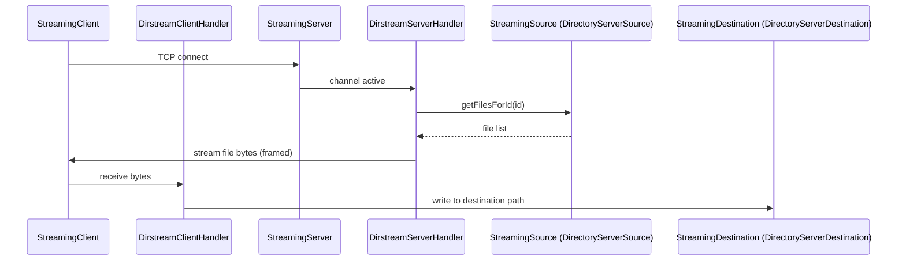

# dn / dn-streaming

_This feature page was generated from `study/atlas/components/dn/dn-streaming.md`. Author prose belongs above or below the BEGIN/END markers._

{/* BEGIN atlas-generated */}

**Classes:** 9    **Kinds:** service:6, interface:2, exception:1

## Overview

The `dn-streaming` feature group provides a lightweight Netty-based binary file streaming infrastructure used to transfer entire directories (e.g., Ratis snapshot directories) between services. `StreamingServer` starts a Netty TCP server; `DirstreamServerHandler` is the Netty pipeline handler that implements the server-side framing protocol. `StreamingClient` connects to a server and calls `DirstreamClientHandler` to receive the stream. `StreamingSource` defines which files to include for a given ID (e.g., a Ratis log segment directory); `StreamingDestination` defines where to write on the receiving side. `DirectoryServerSource` and `DirectoryServerDestination` are the trivial filesystem implementations of these interfaces. This infrastructure is separate from the gRPC-based container replication path; it was introduced in [HDDS-5142](https://issues.apache.org/jira/browse/HDDS-5142) for scenarios where the entire directory must be transferred atomically (e.g., Ratis snapshot download).

## Diagram

## Class table

### Sub-feature: `container.stream`

| reading_order | fqcn | kind | logic | loc | study (min) | role |
|--:|---|---|---|--:|--:|---|
| 1586 | <Fqcn>org.apache.hadoop.ozone.container.stream.StreamingSource</Fqcn> | interface | mixed | 25~ | 20 | Interface to define which files should be replicated for a given id. |
| 1587 | <Fqcn>org.apache.hadoop.ozone.container.stream.StreamingDestination</Fqcn> | interface | mixed | 25~ | 20 | Interface defines the mapping to the destination. |
| 1588 | <Fqcn>org.apache.hadoop.ozone.container.stream.DirstreamClientHandler</Fqcn> | service | mixed | 100~ | 30 | Protocol definition from streaming binary files. |
| 1589 | <Fqcn>org.apache.hadoop.ozone.container.stream.DirstreamServerHandler</Fqcn> | service | mixed | 75~ | 30 | Protocol definition of the streaming. |
| 1590 | <Fqcn>org.apache.hadoop.ozone.container.stream.StreamingClient</Fqcn> | service | mixed | 75~ | 30 | Client to stream huge binaries from a streamling server. |
| 1591 | <Fqcn>org.apache.hadoop.ozone.container.stream.StreamingServer</Fqcn> | service | mixed | 50~ | 30 | Netty based streaming server to replicate files from a directory. |
| 1592 | <Fqcn>org.apache.hadoop.ozone.container.stream.DirectoryServerDestination</Fqcn> | service | mixed | 25~ | 30 | Streaming binaries to single directory. |
| 1593 | <Fqcn>org.apache.hadoop.ozone.container.stream.DirectoryServerSource</Fqcn> | service | mixed | 25~ | 30 | Streaming files from single directory. |
| 1594 | <Fqcn>org.apache.hadoop.ozone.container.stream.StreamingException</Fqcn> | exception | data-only | 25~ | 10 | Runtime exception for any streaming related errors. |

## Anchor details

_No logic-heavy anchors in this feature; the classes are primarily data / dto / config / cli._

## Design docs

- no dedicated design doc under hadoop-hdds/docs/content/ on this branch.

## Seminal JIRAs / PRs

- [HDDS-5142](https://issues.apache.org/jira/browse/HDDS-5142). Make generic streaming client/service for container re-replication, data read, and SCM/OM snapshot download (introduced this package).
- [HDDS-5237](https://issues.apache.org/jira/browse/HDDS-5237). Add SSL support to the Ozone streaming API.
- [HDDS-13939](https://issues.apache.org/jira/browse/HDDS-13939). Potential channel leak in `StreamingClient.stream()` method.
- [HDDS-13943](https://issues.apache.org/jira/browse/HDDS-13943). Improve error message for malformed input in `DirstreamClientHandler`.

## Sharp edges

- `StreamingClient` must be closed explicitly; [HDDS-13939](https://issues.apache.org/jira/browse/HDDS-13939) fixed a channel leak when the server closes the connection before all bytes are sent, but callers must still use try-with-resources around `StreamingClient.stream()`.

## Related features

- `components/dn/ratis-statemachine-dn.md` — Ratis snapshot installation may use `StreamingClient` to transfer snapshot directories.
- `components/dn/grpc-server-dn.md` — the gRPC-based container data path is a separate transport.

## Self-quiz

1. `StreamingServer` uses Netty. What is the framing protocol (length-prefixed, line-delimited, etc.) used by `DirstreamServerHandler`?
2. `StreamingSource.getFilesForId(id)` takes a string ID. What type of ID is passed when streaming a Ratis snapshot directory?
3. `StreamingException` is a `RuntimeException`. What triggers it, and is it recoverable by the client?
4. How does `DirstreamClientHandler` handle a partial transfer (e.g., the server crashes mid-stream)?
5. `StreamingServer` is started with `start()` and stopped with `close()`. Which class in the datanode lifecycle calls these methods?

Answers

Answer 1: `TODO(verify)` — `DirstreamServerHandler` uses a length-prefixed binary protocol; exact framing is in the Netty pipeline definition.
Answer 2: A Ratis group ID (string form of the `RaftGroupId`) identifies the snapshot directory to stream.
Answer 3: `StreamingException` wraps I/O errors during streaming; it is generally not recoverable — the client must close and reopen a new connection.
Answer 4: The Netty channel close event propagates to `DirstreamClientHandler.channelInactive()`, which signals end-of-stream to the caller; if the stream is incomplete, the destination directory is in a partial state and must be discarded.
Answer 5: `TODO(verify)` — likely called from the Ratis snapshot installation code path or from `OzoneContainer`'s startup.

{/* END atlas-generated */}
