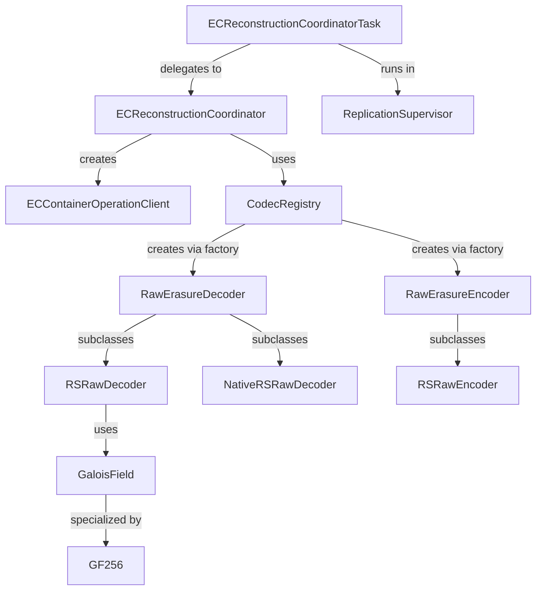

# dn / erasure-coding

_This feature page was generated from `study/atlas/components/dn/erasure-coding.md`. Author prose belongs above or below the BEGIN/END markers._

{/* BEGIN atlas-generated */}

**Classes:** 41    **Kinds:** service:28, factory:6, abstract:5, dto:1, metrics:1

## Overview

The `erasure-coding` feature group contains two distinct subsystems: the mathematical erasure-coding library (`org.apache.ozone.erasurecode.*`) and the EC offline reconstruction coordinator (`org.apache.hadoop.ozone.container.ec.reconstruction.*`). The library provides raw Reed-Solomon and XOR erasure coders in both pure Java and Intel ISA-L native variants; `CodecRegistry` maps `ECReplicationConfig` to the appropriate `RawErasureCoderFactory`. `GaloisField` and `GF256` implement the finite-field arithmetic underlying RS coding: `GaloisField` is a general GF(2^p) implementation while `GF256` optimizes for the common GF(256) case used by RS coders by pre-computing multiplication and log tables. `ECReconstructionCoordinator` is the orchestration class: given an `ECReconstructionCommandInfo` (list of missing block indices and target datanodes), it reads the available parity and data chunks from peer datanodes via `ECContainerOperationClient`, decodes the missing chunks using the configured decoder, and writes the reconstructed chunks to the target datanodes. Each reconstruction request runs as an `ECReconstructionCoordinatorTask` inside `ReplicationSupervisor`.

## Diagram

## Class table

### Sub-feature: `reconstruction`

| reading_order | fqcn | kind | logic | loc | study (min) | role |
|--:|---|---|---|--:|--:|---|
| 210 | <Fqcn>org.apache.hadoop.ozone.container.ec.reconstruction.ECReconstructionCoordinator</Fqcn> | service | logic-heavy | 400~ | 60 | The Coordinator implements the main flow of reconstructing missing container replicas. |
| 211 | <Fqcn>org.apache.hadoop.ozone.container.ec.reconstruction.ECReconstructionCoordinatorTask</Fqcn> | service | mixed | 75~ | 30 | This is the actual EC reconstruction coordination task. |
| 212 | <Fqcn>org.apache.hadoop.ozone.container.ec.reconstruction.ECReconstructionCommandInfo</Fqcn> | dto | data-only | 50~ | 10 | This class is to keep the required EC reconstruction info. |
| 213 | <Fqcn>org.apache.hadoop.ozone.container.ec.reconstruction.ECReconstructionMetrics</Fqcn> | metrics | mixed | 50~ | 20 | Metrics class for EC Reconstruction. |

### Sub-feature: `coder`

| reading_order | fqcn | kind | logic | loc | study (min) | role |
|--:|---|---|---|--:|--:|---|
| 214 | <Fqcn>org.apache.ozone.erasurecode.rawcoder.RawErasureDecoder</Fqcn> | abstract | mixed | 75~ | 30 | An abstract raw erasure decoder that's to be inherited by new decoders. |
| 215 | <Fqcn>org.apache.ozone.erasurecode.rawcoder.RawErasureEncoder</Fqcn> | abstract | mixed | 75~ | 30 | An abstract raw erasure encoder that's to be inherited by new encoders. |
| 216 | <Fqcn>org.apache.ozone.erasurecode.rawcoder.AbstractNativeRawDecoder</Fqcn> | abstract | mixed | 50~ | 30 | Abstract native raw decoder for all native coders to extend with. |
| 217 | <Fqcn>org.apache.ozone.erasurecode.rawcoder.AbstractNativeRawEncoder</Fqcn> | abstract | mixed | 50~ | 30 | Abstract native raw encoder for all native coders to extend with. |
| 218 | <Fqcn>org.apache.ozone.erasurecode.rawcoder.util.RSUtil</Fqcn> | service | mixed | 125~ | 30 | Utilities for implementing Reed-Solomon code, used by RS coder. |
| 219 | <Fqcn>org.apache.ozone.erasurecode.rawcoder.RSRawDecoder</Fqcn> | service | mixed | 100~ | 30 | A raw erasure decoder in RS code scheme in pure Java in case native one isn't available in some environment. |
| 220 | <Fqcn>org.apache.ozone.erasurecode.rawcoder.CoderUtil</Fqcn> | service | mixed | 75~ | 30 | Helpful utilities for implementing some raw erasure coders. |
| 221 | <Fqcn>org.apache.ozone.erasurecode.rawcoder.RSRawEncoder</Fqcn> | service | mixed | 50~ | 30 | A raw erasure encoder in RS code scheme in pure Java in case native one isn't available in some environment. |
| 222 | <Fqcn>org.apache.ozone.erasurecode.rawcoder.XORRawEncoder</Fqcn> | service | mixed | 50~ | 30 | A raw encoder in XOR code scheme in pure Java, adapted from HDFS-RAID. |
| 223 | <Fqcn>org.apache.ozone.erasurecode.rawcoder.XORRawDecoder</Fqcn> | service | mixed | 50~ | 30 | A raw decoder in XOR code scheme in pure Java, adapted from HDFS-RAID. |
| 224 | <Fqcn>org.apache.ozone.erasurecode.rawcoder.NativeXORRawEncoder</Fqcn> | service | mixed | 25~ | 30 | A XOR raw encoder using Intel ISA-L library. |
| 225 | <Fqcn>org.apache.ozone.erasurecode.rawcoder.DummyRawDecoder</Fqcn> | service | mixed | 25~ | 30 | A dummy raw decoder that does no real computation. |
| 226 | <Fqcn>org.apache.ozone.erasurecode.rawcoder.NativeRSRawEncoder</Fqcn> | service | mixed | 25~ | 30 | A Reed-Solomon raw encoder using Intel ISA-L library. |
| 227 | <Fqcn>org.apache.ozone.erasurecode.rawcoder.NativeXORRawDecoder</Fqcn> | service | mixed | 25~ | 30 | A XOR raw decoder using Intel ISA-L library. |
| 228 | <Fqcn>org.apache.ozone.erasurecode.rawcoder.DummyRawEncoder</Fqcn> | service | mixed | 25~ | 30 | A dummy raw encoder that does no real computation. |
| 229 | <Fqcn>org.apache.ozone.erasurecode.rawcoder.NativeRSRawDecoder</Fqcn> | service | mixed | 25~ | 30 | A Reed-Solomon raw decoder using Intel ISA-L library. |
| 230 | <Fqcn>org.apache.ozone.erasurecode.rawcoder.NativeRSRawErasureCoderFactory</Fqcn> | factory | mixed | 25~ | 20 | A raw coder factory for raw Reed-Solomon coder in native using Intel ISA-L. |
| 231 | <Fqcn>org.apache.ozone.erasurecode.rawcoder.XORRawErasureCoderFactory</Fqcn> | factory | mixed | 25~ | 20 | A raw coder factory for raw XOR coder. |
| 232 | <Fqcn>org.apache.ozone.erasurecode.rawcoder.RSRawErasureCoderFactory</Fqcn> | factory | mixed | 25~ | 20 | A raw coder factory for the new raw Reed-Solomon coder in Java. |
| 233 | <Fqcn>org.apache.ozone.erasurecode.rawcoder.DummyRawErasureCoderFactory</Fqcn> | factory | mixed | 25~ | 20 | A raw erasure coder factory for dummy raw coders. |
| 234 | <Fqcn>org.apache.ozone.erasurecode.rawcoder.NativeXORRawErasureCoderFactory</Fqcn> | factory | mixed | 25~ | 20 | A raw coder factory for xor coder in native using Intel ISA-L library. |
| 235 | <Fqcn>org.apache.ozone.erasurecode.rawcoder.RawErasureCoderFactory</Fqcn> | factory | mixed | 25~ | 20 | Raw erasure coder factory that can be used to create raw encoder and decoder. |

### Sub-feature: `ec-chunk`

| reading_order | fqcn | kind | logic | loc | study (min) | role |
|--:|---|---|---|--:|--:|---|
| 236 | <Fqcn>org.apache.ozone.erasurecode.ECChunk</Fqcn> | service | mixed | 50~ | 30 | A wrapper for ByteBuffer or bytes array for an erasure code chunk. |

### Sub-feature: `ec.reconstruction`

| reading_order | fqcn | kind | logic | loc | study (min) | role |
|--:|---|---|---|--:|--:|---|
| 237 | <Fqcn>org.apache.hadoop.ozone.container.ec.reconstruction.ECContainerOperationClient</Fqcn> | service | mixed | 125~ | 30 | This class wraps necessary container-level rpc calls during ec offline reconstruction. |

### Sub-feature: `erasurecode.rawcoder`

| reading_order | fqcn | kind | logic | loc | study (min) | role |
|--:|---|---|---|--:|--:|---|
| 238 | <Fqcn>org.apache.ozone.erasurecode.rawcoder.EncodingState</Fqcn> | abstract | mixed | 25~ | 30 | A utility class that maintains encoding state during an encode call. |
| 239 | <Fqcn>org.apache.ozone.erasurecode.rawcoder.ByteBufferDecodingState</Fqcn> | service | mixed | 100~ | 30 | A utility class that maintains decoding state during a decode call using ByteBuffer inputs. |
| 240 | <Fqcn>org.apache.ozone.erasurecode.rawcoder.ByteBufferEncodingState</Fqcn> | service | mixed | 75~ | 30 | A utility class that maintains encoding state during an encode call using ByteBuffer inputs. |
| 241 | <Fqcn>org.apache.ozone.erasurecode.rawcoder.ByteArrayDecodingState</Fqcn> | service | mixed | 75~ | 30 | A utility class that maintains decoding state during a decode call using byte array inputs. |
| 242 | <Fqcn>org.apache.ozone.erasurecode.rawcoder.ByteArrayEncodingState</Fqcn> | service | mixed | 50~ | 30 | A utility class that maintains encoding state during an encode call using byte array inputs. |
| 243 | <Fqcn>org.apache.ozone.erasurecode.rawcoder.ErasureCodeNative</Fqcn> | service | mixed | 50~ | 30 | Erasure code native libraries (for now, Intel ISA-L) related utilities. |
| 244 | <Fqcn>org.apache.ozone.erasurecode.rawcoder.DecodingState</Fqcn> | service | mixed | 25~ | 30 | A utility class that maintains decoding state during a decode call. |
| 245 | <Fqcn>org.apache.hadoop.io.erasurecode.rawcoder.HadoopNativeECAccessorUtil</Fqcn> | service | mixed | 25~ | 30 | This class is used to access some of the protected API from hadoop native EC java code. |

### Sub-feature: `ozone.erasurecode`

| reading_order | fqcn | kind | logic | loc | study (min) | role |
|--:|---|---|---|--:|--:|---|
| 246 | <Fqcn>org.apache.ozone.erasurecode.CodecRegistry</Fqcn> | service | mixed | 100~ | 30 | This class registers all coder implementations. |

### Sub-feature: `rawcoder.util`

| reading_order | fqcn | kind | logic | loc | study (min) | role |
|--:|---|---|---|--:|--:|---|
| 247 | <Fqcn>org.apache.ozone.erasurecode.rawcoder.util.GaloisField</Fqcn> | service | logic-heavy | 350~ | 45 | Implementation of Galois field arithmetic with 2^p elements. |
| 248 | <Fqcn>org.apache.ozone.erasurecode.rawcoder.util.GF256</Fqcn> | service | logic-heavy | 250~ | 45 | A GaloisField utility class only caring of 256 fields for efficiency. |
| 249 | <Fqcn>org.apache.ozone.erasurecode.rawcoder.util.DumpUtil</Fqcn> | service | mixed | 50~ | 30 | A dump utility class for debugging data erasure coding/decoding issues. |
| 250 | <Fqcn>org.apache.ozone.erasurecode.rawcoder.util.CodecUtil</Fqcn> | service | mixed | 50~ | 30 | A codec &amp; coder utility to help create coders conveniently. |

## Anchor details

### `ECReconstructionCoordinator`

- **path:** `hadoop-hdds/container-service/src/main/java/org/apache/hadoop/ozone/container/ec/reconstruction/ECReconstructionCoordinator.java`
- **loc:** 400~    **difficulty:** 5    **study:** 60 min    **concurrency:** actor/queue    **persistence:** in-memory
- **entry points:** `close`
- **key collaborators:** `org.apache.hadoop.hdds.client.BlockID`, `org.apache.hadoop.hdds.client.ECReplicationConfig`, `org.apache.hadoop.hdds.conf.ConfigurationSource`, `org.apache.hadoop.hdds.protocol.DatanodeDetails`, `org.apache.hadoop.hdds.scm.ContainerClientMetrics`, `org.apache.hadoop.hdds.scm.OzoneClientConfig`
- **role:** Orchestrates the offline reconstruction of missing EC container replicas.

`reconstructECBlockGroup()` is the main entry point: it identifies available and missing stripe indices from `ECReconstructionCommandInfo`, reads available chunks from peer DNs via `ECContainerOperationClient`, decodes using the configured `RawErasureDecoder` in a loop over each block in the container, and writes reconstructed chunks to target DNs. [HDDS-14853](https://issues.apache.org/jira/browse/HDDS-14853) reduced duplicate log output from this method. [HDDS-15791](https://issues.apache.org/jira/browse/HDDS-15791) fixed a case where an EC RECOVERING container could be deleted and recreated as a new OPEN container while reconstruction was still running.

### `GaloisField`

- **path:** `hadoop-hdds/erasurecode/src/main/java/org/apache/ozone/erasurecode/rawcoder/util/GaloisField.java`
- **loc:** 350~    **difficulty:** 4    **study:** 45 min    **concurrency:** thread-safe    **persistence:** in-memory
- **key collaborators:** `org.apache.hadoop.hdds.annotation.InterfaceAudience`
- **role:** General GF(2^p) arithmetic for use by RSUtil in RS matrix construction.

`GaloisField` uses a generator polynomial and pre-computed log/anti-log tables for efficient multiply/divide in GF(2^p). Its `multiply(x, y)` is the core operation used by `RSUtil.encodeData()` to compute parity from data shards. Being thread-safe (all state is in final arrays), a single singleton is shared across all coder instances.

### `GF256`

- **path:** `hadoop-hdds/erasurecode/src/main/java/org/apache/ozone/erasurecode/rawcoder/util/GF256.java`
- **loc:** 250~    **difficulty:** 4    **study:** 45 min    **concurrency:** single-threaded    **persistence:** in-memory
- **key collaborators:** `org.apache.hadoop.hdds.annotation.InterfaceAudience`
- **role:** Optimized GF(256) utility with pre-computed multiplication and log tables for RS coders.

`GF256` pre-computes a 256×256 multiplication table `gfMulTable` and a 256-entry log table `gfLog` at class-loading time. [HDDS-15341](https://issues.apache.org/jira/browse/HDDS-15341) fixed a race where `CoderUtil.emptyChunk` was resized concurrently by multiple coder threads, causing `ArrayIndexOutOfBoundsException` in the encoding path.

## Design docs

- `hadoop-hdds/docs/content/feature/ErasureCoding.md` — user-facing description of the EC feature and configuration.

## Seminal JIRAs / PRs

- [HDDS-15791](https://issues.apache.org/jira/browse/HDDS-15791). EC reconstructed RECOVERING container can be deleted and recreated as new OPEN container.
- [HDDS-15341](https://issues.apache.org/jira/browse/HDDS-15341). EC write can fail with `ArrayIndexOutOfBoundsException` due to `CoderUtil.emptyChunk` resize race.
- [HDDS-14853](https://issues.apache.org/jira/browse/HDDS-14853). Reduce duplicate logs in `ECReconstructionCoordinator#reconstructECBlockGroup`.
- [HDDS-15963](https://issues.apache.org/jira/browse/HDDS-15963). NPE on EC degraded read in isolated ClassLoader environment.
- [HDDS-13174](https://issues.apache.org/jira/browse/HDDS-13174). EC duplicate replica handling for different index in datanodes.

## Sharp edges

- `CoderUtil.emptyChunk` was resized unsafely under concurrent access ([HDDS-15341](https://issues.apache.org/jira/browse/HDDS-15341)); the fix synchronizes the resize, but callers that cache the emptyChunk reference before the resize will see a stale smaller buffer.
- `ECReconstructionCoordinator` holds a `XceiverClientManager` reference; if the executor is shut down while reconstruction is in progress, the client resources are not cleaned up unless `close()` is called explicitly ([HDDS-12902](https://issues.apache.org/jira/browse/HDDS-12902) fixed a similar leak in `CloseContainerCommandHandler`).

## Related features

- `components/dn/container-replication-dn.md` — `ECReconstructionCoordinatorTask` is submitted to `ReplicationSupervisor`.
- `components/dn/dn-statemachine.md` — `ReconstructECContainersCommandHandler` creates and submits the task.
- `components/dn/kv-container.md` — EC containers are stored as `KeyValueContainer`; reconstruction writes new `KeyValueContainer` instances.

## Self-quiz

1. `CodecRegistry` selects a coder implementation. What is the precedence order between native ISA-L and pure Java coders, and how is the preference configured?
2. `ECReconstructionCoordinator.reconstructECBlockGroup()` reads available chunks from peers. What happens if fewer than `(dataBlocks)` chunks are available (i.e., more than `parityBlocks` are missing)?
3. `GF256.multiply(x, y)` uses a pre-computed table. Why does this approach avoid the performance overhead of the general `GaloisField.multiply()`?
4. `ECReconstructionCommandInfo` is a DTO. How is it constructed from a `ReconstructECContainersCommand` Protobuf message?
5. `NativeRSRawEncoder` and `NativeRSRawDecoder` use Intel ISA-L via JNI. What happens at runtime if the native library is not available in the JVM's library path?

Answers

Answer 1: Native ISA-L coders are preferred over pure Java; if `ErasureCodeNative.isNativeCodeLoaded()` returns false, the pure Java coder is used. The preference can be forced via configuration `ozone.erasurecode.coder` keys.
Answer 2: Reconstruction is impossible; `ECReconstructionCoordinator` throws an exception and marks the task as failed; SCM must either wait for more replicas to become available or give up on this container.
Answer 3: A table lookup is O(1) with no branching; the general GaloisField multiply uses a loop over bits or log/anti-log lookups that are slower due to conditional branches and cache misses on large tables.
Answer 4: `ECReconstructionCommandInfo` is built by `ReconstructECContainersCommandHandler` by calling `ECReconstructionCommandInfo.fromProto(command)`, which unpacks target datanodes, missing indices, and the EC config from the proto.
Answer 5: `ErasureCodeNative.isNativeCodeLoaded()` returns false; the `CodecRegistry` falls back to the pure Java coder factory transparently.

{/* END atlas-generated */}
