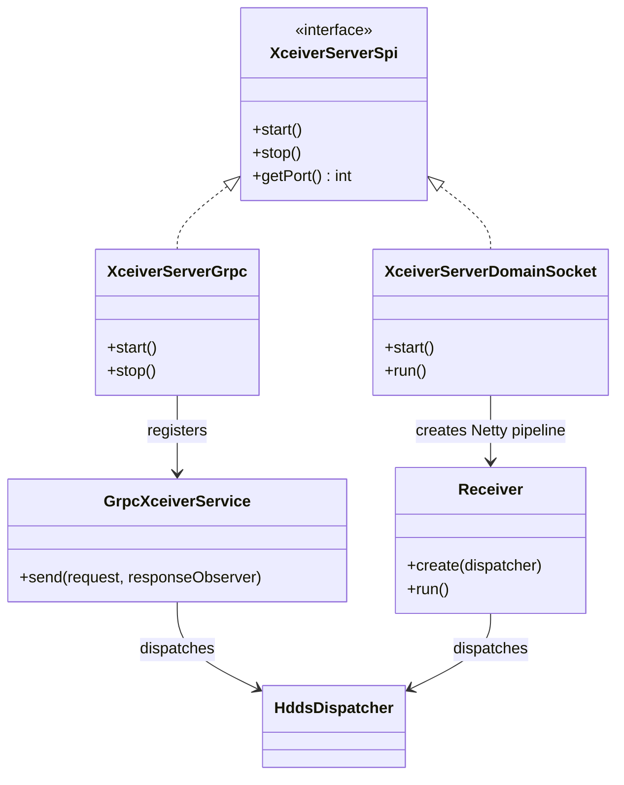

# dn / grpc-server-dn

_This feature page was generated from `study/atlas/components/dn/grpc-server-dn.md`. Author prose belongs above or below the BEGIN/END markers._

{/* BEGIN atlas-generated */}

**Classes:** 5    **Kinds:** service:4, interface:1

## Overview

The `grpc-server-dn` feature group provides the container command transport servers on the datanode. `XceiverServerSpi` is the common interface for all server endpoints. `XceiverServerGrpc` is the standard gRPC server (TCP); it registers `GrpcXceiverService` which receives `ContainerCommandRequestProto` messages and dispatches them to `HddsDispatcher`. `XceiverServerDomainSocket` is an alternative endpoint that uses a Unix domain socket for local clients (short-circuit reads), backed by a Netty pipeline where `Receiver` handles the I/O. `Receiver` runs the Netty event loop for domain-socket connections, reads framed `ContainerCommandRequestProto` messages, and posts them to `HddsDispatcher`. [HDDS-15149](https://issues.apache.org/jira/browse/HDDS-15149) added a connection-count limit to prevent the gRPC server from being overwhelmed by too many concurrent clients; [HDDS-15382](https://issues.apache.org/jira/browse/HDDS-15382) added idle connection closing.

## Diagram

## Class table

### Sub-feature: `transport.server`

| reading_order | fqcn | kind | logic | loc | study (min) | role |
|--:|---|---|---|--:|--:|---|
| 1613 | <Fqcn>org.apache.hadoop.ozone.container.common.transport.server.XceiverServerSpi</Fqcn> | interface | mixed | 25~ | 20 | A server endpoint that acts as the communication layer for Ozone containers. |
| 1614 | <Fqcn>org.apache.hadoop.ozone.container.common.transport.server.Receiver</Fqcn> | service | logic-heavy | 250~ | 45 | Class for processing incoming/outgoing requests. |
| 1615 | <Fqcn>org.apache.hadoop.ozone.container.common.transport.server.XceiverServerDomainSocket</Fqcn> | service | logic-heavy | 225~ | 45 | Creates a DomainSocket server endpoint that acts as the communication layer for Ozone containers. |
| 1616 | <Fqcn>org.apache.hadoop.ozone.container.common.transport.server.XceiverServerGrpc</Fqcn> | service | mixed | 175~ | 45 | Creates a Grpc server endpoint that acts as the communication layer for Ozone containers. |
| 1617 | <Fqcn>org.apache.hadoop.ozone.container.common.transport.server.GrpcXceiverService</Fqcn> | service | mixed | 100~ | 30 | Grpc Service for handling Container Commands on datanode. |

## Anchor details

### `Receiver`

- **path:** `hadoop-hdds/container-service/src/main/java/org/apache/hadoop/ozone/container/common/transport/server/Receiver.java`
- **loc:** 250~    **difficulty:** 4    **study:** 45 min    **concurrency:** single-threaded    **persistence:** in-memory
- **entry points:** `create`, `run`
- **key collaborators:** `org.apache.hadoop.hdds.conf.ConfigurationSource`, `org.apache.hadoop.hdds.scm.OzoneClientConfig`, `org.apache.hadoop.hdds.scm.storage.DomainPeer`, `org.apache.hadoop.hdds.tracing.TracingUtil`, `org.apache.hadoop.ozone.container.common.helpers.ContainerMetrics`, `org.apache.hadoop.ozone.container.common.interfaces.ContainerDispatcher`
- **role:** Netty handler for domain-socket container command connections.

`Receiver.run()` is the per-connection Netty handler that reads length-prefixed `ContainerCommandRequestProto` messages from a `DomainPeer`, dispatches them to `HddsDispatcher`, and writes the `ContainerCommandResponseProto` back. It injects tracing spans via `TracingUtil` if tracing is enabled. Each domain-socket connection runs its own `Receiver` instance on a Netty worker thread.

### `XceiverServerDomainSocket`

- **path:** `hadoop-hdds/container-service/src/main/java/org/apache/hadoop/ozone/container/common/transport/server/XceiverServerDomainSocket.java`
- **loc:** 225~    **difficulty:** 4    **study:** 45 min    **concurrency:** thread-safe    **persistence:** in-memory
- **entry points:** `start`, `run`
- **key collaborators:** `org.apache.hadoop.hdds.conf.ConfigurationSource`, `org.apache.hadoop.hdds.protocol.DatanodeDetails`, `org.apache.hadoop.hdds.scm.OzoneClientConfig`, `org.apache.hadoop.hdds.scm.storage.DomainPeer`, `org.apache.hadoop.hdds.scm.storage.DomainSocketFactory`, `org.apache.hadoop.hdds.utils.FaultInjector`
- **test exemplar:** `hadoop-ozone/integration-test/src/test/java/org/apache/hadoop/hdds/TestXceiverServerDomainSocket.java`
- **role:** Netty-based Unix domain socket server for short-circuit local reads.

`XceiverServerDomainSocket` uses `DomainSocketFactory` to create the server socket, accepts connections with a Netty `ServerBootstrap`, and creates a `Receiver` pipeline handler for each accepted connection. `FaultInjector` is used in tests to simulate connection failures. [HDDS-15404](https://issues.apache.org/jira/browse/HDDS-15404) enabled the short-circuit unit test in CI.

## Design docs

- `hadoop-hdds/docs/content/concept/Datanodes.md` — overview of the datanode transport layer.

## Seminal JIRAs / PRs

- [HDDS-15149](https://issues.apache.org/jira/browse/HDDS-15149). Limit connections created by DataNode gRPC server.
- [HDDS-15382](https://issues.apache.org/jira/browse/HDDS-15382). Close idle connections for Datanode gRPC server.
- [HDDS-15094](https://issues.apache.org/jira/browse/HDDS-15094). Make protocol and cipher configurable for gRPC TLS.
- [HDDS-15404](https://issues.apache.org/jira/browse/HDDS-15404). Enable short-circuit unit test in CI.
- [HDDS-15443](https://issues.apache.org/jira/browse/HDDS-15443). Close state machine on write failure.

## Sharp edges

- `XceiverServerGrpc` has a maximum concurrent stream limit ([HDDS-15149](https://issues.apache.org/jira/browse/HDDS-15149)); when the limit is exceeded, new requests are rejected with a gRPC `UNAVAILABLE` status. Clients must implement backoff to handle this.

## Related features

- `components/dn/dn-service.md` — `OzoneContainer.start()` starts `XceiverServerGrpc` and `XceiverServerDomainSocket`.
- `components/dn/ratis-statemachine-dn.md` — write operations go through `XceiverServerRatis` (Ratis gRPC) not through `XceiverServerGrpc`; reads and non-replicated writes go through `XceiverServerGrpc`.
- `components/dn/container-replication-dn.md` — `ReplicationServer` is a third gRPC server (separate from this feature) for inter-DN replication.

## Self-quiz

1. Why are there two separate gRPC endpoints (`XceiverServerGrpc` and the Ratis gRPC within `XceiverServerRatis`)? What operations go to each?
2. `GrpcXceiverService.send()` is the gRPC service method. It receives a `ContainerCommandRequestProto` and returns a stream. Does it return a unary response or a streaming response?
3. `XceiverServerDomainSocket` bypasses TCP. What is the performance advantage, and what is the client-side requirement to use it?
4. `XceiverServerGrpc` is configured with a connection limit ([HDDS-15149](https://issues.apache.org/jira/browse/HDDS-15149)). What is the default limit and which configuration key controls it?
5. `Receiver` injects tracing spans. What tracing library is used, and how is the span correlated with the client-side span?

Answers

Answer 1: `XceiverServerGrpc` handles read operations (GET_BLOCK, READ_CHUNK) and non-replicated writes from standalone pipelines; Ratis gRPC (inside `XceiverServerRatis`) handles replicated writes (PUT_BLOCK, WRITE_CHUNK on Ratis pipelines).
Answer 2: `GrpcXceiverService.send()` returns a server-streaming response (`StreamObserver<ContainerCommandResponseProto>`) for read responses; for write operations it is a unary response embedded in the stream.
Answer 3: Domain sockets avoid TCP stack overhead (kernel-to-kernel copy elimination) for co-located clients; the client must be on the same host as the datanode and must use `DomainSocketFactory` to connect.
Answer 4: `TODO(verify)` — `hdds.datanode.grpc.max.concurrent.streams` (or similar); default is `TODO(verify)`.
Answer 5: OpenTelemetry (migrated from OpenTracing in [HDDS-13680](https://issues.apache.org/jira/browse/HDDS-13680)); the span context is propagated via gRPC metadata headers from the client and extracted in `TracingUtil.createChildSpan()`.

{/* END atlas-generated */}
