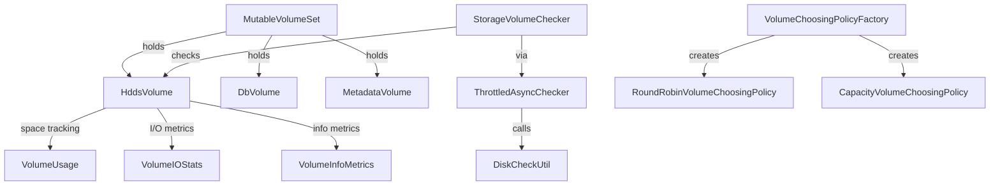

# dn / hdds-volume

_This feature page was generated from `study/atlas/components/dn/hdds-volume.md`. Author prose belongs above or below the BEGIN/END markers._

{/* BEGIN atlas-generated */}

**Classes:** 24    **Kinds:** service:13, factory:5, metrics:3, interface:2, data:1

## Overview

The `hdds-volume` feature group manages the physical storage volumes on a datanode. `StorageVolume` is the abstract base for all volume types; `HddsVolume` is the primary data volume that holds container directories and (in schema v3) a `DbVolume`-linked RocksDB instance. `DbVolume` holds the per-disk RocksDB for multiple `HddsVolume` containers in schema v3. `MetadataVolume` holds the Ratis log and snapshot directories. `MutableVolumeSet` manages the full list of data volumes, handles volume failure recovery, and provides thread-safe access via a `ReadWriteLock`. `StorageVolumeChecker` wraps `ThrottledAsyncChecker` to run periodic disk health checks against each `StorageVolume` via `DiskCheckUtil`, and publishes the failed-volume list back to `MutableVolumeSet`. Volume choosing policies (`RoundRobinVolumeChoosingPolicy`, `CapacityVolumeChoosingPolicy`) select a target volume for new containers. `VolumeUsage` tracks space consumption using a background `SpaceUsageCheckFactory` sampler. [HDDS-14925](https://issues.apache.org/jira/browse/HDDS-14925) added soft and hard minimum-free-space limits per volume.

## Diagram

## Class table

### Sub-feature: `common.volume`

| reading_order | fqcn | kind | logic | loc | study (min) | role |
|--:|---|---|---|--:|--:|---|
| 732 | <Fqcn>org.apache.hadoop.ozone.container.common.volume.VolumeSet</Fqcn> | interface | mixed | 25~ | 20 | Set of volumes. |
| 733 | <Fqcn>org.apache.hadoop.ozone.container.common.volume.AsyncChecker</Fqcn> | interface | mixed | 25~ | 20 | A class that can be used to schedule an asynchronous check on a given Checkable. |
| 734 | <Fqcn>org.apache.hadoop.ozone.container.common.volume.HddsVolume</Fqcn> | service | logic-heavy | 450~ | 60 | HddsVolume represents volume in a datanode. |
| 735 | <Fqcn>org.apache.hadoop.ozone.container.common.volume.StorageVolumeChecker</Fqcn> | service | logic-heavy | 300~ | 45 | A class that encapsulates running disk checks against each volume and allows retrieving a list of failed volumes. |
| 736 | <Fqcn>org.apache.hadoop.ozone.container.common.volume.MutableVolumeSet</Fqcn> | service | logic-heavy | 275~ | 45 | VolumeSet to manage volumes in a DataNode. |
| 737 | <Fqcn>org.apache.hadoop.ozone.container.common.volume.ThrottledAsyncChecker</Fqcn> | service | mixed | 100~ | 30 | An implementation of AsyncChecker that skips checking recently checked objects. |
| 738 | <Fqcn>org.apache.hadoop.ozone.container.common.volume.VolumeUsage</Fqcn> | service | mixed | 100~ | 30 | Stores information about a disk/volume. |
| 739 | <Fqcn>org.apache.hadoop.ozone.container.common.volume.VolumeIOStats</Fqcn> | service | mixed | 100~ | 30 | This class is used to track Volume IO stats for each HDDS Volume. |
| 740 | <Fqcn>org.apache.hadoop.ozone.container.common.volume.DbVolume</Fqcn> | service | mixed | 75~ | 30 | DbVolume represents a volume in datanode holding db instances for multiple HddsVolumes. |
| 741 | <Fqcn>org.apache.hadoop.ozone.container.common.volume.CapacityVolumeChoosingPolicy</Fqcn> | service | mixed | 50~ | 30 | Volume choosing policy that randomly choose volume with remaining space to satisfy the size constraints. |
| 742 | <Fqcn>org.apache.hadoop.ozone.container.common.volume.AvailableSpaceFilter</Fqcn> | service | mixed | 50~ | 30 | Filter for selecting volumes with enough space for a new container. |
| 743 | <Fqcn>org.apache.hadoop.ozone.container.common.volume.RoundRobinVolumeChoosingPolicy</Fqcn> | service | mixed | 50~ | 30 | Choose volumes in round-robin order. |
| 744 | <Fqcn>org.apache.hadoop.ozone.container.common.volume.MetadataVolume</Fqcn> | service | mixed | 25~ | 30 | MetadataVolume represents a volume in datanode for metadata(ratis). |
| 745 | <Fqcn>org.apache.hadoop.ozone.container.common.volume.VolumeChoosingUtil</Fqcn> | service | mixed | 25~ | 30 | Common methods for VolumeChoosingPolicy implementations. |
| 746 | <Fqcn>org.apache.hadoop.ozone.container.common.volume.ImmutableVolumeSet</Fqcn> | service | mixed | 25~ | 30 | Fixed list of volumes. |
| 747 | <Fqcn>org.apache.hadoop.ozone.container.common.volume.StorageVolumeFactory</Fqcn> | factory | mixed | 50~ | 20 | A factory class for StorageVolume. |
| 748 | <Fqcn>org.apache.hadoop.ozone.container.common.volume.MetadataVolumeFactory</Fqcn> | factory | mixed | 25~ | 20 | A factory class for MetadataVolume. |
| 749 | <Fqcn>org.apache.hadoop.ozone.container.common.volume.DbVolumeFactory</Fqcn> | factory | mixed | 25~ | 20 | A factory class for DbVolume. |
| 750 | <Fqcn>org.apache.hadoop.ozone.container.common.volume.VolumeChoosingPolicyFactory</Fqcn> | factory | mixed | 25~ | 20 | A factory to create volume choosing policy instance based on configuration property HddsConfigKeys#HDDS_DATANODE_VOLU... |
| 751 | <Fqcn>org.apache.hadoop.ozone.container.common.volume.HddsVolumeFactory</Fqcn> | factory | mixed | 25~ | 20 | A factory class for HddsVolume. |
| 752 | <Fqcn>org.apache.hadoop.ozone.container.common.volume.StorageVolume</Fqcn> | abstract | logic-heavy | 550~ | 10 | StorageVolume represents a generic Volume in datanode, could be 1. |
| 753 | <Fqcn>org.apache.hadoop.ozone.container.common.volume.VolumeInfoMetrics</Fqcn> | metrics | mixed | 175~ | 20 | This class is used to track Volume Info stats for each HDDS Volume. |
| 754 | <Fqcn>org.apache.hadoop.ozone.container.common.volume.VolumeHealthMetrics</Fqcn> | metrics | mixed | 50~ | 20 | This class is used to track Volume Health metrics for all volumes on a datanode. |
| 755 | <Fqcn>org.apache.hadoop.ozone.container.common.volume.BackgroundVolumeScannerMetrics</Fqcn> | metrics | mixed | 50~ | 20 | This class captures the Background Storage Volume Scanner Metrics. |

## Anchor details

### `HddsVolume`

- **path:** `hadoop-hdds/container-service/src/main/java/org/apache/hadoop/ozone/container/common/volume/HddsVolume.java`
- **loc:** 450~    **difficulty:** 5    **study:** 60 min    **concurrency:** thread-safe    **persistence:** RocksDB
- **entry points:** `build`
- **key collaborators:** `org.apache.hadoop.hdds.annotation.InterfaceAudience`, `org.apache.hadoop.hdds.annotation.InterfaceStability`, `org.apache.hadoop.hdds.conf.ConfigurationSource`, `org.apache.hadoop.hdds.fs.SpaceUsageSource`, `org.apache.hadoop.hdds.upgrade.HDDSLayoutFeature`, `org.apache.hadoop.hdds.utils.db.managed.ManagedOptions`
- **test exemplar:** `hadoop-hdds/container-service/src/test/java/org/apache/hadoop/ozone/container/common/volume/TestHddsVolume.java`
- **role:** Represents a single data volume on a datanode; tracks health, space, and container layout.

`HddsVolume` maintains a `committedBytes` counter (for pre-reserving space before a container write completes) alongside the actual `bytesUsed`. [HDDS-14925](https://issues.apache.org/jira/browse/HDDS-14925) added `softMinFreeSpace` and `hardMinFreeSpace` thresholds that are checked before accepting writes; [HDDS-14862](https://issues.apache.org/jira/browse/HDDS-14862) promoted volume failure logging from WARN to ERROR. [HDDS-14574](https://issues.apache.org/jira/browse/HDDS-14574) enforces 700 permissions on the `hdds/` directory at startup.

### `StorageVolumeChecker`

- **path:** `hadoop-hdds/container-service/src/main/java/org/apache/hadoop/ozone/container/common/volume/StorageVolumeChecker.java`
- **loc:** 300~    **difficulty:** 4    **study:** 45 min    **concurrency:** thread-safe    **persistence:** in-memory
- **entry points:** `start`
- **key collaborators:** `org.apache.hadoop.hdds.conf.ConfigurationSource`, `org.apache.hadoop.ozone.container.common.statemachine.DatanodeConfiguration`
- **test exemplar:** `hadoop-hdds/container-service/src/test/java/org/apache/hadoop/ozone/container/common/volume/TestStorageVolumeChecker.java`
- **role:** Runs periodic disk health checks against each volume and returns failed volumes to the caller.

`StorageVolumeChecker.checkAllVolumes()` uses `ThrottledAsyncChecker` to schedule checks; only volumes that have not been checked recently are re-checked (the throttle interval is read from `DatanodeConfiguration.getPeriodicDiskCheckIntervalMinutes()`). [HDDS-14871](https://issues.apache.org/jira/browse/HDDS-14871) made the checker tolerate per-volume latch timeouts instead of marking the volume failed immediately, reducing false positives under load.

### `MutableVolumeSet`

- **path:** `hadoop-hdds/container-service/src/main/java/org/apache/hadoop/ozone/container/common/volume/MutableVolumeSet.java`
- **loc:** 275~    **difficulty:** 4    **study:** 45 min    **concurrency:** thread-safe    **persistence:** in-memory
- **key collaborators:** `org.apache.hadoop.hdds.conf.ConfigurationSource`, `org.apache.hadoop.hdds.fs.SpaceUsageCheckFactory`, `org.apache.hadoop.hdds.scm.ScmConfigKeys`, `org.apache.hadoop.hdds.server.ServerUtils`, `org.apache.hadoop.hdds.utils.HddsServerUtil`, `org.apache.hadoop.ozone.container.common.impl.StorageLocationReport`
- **role:** VolumeSet to manage volumes in a DataNode.

## Design docs

- `hadoop-hdds/docs/content/design/full-volume-handling.md` — design for handling full volumes and min-free-space enforcement.
- `hadoop-hdds/docs/content/design/volume-management.md` — overall volume management design.
- `hadoop-hdds/docs/content/feature/dn-merge-rocksdb.md` — introduces `DbVolume` for schema v3.

## Seminal JIRAs / PRs

- [HDDS-14925](https://issues.apache.org/jira/browse/HDDS-14925). Enhance DN disk space management with soft and hard min-freespace limits.
- [HDDS-15091](https://issues.apache.org/jira/browse/HDDS-15091). `CapacityVolumeChoosingPolicy` should compare utilization, not available bytes.
- [HDDS-14871](https://issues.apache.org/jira/browse/HDDS-14871). Tolerate per-volume health-check latch timeouts before marking volumes failed.
- [HDDS-14860](https://issues.apache.org/jira/browse/HDDS-14860). Synchronize `ThrottledAsyncChecker#schedule`.
- [HDDS-14574](https://issues.apache.org/jira/browse/HDDS-14574). Enforce 700 permissions on Ozone metadata and data directories.
- [HDDS-14862](https://issues.apache.org/jira/browse/HDDS-14862). Log volume failure as error.
- [HDDS-13108](https://issues.apache.org/jira/browse/HDDS-13108). Refactor `StorageVolume` to use `SlidingWindow`.

## Sharp edges

- `HddsVolume.committedBytes` is used to pre-reserve space during container creation; if a container creation fails partway through, the committed bytes are not released until the next `updateCurrentUsage()` call, transiently under-reporting available space.
- `CapacityVolumeChoosingPolicy` was comparing raw available bytes rather than utilization before [HDDS-15091](https://issues.apache.org/jira/browse/HDDS-15091); this caused all writes to be directed at the largest-capacity volume regardless of its fill level.

## Related features

- `components/dn/dn-service.md` — `OzoneContainer` holds `MutableVolumeSet` and starts one `ContainerReader` per volume.
- `components/dn/dn-rocksdb.md` — `DbVolume` hosts the per-disk RocksDB for schema v3 containers.
- `components/dn/disk-balancer.md` — `DiskBalancerVolumeCalculation` reads volume space stats from `HddsVolume`.
- `components/dn/dn-utils.md` — `StorageVolumeUtil` validates volume `VERSION` files; `HddsVolumeUtil` provides schema migration helpers.

## Self-quiz

1. `MutableVolumeSet` tracks failed volumes in a separate set. When a volume fails health check, what happens to the containers it held?
2. `CapacityVolumeChoosingPolicy` picks a random volume among those with sufficient space. How does it differ from `RoundRobinVolumeChoosingPolicy`, and which is the default?
3. `HddsVolume.reserveSpace(size)` is called before a container write. What happens if the call succeeds but the container write then fails?
4. `ThrottledAsyncChecker` prevents redundant checks. What is the minimum time between re-checks of the same volume, and where is this configured?
5. `DbVolume` hosts the RocksDB for multiple `HddsVolume` instances. How does the datanode determine which `DbVolume` a given `HddsVolume` should use?

Answers

Answer 1: Failed volume containers remain on disk but the volume is removed from the active `volumeMap`; SCM is notified via a `NodeReport` ICR that the containers on the failed volume are now UNHEALTHY.
Answer 2: `CapacityVolumeChoosingPolicy` selects from volumes that meet the capacity constraint randomly; `RoundRobinVolumeChoosingPolicy` cycles through all volumes in order regardless of free space. The default is configurable via `hdds.datanode.volume.choosing.policy`.
Answer 3: The reserved space remains locked until `unreserveSpace(size)` is called; this must be done in the error path or via a try-finally block. [HDDS-14183](https://issues.apache.org/jira/browse/HDDS-14183) fixed a specific case where this was not released.
Answer 4: The throttle interval is `DatanodeConfiguration.getPeriodicDiskCheckIntervalMinutes()` (default: `TODO(verify)` minutes); [HDDS-14871](https://issues.apache.org/jira/browse/HDDS-14871) covers its behavior.
Answer 5: The `DbVolume` is assigned by `HddsVolumeUtil` based on configuration (`hdds.datanode.db.volumes`) or by round-robin if no explicit mapping is provided.

{/* END atlas-generated */}
