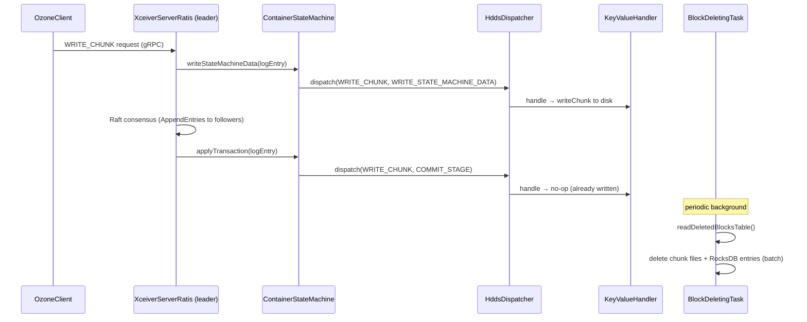

# dn / ratis-statemachine-dn

_This feature page was generated from `study/atlas/components/dn/ratis-statemachine-dn.md`. Author prose belongs above or below the BEGIN/END markers._

{/* BEGIN atlas-generated */}

**Classes:** 8    **Kinds:** service:5, state-machine:1, data:1, metrics:1

## Overview

The `ratis-statemachine-dn` feature group implements the Ratis (Raft consensus) integration on the datanode. `XceiverServerRatis` starts the embedded `RaftServer` and bridges Ratis lifecycle events to `ContainerStateMachine`. `ContainerStateMachine` implements Ratis's `StateMachine` interface: `writeStateMachineData()` (stage: WRITE_STATE_MACHINE_DATA) is called on the leader to stream chunk data before consensus; `applyTransaction()` is called on all Raft group members after log commitment to actually execute the command (PUT_BLOCK, WRITE_CHUNK, CLOSE_CONTAINER, etc.) via `HddsDispatcher`. `DispatcherContext` carries the Ratis-specific stage and log index, so `KeyValueHandler` can distinguish streaming writes from commit-only operations. `BlockDeletingTask` is a `BackgroundTask` run by `BlockDeletingService`: it reads the `deletedBlocksTable`, deletes the corresponding chunk files (if using `FilePerChunkStrategy`) or marks block file offsets (if using `FilePerBlockStrategy`), and removes the RocksDB entries in a batch. `StaleRecoveringContainerScrubbingService` cleans up EC RECOVERING containers that were abandoned before reconstruction completed. `LocalStream` is an inner class of `ContainerStateMachine` that holds the data stream for a single streaming write session.

## Diagram

## Class table

### Sub-feature: `server.ratis`

| reading_order | fqcn | kind | logic | loc | study (min) | role |
|--:|---|---|---|--:|--:|---|
| 390 | <Fqcn>org.apache.hadoop.ozone.container.common.transport.server.ratis.LocalStream</Fqcn> | state-machine | mixed | 25~ | 90 | inferred: LocalStream — role not documented. |
| 391 | <Fqcn>org.apache.hadoop.ozone.container.common.transport.server.ratis.ContainerStateMachine</Fqcn> | service | logic-heavy | 1000~ | 60 | A StateMachine for containers, which is responsible for handling different types of container requests. |
| 392 | <Fqcn>org.apache.hadoop.ozone.container.common.transport.server.ratis.XceiverServerRatis</Fqcn> | service | logic-heavy | 675~ | 60 | Creates a ratis server endpoint that acts as the communication layer for Ozone containers. |
| 393 | <Fqcn>org.apache.hadoop.ozone.container.common.transport.server.ratis.RatisServerConfiguration</Fqcn> | service | mixed | 25~ | 30 | Holds configuration items for Ratis/Raft server. |
| 394 | <Fqcn>org.apache.hadoop.ozone.container.common.transport.server.ratis.DispatcherContext</Fqcn> | service | mixed | 150~ | 10 | DispatcherContext class holds transport protocol specific context info required for execution of container commands o... |
| 395 | <Fqcn>org.apache.hadoop.ozone.container.common.transport.server.ratis.CSMMetrics</Fqcn> | metrics | mixed | 175~ | 20 | This class is for maintaining Container State Machine statistics. |

### Sub-feature: `statemachine.background`

| reading_order | fqcn | kind | logic | loc | study (min) | role |
|--:|---|---|---|--:|--:|---|
| 396 | <Fqcn>org.apache.hadoop.ozone.container.keyvalue.statemachine.background.BlockDeletingTask</Fqcn> | service | logic-heavy | 400~ | 60 | BlockDeletingTask for KeyValueContainer. |
| 397 | <Fqcn>org.apache.hadoop.ozone.container.keyvalue.statemachine.background.StaleRecoveringContainerScrubbingService</Fqcn> | service | mixed | 50~ | 30 | A per-datanode container stale recovering container scrubbing service takes in charge of deleting stale recovering co... |

## Anchor details

### `ContainerStateMachine`

- **path:** `hadoop-hdds/container-service/src/main/java/org/apache/hadoop/ozone/container/common/transport/server/ratis/ContainerStateMachine.java`
- **loc:** 1000~    **difficulty:** 5    **study:** 60 min    **concurrency:** thread-safe    **persistence:** in-memory
- **entry points:** `takeSnapshot`, `write`, `read`, `applyTransaction`
- **key collaborators:** `org.apache.hadoop.hdds.HddsUtils`, `org.apache.hadoop.hdds.conf.ConfigurationSource`, `org.apache.hadoop.hdds.conf.StorageUnit`, `org.apache.hadoop.hdds.ratis.ContainerCommandRequestMessage`, `org.apache.hadoop.hdds.scm.ScmConfigKeys`, `org.apache.hadoop.hdds.scm.container.common.helpers.ContainerNotOpenException`
- **test exemplar:** `hadoop-ozone/integration-test/src/test/java/org/apache/hadoop/ozone/client/rpc/TestContainerStateMachine.java`
- **role:** Ratis `StateMachine` implementation that drives container command execution through consensus.

`applyTransaction()` is called on the single Ratis apply thread; it decodes the `ContainerCommandRequestProto` from the `LogEntryProto`, sets `DispatcherContext.Stage` to COMBINED (for non-streaming) or COMMIT_STAGE (for streaming), and calls `HddsDispatcher.dispatch()`. `takeSnapshot()` flushes all container RocksDB stores to ensure the snapshot point is consistent. [HDDS-15443](https://issues.apache.org/jira/browse/HDDS-15443) added explicit state-machine close on write failure to prevent a half-open state machine from accepting further writes.

### `XceiverServerRatis`

- **path:** `hadoop-hdds/container-service/src/main/java/org/apache/hadoop/ozone/container/common/transport/server/ratis/XceiverServerRatis.java`
- **loc:** 675~    **difficulty:** 5    **study:** 60 min    **concurrency:** thread-safe    **persistence:** in-memory
- **entry points:** `start`
- **key collaborators:** `org.apache.hadoop.hdds.DatanodeVersion`, `org.apache.hadoop.hdds.HddsConfigKeys`, `org.apache.hadoop.hdds.HddsUtils`, `org.apache.hadoop.hdds.conf.ConfigurationSource`, `org.apache.hadoop.hdds.conf.DatanodeRatisServerConfig`, `org.apache.hadoop.hdds.conf.RatisConfUtils`
- **role:** Creates a ratis server endpoint that acts as the communication layer for Ozone containers.

### `BlockDeletingTask`

- **path:** `hadoop-hdds/container-service/src/main/java/org/apache/hadoop/ozone/container/keyvalue/statemachine/background/BlockDeletingTask.java`
- **loc:** 400~    **difficulty:** 5    **study:** 60 min    **concurrency:** single-threaded    **persistence:** RocksDB
- **entry points:** `call`
- **key collaborators:** `org.apache.hadoop.hdds.conf.ConfigurationSource`, `org.apache.hadoop.hdds.utils.BackgroundTask`, `org.apache.hadoop.hdds.utils.BackgroundTaskResult`, `org.apache.hadoop.hdds.utils.db.BatchOperation`, `org.apache.hadoop.hdds.utils.db.Table`, `org.apache.hadoop.hdds.utils.db.TableIterator`
- **role:** Background task that deletes pending-deletion blocks from a single container.

`call()` iterates the `deletedBlocksTable`, resolves chunk file paths from `BlockData`, deletes the files, and removes the RocksDB entries using `BatchOperation` for atomicity. For schema v1 it scans `SchemaOneDeletedBlocksTable`. [HDDS-13467](https://issues.apache.org/jira/browse/HDDS-13467) introduced the `pendingDeletionBlockBytes` counter in `ContainerData` so that the scanner can account for bytes that will be freed before reporting used space.

## Design docs

- `hadoop-hdds/docs/content/concept/Containers.md` — describes Ratis-based container write path.
- `hadoop-hdds/docs/content/concept/Datanodes.md` — overview of the Ratis pipeline and the state machine's role.

## Seminal JIRAs / PRs

- [HDDS-15443](https://issues.apache.org/jira/browse/HDDS-15443). Close state machine on write failure.
- [HDDS-15757](https://issues.apache.org/jira/browse/HDDS-15757). Streaming Write also commit PutBlock at the time of closing.
- [HDDS-15758](https://issues.apache.org/jira/browse/HDDS-15758). Commit PutBlock without Raft in Client.
- [HDDS-13618](https://issues.apache.org/jira/browse/HDDS-13618). Avoid frequent pipeline close action from DN.
- [HDDS-13711](https://issues.apache.org/jira/browse/HDDS-13711). Handle null failedEntry in notifyLogFailed to avoid NPE.
- [HDDS-13467](https://issues.apache.org/jira/browse/HDDS-13467). Introduce pending deletion block bytes of container in DN.

## Sharp edges

- `ContainerStateMachine.applyTransaction()` runs on the single Ratis apply thread; any slow operation here (e.g., a slow disk for `FlushDB` during `takeSnapshot`) blocks all future log applies for the Raft group, causing replication stall and eventual pipeline timeout.
- `BlockDeletingTask` deletes chunk files before removing the RocksDB entry; if the datanode crashes between the file delete and the RocksDB batch commit, the block metadata entry remains but the data is gone — the container scanner marks it UNHEALTHY on the next scan ([HDDS-15291](https://issues.apache.org/jira/browse/HDDS-15291)).

## Related features

- `components/dn/kv-container-impl.md` — `KeyValueStreamDataChannel` and `BlockManagerImpl` are called from `ContainerStateMachine`.
- `components/dn/grpc-server-dn.md` — `XceiverServerRatis` is started alongside `XceiverServerGrpc` by `OzoneContainer`.
- `components/dn/dn-service.md` — `BlockDeletingService` submits `BlockDeletingTask` instances.
- `components/dn/dn-rocksdb.md` — `BlockDeletingTask` reads the `deletedBlocksTable` from `DatanodeStore`.

## Self-quiz

1. `ContainerStateMachine.writeStateMachineData()` is called only on the Raft leader. What is the consequence if this method throws an exception before returning to Ratis?
2. `applyTransaction()` is called on all Raft group members. For a follower, the chunk file was not written during `writeStateMachineData()` (only the leader calls it). How does the follower get the chunk data?
3. `DispatcherContext.Stage` has three values: WRITE_STATE_MACHINE_DATA, COMMIT_STAGE, COMBINED. When is COMBINED used vs. the two-stage approach?
4. `BlockDeletingTask.call()` uses a `BatchOperation` to remove RocksDB entries. What is the risk if the file deletion succeeds but the batch commit fails?
5. `XceiverServerRatis` manages one `RaftServer` per datanode. How does the Raft group membership (which datanodes form a pipeline's Raft group) get configured and discovered?

Answers

Answer 1: Ratis treats the exception as a write failure and closes the pipeline; the leader's `notifyLogFailed()` callback is invoked, which eventually causes SCM to re-create the pipeline ([HDDS-15443](https://issues.apache.org/jira/browse/HDDS-15443) adds explicit state machine close on this path).
Answer 2: Ratis replicates the log entry (the command proto) to followers; on `applyTransaction()`, the follower calls `HddsDispatcher.dispatch()` with stage=COMMIT_STAGE. For streaming writes, the follower uses the `LocalStream` (which accumulates the streaming data forwarded by the leader through Ratis's streaming pipeline) to write the chunk data.
Answer 3: COMBINED is used for non-streaming commands (e.g., CLOSE_CONTAINER, CREATE_CONTAINER) that have no separate data-stream phase; WRITE_STATE_MACHINE_DATA + COMMIT_STAGE is used for streaming WRITE_CHUNK operations.
Answer 4: The chunk files are deleted but the `deletedBlocksTable` entries remain; the next `BlockDeletingTask` run will attempt to delete the already-deleted files (ENOENT error), then remove the entries. This is idempotent but causes spurious error logs.
Answer 5: When SCM creates a pipeline (via `CreatePipelineCommand`), it sends the pipeline proto (containing the Raft group ID and all member datanode addresses) to each member DN; `CreatePipelineCommandHandler` on each DN calls `XceiverServerRatis.addGroup()` to join the Raft group.

{/* END atlas-generated */}
