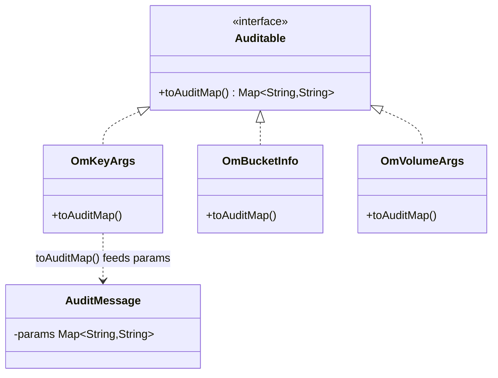

# hddscommon / audit-common

_This feature page was generated from `study/atlas/components/hddscommon/audit-common.md`. Author prose belongs above or below the BEGIN/END markers._

{/* BEGIN atlas-generated */}

**Classes:** 1    **Kinds:** interface:1

## Overview

The `audit-common` feature group contains a single interface, `Auditable`, which lives in `hadoop-hdds/common` rather than `hadoop-hdds/framework` so that domain objects in the common layer can implement it without taking a dependency on the full framework module. Any class that represents a user-visible entity — key arguments, bucket info, volume info — implements `Auditable` and provides `toAuditMap()`, returning a `Map<String,String>` of field names to string values. The `audit` feature's `AuditMessage.Builder` consumes this map as the `params` field of every log entry. Keeping the interface in the common module means the split between audit data producers (in `hdds/common`) and the audit logging machinery (in `hdds/framework`) is clean and avoids circular dependencies.

## Diagram

## Class table

### Sub-feature: `ozone.audit`

| reading_order | fqcn | kind | logic | loc | study (min) | role |
|--:|---|---|---|--:|--:|---|
| 1647 | <Fqcn>org.apache.hadoop.ozone.audit.Auditable</Fqcn> | interface | mixed | 25~ | 20 | Interface to make an entity auditable. |

## Anchor details

This feature has a single class. `Auditable` declares only `toAuditMap()`, but its placement in `hadoop-hdds/common` is architecturally significant: it allows domain objects like `OmKeyArgs` and `OmBucketInfo` to be audit-aware without importing anything from `hadoop-hdds/framework`, keeping the module dependency graph acyclic.

## Design docs

No dedicated design doc under `hadoop-hdds/docs/content/` on this branch. See `hadoop-hdds/docs/content/design/gdpr.md` for the data-deletion audit requirements that motivate completeness of `toAuditMap()` implementations on key domain objects.

## Seminal JIRAs / PRs

- [HDDS-8860](https://issues.apache.org/jira/browse/HDDS-8860). Move audit to hdds-server-framework
- [HDDS-6562](https://issues.apache.org/jira/browse/HDDS-6562). Exclude specific operations in Audit log
- [HDDS-6525](https://issues.apache.org/jira/browse/HDDS-6525). Add audit log for S3Gateway

## Sharp edges

- `toAuditMap()` returns a plain `Map<String,String>`, so any field that is not a string (e.g. a `long` size or an `enum`) must be converted by the implementor. Forgetting a field silently produces an incomplete audit entry with no compile-time warning ([HDDS-6562](https://issues.apache.org/jira/browse/HDDS-6562) added exclusion support, but omissions are still silent).

## Related features

- [`audit.md`](/component/hddscommon/audit) — `AuditMessage.Builder` consumes the `Map` returned by `toAuditMap()`; `AuditLogger` and `AuditMarker` live here
- [`ozone-common-primitives.md`](/component/hddscommon/ozone-common-primitives) — domain objects such as `OmKeyArgs` and `OmBucketInfo` that implement `Auditable`
- [`framework-server.md`](/component/hddscommon/framework-server) — service classes that call `toAuditMap()` indirectly via `AuditMessage.Builder`

## Self-quiz

1. `Auditable` lives in `hadoop-hdds/common` rather than `hadoop-hdds/framework`. Why does this placement matter for the module dependency graph?
2. `toAuditMap()` returns `Map<String,String>`. Name two domain classes in Ozone that implement `Auditable`, and give one field from each that requires explicit conversion to `String`.
3. [HDDS-6562](https://issues.apache.org/jira/browse/HDDS-6562) added the ability to exclude specific operations from the audit log. Is the exclusion mechanism in `Auditable`, in `AuditLogger`, or somewhere else? What is the consequence of putting it in the wrong layer?
4. What happens at runtime if a class passes a `null` `Auditable` reference to `AuditMessage.Builder`?
5. `Auditable` has no `default` method implementations. If a new field needs to appear in all audit maps, what is the required change, and which classes are affected?

Answers

Answer 1: Domain objects in `hdds/common` (e.g. `OmKeyArgs`) can implement `Auditable` without importing `hdds/framework`. If `Auditable` were in `framework`, `common` would need a dependency on `framework`, creating a circular dependency since `framework` already depends on `common`.
Answer 2: For example, `OmKeyArgs` (field: `dataSize` long → `String.valueOf(dataSize)`) and `OmBucketInfo` (field: `storageType` enum → `storageType.name()`).
Answer 3: Exclusion is handled at the `AuditLogger` call site or in the service layer, not in `Auditable`. Putting it in `Auditable` would mean domain objects decide what to omit, breaking separation of concerns — the logging policy should belong to the service, not the data object.
Answer 4: `AuditMessage.Builder` would receive a null map; calling `params(null.toAuditMap())` would throw a `NullPointerException` at the call site before the message is built.
Answer 5: `toAuditMap()` must be added to every implementing class. Because `Auditable` is a plain interface with no `default` implementation, the compiler enforces this — every `Auditable` implementor must either add the field to its map or fail to compile.

{/* END atlas-generated */}
