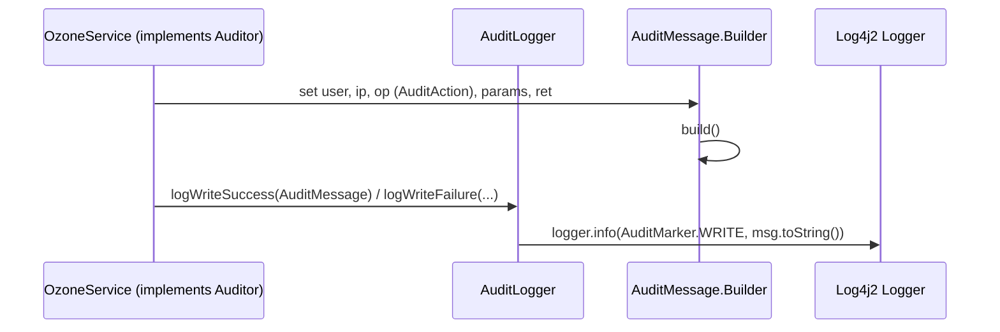

# hddscommon / audit

_This feature page was generated from `study/atlas/components/hddscommon/audit.md`. Author prose belongs above or below the BEGIN/END markers._

{/* BEGIN atlas-generated */}

**Classes:** 7    **Kinds:** data:3, interface:2, service:2

## Overview

The `audit` feature group provides the infrastructure that Ozone services use to emit structured audit log entries via Log4j 2. `AuditAction` is the interface that each service implements to name its operations (e.g. `OMAction`, `SCMAction`). `Auditor` marks a service class as an audit emitter. `AuditLogger` wraps a Log4j 2 `Logger` and three `Marker` values — WRITE, READ, DNAUDIT — and exposes `logWriteSuccess`, `logWriteFailure`, `logReadSuccess`, and `logReadFailure` shortcuts so callers never construct marker strings directly. `AuditMessage` is the builder-pattern DTO whose `toString()` produces the final log line; callers set `user`, `ip`, `op`, `params` (a `Map<String,String>`), `ret`, `exception`, and `time`. The two enums `AuditLoggerType` and `AuditMarker` select the right named logger instance and route events to separate appenders. `AuditEventStatus` captures whether the event succeeded or failed.

## Diagram

## Class table

### Sub-feature: `ozone.audit`

| reading_order | fqcn | kind | logic | loc | study (min) | role |
|--:|---|---|---|--:|--:|---|
| 1640 | <Fqcn>org.apache.hadoop.ozone.audit.AuditAction</Fqcn> | interface | mixed | 25~ | 20 | Interface to define AuditAction. |
| 1641 | <Fqcn>org.apache.hadoop.ozone.audit.Auditor</Fqcn> | interface | mixed | 25~ | 20 | Interface to mark an actor as Auditor. |
| 1642 | <Fqcn>org.apache.hadoop.ozone.audit.AuditLogger</Fqcn> | service | mixed | 125~ | 30 | Class to define Audit Logger for Ozone. |
| 1643 | <Fqcn>org.apache.hadoop.ozone.audit.AuditMessage</Fqcn> | service | mixed | 100~ | 30 | Defines audit message structure. |
| 1644 | <Fqcn>org.apache.hadoop.ozone.audit.AuditLoggerType</Fqcn> | data | data-only | 25~ | 10 | Enumeration for defining types of Audit Loggers in Ozone. |
| 1645 | <Fqcn>org.apache.hadoop.ozone.audit.AuditEventStatus</Fqcn> | data | data-only | 25~ | 10 | Enum to define AuditEventStatus values. |
| 1646 | <Fqcn>org.apache.hadoop.ozone.audit.AuditMarker</Fqcn> | data | data-only | 25~ | 10 | Defines audit marker types. |

## Anchor details

No class in this feature is marked `logic-heavy`. The most substantive class is `AuditLogger`: it holds a Log4j 2 `Logger` instance keyed by `AuditLoggerType` name (e.g. `"OMAudit"`, `"SCMAudit"`) and a corresponding `Marker` (WRITE, READ, DNAUDIT), so a single `AuditLogger` instance routes events to the correct named appender without the caller knowing the logger name. The class is `thread-safe` because the underlying Log4j 2 `Logger` is thread-safe and `AuditLogger` holds no mutable state of its own.

## Design docs

No dedicated design doc under `hadoop-hdds/docs/content/` on this branch. The GDPR handling design (`hadoop-hdds/docs/content/design/gdpr.md`) describes how audit logs are used to satisfy data-deletion audit requirements.

## Seminal JIRAs / PRs

- [HDDS-14204](https://issues.apache.org/jira/browse/HDDS-14204). Reduce duplication in auditing S3G
- [HDDS-13370](https://issues.apache.org/jira/browse/HDDS-13370). Separate audit log for background deletion
- [HDDS-11306](https://issues.apache.org/jira/browse/HDDS-11306). OM support system audit log
- [HDDS-9719](https://issues.apache.org/jira/browse/HDDS-9719). Add performance audit log for Datanode
- [HDDS-9822](https://issues.apache.org/jira/browse/HDDS-9822). Format audit log message lazily
- [HDDS-8860](https://issues.apache.org/jira/browse/HDDS-8860). Move audit to hdds-server-framework

## Sharp edges

- `AuditMessage.toString()` assembles the log string eagerly on every call. If a service passes `AuditMessage` objects to a disabled log level, the formatting cost is paid anyway; [HDDS-9822](https://issues.apache.org/jira/browse/HDDS-9822) addressed this by deferring message formatting, but callers that build the `AuditMessage` before checking log level still pay the `Map` allocation.
- `AuditLoggerType` names (e.g. `"OMAudit"`) must match the appender names in the service's `log4j2.xml`. A mismatch silently drops audit events to the root logger instead of the dedicated audit file.

## Related features

- [`audit-common.md`](/component/hddscommon/audit-common) — `Auditable` interface lives here; domain objects implement it to supply the `params` map consumed by `AuditMessage`
- [`framework-server.md`](/component/hddscommon/framework-server) — server lifecycle classes that implement `Auditor` and instantiate `AuditLogger`
- [`security-common.md`](/component/hddscommon/security-common) — authentication context (user, IP) fed into `AuditMessage`
- [`tracing-common.md`](/component/hddscommon/tracing-common) — OpenTelemetry tracing provides a complementary observability path alongside audit logging

## Self-quiz

1. `AuditLogger` is marked `thread-safe` while the other classes are `single-threaded`. What property of `AuditLogger`'s internal state makes it safe to share across threads without locking?
2. `AuditMarker` defines WRITE, READ, and DNAUDIT. What is the practical effect of passing different markers to Log4j 2 — specifically, how does a typical Ozone `log4j2.xml` use them?
3. `AuditAction` is an interface rather than an enum. What is the advantage of this design for services like OM and SCM that each define dozens of distinct operations?
4. `AuditMessage.Builder` accepts `params` as a `Map<String,String>`. Which interface from `audit-common` do domain objects implement to produce this map, and what method does it declare?
5. `AuditLoggerType` names the logger (e.g. `OM`, `SCM`, `DN`, `S3G`). What runtime failure occurs if an `AuditLogger` is constructed with a type name that does not match any named logger in `log4j2.xml`?

Answers

Answer 1: `AuditLogger` holds only a Log4j 2 `Logger` reference and a `Marker` constant, both of which are immutable after construction. Log4j 2 `Logger` instances are themselves thread-safe, so no additional locking is needed.
Answer 2: Log4j 2 `MarkerFilter` entries in `log4j2.xml` route events to separate `RollingFileAppender` instances — for example, WRITE events go to the audit-write log and DNAUDIT events go to the datanode audit log — allowing independent rotation and retention policies.
Answer 3: Making `AuditAction` an interface lets each service define its own enum (e.g. `OMAction`, `SCMAction`) that implements the interface, avoiding a single monolithic enum that must be updated for every new operation across all services.
Answer 4: `Auditable` in `audit-common`, declaring `Map<String,String> toAuditMap()`. Implementors such as `OmKeyArgs` and `OmBucketInfo` return a map of field names to string values that becomes the `params` field in `AuditMessage`.
Answer 5: Log4j 2 falls back to the root logger, so audit events are emitted but to the wrong destination (e.g. the main service log instead of the dedicated audit file), making it impossible to distinguish audit records from normal log output without log-level filtering.

{/* END atlas-generated */}
