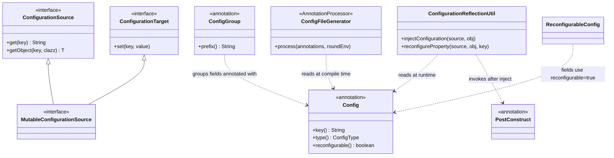

# hddscommon / config-annotations

_This feature page was generated from `study/atlas/components/hddscommon/config-annotations.md`. Author prose belongs above or below the BEGIN/END markers._

{/* BEGIN atlas-generated */}

**Classes:** 16    **Kinds:** interface:5, service:5, data:3, config:2, exception:1

## Overview

The `config-annotations` feature group implements Ozone's type-safe configuration system, which binds `ozone-site.xml` values to annotated POJO fields at startup and during live reconfiguration. `@ConfigGroup` marks a POJO class as a config holder; `@Config` marks individual fields with key name, type, default, and a `reconfigurable` flag. `ConfigurationReflectionUtil.injectConfiguration()` scans all declared fields, detects their `ConfigType` (STRING, INT, BOOLEAN, TIME, SIZE, AUTO), converts values via `TimeDurationUtil` and `StorageUnit`, injects them with `forcedFieldSet()`, then invokes any `@PostConstruct` methods. During live reconfiguration, `reconfigureProperty()` saves the old value, injects the new one, calls `@PostConstruct`, and rolls back on failure. `ConfigFileGenerator` is an annotation processor that reads `@Config` annotations at compile time and writes `*-default.xml` fragments, eliminating the need to hand-maintain default configuration files. `ConfigurationSource` and `ConfigurationTarget` separate read and write access; `MutableConfigurationSource` extends both.

## Diagram

## Class table

### Sub-feature: `hdds.conf`

| reading_order | fqcn | kind | logic | loc | study (min) | role |
|--:|---|---|---|--:|--:|---|
| 1648 | <Fqcn>org.apache.hadoop.hdds.conf.ConfigurationSource</Fqcn> | interface | mixed | 175~ | 20 | Defines read-only contract of Configuration objects. |
| 1649 | <Fqcn>org.apache.hadoop.hdds.conf.PostConstruct</Fqcn> | interface | mixed | 25~ | 20 | Methods annotated with this annotation will be called after object creation. |
| 1650 | <Fqcn>org.apache.hadoop.hdds.conf.ConfigGroup</Fqcn> | interface | mixed | 25~ | 20 | Mark pojo which holds configuration variables. |
| 1651 | <Fqcn>org.apache.hadoop.hdds.conf.ConfigurationTarget</Fqcn> | interface | mixed | 25~ | 20 | Defines write contract of Configuration objects. |
| 1652 | <Fqcn>org.apache.hadoop.hdds.conf.MutableConfigurationSource</Fqcn> | interface | mixed | 25~ | 20 | Configuration that can be both read and written. |
| 1653 | <Fqcn>org.apache.hadoop.hdds.conf.ConfigurationReflectionUtil</Fqcn> | service | logic-heavy | 225~ | 45 | Reflection utilities for configuration injection. |
| 1654 | <Fqcn>org.apache.hadoop.hdds.conf.TimeDurationUtil</Fqcn> | service | mixed | 150~ | 45 | Utility to handle time duration. |
| 1655 | <Fqcn>org.apache.hadoop.hdds.conf.StorageSize</Fqcn> | service | mixed | 75~ | 30 | A class that contains the numeric value and the unit of measure. |
| 1656 | <Fqcn>org.apache.hadoop.hdds.conf.ConfigFileGenerator</Fqcn> | service | mixed | 75~ | 30 | Annotation processor to generate config fragments from Config annotations. |
| 1657 | <Fqcn>org.apache.hadoop.hdds.conf.ConfigFileAppender</Fqcn> | service | mixed | 50~ | 30 | Simple DOM based config file writer. |
| 1658 | <Fqcn>org.apache.hadoop.hdds.conf.ReconfigurableConfig</Fqcn> | config | data-only | 25~ | 20 | Base class for config with reconfigurable properties. |
| 1659 | <Fqcn>org.apache.hadoop.hdds.conf.Config</Fqcn> | config | data-only | 25~ | 20 | Mark field to be configurable from ozone-site.xml. |
| 1660 | <Fqcn>org.apache.hadoop.hdds.conf.StorageUnit</Fqcn> | data | logic-heavy | 400~ | 10 | Enum to represent storage unit. |
| 1661 | <Fqcn>org.apache.hadoop.hdds.conf.ConfigType</Fqcn> | data | data-only | 150~ | 10 | Possible type of injected configuration. |
| 1662 | <Fqcn>org.apache.hadoop.hdds.conf.ConfigTag</Fqcn> | data | data-only | 25~ | 10 | The definitive list of configuration tags. |
| 1663 | <Fqcn>org.apache.hadoop.hdds.conf.ConfigurationException</Fqcn> | exception | data-only | 25~ | 10 | Exception to throw in case of a configuration problem. |

## Anchor details

### `ConfigurationReflectionUtil`

- **path:** `hadoop-hdds/config/src/main/java/org/apache/hadoop/hdds/conf/ConfigurationReflectionUtil.java`
- **loc:** 225~    **difficulty:** 4    **study:** 45 min    **concurrency:** single-threaded    **persistence:** in-memory
- **test exemplar:** `hadoop-hdds/config/src/test/java/org/apache/hadoop/hdds/conf/TestConfigurationReflectionUtil.java`
- **role:** Reflection utilities for configuration injection.

`injectConfiguration()` calls `detectConfigType()` on each `@Config` field to pick the conversion branch, then uses `forcedFieldSet()` (which calls `field.setAccessible(true)`) to bypass private/final access; this means injection works even on final fields declared in config POJOs. `reconfigureProperty()` implements a compare-and-restore protocol: it saves the current field value before injection and re-calls `forcedFieldSet()` to restore it if the `@PostConstruct` method throws, giving reconfiguration an atomic appearance at the POJO level.

## Design docs

- `hadoop-hdds/docs/content/design/typesafeconfig.md` — describes the type-safe configuration design that this feature implements
- `hadoop-hdds/docs/content/design/configless.md` — covers the config-less datanode deployment model, which depends on dynamic reconfiguration enabled by `reconfigurable=true` fields

## Seminal JIRAs / PRs

- [HDDS-14105](https://issues.apache.org/jira/browse/HDDS-14105). Require ConfigGroup prefix to be present in Config keys
- [HDDS-14030](https://issues.apache.org/jira/browse/HDDS-14030). Add ConfigGroup prefix to all configs where missing
- [HDDS-13890](https://issues.apache.org/jira/browse/HDDS-13890). Datanode supports dynamic configuration of SCM
- [HDDS-13179](https://issues.apache.org/jira/browse/HDDS-13179). rename-generated-config fails on re-compile without clean
- [HDDS-14789](https://issues.apache.org/jira/browse/HDDS-14789). Compiler options not recognized by any processor

## Sharp edges

- `ConfigFileGenerator` writes generated `*-default.xml` files into the build output directory. If you run `mvn compile` twice without `clean` after renaming a `@Config` key, stale generated files remain and the old key name survives in the XML, causing silent config drift ([HDDS-13179](https://issues.apache.org/jira/browse/HDDS-13179)).
- `@Config(reconfigurable = true)` fields are live-updated without restarting the JVM, but the rollback in `reconfigureProperty()` is only best-effort at the POJO level. If a `@PostConstruct` method caches a derived value (e.g. a thread-pool size) in a separate field, that derived field is not rolled back, leaving the object in a partially updated state.
- [HDDS-14105](https://issues.apache.org/jira/browse/HDDS-14105) enforces that `@Config` key values must begin with the enclosing `@ConfigGroup` prefix. Adding a `@Config` key that violates this fails at compile time via `ConfigFileGenerator`, but the check did not exist before [HDDS-14105](https://issues.apache.org/jira/browse/HDDS-14105), so legacy keys that predate that JIRA may still be inconsistent.

## Related features

- [`config-common.md`](/component/hddscommon/config-common) — `OzoneConfiguration` (the `MutableConfigurationSource` implementation) lives here and is the concrete object injected by `ConfigurationReflectionUtil`
- [`config-runtime.md`](/component/hddscommon/config-runtime) — runtime configuration management and reconfiguration RPC handlers that trigger `reconfigureProperty()`
- [`annotations.md`](/component/hddscommon/annotations) — compile-time annotation processors in the same HDDS common layer; `ConfigFileGenerator` is the config-side parallel
- [`upgrade-framework.md`](/component/hddscommon/upgrade-framework) — upgrade finalization uses `@Config` POJOs to carry version-gated configuration values

## Self-quiz

1. `ConfigurationReflectionUtil.injectConfiguration()` calls `forcedFieldSet()` before invoking `@PostConstruct` methods. What does `forcedFieldSet()` do that a normal field assignment cannot, and why is this necessary for config POJOs?
2. `reconfigureProperty()` rolls back a field if `@PostConstruct` throws. Under what circumstances does this rollback NOT fully restore the object's state, and what type of derived state is at risk?
3. `ConfigFileGenerator` is an annotation processor. What is the output artifact it produces, and at what build phase does it run relative to normal Java compilation?
4. `TimeDurationUtil` parses strings like `"5m"` and `"100ms"`. What `ConfigType` enum value causes `ConfigurationReflectionUtil` to delegate to `TimeDurationUtil`, and what is the unit of the resulting value injected into the field?
5. `@ConfigGroup` requires that `@Config` key values start with the group's `prefix`. Which class enforces this constraint, at what time (compile vs. runtime), and what JIRA introduced this enforcement?

Answers

Answer 1: `forcedFieldSet()` calls `field.setAccessible(true)` to bypass Java access control, then sets the field value via reflection. This is necessary because config POJO fields are typically `private`, and some may be `final`; normal assignment requires either a setter or public visibility.
Answer 2: Rollback restores the annotated field to its previous value but does not touch any other fields the `@PostConstruct` method may have computed and stored. For example, if `@PostConstruct` caches a derived thread-pool size in a separate `private int` field, that derived field retains the partially-new value after rollback.
Answer 3: `ConfigFileGenerator` produces `*-default.xml` XML fragments (e.g. `ozone-default-generated.xml`) in `target/generated-sources` or the resources output directory. It runs during the `generate-sources` phase, before `compile`, so the XML is available for packaging.
Answer 4: `ConfigType.TIME` causes delegation to `TimeDurationUtil`. The resulting value is injected in milliseconds (as a `long`) unless the field's declared Java type is `Duration`, in which case a `Duration` object is injected.
Answer 5: `ConfigFileGenerator` (the annotation processor) enforces the prefix constraint at compile time. It was introduced by [HDDS-14105](https://issues.apache.org/jira/browse/HDDS-14105).

{/* END atlas-generated */}
